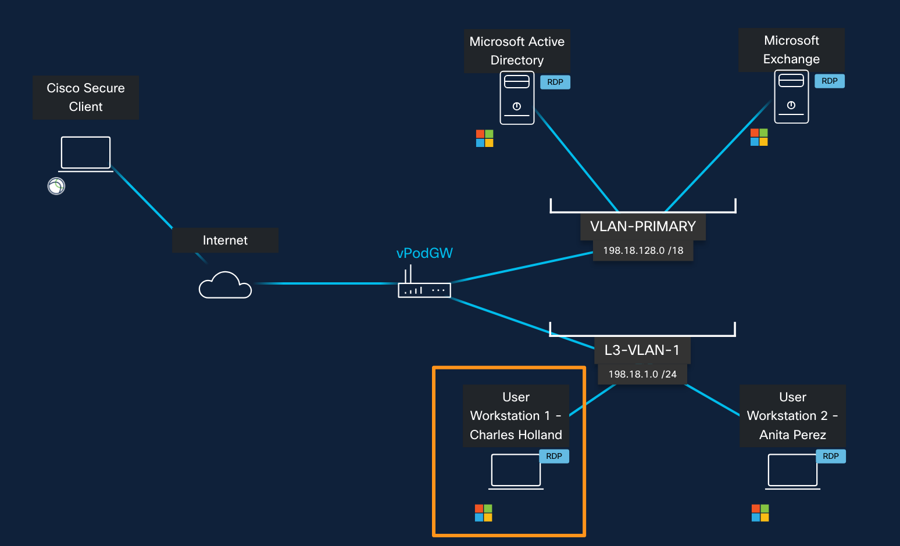
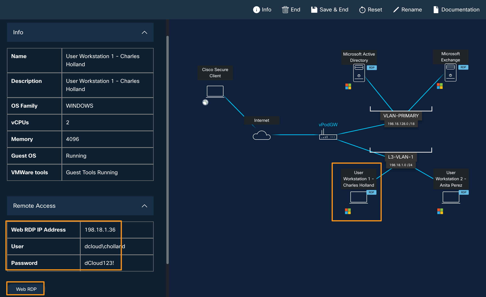
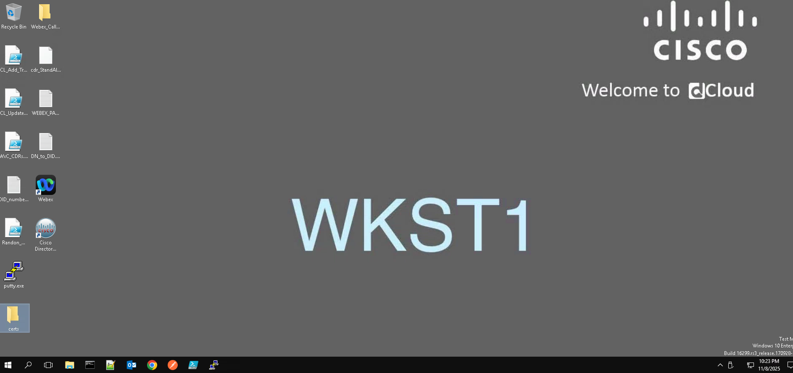

# Accessing your Lab

Open a browser on your laptop and go to https://dcloud.cisco.com

Click Login at the top right corner and log in with your Cisco.com credentials.

Once logged in, open a new browser tab and paste the event URL for your lab. The event URL is https://dcloud2-lon.cisco.com/event/400604/access

You will be automatically assigned to a lab pod, and you will be taken to the Lab topology page as shown below.

Click on the User Workstation 1 icon on the topology page and it will bring up the Info fly-out window on left with Workstation 1 related information. Expand the Remote Access section to see Workstation 1’s IP Address, username, and password as shown below.

Similarly, you can click on any other Virtual Machine on the topology page to get its respective details.

In this lab, you will access Workstation 1 (through WebRDP) and from Workstation 1 you will be able to access all the other applications required for this lab like Webex Control Hub, Vidcast or Slido etc., to complete the lab tasks.

Accessing Workstation 1

To access Workstation 1 over WebRDP, click on the Workstation 1 icon on the topology page and when it brings up a fly-out window on the left, click on the Remote Access > Web RDP.  It will open a new browser tab and connect you to Workstation 1.

Now you can proceed with the lab modules.
