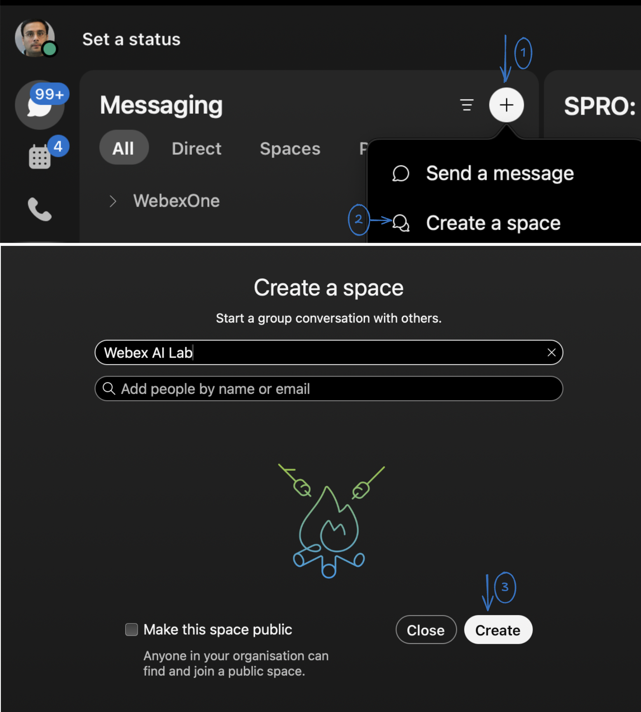
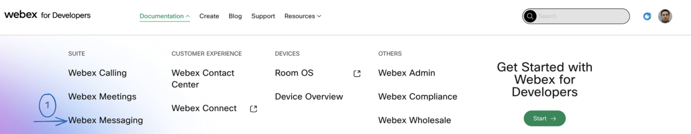
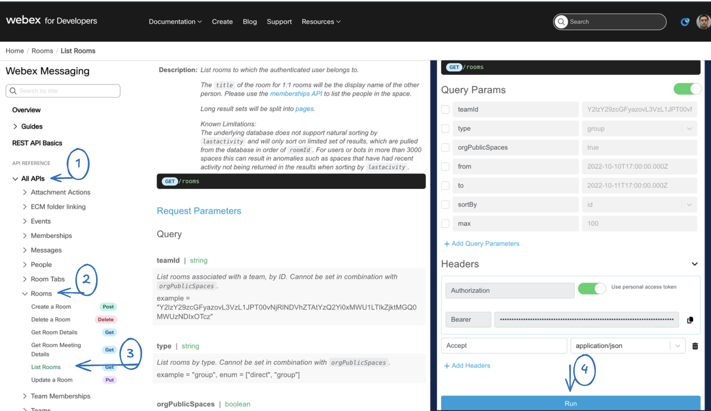
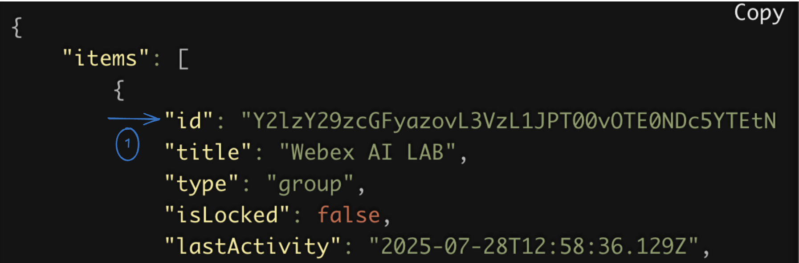

# Accessing your Lab (Pre-Requisites)

## Introduction

To interact with Webex programmatically (for example, to send messages), you'll need to authenticate using a **Webex API access token** (Bearer token). This token acts like a digital key that allows your script to securely access your Webex account and perform actions on your behalf, like sending messages, listing spaces, etc. Without it, any API call to Webex will be rejected.

You can find more information on the [Webex Developer Portal](https://developer.webex.com/){:target="_blank" rel="noopener"}.

## Steps to Obtain and Use Your Webex Token

### 1. Log in to the Webex Developer Portal

Go to the [Webex Developer Portal](https://developer.webex.com/){:target="_blank" rel="noopener"} and click **Log in**.

!!! warning "Important: Use your assigned Charles Holland account"
    Please use the **Charles Holland** account assigned to your demo pod throughout this lab.

    The username will follow the format: `cholland@cbXXX.dc-YY.com`, where `XXX` and `YY` are unique to your dCloud environment.

    **Example:** 👉 `cholland@cb123.dc-01.com`

    The password for your assigned account can be found in the **`Credentials.txt`** file available in your demo environment.

### 2. Copy your Bearer token

After logging in, click on your **profile picture** (top-right corner). Under **"Bearer"**, copy the displayed token. This is the one you'll use in the upcoming tasks.

### 3. Log in to the Webex App

Use your assigned Charles Holland account (`cholland@cbXXX.dc-YY.com`) to log in to the **Webex App** that is pre-installed on your laptop.

### 4. Create a Webex Space

Once logged in, create a new Webex Space and name it something like **"Webex AI Lab"**.

!!! info "You'll need this Space ID later"
    After the space is created, we will retrieve its ID. This will be used in a later step.

### 5. Retrieve the Space ID via the Developer Portal

Go back to the [Webex Developer Portal](https://developer.webex.com/){:target="_blank" rel="noopener"} and log in again.

Click on **Documentation → Webex Messaging**.

Select **All APIs**, then navigate to **Rooms → List Rooms**, and press **Run**.

In the response, you will find a list of rooms associated with your account. Locate the room you just created (e.g., **"Webex AI Lab"**) and copy its corresponding **`id`**. This will be used in a later step.

