# Legacy / Additional Items Requiring Review

Webex Calling Customer Assist is designed to provide significant contact center capabilities such as queue management, screen pop, analytics, reports, and so on. You can easily elevate your Webex Calling Call Queue to Customer Assist while maintaining the existing settings. Agents and supervisors can access the features directly from their Webex App.

You need to assign a Customer Assist license to the users Charles Holland and Anita Perez, remember that Customer Assist license already includes a Webex Calling Professional licenses.

1. Continuing on demo workstation (virtual workstation) and Webex Control Hub browser tab.  Navigate to MANAGEMENT > Users then select the Charles Holland user.

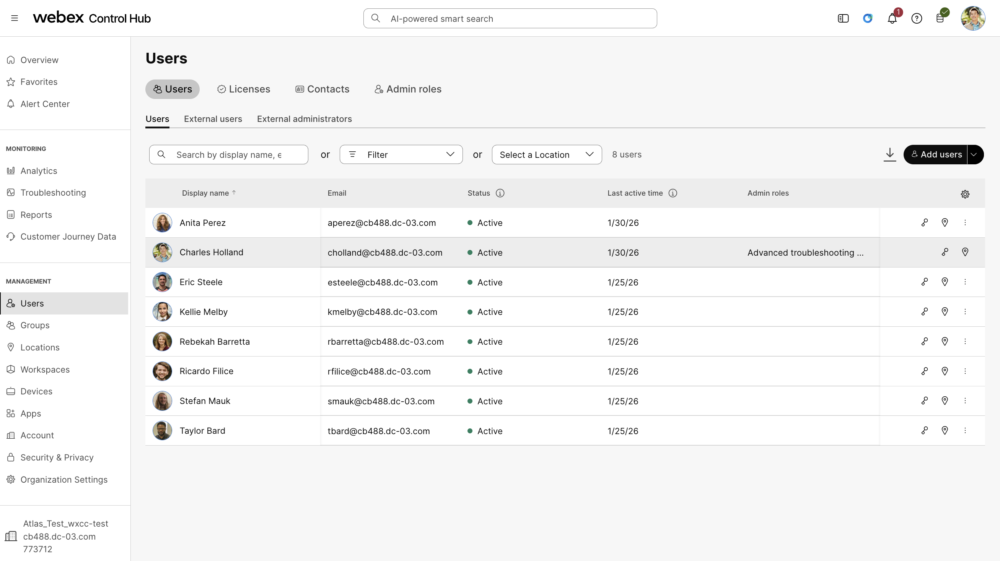

1. Scroll down a little on user page to Licenses section, click Edit Licenses.

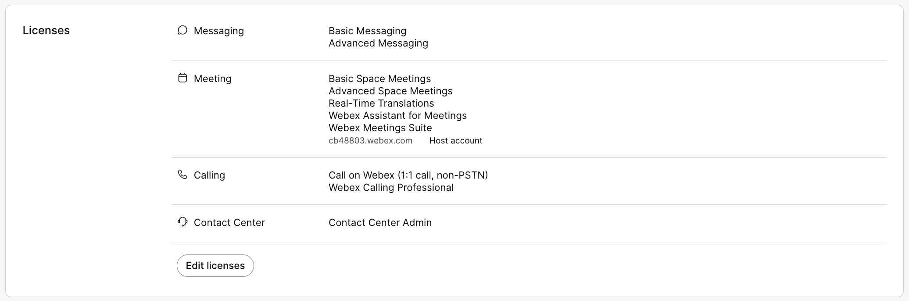

1. Click Edit Licenses again  on Edit Licenses for cholland@cbXXX.dc-YY.com

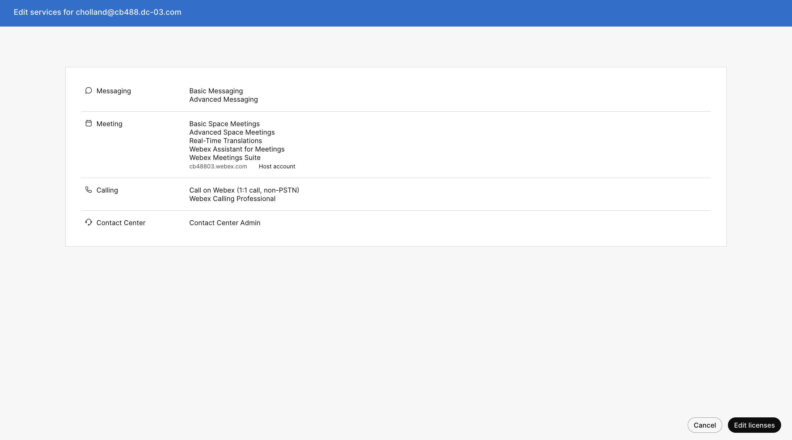

Click Calling and remove the Webex Calling Professional license you assigned before.

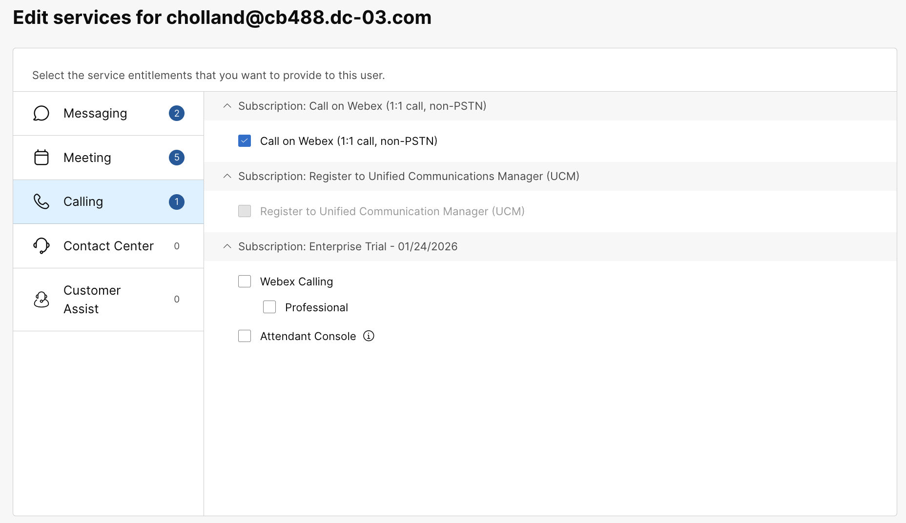

Click Customer Assist and select the Customer Assist license. Click Save.

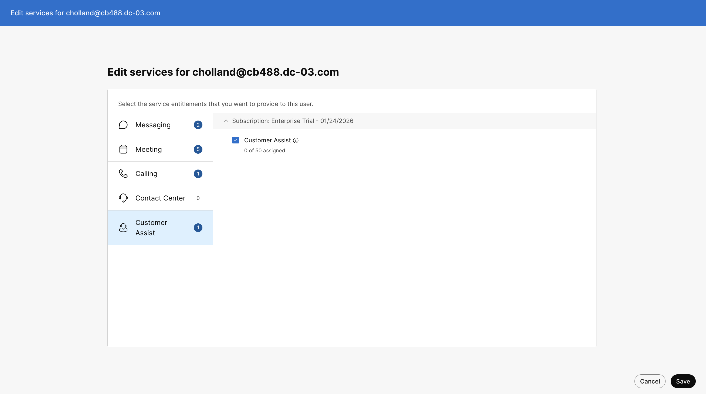

Click Close.

Repeat above steps (1 through 6 ) and assign Customer Assist license to Anita Perez as well.

## Module 2g: Announcements Text-to-Speech Capabilities

Text to Speech (TTS) support in the Webex Calling Announcement Repository streamlines the creation and management of audio announcements by allowing users to generate spoken messages directly from written text. With this feature, you can easily manage and update TTS announcements in a centralized location, ensuring dynamic control over all announcements that use the Announcement Repository. TTS also enables seamless integration across supported features, rich customization through SSML tags for expressive and natural-sounding speech, and offers multiple voice and gender options to suit your business needs. Powered by AI, TTS in Webex Calling transforms written content into professional audio for IVR, greetings, and call flows, enhancing both flexibility and efficiency in communication.

You are going to create now all the announcements you will use in the Customer  Assist configuration.

Click Calling under SERVICES and then click Features.

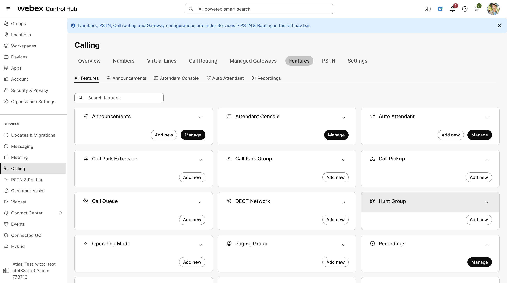

1. Click Add new in the Announcements section in order to create the first prompt for the Customer Assist configuration.

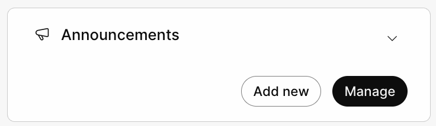

1. Click Text to speech to create the first prompt.

1. You can configure announcements (prompts) at Organization or at Location level, for this lab you will configure the announcement at Organization level. Select Organization under Level.

1. Enter “Welcome Message” as the Label and File name in the Text to speech section.

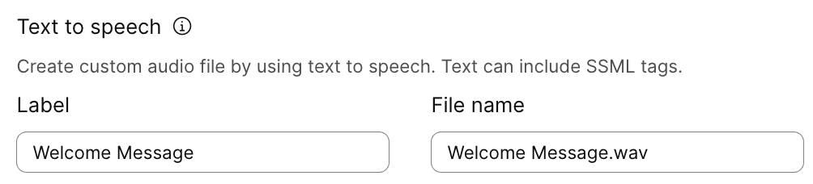

1. Enter “Thank you for calling Cisco Live Amsterdam. Experience the future of AI powered collaboration with us. For Sales, please press 1. For Support, please press 2.” as the Enter your text here in the Text to speech section. You may have up to 3000 characters in the text to speech feature per prompt.

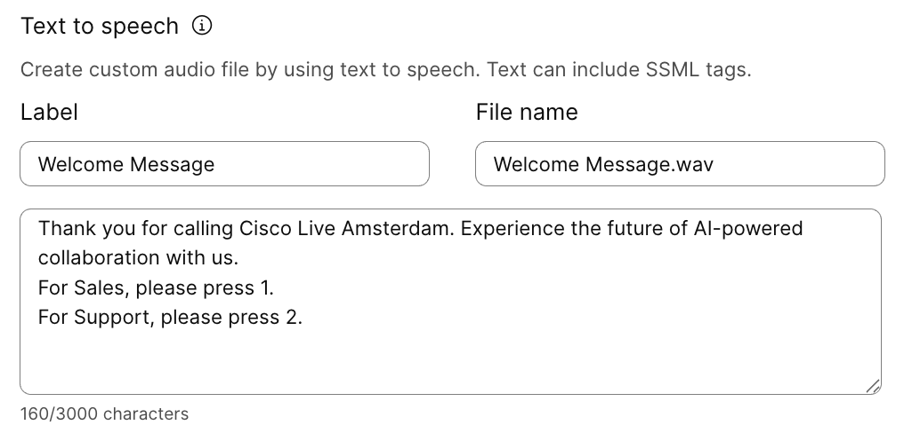

1. Under the Select Language dropdown menu, keep English selected. Currently, only English is supported as this feature is in beta.

1. Under the Select Voice dropdown menu, select Veronica-Female. Currently, only two voices are supported—one male and one female—as this feature is in beta.

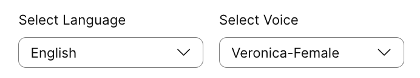

1. Click Generate. You can configure up to 150 announcements per week

1. After a few minutes you can test the announcement. Click Save.

1. Go back to Announcements.

1. Now let´s work on an Overflow prompt. In Webex Calling Customer Assist, "overflow" happens when all agents are busy or the call queue is full. When this occurs, incoming calls are automatically handled according to preset rules, such as redirecting them to another team, sending them to voicemail, or playing a recorded message. This ensures that callers receive a response even during periods of high call volume. Click Add File.

1. Click Text to speech to create the prompt.

1. Select Organization under Level.

1. Enter “Overflow” as the Label and File name in the Text to speech section.

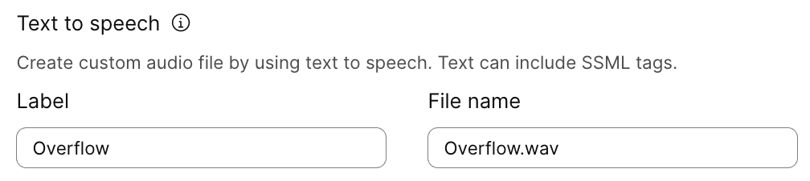

1. Enter “We apologize. We are currently experiencing a high volume of calls. Please try again later.” as the Enter your text here in the Text to speech section.

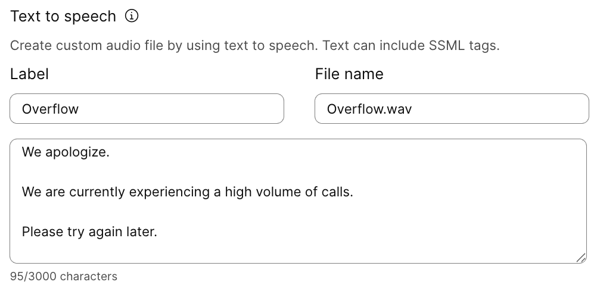

1. Under the Select Voice dropdown menu, select Calvin-Male.

1. Click Generate. You can configure up to 150 announcements per day.

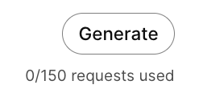

1. After a few minutes you can test the announcement. Click Save.

1. Go back to Announcements.

1. Now let´s work on an Comfort prompt. In Webex Calling Customer Assist, a comfort message (sometimes called a “comfort prompt”) is a recorded announcement played to callers who are waiting in a queue for an agent. Its purpose is to reassure callers that their call is still in progress and will be answered as soon as possible. Comfort messages help reduce caller frustration by letting them know they haven’t been forgotten and providing updates about their wait time or queue status. Click Add File.

1. Click Text to speech to create the prompt.

1. Select Organization under Level.

1. Enter “Comfort” as the Label and File name in the Text to speech section.

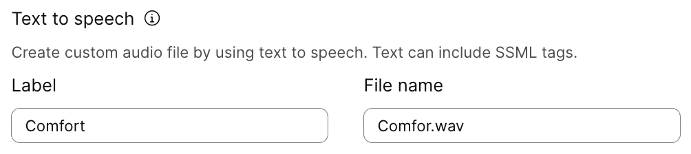

1. Enter “Thank you for your patience. All of our agents are currently assisting other callers. Your call is important to us and will be answered as soon as possible.” as the Enter your text here in the Text to speech section.

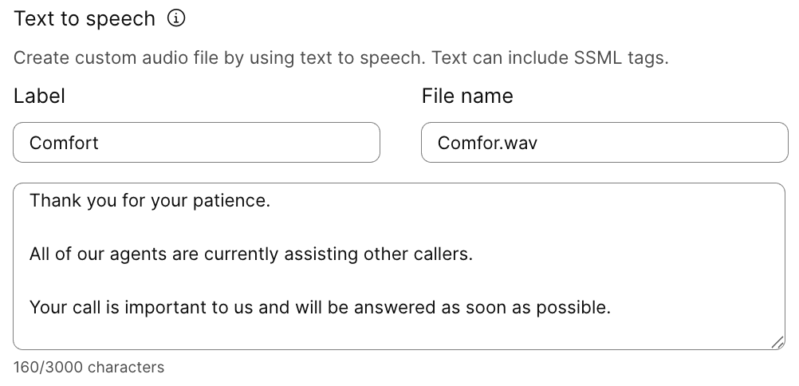

1. Under the Select Voice dropdown menu, select Calvin-Male.

1. Click Generate.

1. After a few minutes you can test the announcement. Click Save.

1. Go back to Announcements.

1. Now let´s work on an Sales prompt. Click Add File.

1. Click Text to speech to create the prompt.

1. Select Organization under Level.

1. Enter “Sales” as the Label and File name in the Text to speech section.

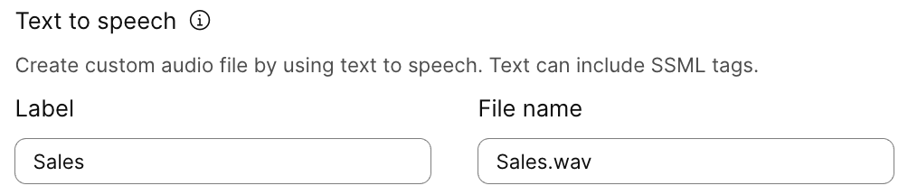

1. Enter “Thank you for calling our Sales Department!. All of our sales representatives are currently assisting other customers. Please stay on the line and the next available representative will be with you shortly. We appreciate your patience!” as the Enter your text here in the Text to speech section.

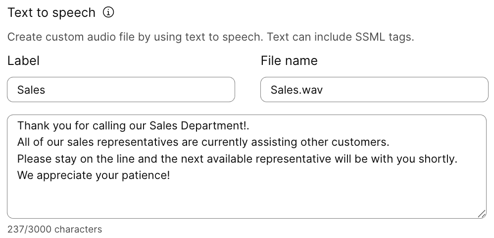

1. Under the Select Voice dropdown menu, select Veronica-Female. Currently, only two voices are supported—one male and one female—as this feature is in beta.

1. Click Generate.

1. After a few minutes you can test the announcement. Click Save.

1. Go back to Announcements.

1. Now let´s work on an Support prompt. Click Add File.

1. Click Text to speech to create the prompt.

1. Select Organization under Level.

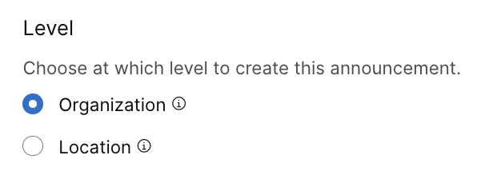

1. Enter “Support” as the Label and File name in the Text to speech section.

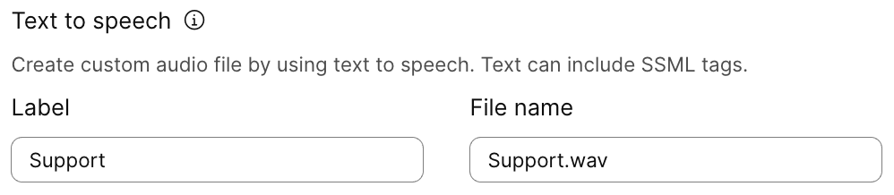

1. Enter “Thank you for calling our Support Team. All of our agents are currently assisting other customers. Please stay on the line, and the next available agent will be with you shortly. We appreciate your patience and are here to help you as soon as possible.” as the Enter your text here in the Text to speech section.

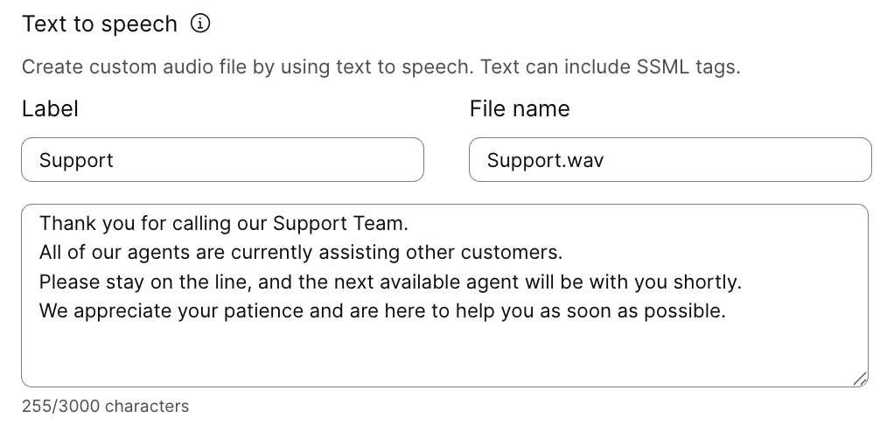

1. Under the Select Voice dropdown menu, select Veronica-Female. Currently, only two voices are supported—one male and one female—as this feature is in beta.

1. Click Generate.

1. After a few minutes you can test the announcement. Click Save.

1. Go back to Announcements.

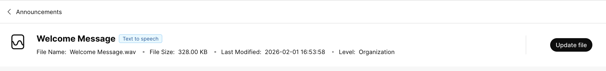

1. Now let´s work on a Sales Whisper prompt. A whisper in Webex Calling Customer Assist is a short audio message played only to the agent before they answer a call, notifying them of which queue the call is coming from. This helps the agent prepare and respond appropriately to the caller’s needs. Click Add File.

1. Click Text to speech to create the prompt.

1. Select Organization under Level.

1. Enter “Sales-Whisper” as the Label and File name in the Text to speech section.

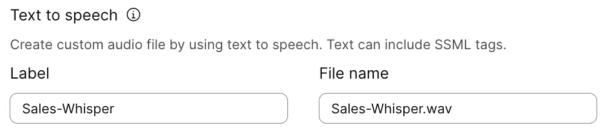

1. Enter “You are receiving a call from the Sales queue.” as the Enter your text here in the Text to speech section.

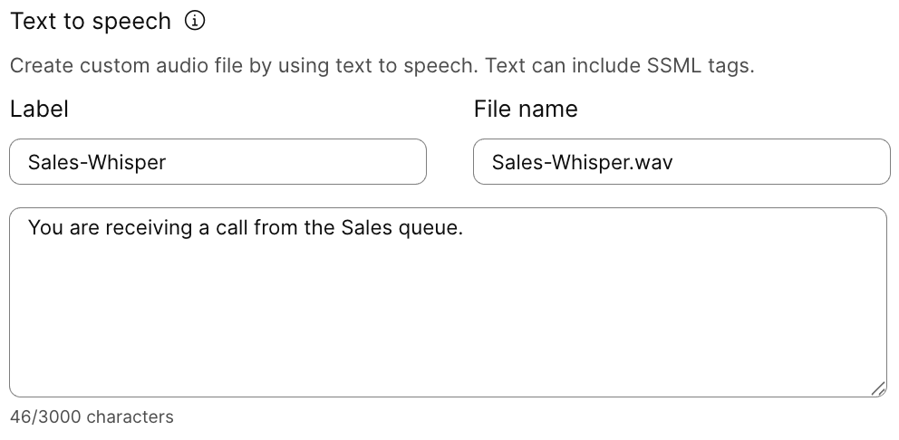

1. Under the Select Voice dropdown menu, select Calvin-Male.

1. Click Generate.

1. After a few minutes you can test the announcement. Click Save.

1. Go back to Announcements.

1. Now let´s work on a Support Whisper prompt. Click Add File.

1. Click Text to speech to create the prompt.

1. Select Organization under Level.

1. Enter “Support-Whisper” as the Label and File name in the Text to speech section.

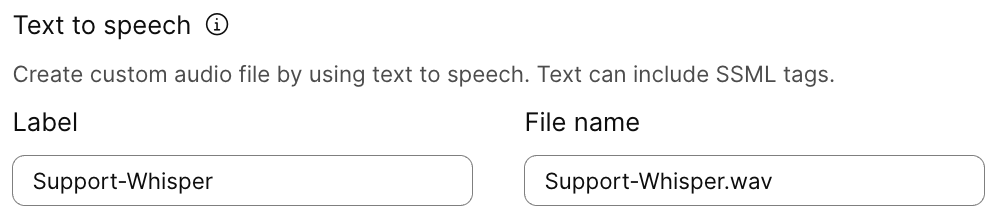

1. Enter “You are receiving a call from the Support queue.” as the Enter your text here in the Text to speech section.

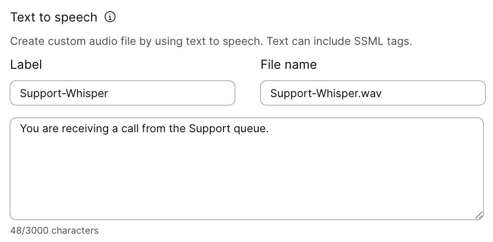

1. Under the Select Voice dropdown menu, select Calvin-Male.

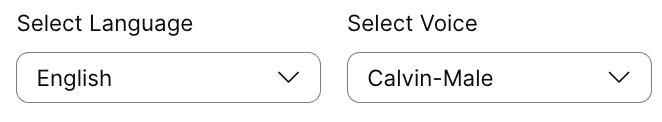

1. Click Generate.

1. After a few minutes you can test the announcement. Click Save.

1. Go back to Announcements.

1. Now let´s work on a After Hours Welcome prompt. Click Add File.

1. Click Text to speech to create the last prompt for this lab.

1. Select Organization under Level.

1. Enter “After-Hours” as the Label and File name in the Text to speech section.

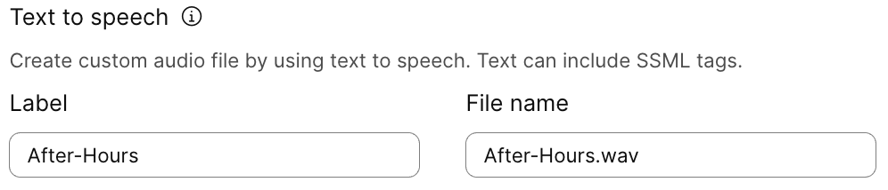

1. Enter “Thank you for calling. Our office is currently closed and we are unable to take your call at this time. Please call back during our regular business hours. We appreciate your understanding.” as the Enter your text here in the Text to speech section.

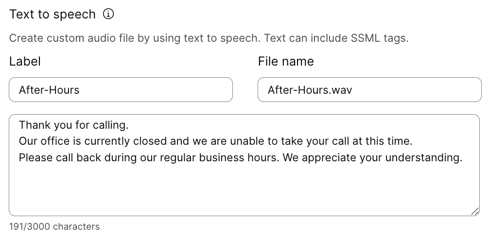

1. Under the Select Voice dropdown menu, select Veronica-Female. Currently, only two voices are supported—one male and one female—as this feature is in beta.

1. Click Generate.

1. After a few minutes you can test the announcement. Click Save.

You are ready now to start the Customer Assist configuration.

## Module 2h: Location Schedules.

Schedules in Webex Calling Locations let administrators set time-based rules for call handling aligned with business hours. This ensures calls are routed efficiently, improving customer service and agent availability in Customer Assist environments. Proper scheduling helps optimize call flow and maintain service quality.

We need to create schedules before the actual configuration of Customer Assist. In Webex Calling, schedules under Calling and Locations configuration allow users or administrators to set time-based rules for call handling, enabling customized call behaviors during specified times or days. Click Locations under MANAGEMENT.

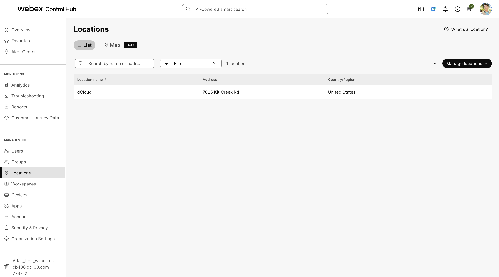

Click on the dCloud location.

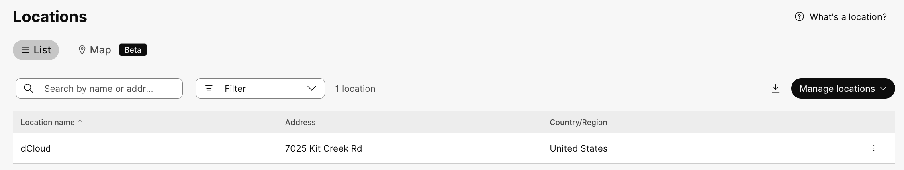

In the dCloud location, click Calling.

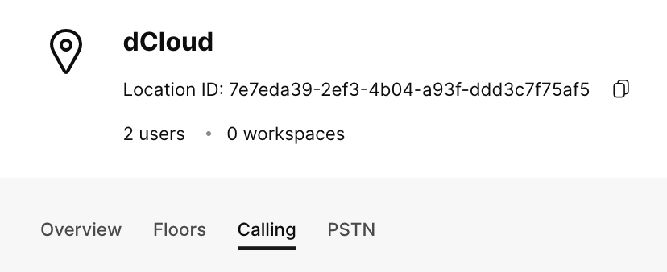

In the Calling features settings, click Schedules.

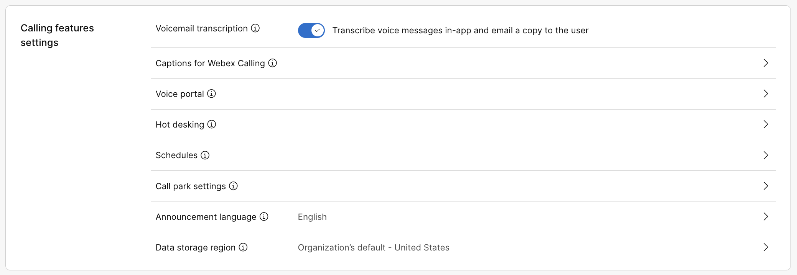

Click Add Schedule.

Enter Business-Hours in Schedule Name and keep Business Hours under the Schedule Type dropdown menu.

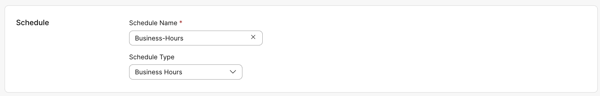

In Hours just change the final hour of this schedule from 5:00 pm to 6:30 pm (this is just an example).

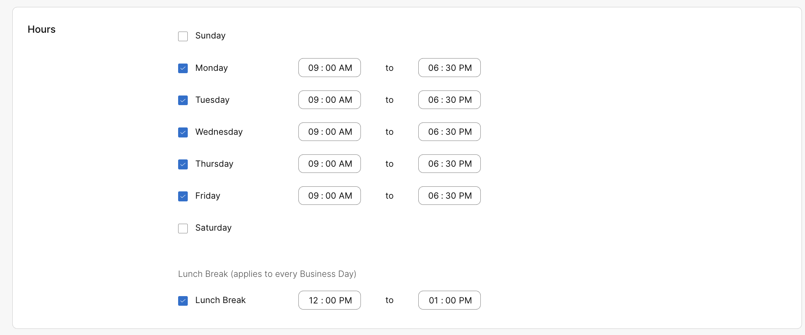

Click Save.

Now, you will add a Holidays schedule to define the behavior of the Auto Attendant configuration after hours and on holidays. For this lab, you will configure only one holiday. Keep in mind that you can configure holidays either manually or in bulk. Click Add Schedule.

Enter Holidays in Schedule Name and select Holiday under the Schedule Type dropdown menu.

In the Hours section click Add.

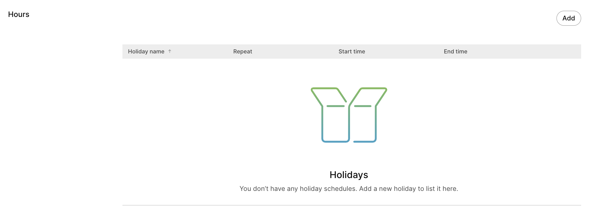

Enter Christmas in the New Holiday Hours, select Yearly in the dropdown menu.

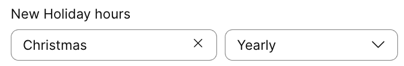

Select Date in the Repeat on dropdown menu.

Enter December 25th as the date for this Holiday, ignore the from dates, it will not matter for this configuration and finally turn on the All Day toggle. Your configuration should be similar to the image bellow.

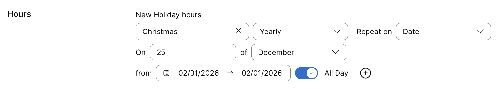

Now click the plus + button.

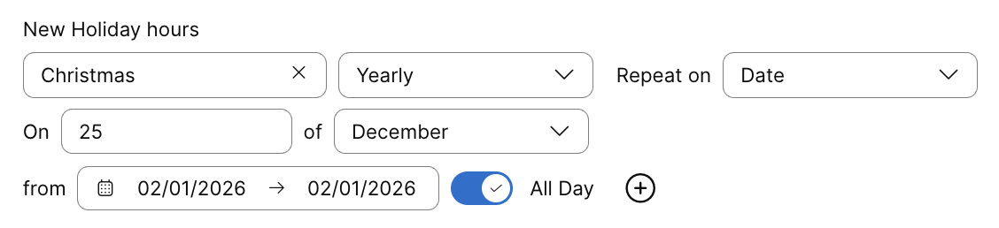

Click Save. You have now ready the Business Hours and Holidays schedules to be used in the Customer Assist configuration.

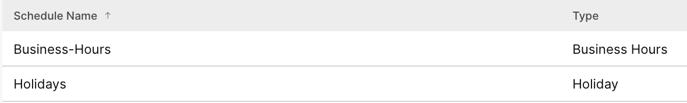

## Module 2i: Customer Assist Sales Queue Configuration.

Webex Calling Customer Assist is an AI-powered, calling-focused solution integrated within the Webex App designed to empower employees to deliver exceptional customer service. It provides features such as real-time caller intent summaries, suggested responses based on organizational knowledge bases, screen pops with relevant customer information, and real-time queue monitoring. The solution enhances agent productivity with tools like wrap-up reasons, agent availability management, and supervisor capabilities including agent monitoring, call sentiment analysis (coming soon), and historical queue analytics. It targets local and regional branch offices and knowledge workers who handle inbound customer interactions without dedicated contact center resources. Webex Calling Customer Assist is delivered as a cloud solution including a Webex Calling Professional License and is available globally. It supports voice interactions currently. The solution aims to simplify customer engagement, improve first-call resolution, and provide supervisors with actionable insights to optimize call handling and customer experience.

Key features include:

1. AI-driven caller intent and suggested responses to assist agents (coming soon).
2. Real-time queue and agent status monitoring.
3. Screen pops with caller information for more productive calls.
4. Wrap-up codes for post-call categorization.
5. Supervisor tools for monitoring, coaching, and analytics.
6. Webex Calling Professional License included in Customer Assist License.

This solution is ideal for organizations seeking to enhance customer service at frontline locations without the complexity and cost of full contact center solutions.

Click Customer Assist under SERVICES.

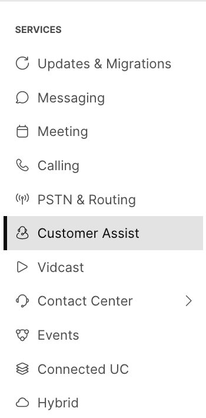

In the Webex Calling Customer Assist configuration page, click Queues.

You can add queues manually or in bulk. In this case, you will manually add two queues: one for Sales and one for Support. Click Add Queue to begin.

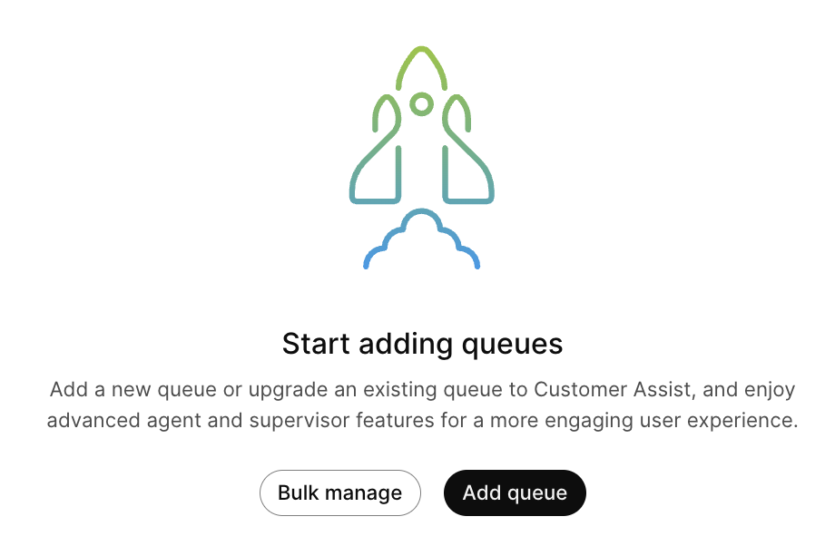

In the Basic configuration, select dCloud under the Location dropdown menu.

In the Queue Name field, enter “Sales”.

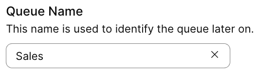

In the Phone Number field, enter 1410 as the extension number, turn on the Allow agents to use call queue number as caller ID and keep 10 in the Number of Calls in Queue. You may have up to 250 calls in queue.

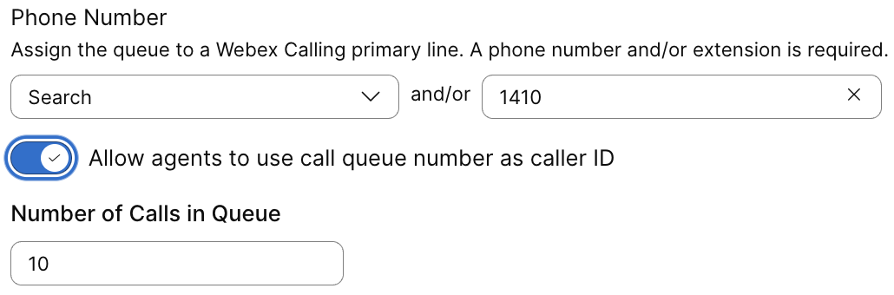

In the Direct line caller ID name, keep “Sales” ad the Display Name.

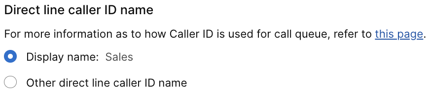

In the Display by name field, enter “Sales”.

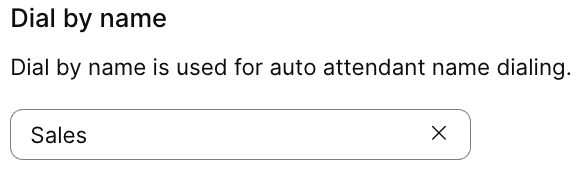

1. In the External caller ID phone number select the dCloud Location main number you configure in module 1.

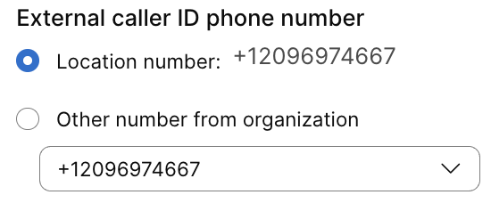

1. In the Language, keep English as it is and click Next.

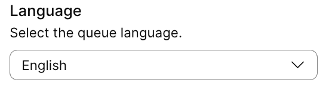

1. Customer Assist supports Priority Based routing with methods like Circular, Top Down, Longest Idle, Weighted, and Simultaneous, and Skills Based routing where agents have skill levels from 1 (highest) to 20 (lowest). Calls are routed to agents based on priority or skill match to improve efficiency and customer service. In the Create Queue, select Skill Based and select Longest Idle as the routing algorithm to route calls to agents. Click Next.

1. In the Overflow Settings, keep the default value of Perform busy treatment in the For new calls when the queue is full (Overflow) dropdown menu and turn on the Enable overflow after calls wait x seconds toggle and enter 300 seconds (5 minutes) as the overflow time. This setting triggers overflow handling if a call waits longer than the specified time, helping to manage call queues effectively.

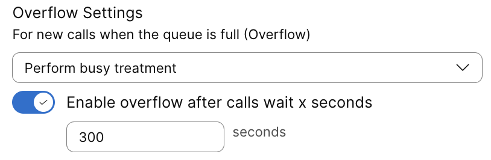

1. In order to customize the Overflow prompt, turn on the Play announcement before overflow processing toggle.

1. In the Play announcement before overflow processing field select Custom Greeting.

1. In the Play announcement before overflow processing field, click Select. This announcement will be played to callers before overflow processing begins, informing them of the call transfer.

1. Since all announcements (prompts) were configured by you at the Organization level before, you must select the Organization scope in the Announcement Files repository before you can choose the Overflow prompt.

1. Click Overflow and then click Select.

1. In the Add Queue configuration page, click Next.

1. Check Welcome message is mandatory under the Create Queue field. This is to force always the Welcome message for all calls coming to this queue. You can optionally turn off the Welcome Message depending on your use case in real life scenarios.

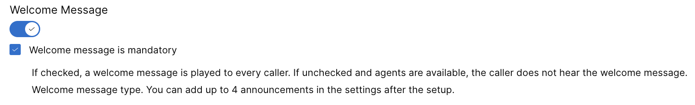

1. In the Welcome Message field, click Select file. This announcement will be played to callers when their call arrives in the Sales queue, before the call is redirected to an available agent.

1. Since all announcements (prompts) were configured by you at the Organization level before, you must select the Organization scope in the Announcement Files repository before you can choose the Overflow prompt.

1. Click Sales and then click Select.

1. The estimated wait message for queued calls in Webex Calling Customer Assist notifies callers of their estimated wait time or their position in the queue. This message plays after the welcome message and before the comfort message. When enabled, it helps manage caller expectations by providing timely updates on wait times or queue positions. We will configure this feature in the Sales queue and the Support queue to improve the customer experience in Customer Assist. Enable the Estimated wait message for Queued Calls toggle.

1. Keep 5 minutes as the Default Call Handling Time. Based on this value and the call volume, the Customer Assist solution calculates the actual call handling time to provide an accurate estimated wait time. Enable the Repeat periodic playing of Estimated wait message option and set the interval to 35 seconds (all the timers in this lab are examples, you need to adjust them according to your specific use case) so that the announcement is played periodically, informing callers of their estimated wait time or queue position.

1. For this lab, you will use the Announce queue position feature. Customer Assist requires an initial call volume to calculate the estimated wait time by determining the call handling time. Because the call volume in this lab is very low, the estimated wait time calculation will not function properly. Therefore, select the Announce queue position configuration and keep the default value of 100 calls under the Play message for caller in queue position setting.

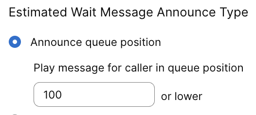

1. In the Comfort Message configuration, which is enabled by default, enter 20 seconds in the Time between comfort message field to repeat the Comfort message you configured every 20 seconds. Note that all timers in this lab are examples and should be adjusted according to your specific use case.

1. In the Comfort Message field, select Custom Greeting and click Select file.

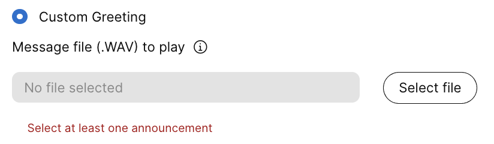

1. Select the Organization scope in the Announcement Files repository before you can choose the Overflow prompt.

1. Click Comfort and then click Select.

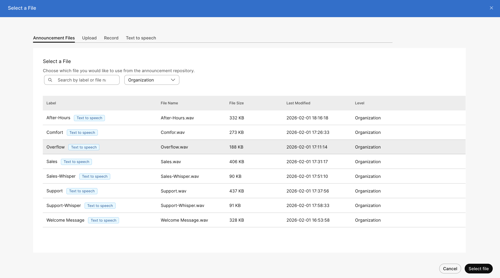

1. Comfort Bypass is a feature in Webex Calling Customer Assist that plays a shorter comfort message instead of the usual full comfort or music on hold announcement for calls that should be answered quickly. This prevents callers from hearing only a truncated portion of the standard comfort message when connected to an agent. For this lab, we will keep the Comfort Bypass toggle off because we are not going to use this feature during the lab.

1. Turn on the Hold Music toggle to enable music on hold while calls are queued in this Sales queue.

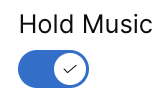

1. Keep the Default Greeting selected in Hold Music to use the default music on hold provided by Webex Calling. You can upload different music on hold files to Webex Calling and configure a playlist, depending on your use case.

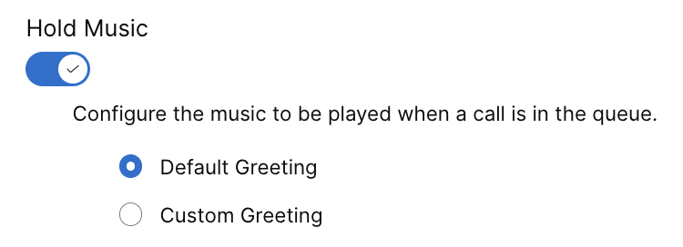

1. Turn on the Call Whisper toggle to enable the Call Whisper announcement you configured earlier. This announcement will let the agent know from which queue the call is coming.

1. In the Call Whisper field, select Custom Greeting and click Select file.

1. Select the Organization scope in the Announcement Files repository before you can choose the Overflow prompt.

1. Click Sales-Whisper and then click Select file.

1. Click Next.

1. In the Assigned skill level, select Anita Perez, she will be the only agent in this Customer Assist solution for this lab.

1. Select Allow agents to join or unjoin the queue. This setting allows agents to sign in or sign out from queues as needed, enabling them to selectively participate in a call queue without requiring administrator intervention.

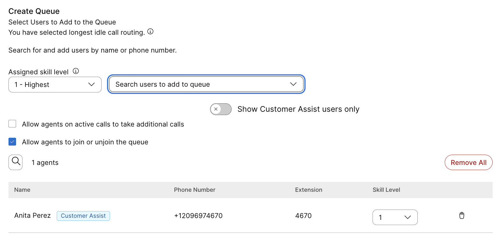

1. Click Next.

1. You can review all the configuration. Click Create and then click Done.

## Module 2j: Customer Assist Support Queue Configuration (Optional).

The module to configure the Support Queue in Customer Assist is optional because the Sales Queue already provides a complete environment to test all AI features. This means the Support Queue configuration is not mandatory for basic testing or demonstration purposes, allowing users to focus on the Sales Queue if desired, while still having the option to add the Support Queue for extended scenarios or additional testing flexibility.

You will now configure the Support queue. Click Manage and then Add.

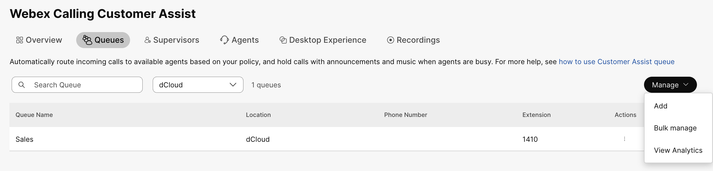

In the Basic configuration, select dCloud under the Location dropdown menu.

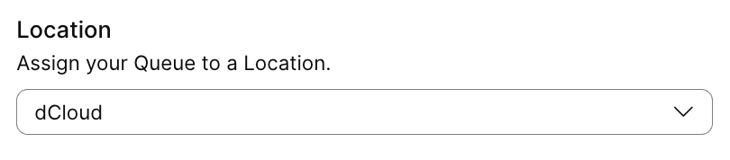

In the Queue Name field, enter “Support”.

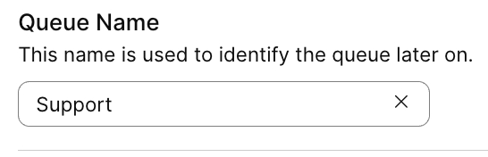

In the Phone Number field, enter 1411 as the extension number, turn on the Allow agents to use call queue number as caller ID and keep 10 in the Number of Calls in Queue. You may have up to 250 calls in queue.

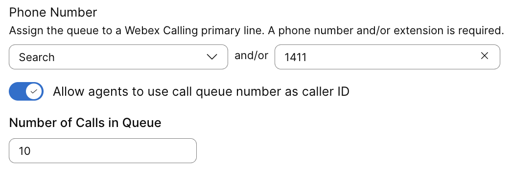

In the Direct line caller ID name, keep “Support” ad the Display Name.

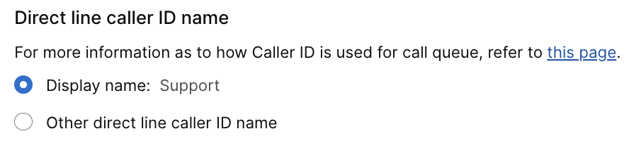

In the Display by name field, enter “Support”.

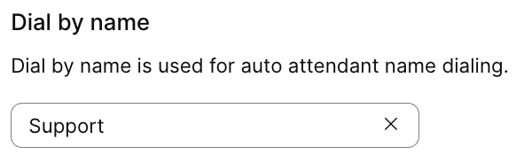

1. In the External caller ID phone number select the dCloud Location main number you configure in module 1.

1. In the Language, keep English as it is and click Next.

1. Customer Assist supports Priority Based routing with methods like Circular, Top Down, Longest Idle, Weighted, and Simultaneous, and Skills Based routing where agents have skill levels from 1 (highest) to 20 (lowest). Calls are routed to agents based on priority or skill match to improve efficiency and customer service. In the Create Queue, select Skill Based and select Longest Idle as the routing algorithm to route calls to agents. Click Next.

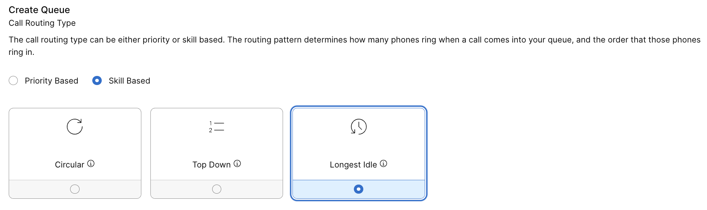

1. In the Overflow Settings, keep the default value of Perform busy treatment in the For new calls when the queue is full (Overflow) dropdown menu and turn on the Enable overflow after calls wait x seconds toggle and enter 300 seconds (5 minutes) as the overflow time. This setting triggers overflow handling if a call waits longer than the specified time, helping to manage call queues effectively.

1. In order to customize the Overflow prompt, turn on the Play announcement before overflow processing toggle.

1. In the Play announcement before overflow processing field select Custom Greeting.

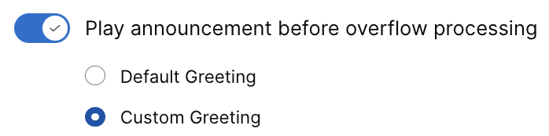

1. In the Play announcement before overflow processing field, click Select. This announcement will be played to callers before overflow processing begins, informing them of the call transfer.

1. Since all announcements (prompts) were configured by you at the Organization level before, you must select the Organization scope in the Announcement Files repository before you can choose the Overflow prompt.

1. Click Overflow and then click Select.

1. In the Add Queue configuration page, click Next.

1. Check Welcome message is mandatory under the Create Queue field. This is to force always the Welcome message for all calls coming to this queue. You can optionally turn off the Welcome Message depending on your use case in real life scenarios.

1. In the Welcome Message field, click Select file. This announcement will be played to callers when their call arrives in the Sales queue, before the call is redirected to an available agent.

1. Since all announcements (prompts) were configured by you at the Organization level before, you must select the Organization scope in the Announcement Files repository before you can choose the Overflow prompt.

1. Click Support and then click Select.

1. The estimated wait message for queued calls in Webex Calling Customer Assist notifies callers of their estimated wait time or their position in the queue. This message plays after the welcome message and before the comfort message. When enabled, it helps manage caller expectations by providing timely updates on wait times or queue positions. We will configure this feature in the Sales queue and the Support queue to improve the customer experience in Customer Assist. Enable the Estimated wait message for Queued Calls toggle.

1. Keep 5 minutes as the Default Call Handling Time. Based on this value and the call volume, the Customer Assist solution calculates the
2. actual call handling time to provide an accurate estimated wait time. Enable the Repeat periodic playing of Estimated wait message option and set the interval to 35 seconds (all the timers in this lab are examples, you need to adjust them according to your specific use case) so that the announcement is played periodically, informing callers of their estimated wait time or queue position.

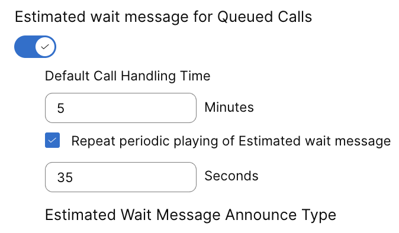

1. For this lab, you will use the Announce queue position feature. Customer Assist requires an initial call volume to calculate the estimated wait time by determining the call handling time. Because the call volume in this lab is very low, the estimated wait time calculation will not function properly. Therefore, select the Announce queue position configuration and keep the default value of 100 calls under the Play message for caller in queue position setting.

1. In the Comfort Message configuration, which is enabled by default, enter 20 seconds in the Time between comfort message field to repeat the Comfort message you configured every 20 seconds. Note that all timers in this lab are examples and should be adjusted according to your specific use case.

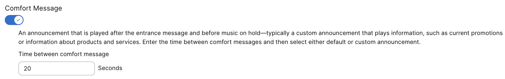

1. In the Comfort Message field, select Custom Greeting and click Select file.

1. Select the Organization scope in the Announcement Files repository before you can choose the Overflow prompt.

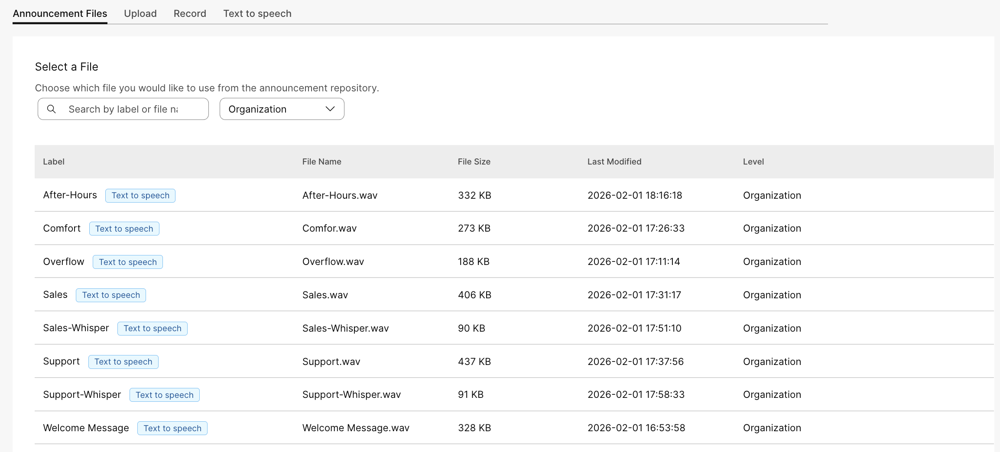

1. Click Comfort and then click Select.

1. Comfort Bypass is a feature in Webex Calling Customer Assist that plays a shorter comfort message instead of the usual full comfort or music on hold announcement for calls that should be answered quickly. This prevents callers from hearing only a truncated portion of the standard comfort message when connected to an agent. For this lab, we will keep the Comfort Bypass toggle off because we are not going to use this feature during the lab.

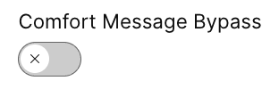

1. Turn on the Hold Music toggle to enable music on hold while calls are queued in this Sales queue.

1. Keep the Default Greeting selected in Hold Music to use the default music on hold provided by Webex Calling. You can upload different music on hold files to Webex Calling and configure a playlist, depending on your use case.

1. Turn on the Call Whisper toggle to enable the Call Whisper announcement you configured earlier. This announcement will let the agent know from which queue the call is coming.

1. In the Call Whisper field, select Custom Greeting and click Select file.

1. Select the Organization scope in the Announcement Files repository before you can choose the Overflow prompt.

1. Click Support-Whisper and then click Select file.

1. Click Next.

1. In the Assigned skill level, select Anita Perez, she will be the only agent in this Customer Assist solution for this lab.

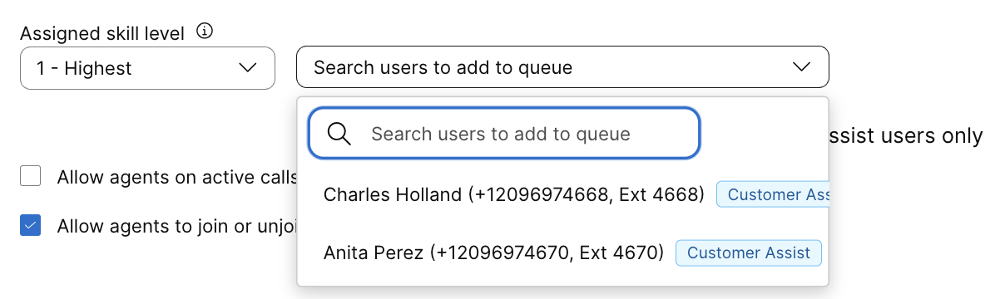

1. Select Allow agents to join or unjoin the queue. This setting allows agents to sign in or sign out from queues as needed, enabling them to selectively participate in a call queue without requiring administrator intervention.

1. Click Next.

1. You can review all the configuration. Click Create and then click Done.

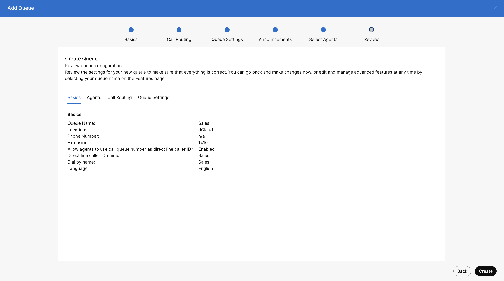

## Module 2k: Supervisor Configuration for Customer Assist.

A supervisor in Webex Calling Customer Assist is a user who manages and monitors agents and queues through a centralized interface. Supervisors can view real-time and historical data about agents and queues, monitor live calls, send messages to agents, change agent statuses, and manage agent assignments to queues. They have tools to assess agent performance, listen in on calls, whisper coach, or barge into calls to assist agents. Supervisors also generate and download reports on agent wrap-up reasons enabling effective oversight and operational management of the Customer Assist environment.

1. Now you need to define the Supervisor role for Charles Holland. In the Webex Calling Customer Assist configuration page click Supervisors.

1. Click Add Supervisor.

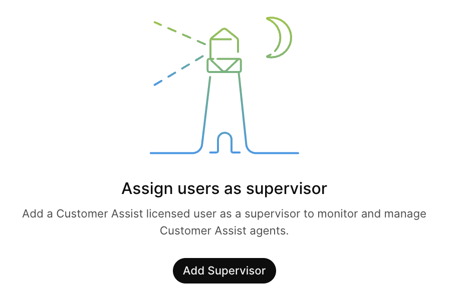

1. In the Select user to add as a supervisor dropdown menu, select Charles Holland.

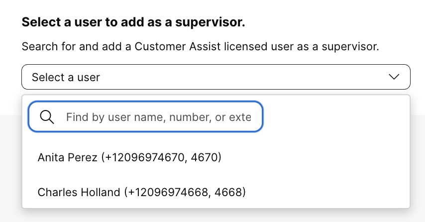

1. Click Next.

1. In the Select agents to assign to the supervisor select Anita Perez.

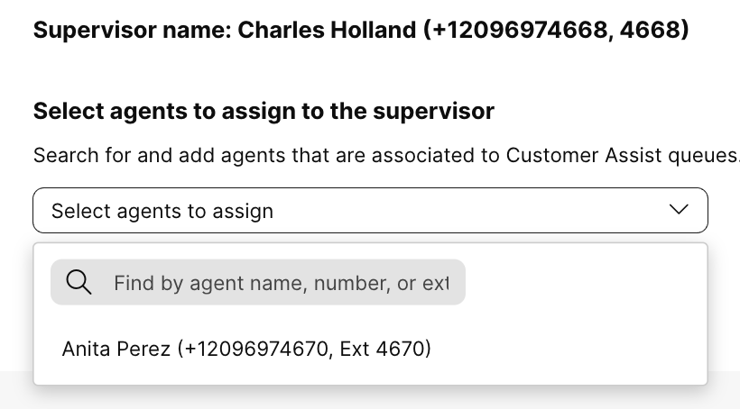

1. Click Next.

1. Review the configuration you just did and click Add Supervisor.

## Module 2l: Auto Attendant Configuration.

An Auto Attendant is an entry point from PSTN to route calls to the Sales or Support queue depending upon the end user requirements dialing to the Customer Assist solution. An Auto Attendant in Webex Calling answers incoming calls and provides a menu for callers to direct their calls to the right person, group, or voicemail without a receptionist. It supports customizable greetings and scheduling for business hours, after hours, and holidays, enabling efficient automated call handling 24/7.

1. Click Calling under SERVICES.

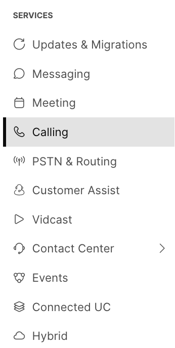

1. On the Calling page, click the Features tab.

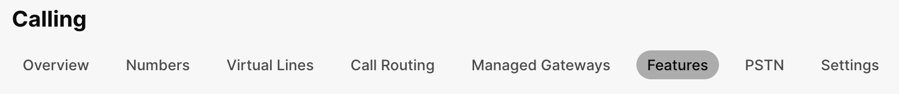

1. In the Auto Attendant configuration, click Add New.

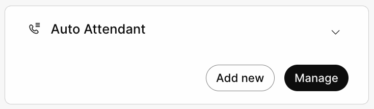

Select dCloud under the Location dropdown menu.

In the Auto Attendant Name field, enter “Main-AA”.

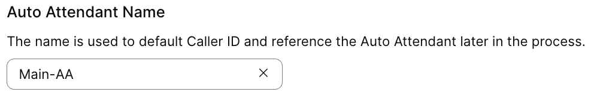

In the Phone Number field, select the telephone number you assigned to the Location and enter 1400 as the extension number.

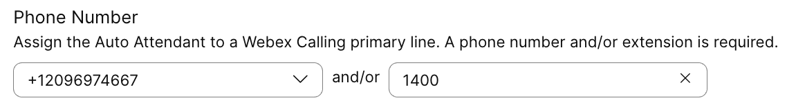

In the Direct line caller ID name, keep “Main-AA” as the Display Name.

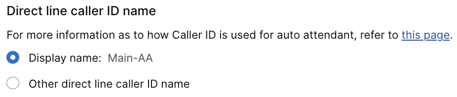

In the Display by name field, enter “Main”.

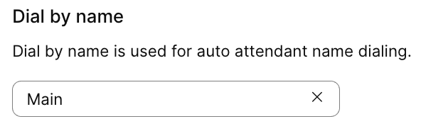

1. On the Language selection screen, ensure English remains selected, then click Next to continue.

1. On the Business Hours Schedule screen, choose “Business-Hours” from the Assign an existing schedule dropdown menu. Click Next.

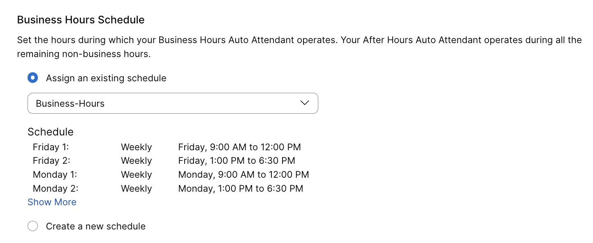

1. On the Holiday Schedule screen, choose “Holidays” from the Assign an existing schedule dropdown menu. Click Next.

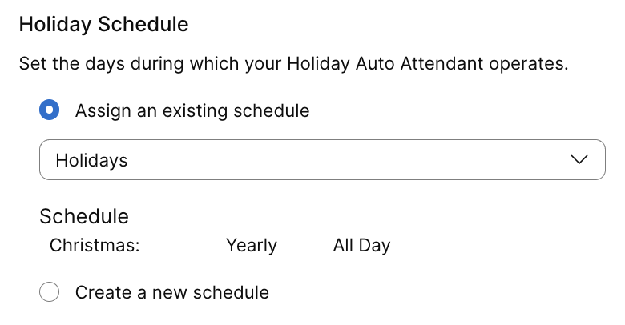

1. On the Business Hours tab, choose Transfer call without prompt under the Press 1 to dropdown menu and enter 1410 in the Phone Number or Extension.

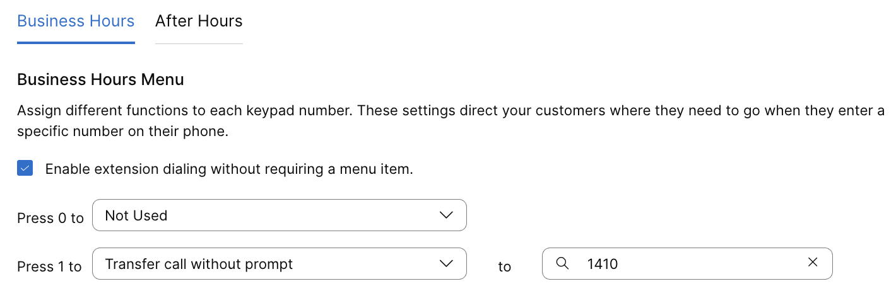

1. On the Business Hours tab, choose Transfer call without prompt under the Press 2 to dropdown menu and enter 1411 in the Phone Number or Extension. Leave all other settings at their default values and click Next.

1. On the Business Hours tab select Custom Greeting and click Select file.

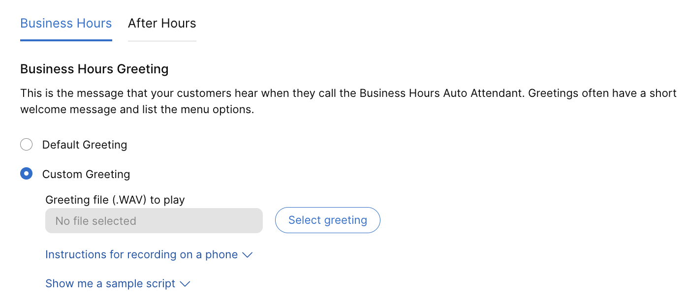

1. Select the Organization scope in the Announcement Files repository before you can choose the Welcome Message prompt you configured before.

1. Click Welcome Message and then click Select.

1. Click After Hours to configure the prompt the Auto Attendant will use after hours or in any Holiday you configured in Schedules (for this lab is just Christmas).

1. On the Business Hours tab, select Custom Greeting and click Select file.

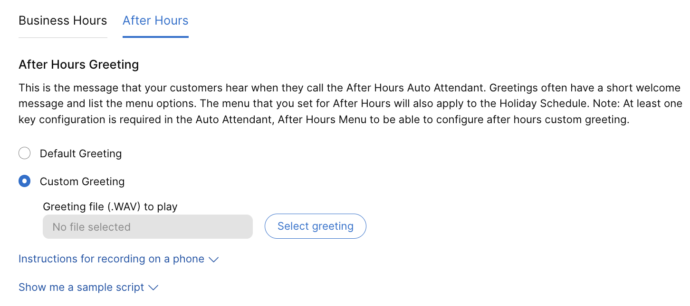

1. Select the Organization scope in the Announcement Files repository before you can choose the After-Hours prompt you configured before.

1. Click After-Hours and then click Select. Click Next.

1. Review all the configuration and click Create. You are now ready to configure the Call Queue Recording in Customer Assist and to test it.

## Module 2m: Customer Assist: AI Summaries for Call Queue Recordings

Queue recording in Webex Calling Customer Assist enables the recording of both incoming and outgoing calls at the queue level, allowing administrators to manage recordings centrally without needing to enable recording for individual agents. This feature supports automatic recording with options for pause and resume, and recordings are accessible through Control Hub for administrators and compliance officers. The AI capabilities integrated with queue recording include the generation of transcripts, summaries, and action items using artificial intelligence. These AI-generated transcripts provide a textual record of the call, while summaries highlight key points and action items with timestamps to facilitate quick navigation and follow-up. This enhances quality assurance, agent training, and operational efficiency by providing detailed insights into customer interactions and enabling supervisors and agents to review and act on call content effectively.

Key points:

1. Queue-level call recording for inbound and outbound calls.
2. Centralized management and access via Control Hub.
3. AI-generated transcripts, summaries, and action items.
4. Action items include timestamps for easy reference.
5. AI features improve agent and supervisor experience by providing detailed call insights.

This functionality is part of the broader Webex Calling Customer Assist solution, which aims to enhance customer service operations with AI-powered tools.

1. Click Customer Assist under SERVICES.

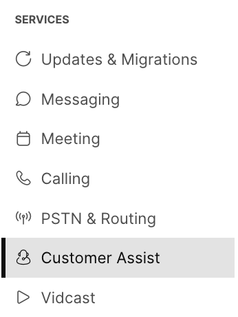

1. On the Webex Calling Customer Assist configuration, click the “Sales” queue you configured before.

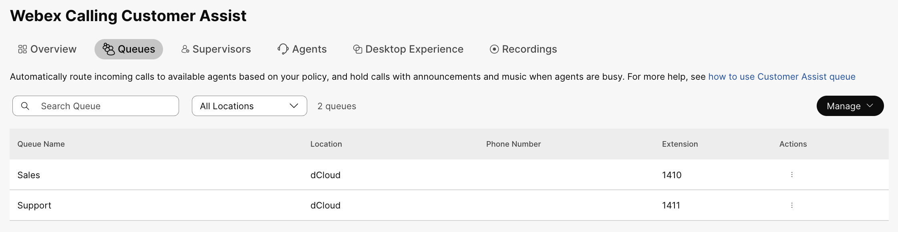

1. On the Queue Recordings section, click Call Recording.

1. Turn on the Call recording for the Sales Queue.

1. Keep the Always selection to record all the calls for this “Sales” queue. You can see that there is another option called Always with Pause/resume to record all the calls but with the option to pause and resume the recording, this may be an option for your real use case scenario.

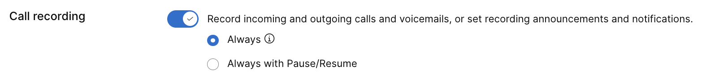

1. In the recording settings, enable Play recording start/stop announcement for PSTN calls and Play recording start/stop announcement for internal calls, then save the changes. Enabling these options ensures callers and agents are informed when call recording starts or stops, promoting transparency and compliance with legal or organizational policies.

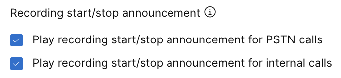

1. Turn on the Generate Transcript toggle and enable Generate Summary and Action Items. Enabling these AI features will provide transcripts, summaries, and action items for all recordings in this queue. Click Save.

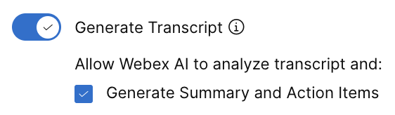

1. If the “Support” queue is configured, repeat steps 1 through 7 for the “Support” queue.

1. To test the AI features on Customer Assist Queue Recordings, log out from user Charles Holland (cholland@cbXXX.dc-YY.com) on demo workstation (virtual workstation) and then log back in with the same user to activate Customer Assist in the Webex app. If Customer Assist is already active, verify its status and explore the Supervisor menus to confirm access.

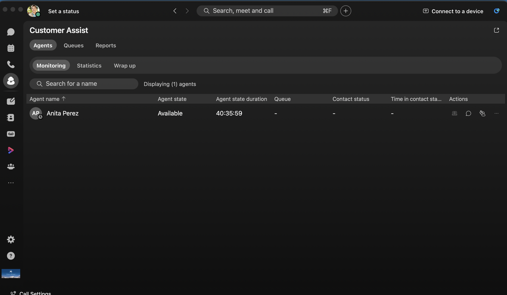

1. To test the AI features on Customer Assist Queue Recordings, log out from user Anita Perez (aperez@cbXXX.dc-YY.com) on the physical workstation and then log back in with the same user to activate Customer Assist in the Webex app. If Customer Assist is already active, verify its status and explore the Supervisor menus to confirm access.

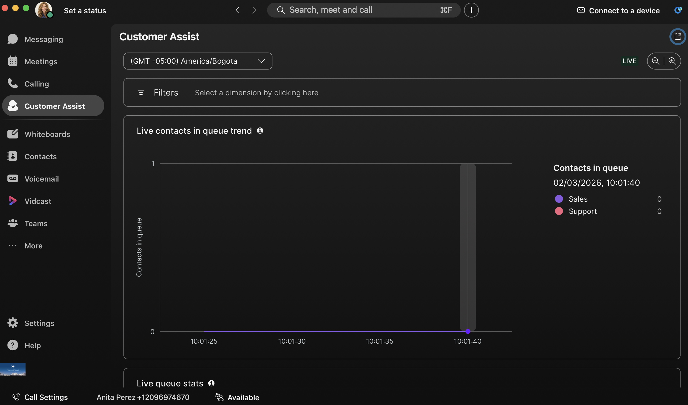

1. To test the Customer Assist Queue Recording feature, from the registered 98XX IP Phone, dial 1400, which is the Auto Attendant number. Follow the Welcome Message prompts and select the option to route the call to either the Customer Assist Sales or Support queue based on your configuration.

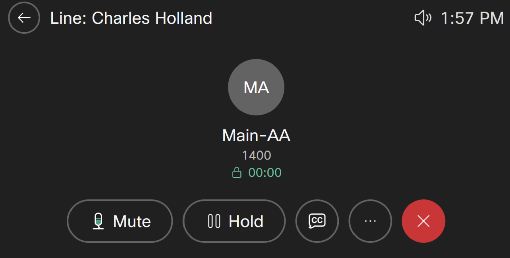

1. To test the AI features on Customer Assist Queue Recordings with agent Anita Perez (aperez@cbXXX.dc-YY.com), ensure she is in the available status for Customer Assist. Then, answer the call from the Webex app. You will see that the recording starts automatically. Engage in conversation on both the Webex app and the 98XX phone to generate a call recording that includes the AI features such as transcription, summary, and action items.

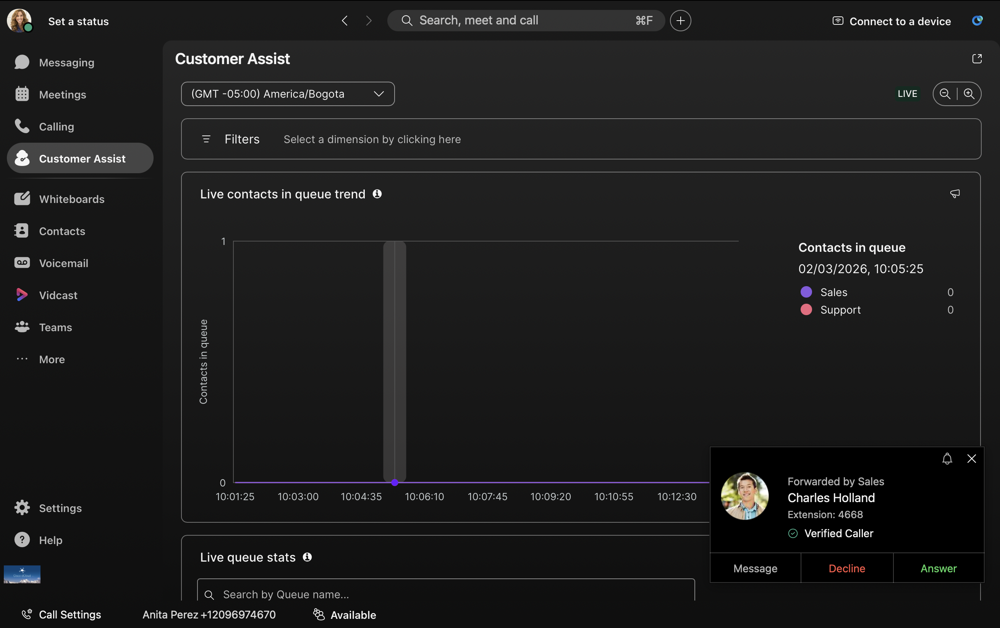

1. Keep the conversation active for a few seconds to allow the AI features—such as transcription, summary, and action items—to capture more data and demonstrate their capabilities effectively.

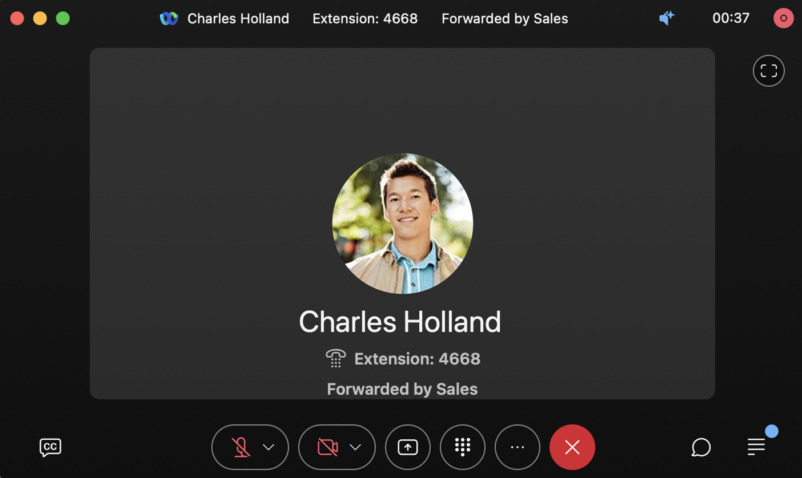

1. To view and access call recordings, a user must have the Compliance Officer role assigned. This role grants the necessary permissions to download, play, and manage recordings within the Webex Control Hub. In this lab, the user Anita Perez (aperez@cbXXX.dc-YY.com) has been assigned the Compliance Officer role, which enables her to access and utilize these recording features as part of the lab configuration. This role is typically assigned by a full administrator and is required to ensure regulatory compliance and proper handling of recorded content. Open a new Chrome session in your physical workstation and log in using Anita Perez (aperez@cbXXX.dc-YY.com) user. Click Customer Assist under SERVICES.

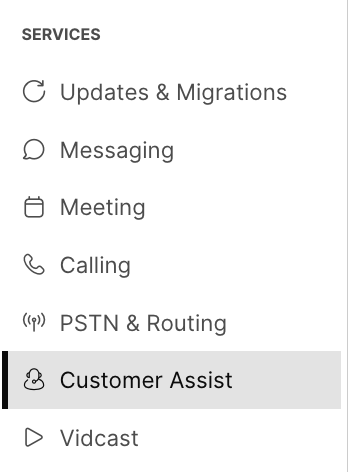

1. On the Webex Calling Customer Assist configuration page, click Recordings.

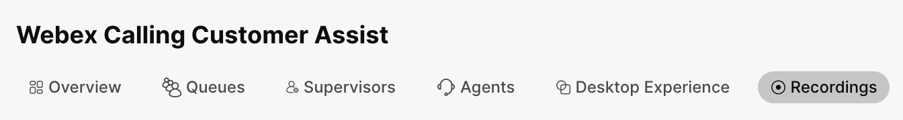

1. On the All Locations dropdown menu, select dCloud location.

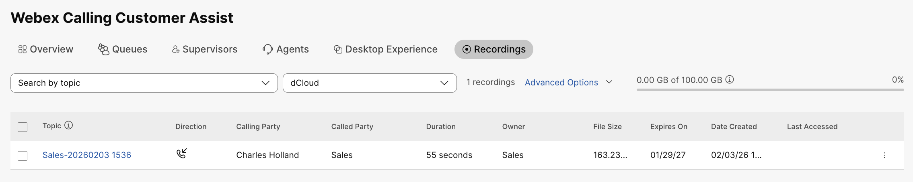

1. Click on the recording you just made to view the AI-generated transcription, summary, and action items. Please wait a few minutes if the processing is not yet complete, as these features require some time to be generated.

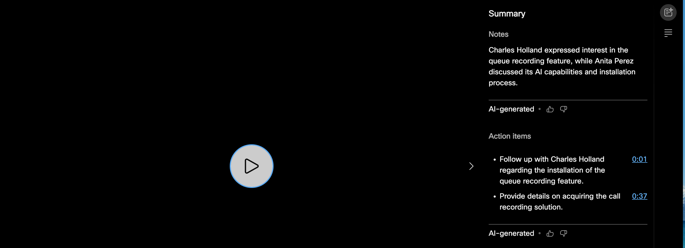

Remember that these AI-generated transcription, summary, and action items features are included in the Customer Assist licenses!!. You can continue with the next module.
