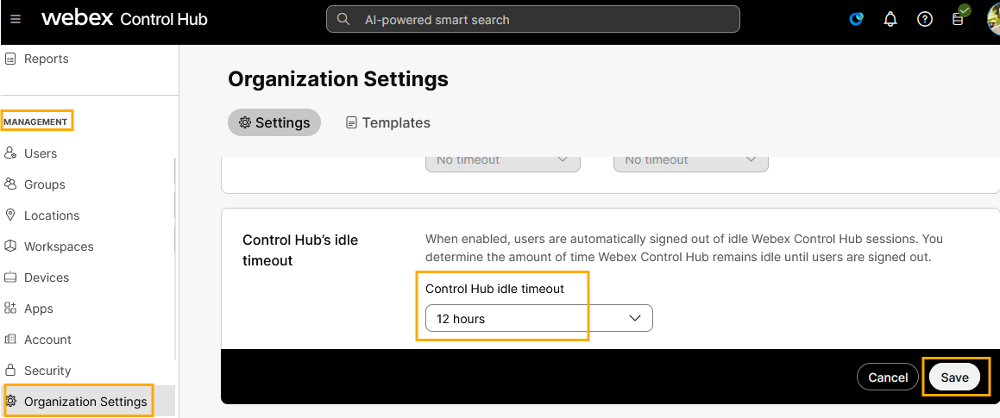
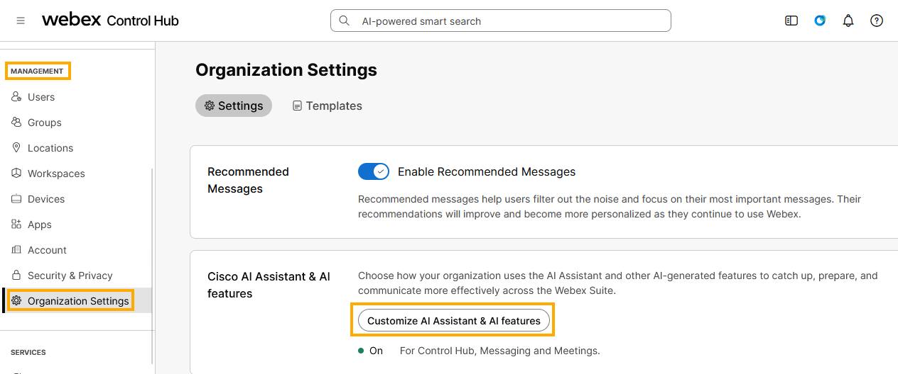
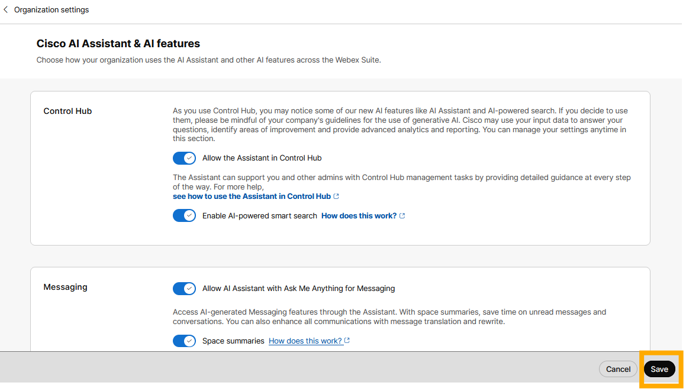

# Module 1a: Activating and Configuring the Cisco AI Assistant

The Webex Control Hub serves as the central command center for Webex AI. As an administrator, you can decide which AI capabilities are deployed, ensuring they align with your organization’s policies while maximizing productivity. In this module, you will learn how to navigate the AI settings to enable the suite-wide features that power the subsequent modules in this lab.

1. Open WebRDP connection to Workstation 1 as described in the Accessing your lab section.
2. Within Workstation 1, open the Chrome browser from the taskbar.
3. From browser home page navigate to Collaboration Admin Links > Cisco Webex Control Hub or manually type and browse to https://admin.webex.com.
4. Login to Webex Control Hub Charles Holland credentials.   Credentials are located on Workstation 1 desktop in Credentilas.txt file.  Refer to the screenshot below for credentials.

!!! note
    VERY IMPORTANT NOTE: Every session/pod has their own credentials, below screenshot is for reference purpose only.  Use the credentials from your own session/pod.

1. For security reasons, Webex Control Hub signs out every 20 minutes (Idle timeout) by default. For this lab, let’s make the idle time out longer so the Control Hub does not sign you out often during this lab. Go to MANAGEMENT > Organization Settings > Control Hub’s idle timeout. Drop down the option for Control Hub idle timeout and select 12 hours or no timeout. Click Save.

1. Next, we will turn on AI features including the Cisco AI Assistant for your pod’s Webex tenant. Go to Management > Organization Settings > Cisco AI Assistant & AI features > click on Customize AI Assistant & AI features as shown below.

    

3. Ensure all the toggles are turned ON with the exception of External sources and AI Assistant Integrations. Click Save at the bottom right.

    

1. This completes Activating and configuring the Cisco AI Assistant and its associated features within Webex Control Hub
