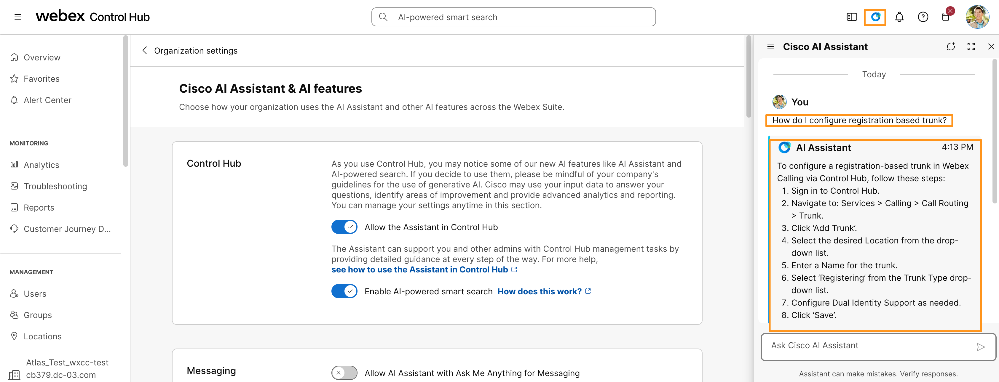

# Module 1b: AI Assistant in Control Hub

One of the toggles we enabled in previous module is called Allow the Assistant in Control Hub.

This AI Assistant allows you to ask how do I questions relating to setup and configuration of the Webex Suite.

You can also see your previous conversation history, play it back, and ask follow-up questions, while maintaining the full context of your previous interactions.

The Cisco AI Assistant in Control Hub can answer questions pertaining to the Webex Suite, which includes products such as Messaging, Meetings, Calling, and Contact Center.

Let's quickly explore on how to use this AI assistant in Webex Control Hub.

1. Continuing on Workstation 1, on browser tab where you have logged into Webex Control Hub.
2. Click  AI Assistant  [] towards top right corner.

    

1. It will bring up AI Assistant fly-out window on right side.  Ask any Webex Control Hub related questions like, how do I configure registration based trunk?

1. Feel free to explore asking more questions and when completed, move on to the next module.
