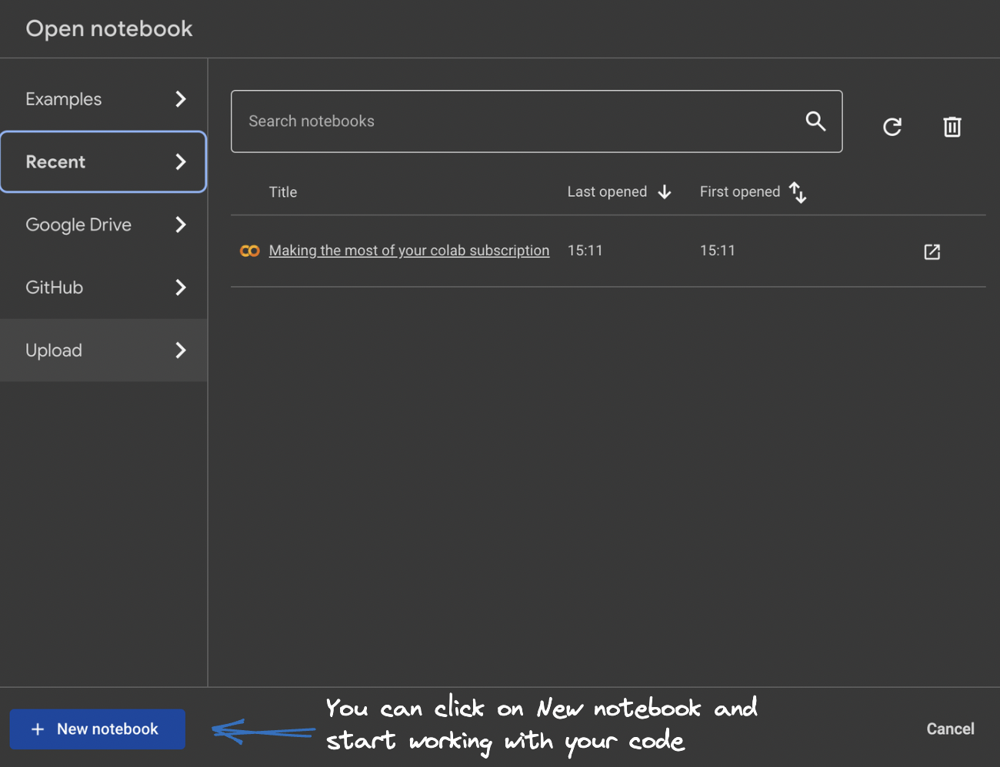
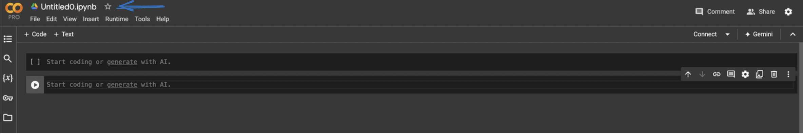
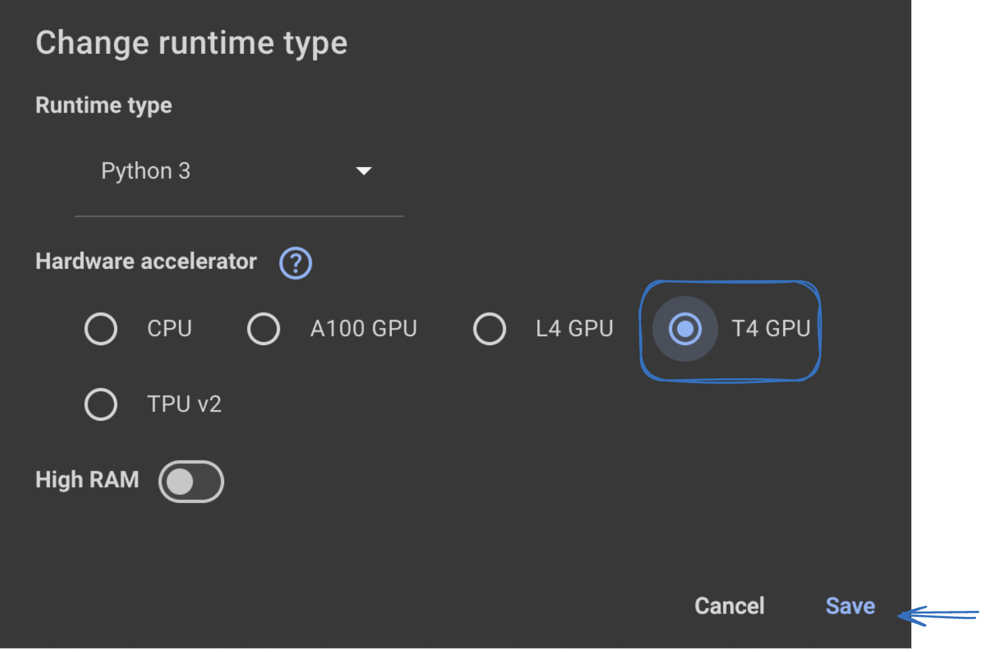
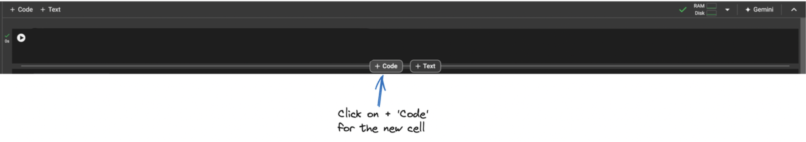

# Module 1b: Google Colab Setup

Google Colab is a cloud-based platform for running Python notebooks. If you want to build a machine learning model but don't have a computer that can handle the workload, Google Colab is a great option. In this lab, we will use Google Colab to test and run our code. If you have your own Python environment and prefer to run the code locally, feel free to do so.

Here are some reasons why Google Colab is useful for this lab:

* **Free access to GPUs and TPUs:** Colab offers free access to powerful GPUs and TPUs, which can significantly speed up training and fine-tuning of machine learning models.
* **No setup required:** Everything runs in the cloud, so you don't need to install or configure anything on your local machine.
* **Easy collaboration:** Notebooks can be shared with team members, making it ideal for collaborative projects.
* **Google Drive integration:** Colab saves your work directly to Google Drive.
* **Pre-installed libraries:** Popular libraries such as TensorFlow and PyTorch come pre-installed, so you can start working right away.

## Steps

### 1. Sign in and open Colab

Log in to your Google account, then open [Google Colab](https://colab.research.google.com/){:target="_blank" rel="noopener"} in a new tab.

!!! info "Use your personal Google account"
    You can use your personal Google account (Gmail) for this lab.

### 2. Create a new notebook

From the Colab welcome screen, click **File > New notebook** to create a new Jupyter notebook.

The new notebook will be named **`Untitled0.ipynb`** by default and saved to your Google Drive in a folder called **`Colab Notebooks`**. Since it is a Jupyter notebook, all standard Jupyter notebook commands work here.

### 3. Choose your runtime environment

!!! note "When to change the runtime"
    There may be times when you need to fine-tune models or run tasks that benefit from a specific runtime environment. Colab lets you pick a Python version and a hardware accelerator that matches your workload.

    * **Python version:** Choose the Python version that matches your code and library compatibility (Python 2 or Python 3). We will use **Python 3** for this lab.
    * **Hardware accelerator:** Pick the option that fits your workload:
        * **None:** No hardware acceleration. Good for basic tasks.
        * **GPU:** Speeds up computations using a Graphics Processing Unit.
        * **TPU:** Uses a Tensor Processing Unit for even faster performance, especially for deep learning.

Click the arrow next to **Connect** to open the dropdown.

Then follow these steps:

1. Select **Change runtime type** to open the runtime configuration dialog.
2. From the **Runtime type** dropdown, choose **Python 3**.
3. From the **Hardware accelerator** dropdown, choose **GPU** or **TPU**.
4. Click **Save** to apply the changes.

### 4. Add a new code cell

Whenever you want to copy code into Colab and run it, click **+ Code** to add a new code cell.

### 5. Run your code

Click the **play button** to the left of the cell, or press **Command/Ctrl + Enter** while the cell is selected.

