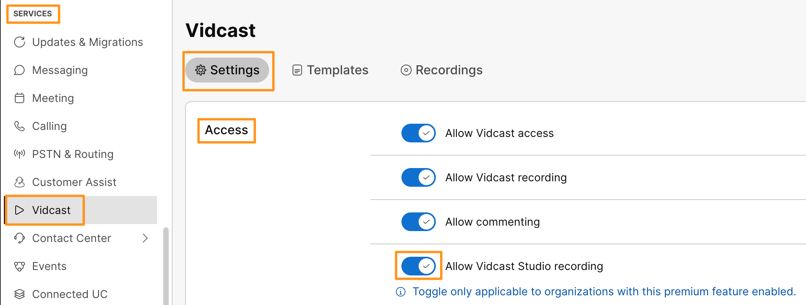
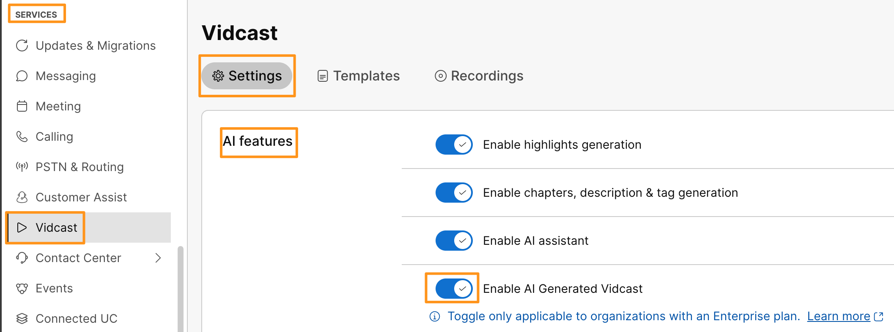
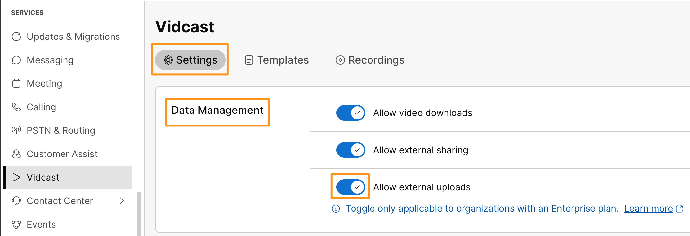
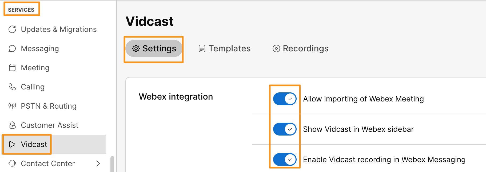

# Module 1c: Enabling AI Features for Vidcast

1. Continuing on Workstation 1,  on browser tab where you have logged into Webex Control Hub. Navigate to  SERVICES > Vidcast.

1. On Vidcast Settings page, enable the following toggles ON.

1. Access > Allow Vidcast Studio recording

    

1. Scroll down to AI features and toggle Enable AI Generated Vidcast

    

1. Scroll down to Data Management and toggle  Allow external upload

1. Also, scroll up to Webex integration section and make sure all the toggles are turned ON.

    

Now we are ready to interact and explore power of AI in Vidcast, that we will experience in later modules.
