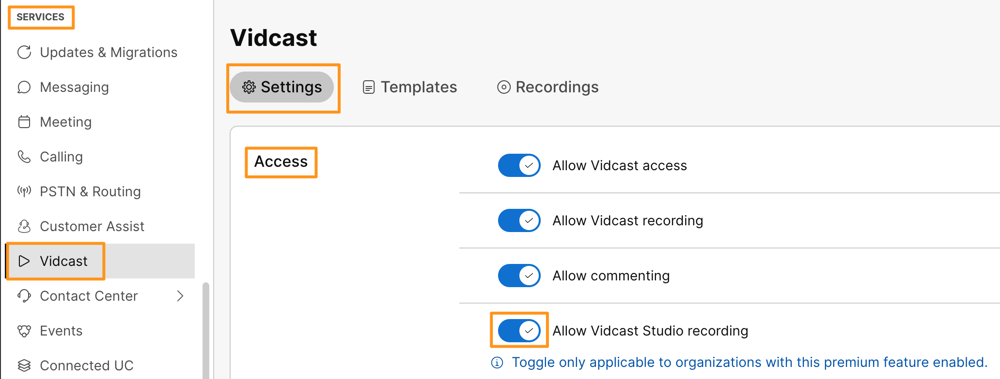
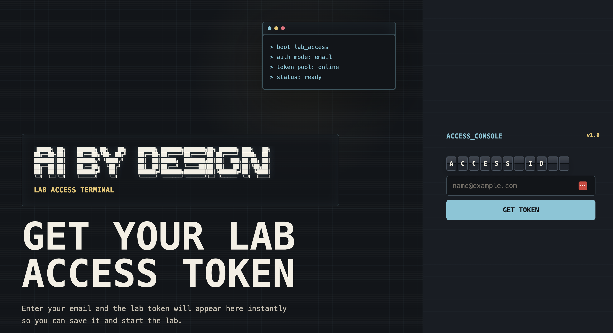
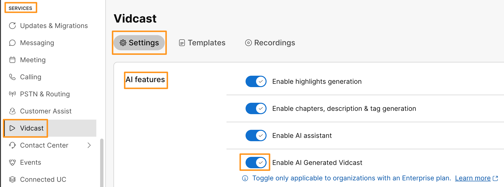

# Module 1c: Managing API Keys in Google Colab

When working with frameworks like **LangChain** and large language model providers like **OpenAI**, your code needs an API key to authenticate. Hard-coding keys directly inside your notebook is not safe (the key can be shared by accident or pushed to a public repo). Google Colab provides a built-in **Secrets** feature that lets you store keys securely and reference them from any notebook in your account.

In this task, you will add the **OpenAI API key** to Colab Secrets so the rest of the lab can use it.

## Steps

### 1. Open the Secrets panel

Inside your existing Google Colab notebook, click the **key icon** in the left sidebar to open the **Secrets** section.

### 2. Get your OpenAI API key

Before you can add the secret, you need an actual key to paste in.

For this lab, we have set up a small webpage that will hand you a temporary OpenAI API key. Open this URL in a new tab:

[https://cs.co/AiByDesign](https://cs.co/AiByDesign){:target="_blank" rel="noopener"}

Enter your email address on the page and submit. The API key will be displayed on the screen, and a copy will also be sent to your email so you have it for the rest of the session.

Copy the key shown on screen. You will paste it into Colab in the next step.

!!! note "If the page is not reachable"
    If you cannot access [https://cs.co/AiByDesign](https://cs.co/AiByDesign){:target="_blank" rel="noopener"} from your lab pod, please ask one of your **lab proctors**. They will hand you a key directly so you can keep moving.

### 3. Add the key as a Colab secret

Back in your Colab notebook, in the **Secrets** panel from the previous step, click **+ Add new secret** and fill in the following:

* **Name:** `OPENAI_API_KEY`
* **Value:** the OpenAI API key you just copied (from `cs.co/AiByDesign` or from your proctor)

!!! warning "Use the exact name `OPENAI_API_KEY`"
    The lab code references this key by name. Make sure you enter it exactly as **`OPENAI_API_KEY`** (uppercase, with the underscore). If the name does not match, the notebook will not be able to find the key and your code will fail.

### 4. Grant notebook access

Your secrets are stored once and shared across all your notebooks. For each notebook that needs to use a secret, you have to turn on the **Notebook access** toggle next to that secret.

Toggle **Notebook access** on for `OPENAI_API_KEY` so the current notebook can read it.

!!! note "About the lab API key"
    The OpenAI API key provided to you is for **lab use only** and will be valid only for the duration of this session. You're welcome to continue exploring on your own after the lab by using your personal OpenAI API key in place of the one provided here.
