# Module 1d: Ordering Phone Numbers (DIDs) for Users

In this module we will order new DID numbers using Cisco Calling Plan and then assign one of these DID numbers as the Main number for the location of Control Hub.

In customer environments, if you have an existing PSTN provider and DID numbers, you can import all your DID numbers into Control Hub and assign them as the Main number and/or any user for Webex Calling.

1. Continuing on Workstation 1, go back to the browser where you have logged in to Webex Control Hub before.

1. On Webex Control Hub, navigate to SERVICES > PSTN & Routing. Drop down option Manage and choose Add.

    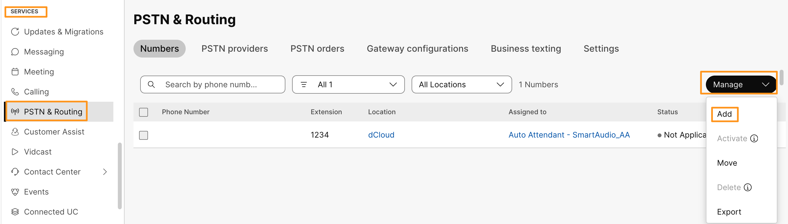

1. On the Add Numbers page, drop down the option for Location and choose dCloud. Since we are setting up this location for the first time, first we need to select the PSTN Connection for this location.  Click Edit PSTN.

    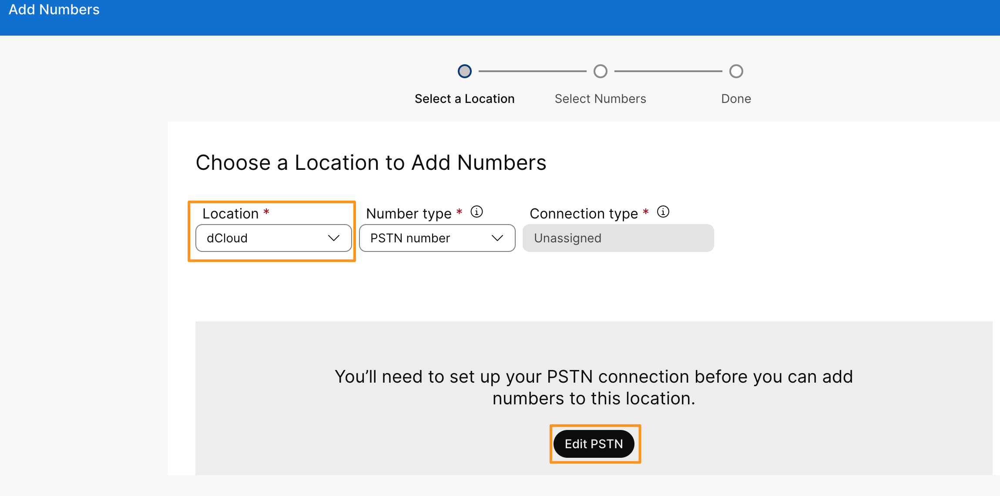

1. You will be taken to Edit PSTN connection for dCloud (Location) page.  Choose Cisco Calling Plans  for connection type and click Next.

    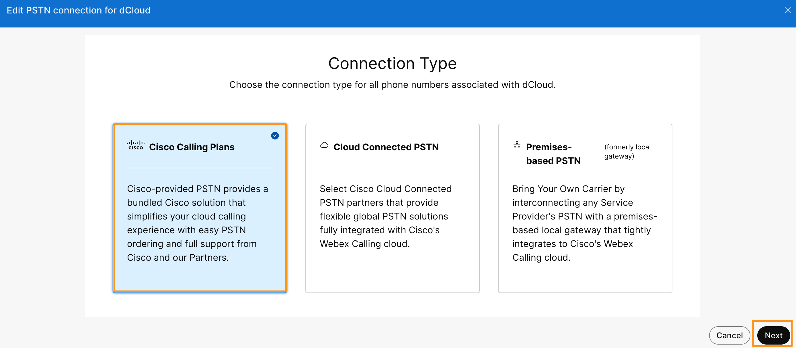

1. On the next page, we need to fill out Contract Information, use the information below to fill out then and click Next.
2. Company Name: Keep the information that is shown by default.
3. First Name: Charles
4. Last Name: Holland
5. Email Address: cholland@cbXXX.dc-YY.com where XXX and YY are specific to your POD as it as explained in module 1a.
6. Confirm Email Address: cholland@cbXXX.dc-YY.com where XXX and YY are specific to your POD as it as explained in module 1a.
7. Billing Telephone Number: Leave blank.

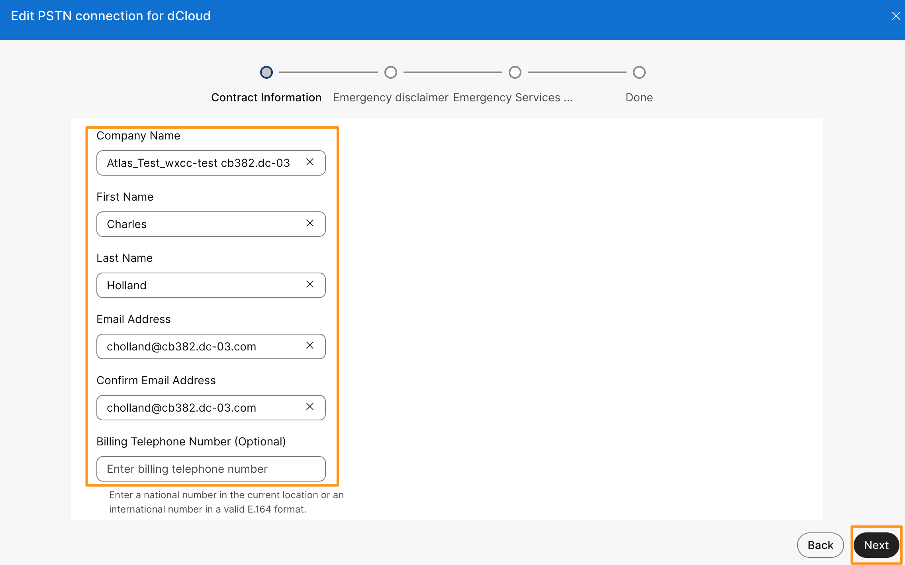

1. It will bring up a pop-up window to confirm the Contract Information Update , click Yes, Change.

    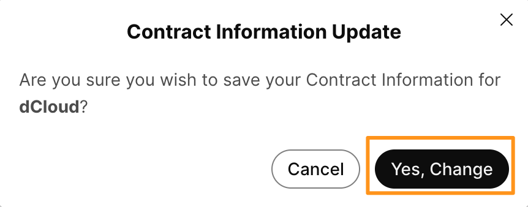

1. It will take you to the Emergency Disclaimer page, scroll all the way down on the contact agreement and populate the following information.  Click Agree and Continue.
2. Authorized Contact: Charles Holland.
3. Job Title: Engineer

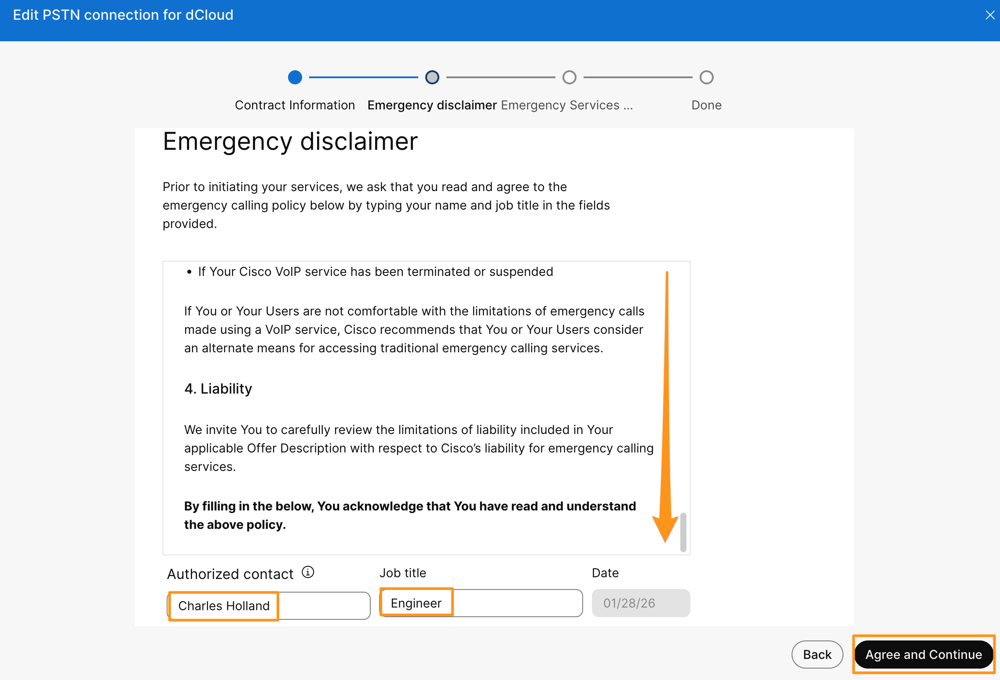

1. On the next page, for Emergency Services Address window, leave all fields as default and click Save.

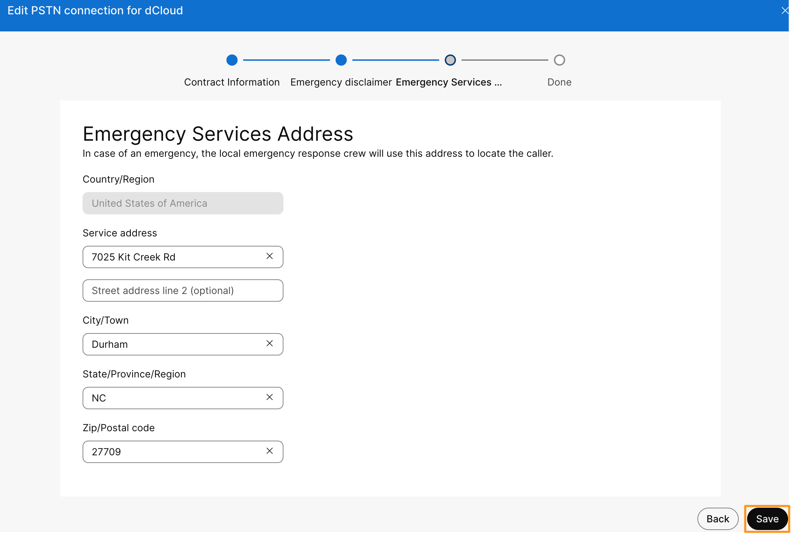

1. In the PSTN connection saved window click Add numbers.

    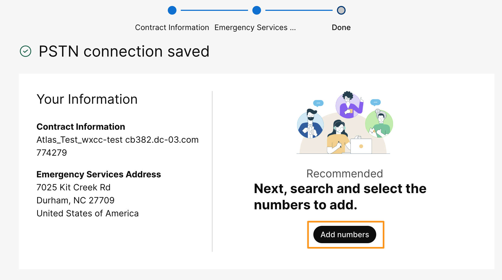

1. In the Choose a Location to Add Numbers window, make sure location is selected as dCloud and Number type is selected as PSTN number.  Keep the Order New Numbers option selected and click Next.

    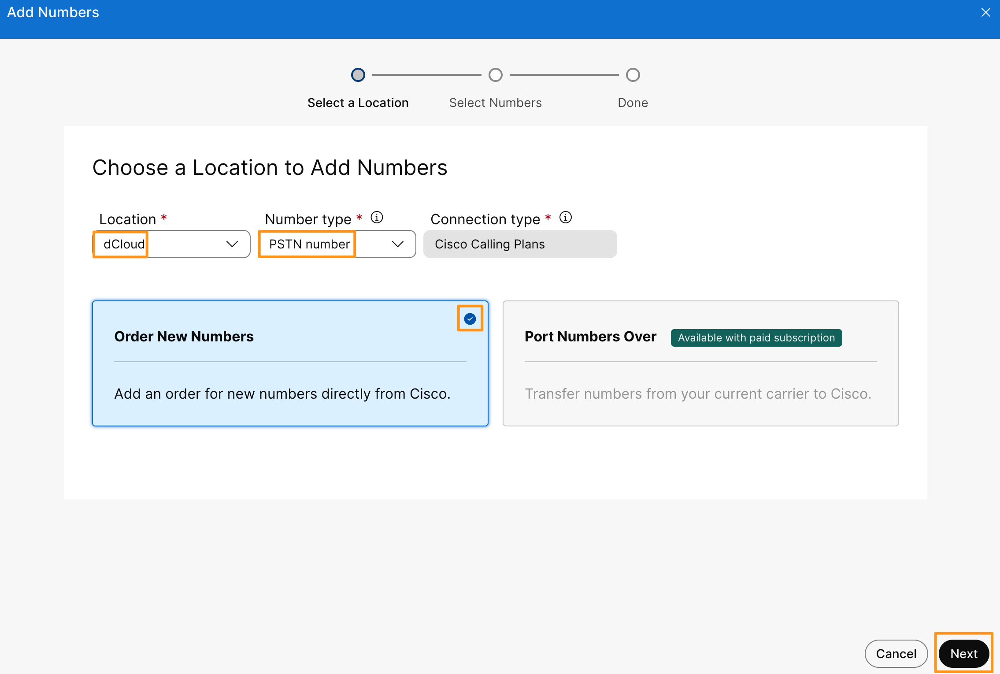

2. On the Specify the numbers you want to order page, select any state of your choice from drop down option for State/Province/Region, Example: California.
3. For Search by option keep Area Code selected.

1. From the Area Number dropdown menu, select any area code available.

1. In the How many numbers do you want auto-selected for you? field, enter 3 and click Search.

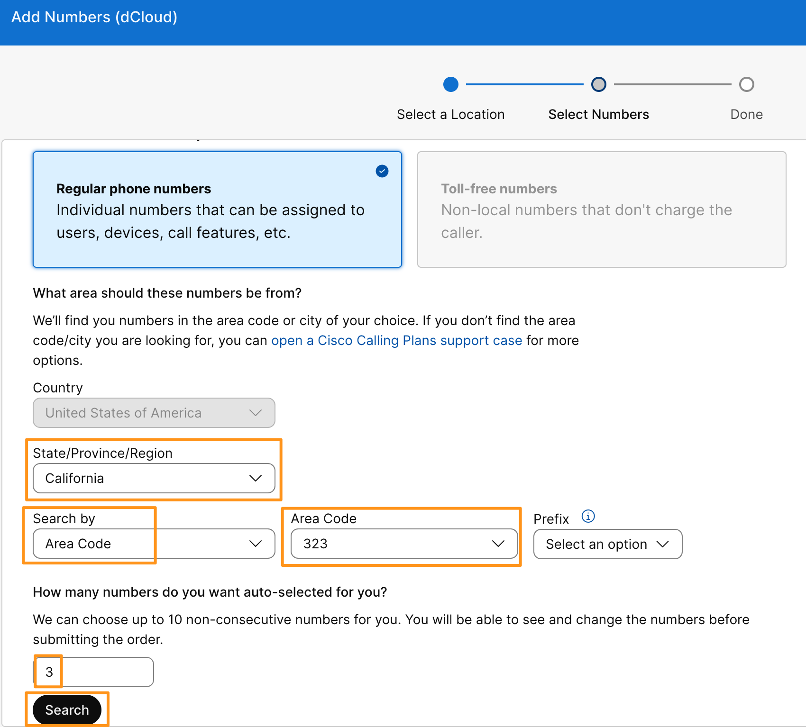

1. It will select three available numbers for you. Click Order.

    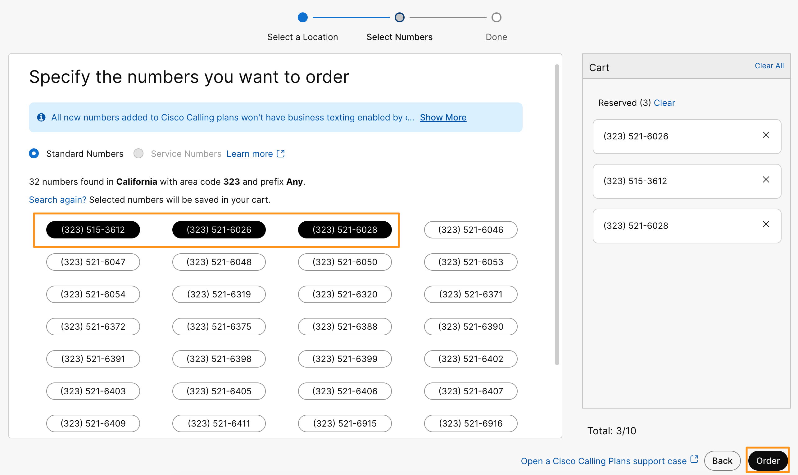

1. Click View Orders.  It will take you to PSTN orders tab PSTN & Routing page. Verify that the order status is now Pending.

    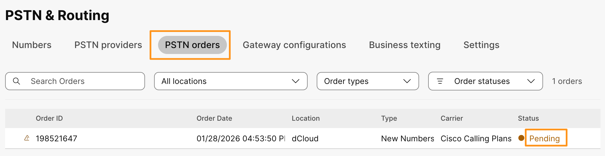

1. Click on the order, it will bring up a fly-out window on right side.  On the fly-out window verify the Order status is Provisioned.   Click close (x mark) on the fly-out window.

    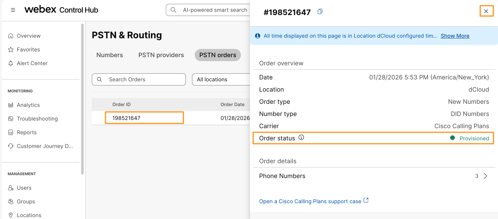

2. That completes ordering the Phone numbers.  Now, we need to assign one of the phone numbers to the location as Main number.  Navigate to MANAGEMENT > Locations and then select the dCloud location.
3. On the dCloud location page, go to PSTN tab.
4. In the PSTN Configuration section, drop down the option for Main number and choose any of the available numbers from list. Click Save.

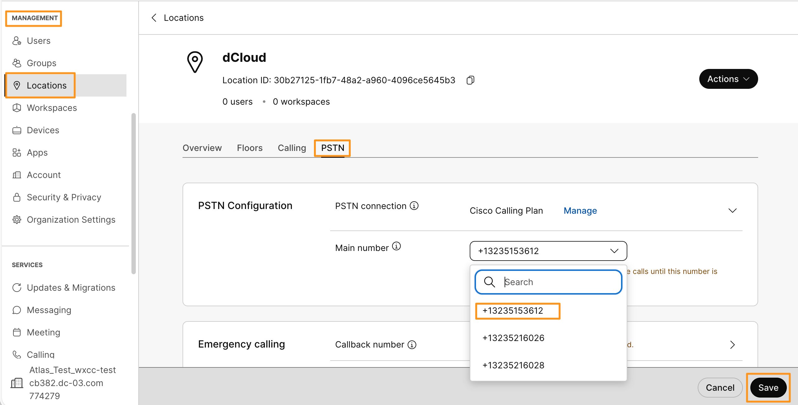

1. Make a note of DID numbers assigned to Charles Holland and Anita Perez in a note pad, we will be using those numbers to make few outbound calls in later modules.
2. This completes Ordering Phone numbers (DIDs)  for users using Cisco Calling Plan on Webex Control Hub
