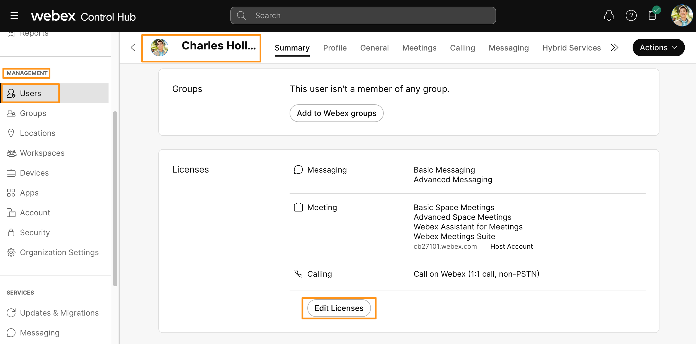
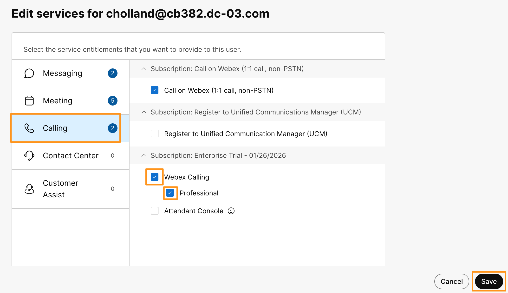
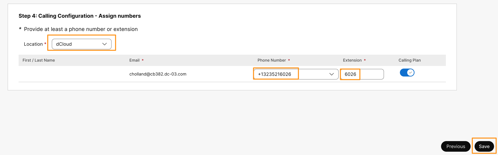
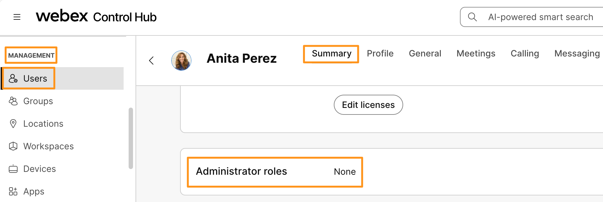
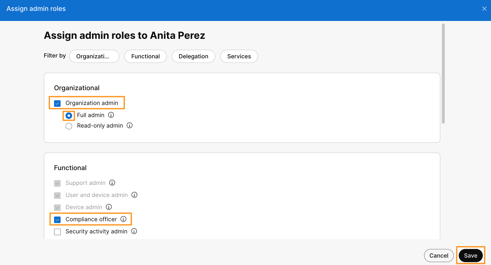

# Module 1e: Assigning Webex Calling License and Phone Number to Users

Webex Calling Licenses:

Webex Calling is available through the Cisco Collaboration Flex Plan. You must purchase an Enterprise Agreement (EA) plan or a Named User (NU) plan.

Webex Calling provides three license types:

Professional - These licenses provide a full feature set for your entire organization. This offer includes unified communications (Webex Calling), mobility (desktop and mobile clients with support for multiple devices), team collaboration in the Webex App, and the option to bundle meetings with up to 1000 participants per meeting.

Standard - is designed for users requiring standard calling capabilities with a single device. This license allows users to use either one hardware device (e.g., an IP Phone) or soft clients (mobile, desktop, or tablet) across platforms. While offering essential features like voicemail and hotdesking profiles, it does not support advanced functionalities such as virtual lines, Voice Queues agent configuration, or Microsoft Teams calling integration.

Workspaces (also known as Common Area) — Choose this option if you're looking for a basic dial tone with a limited set of calling features appropriate for areas such as break rooms, lobbies, and conference rooms.

In this lab, we will explore the Professional License option only.

1. Continuing on Workstation 1, Go back to the browser where you have logged in to Webex Control Hub before.
2. Go to MANAGEMENT > Users.
3. Select Charles Holland user from the list of users.
4. On the user Summary page scroll down and click Edit Licenses
5. On the next page, go to Calling tab and check mark options for Webex Calling and Professional.  Click Save.

1. On the next page, for Calling Configuration – Assign numbers page,  drop down option for Location and choose dCloud.  Now drop down option for Phone Number and choose one of the available phone numbers, OTHER than the number assigned for location Main number.  For Extension enter last 4 digits of the Phone number.  Click Save.

    

1. It will assign the Webex Calling Professional and give summary of all the licenses that are currently assigned to Charles Holland.  Click Close.
2. Repeat above steps (1 through 6 ) and assign Webex Calling Professional license along with Phone number and Extension to Anita Perez as well.  Make sure you assign the number other the Location Main number.

You have now successfully assigned Webex Calling license and Phone number to users Charles Holland and Anita Perez.

As we are on the Anita Perez user page, let's assign Organization Administrator and Compliance Officer roles to Anita Perez.  These roles are required for Anita later, in Customer Assist module.  For now make sure you assign the roles before you move on to next module.

1. On Anita Perez user summary page, select Administrator roles (None).

    

1. On the Assign admin roles page, check mark option for Organizational > Organization admin (Full admin will be auto selected) and Functional > Compliance officer.  Click Save.

    

