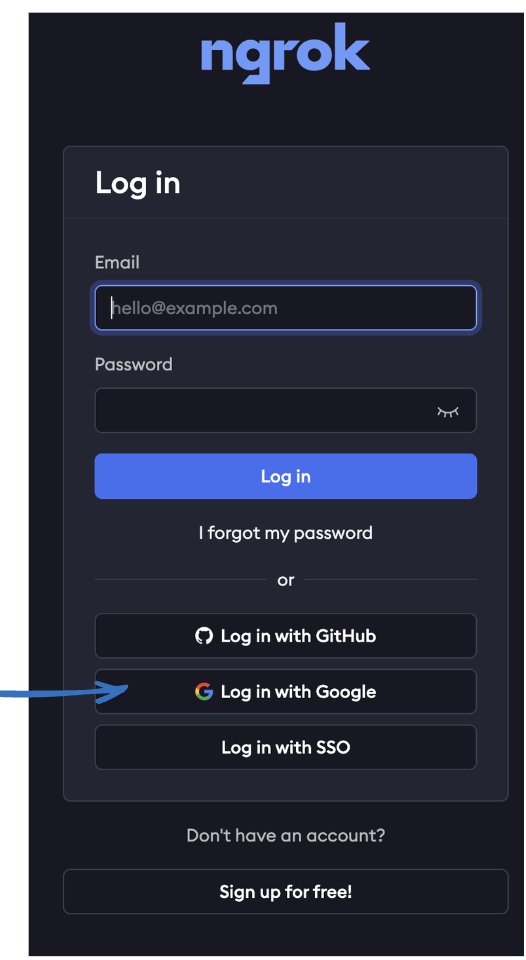
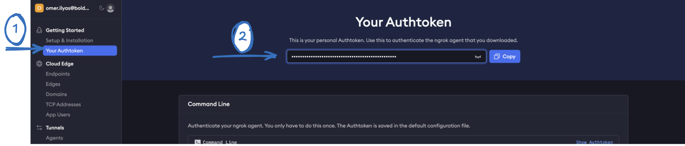

# Module 1e: Introduction to ngrok

When you build the Streamlit app at the end of the lab, it will run inside your Google Colab notebook. By default that app is only reachable from inside the Colab environment, which means you can't open it in your browser, share it with a teammate, or have Webex send notifications to it. To get around that, we'll use **ngrok**.

This task is a quick read, no clicks required. Its purpose is to give you a mental model of what ngrok is so the later modules feel familiar when you see it appear. We'll walk through the actual login and auth-token steps in the module that uses ngrok.

## What is ngrok?

ngrok is a reverse proxy service that gives any app running on your local machine (or, in our case, inside Colab) a **public URL** on the internet. You start your app, point ngrok at it, and ngrok hands you back a URL like `https://omer.ngrok-free.app` that anyone can open in their browser. Behind the scenes, ngrok forwards that traffic through a secure tunnel to your app.

In short: **ngrok takes something private and makes it reachable, without you having to open firewall ports or deploy anywhere.**

## Why we use it in this lab

* **Reach your Streamlit app from outside Colab.** Colab notebooks run in a sandboxed environment. ngrok puts a public URL in front of your Streamlit app so you can actually click through it in a real browser.
* **Receive Webex webhooks.** If you want Webex to push events (like new messages) to your app, Webex needs a public URL to call. ngrok provides exactly that.
* **No infrastructure setup.** No cloud account, no DNS, no deployment pipeline. One command and your app is reachable.

## What you'll do later (preview only)

In a later module we'll walk through these steps in detail. For now, here's what to expect:

1. Browse to [ngrok.com](https://ngrok.com){:target="_blank" rel="noopener"} and click **Login** (the "Login with Google" option works well, but use whichever sign-in method you prefer).

    

    !!! info "Reuse your Google account"
        You can sign in with the same Google account you used for [Google Colab](module-1b-google-colab.md). Keeping both accounts in sync makes it easier to switch between Colab and the ngrok dashboard during the lab.

2. Once logged in, copy your **ngrok auth token** from the dashboard. You'll paste this into your Colab notebook in a later step.

    

3. We'll start the Streamlit app in a later section and use ngrok to expose it via a public URL.

!!! tip "Want to explore on your own?"
    The official ngrok docs are at [ngrok.com/docs](https://ngrok.com/docs){:target="_blank" rel="noopener"}. The "Getting Started" section is the fastest way to see what's possible.
