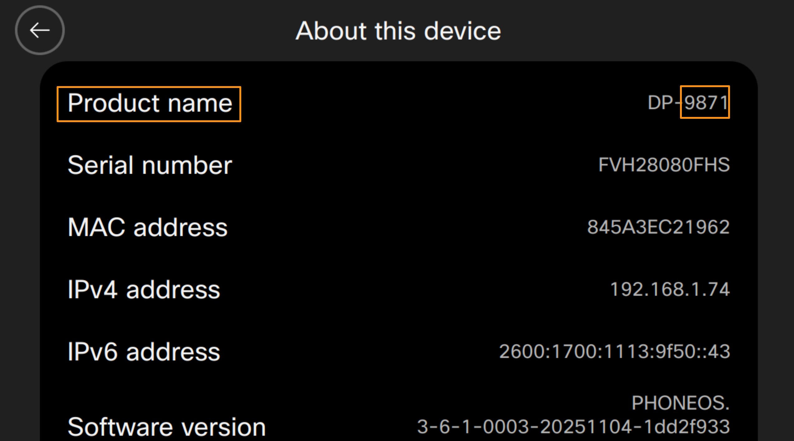
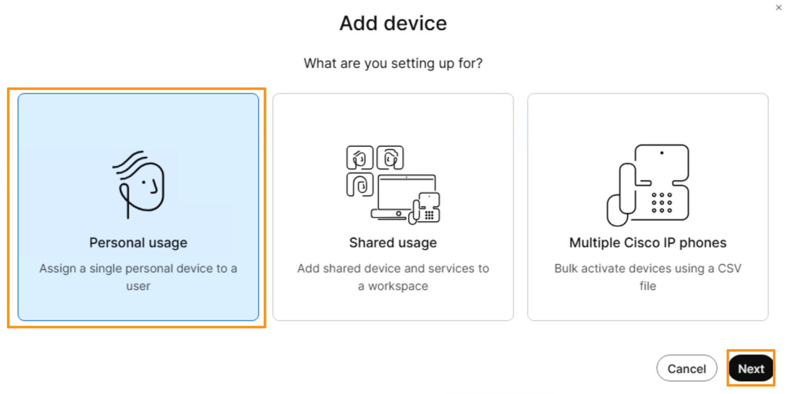
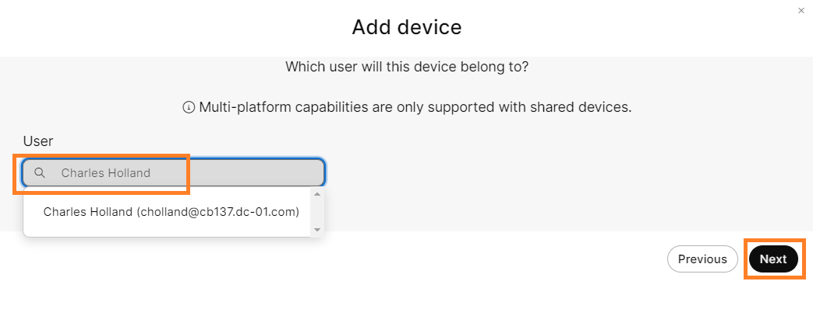
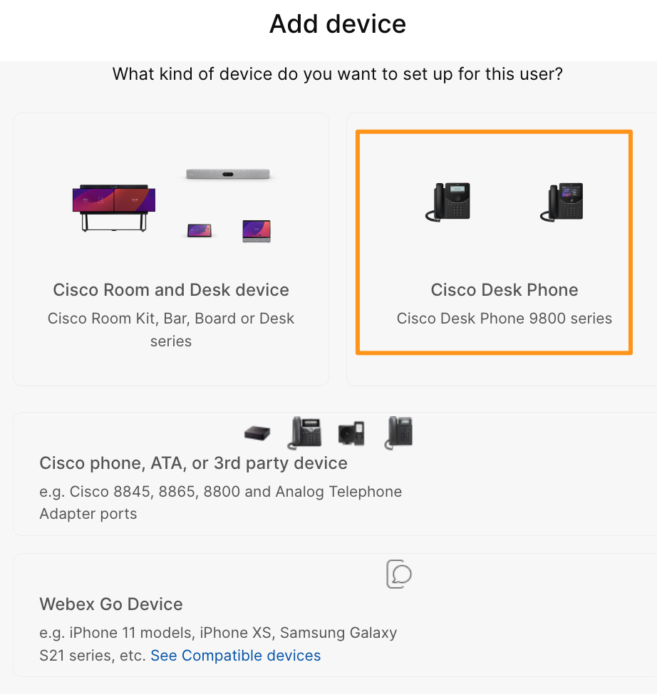
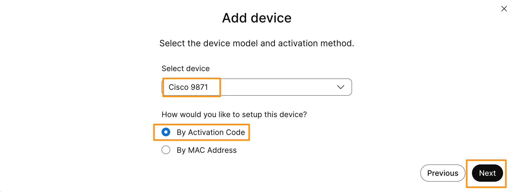
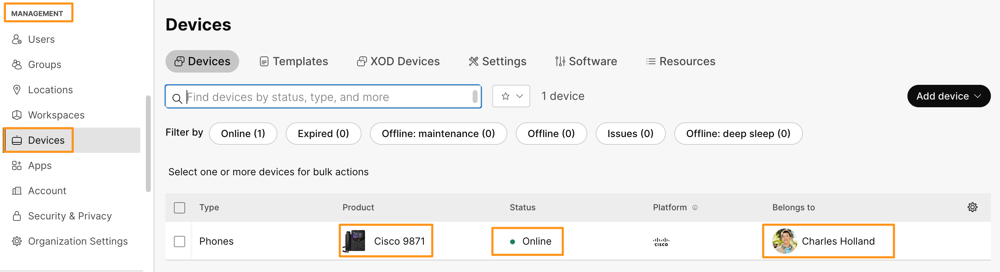
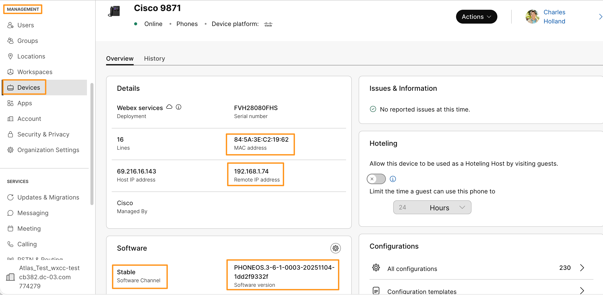

# Module 1f: Registering Cisco 9800 Phone

Cisco Desk Phone 9800 Series phones are modern enterprise IP phones built for hybrid work, running PhoneOS and supporting Webex Calling, CUCM, BroadWorks, and third-party platforms. They include AI-powered audio intelligence such as background noise removal, voice enhancement, and optimized wideband audio for clearer conversations. AI features also enable live captions, real-time transcription, and meeting summaries during calls and Webex meetings. The phones integrate smart workspace capabilities like hot desking, desk reservation, and one-button-to-join, while delivering strong security with TPM 2.0, encryption, and enterprise-grade manageability.

In this lab you will explore AI-powered audio intelligence, Live Captions, Real-time transcription in later sections.

Before we start add/register phone, let's find your Cisco 9800 series phone model.  To find your phone model, on the phone go to Settings (gear icon) > About this device.  Phone model will be listed under Product name.  Note down the model number (4 digits after DP-).

1. Continuing on  Workstation 1, on the browser tab where you have Webex Control Hub logged in.  Go to MANAGEMENT > Devices.  On the Devices page drop down Add device option and choose Add device.
2. In the Add device page, select Personal Usage > Next

1. On the next page,  under User box, start typing Charles Holland.  Select the user Charles Holland (cholland@cbXXX.dc-YY.com) and click on Next.

1. On the next page select Cisco Desk Phone  (Cisco Desk Phone 9800 series) on the top right corner.

    

1. On the following page, drop down Select device and choose Cisco 98XX model (4 digits you noted for your phone in the beginning of this module).  For the option How would you like to setup this device? select By Activation Code.  Click Next.

    

1. On the next page, it gives you an Activation Code, that we need to enter on Cisco 9800 phone for registering with Webex Control Hub.  Copy the code and save it in note pad on Workstation 1.

!!! note
    NOTE: DO NOT close the pop-up window on which it displays Activation code, until you save or enter the code on phone.  If you close it before entering on the device, you have to repeat all steps.

1. Now, go to your Cisco 9800 phone and enter the Activation code (you generated above) and click Activate.  Phone will start registration process.

!!! note
    NOTE: If the phone is running an older firmware, it will install the latest firmware from Control Hub and reboot multiple times.

1. It will take are around 3 to 5 min for the registration.  Wait for the phone to register.

1. Once you see your phone is registered, on Control Hub page, navigate to MANAGEMENT > Devices OR if you are already on that page, refresh/reload the page.  On the device page observe Product (Phone model) and displays Charles Holland (username) under Belongs to.  The status of these device should be “Online” at this stage.

    

1. Click/Select the phone and you will see the details about phone, like MAC address, IP address, firmware and Software channel etc.

That completes Registering Cisco 98XX  Phone for Charles Holland.
