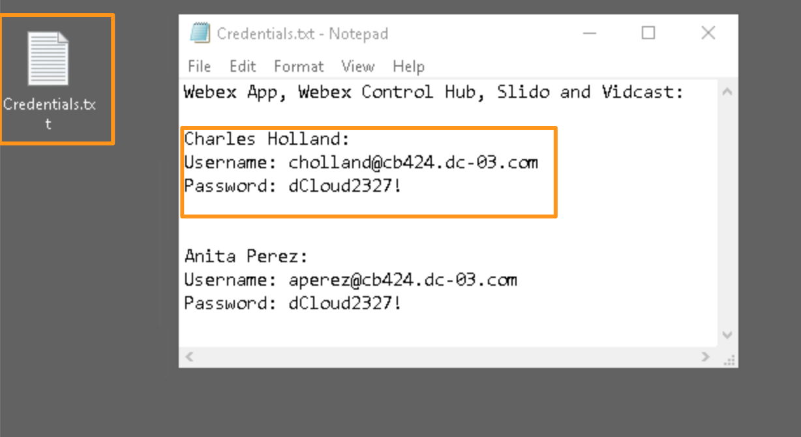
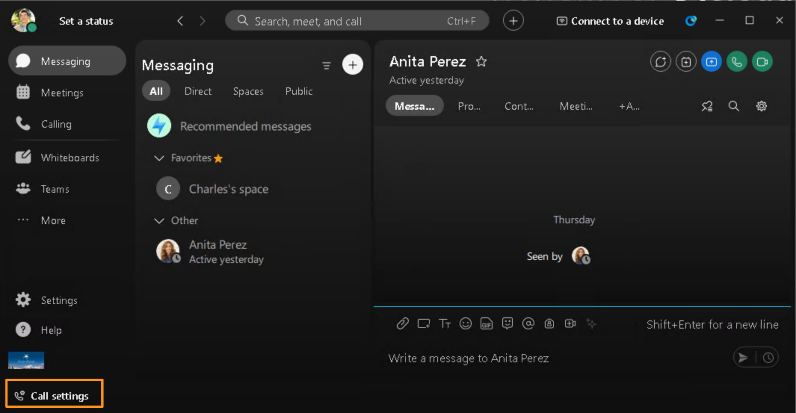

# Module 1g: Login to Webex Clients

We are almost done setting up the lab environment and ready to explore the AI features.  As a last step let's login to Webex Clients and have them ready.

1. Continuing on workstation 1, minimize the browser and open Webex app on desktop.
2. Click Agree on the IMPORTANT NOTICES AND DISCLAIMERS pop-up.
3. Click Sign in and use credentials for Charles Holland specified in Credentials.txt file on your demo workstation (virtual workstation) and complete the sign in process.

    

5. Once logged into Webex, it will display a pop-up window about Emergency Calling Notification.  Click OK.  Webex will be signed in and ready for use on workstation 1.

    

7. Now bring Webex on your attendee workstation (Physical workstation) and repeat above steps (steps 1 through 4) and complete sign in process.  Use credentials for Anita Perez specified in Credentials.txt file on your demo workstation (virtual workstation) and complete the sign in process.

    

9. Before you continue make sure you have signed into Webex Clients (Charles Holland – virtual workstation and Anita Perez – Physical workstation) and Cisco 9800 phone is registered for Charles Holland.

From now on:

Charles Holland will use either Workstation 1 (we will refer to it as demo workstation or virtual workstation) or Cisco 9800 phone

Anita Perez will use attendee workstation (physical workstation)
