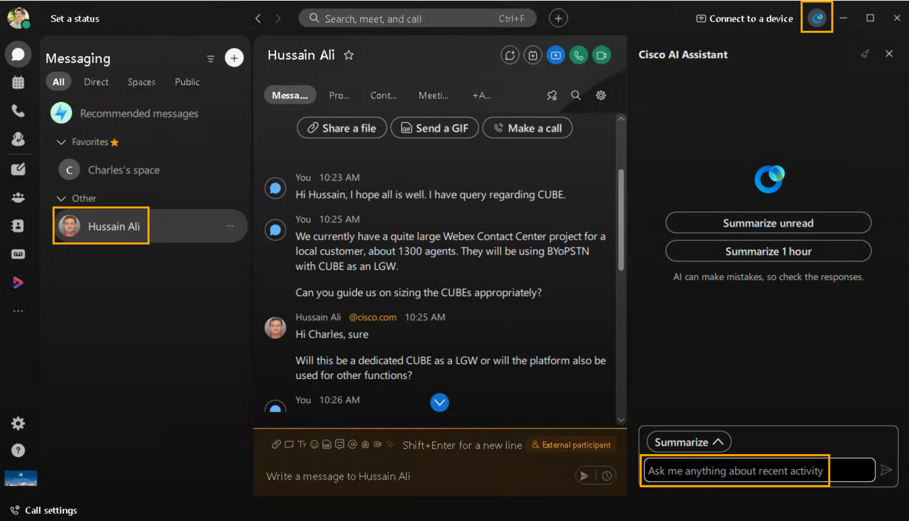
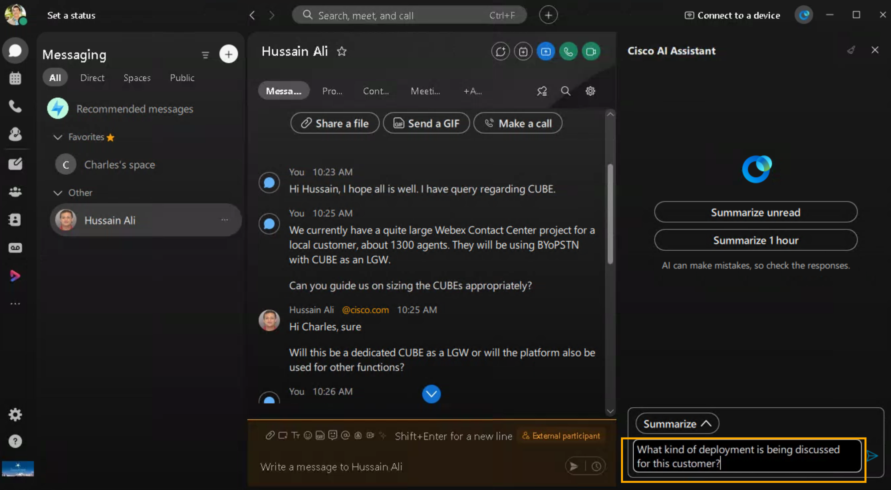
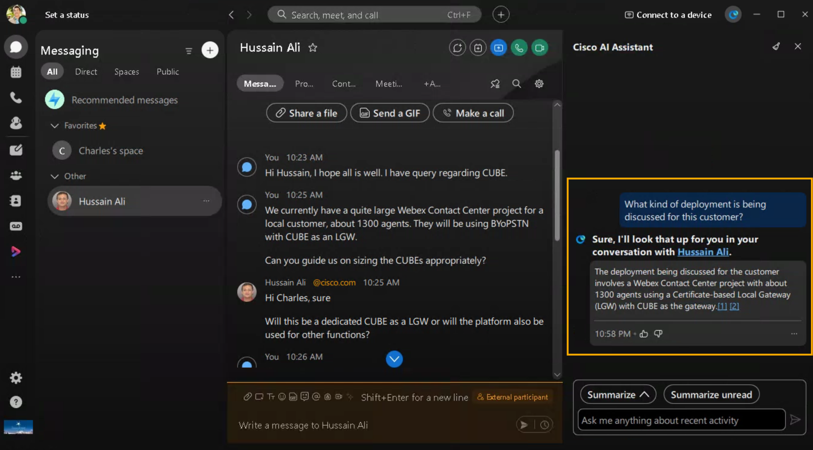

# Module 2a: Ask Me Anything — AI Assistant for Messaging

The Ask Me Anything (AMA) feature in Webex messaging is part of the Cisco AI Assistant designed to help users quickly find information within their conversation spaces. It allows users to ask questions about recent discussions, content, or context directly within a space. Any questions that are asked and the answers received are only visible to you and are not saved in the space.

!!! note
    NOTE: The Webex App for the user Charles Holland, logged into Workstation 1 (WebRDP) may already be preloaded with some chat. If not, feel free to do some back and forth chat with the user Anita Perez (Webex App logged into your physical workstation).

1. Continuing on demo workstation (virtual workstation), Bring up Webex app (logged in as Charles Holland)
2. Go to the app header on top right corner and click the AI Assistant [ ]. Then, select a space from your spaces list.

    

3. In the Cisco AI Assistant panel, select:
4. Ask me anything about recent activity—ask AI Assistant questions, to search for, or find out more, about conversations and content discussed in the space.
5. Answers come with highlighted citation links that you can click, to go directly to the source messages, so you can quickly get to specific content for more information.
6. Click More [], and select Copy [], to copy answer content and share elsewhere.

    

    

7. Click Stop generating to cancel an AI Assistant reply.

    

