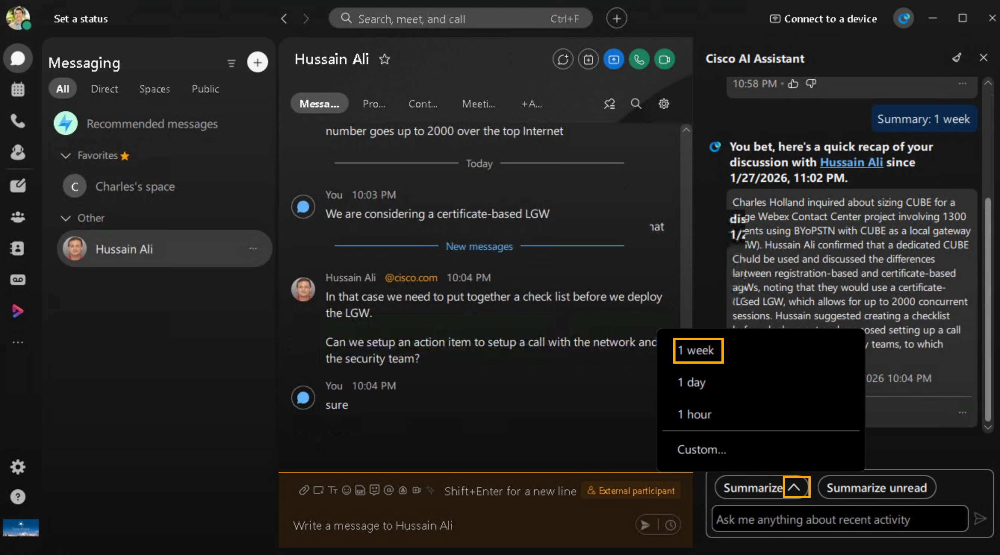
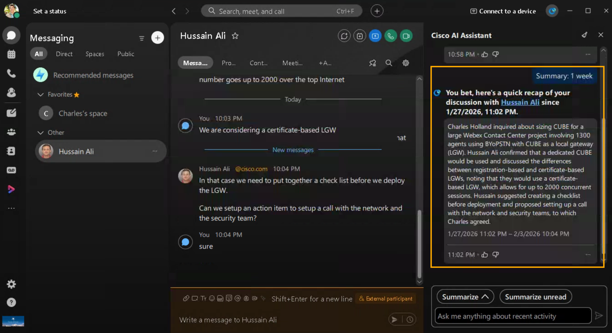

# Module 2b: Space Summaries — Automated Conversation Overviews

When you're busy, or you've been away from the office, catching up with all your spaces can be challenging. AI Assistant can generate space summaries to help you quickly catch up on missed messages and conversations in the space. Stay informed on decisions, key points, and get up to date with the discussion at a glance.

1. Continuing on Cisco AI Assistant on Webex, click on Summarize as shown below and select 1 week.

    

Your summary will be displayed in the Cisco AI Assistant panel.

