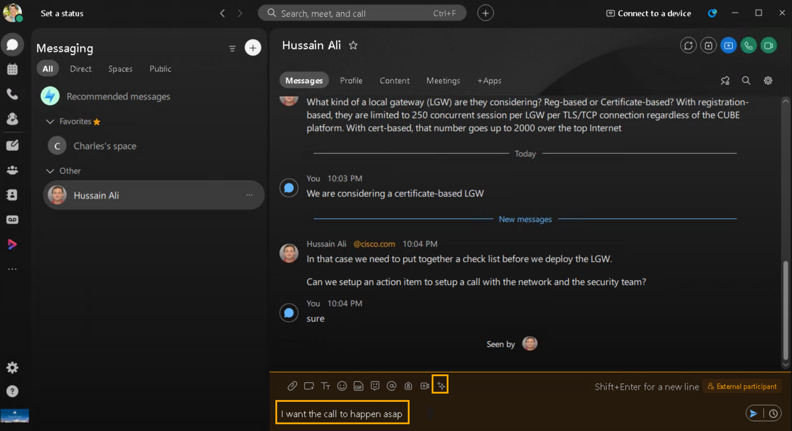
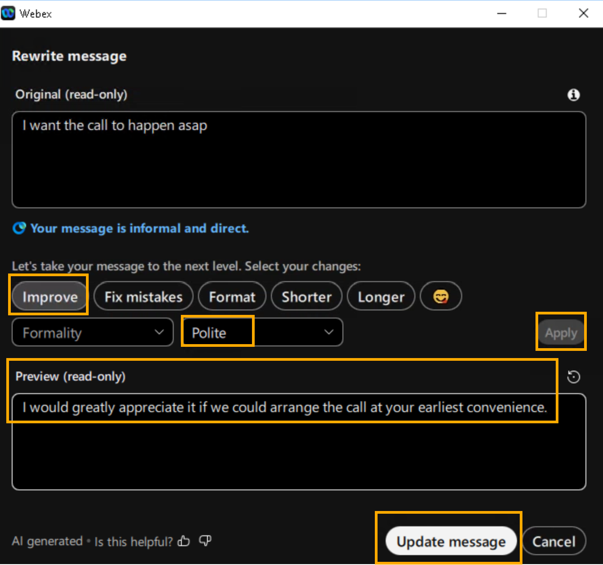
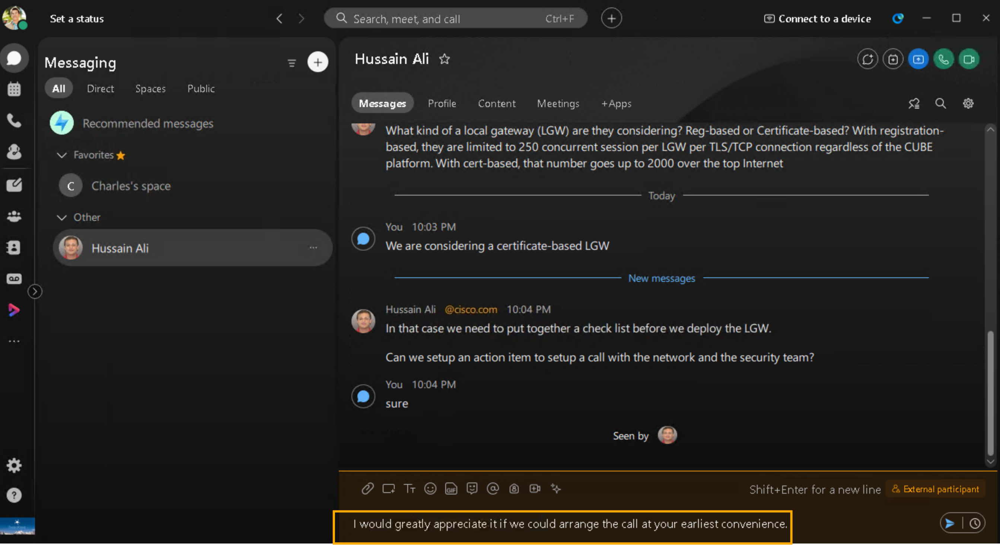

# Module 2c: Smart Rewrite — AI-Powered Message Refinement

Enhance and improve your communication and collaboration with your team, with AI powered message rewrites. AI Assistant analyses your message and provides options to adapt the style, tone, and content quality, to help you communicate more effectively.

1. Continuing on demo workstation (virtual workstation) Webex.  Type any question in chat window and click Rewrite message [].

    

    

AI Assistant analyzes your message and provides options to fix mistakes, improve spelling and grammar, update format and style, and change the message tone.

1. It will open the rewrite pop-up window.  Choose any of the available drop-down options to rewrite your message and click Apply to generate a preview.  You can click [ ] to generate more preview versions. To go back and forth between versions, click the left and right arrows.  Finally when you are satisfied with a new version the message, click Update message, or if you wish to use your original message you can discard all changes by clicking Cancel.  For now keep the message generated with AI (with all your desired options) and press Enter to send your updated message. See the screenshots below for an example

    

