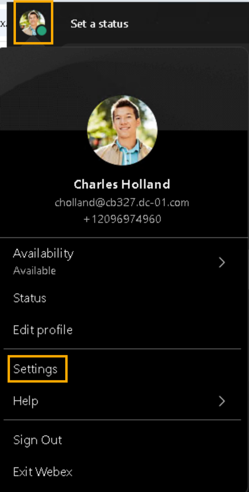
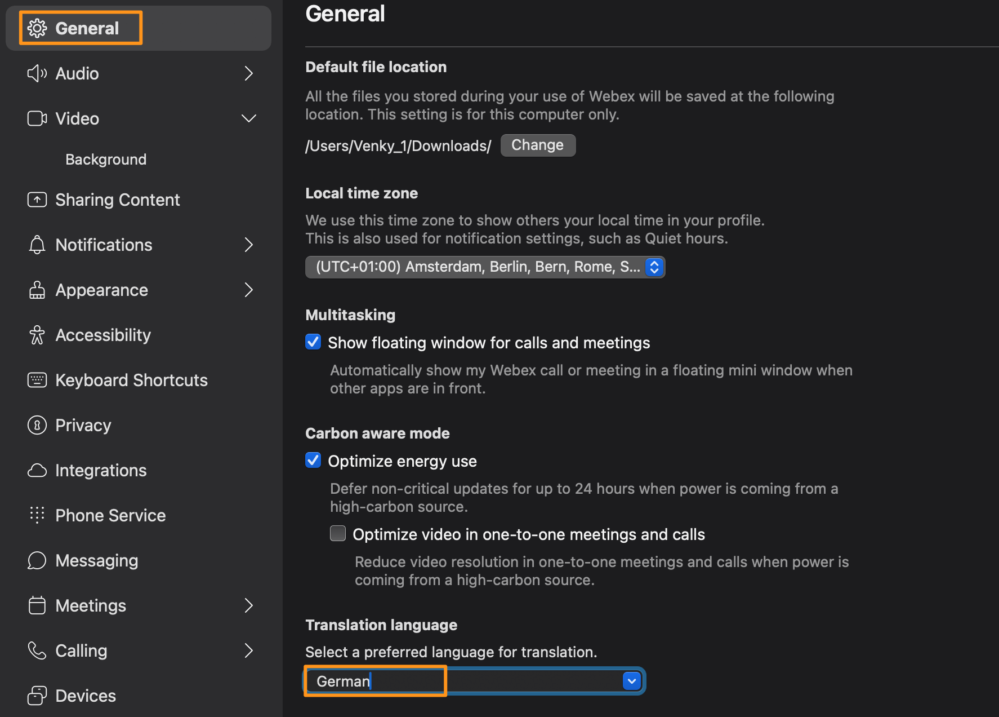
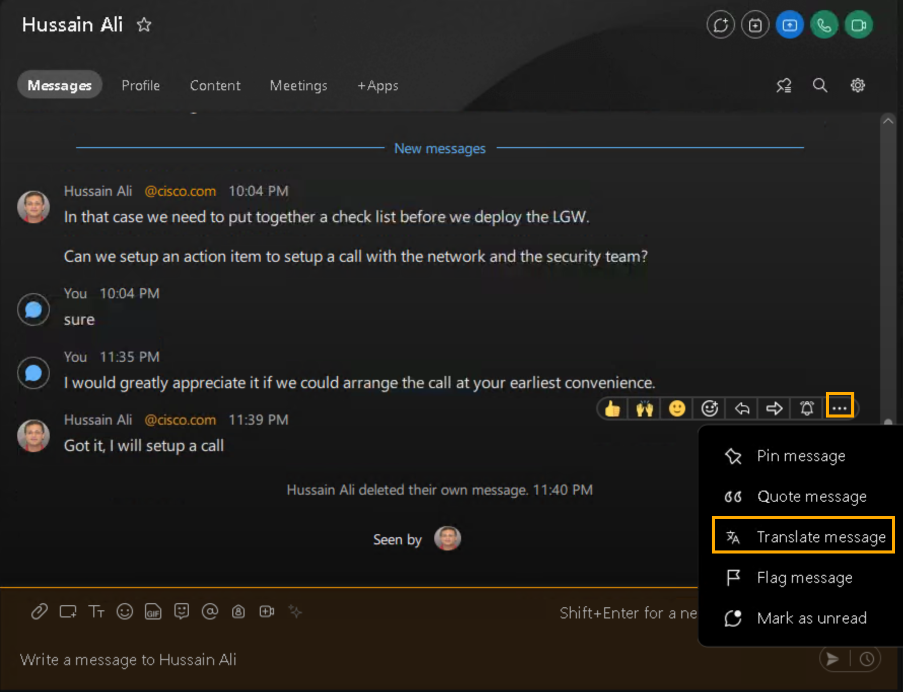
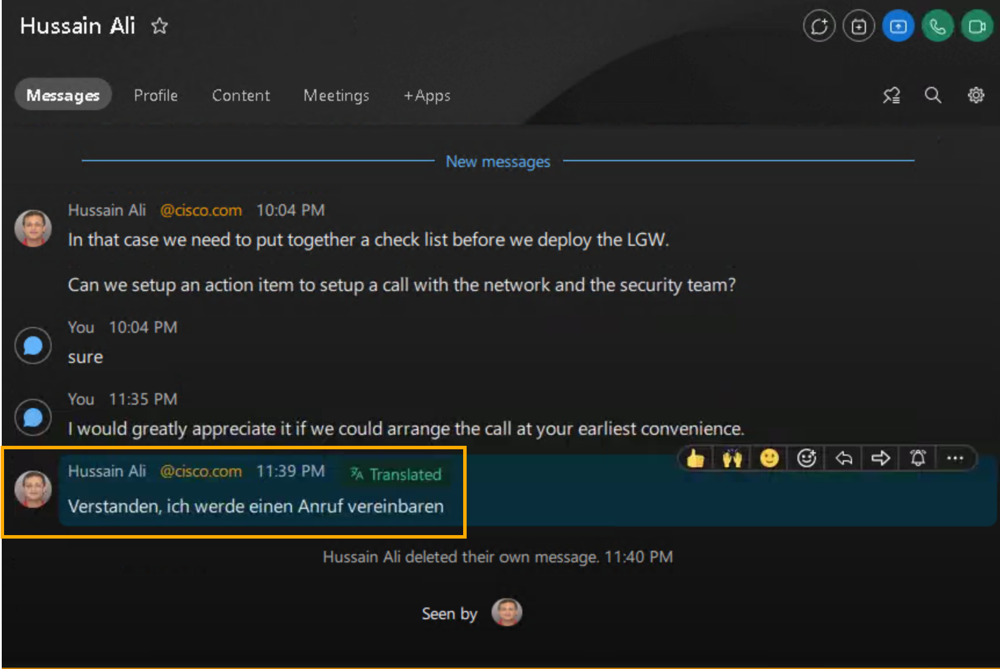
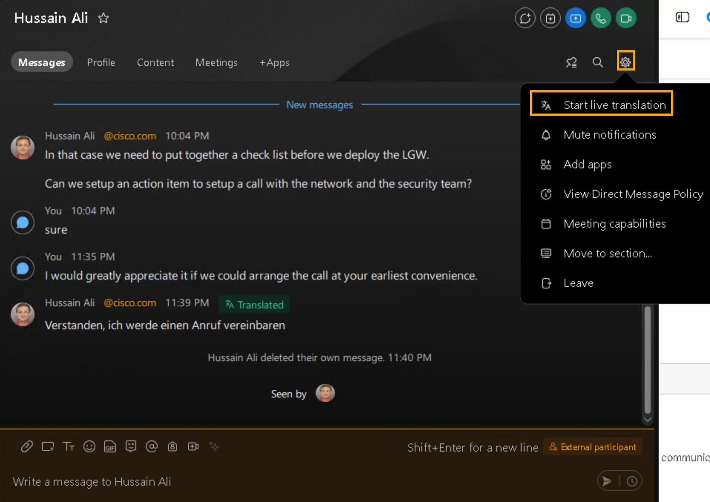
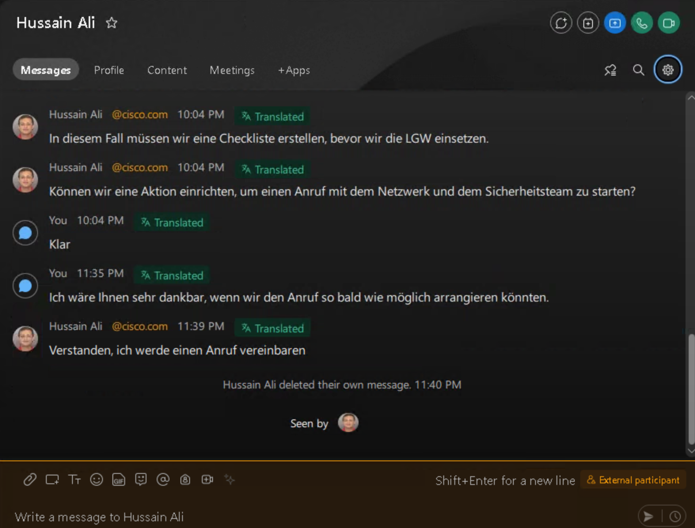

# Module 2d: Real-Time Message Translation

Promote more effective communication and break down barriers in your direct or group spaces with our translation feature. Enable your target language in your settings, and translate individual messages, or all messages in your direct or group spaces in real time.

To translate messages in a space from any language to your desired language, select your language in your settings.

1. Continuing on demo workstation (virtual workstation) Webex , click on Profile picture (top left corner) on the Webex app and go to Settings.

    

3. It will bring up Webes Settings pop-up window.  On the pop-up window select General > Translation language.  Select your preferred language for translation from the drop-down list, and click Save.

1. Now, you can either translate any individual message in a space to your selected language Or you can translate all the messages in a space by going to the space settings menu and selecting Start live translation, that will translate all the messages in space.   See the screenshots below for reference.

This completes this module.
