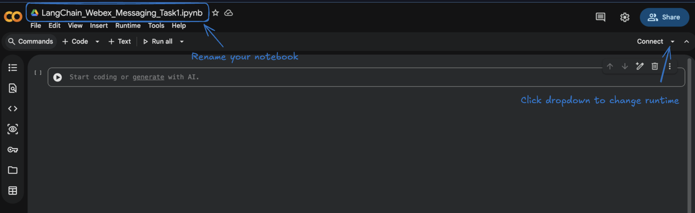
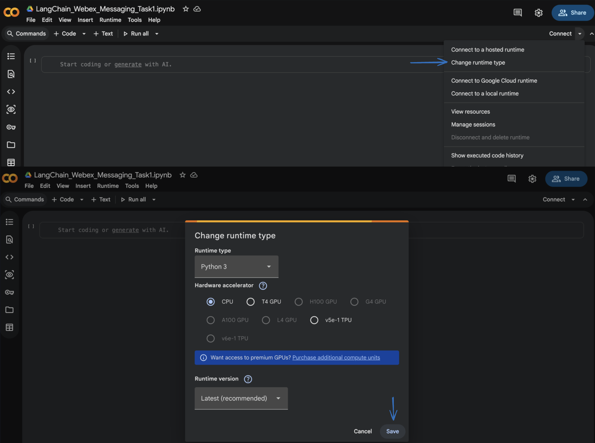
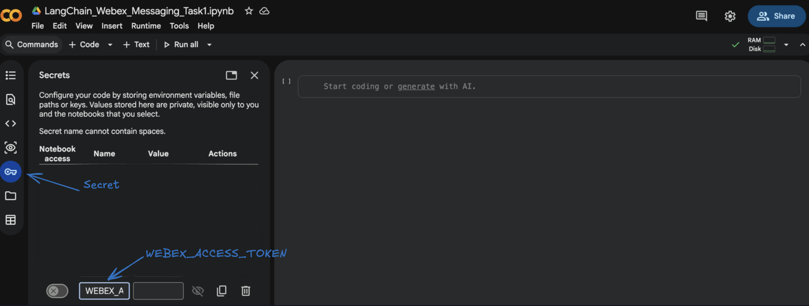
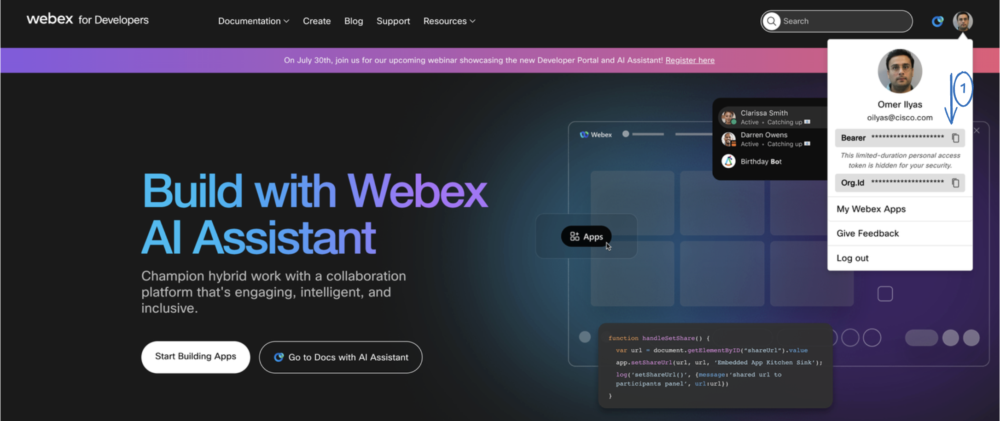
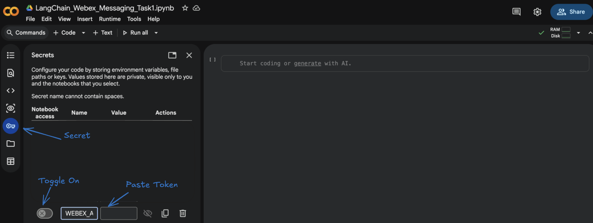
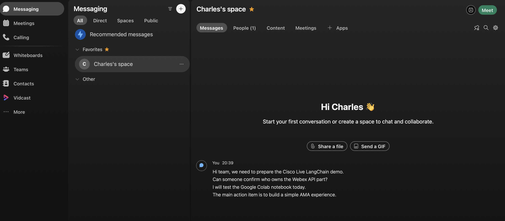
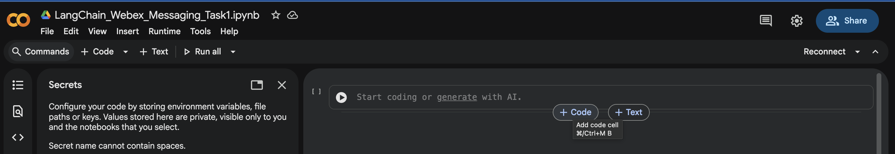
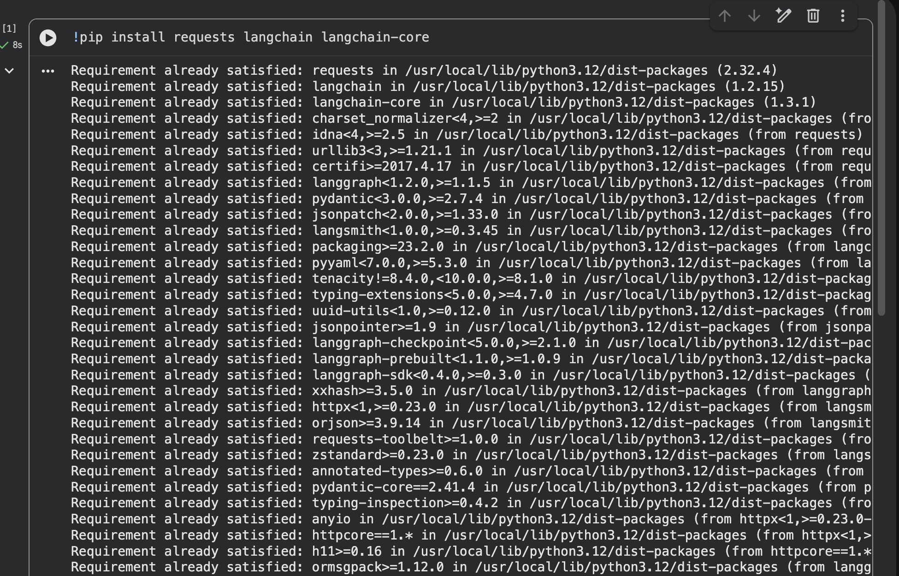

# Module 2a: Connect LangChain to Webex Messaging

<div style="display:flex;align-items:center;gap:0.5rem;margin:0.2rem 0 1.2rem;flex-wrap:wrap;">
<span style="font-size:0.75rem;font-weight:700;color:#fff;background:#009688;padding:0.2rem 0.7rem;border-radius:20px;letter-spacing:0.04em;">📥 TASK 1</span>
<span style="font-size:0.7rem;font-weight:700;color:#009688;background:rgba(0,150,136,0.15);padding:0.15rem 0.6rem;border-radius:20px;letter-spacing:0.04em;">2a</span>
<span style="font-size:0.85rem;color:var(--md-default-fg-color--light);font-style:italic;">Read Webex Messages as AI Context</span>
</div>

## Goal

In this task, we will connect to the **Webex Messaging API**, retrieve recent messages from a Webex space, and convert those messages into **LangChain Documents**.

This is the foundation for everything we will build later. Before an AI assistant can summarize, answer questions, rewrite messages, or act as an agent, it first needs access to context.

!!! tip "Teaching moment"
    Before AI can reason, it first needs **context** and **data**.

## What You Will Learn

By the end of this task, you will understand:

* how to call the **Webex Messages API** from Google Colab
* how to retrieve recent messages from a Webex space
* how to inspect raw Webex message data
* how to convert Webex messages into **LangChain Documents**

!!! info "Already covered in Module 1"
    A few foundations for this task were set up earlier in [Module 1: Setup your Lab Environment](../module-1-setup-your-lab-environment/index.md). If anything below feels unfamiliar, jump back and review:

    * Accessing the Webex Developer Portal, retrieving your **personal access token**, and locating your **Webex Space ID**: covered in [1a: Webex Developer Portal Setup](../module-1-setup-your-lab-environment/module-1a-webex-developer-portal.md).
    * Creating a Google Colab notebook and connecting to a runtime: covered in [1b: Google Colab Setup](../module-1-setup-your-lab-environment/module-1b-google-colab.md).
    * Storing API keys safely as **Colab Secrets**: covered in [1c: Managing API Keys in Colab](../module-1-setup-your-lab-environment/module-1c-managing-api-keys-in-colab.md).

The Webex Messages API lets developers list, create, update, and delete messages. Messages include text, sender information, timestamps, and other metadata. The API requires the user to be a member of the Webex room being accessed.

## Prerequisites

Before starting this task, make sure you have:

* access to **Google Colab**
* a **Webex** account
* an **OpenAI API key** (used in later LangChain tasks)
* a **Webex personal access token**

!!! info "About personal access tokens"
    For testing and lab use, Webex personal access tokens can be copied from the Webex Developer Portal. These tokens are short-lived and are intended for development and testing, not production applications.

## Steps

### Step 1: Open Google Colab

Open Google Colab and create a new notebook.

In Google Colab:

1. Click **File**.
2. Click **New notebook**.
3. Rename the notebook to `LangChain_Webex_Messaging_Task1`.



Make sure you are connected to a runtime. For this task, a **CPU runtime** is enough (no GPU required).



### Step 2: Add Secrets in Google Colab

Open the **Secrets** section from the left sidebar in Colab and add the following secret:

* `WEBEX_ACCESS_TOKEN`



Optional for later tasks (you can add it now to save time):

* `OPENAI_API_KEY`

We'll toggle **Notebook access** on for each secret in the next step.

!!! warning "Why use Secrets?"
    Storing your token as a Colab Secret avoids hardcoding it inside the notebook. Hardcoded tokens are easy to leak by accident: in screenshots, in shared notebooks, or when the notebook is pushed to a public repo.

### Step 3: Get Your Webex Personal Access Token

Open the [Webex Developer Portal](https://developer.webex.com){:target="_blank" rel="noopener"}, then:

1. Sign in with your Webex account.
2. Go to the **Getting Started** or **API Reference** section.
3. Locate your **Personal Access Token**.
4. Copy the token.

    

5. Go back to your Colab notebook, open the **Secrets** panel from the left sidebar, find the `WEBEX_ACCESS_TOKEN` secret you created in [Step 2](#step-2-add-secrets-in-google-colab), and paste the token into its **Value** field. Then turn on the **Notebook access** toggle next to it so this notebook can read the secret.

    

Webex REST API requests must include an access token in the `Authorization` header. For lab testing, the personal access token allows API calls to be made on your own behalf.

!!! warning "Tokens expire"
    Personal access tokens are short-lived. If your code suddenly stops working later, your token may have expired. Return to the Webex Developer Portal, copy a new token, and update your Colab secret.

### Step 4: Create or Identify a Webex Space

You now need a Webex space that contains some messages. You can use:

* the **Charles's Space** that was created as part of this lab (recommended)
* a new space you create yourself
* a direct space with another lab user

For the best experience, post a few messages in the space so the AI assistant has something to work with. For example:

```text
Hi team, we need to prepare the Cisco Live LangChain demo.
Can someone confirm who owns the Webex API part?
I will test the Google Colab notebook today.
The main action item is to build a simple AMA experience.
```

These messages will become the data source for the AI assistant in later tasks.



### Step 5: Install Required Libraries

In your Colab notebook, click **+ Code** to add a new cell, then run:



```py linenums="1"
!pip install requests langchain langchain-core
```

For Task 1 we only need:

* **`requests`** to call Webex APIs
* **`langchain-core`** to create LangChain `Document` objects

The other LangChain pieces (LLMs, retrievers, agents) come into play in the next tasks.



### Step 6: Load the Webex Token from Colab Secrets

In a new code cell, run:

```py linenums="1"
import os
from google.colab import userdata

WEBEX_ACCESS_TOKEN = userdata.get("WEBEX_ACCESS_TOKEN")

if WEBEX_ACCESS_TOKEN:
    print("Webex token loaded successfully.")
else:
    print("Webex token not found. Please check your Colab Secrets.")
```

`userdata.get(...)` reads the secret you stored in Step 2 without printing it to the screen. The `if/else` check is a quick sanity test so you don't move on with a missing or misnamed secret.

**Expected output:**

```text
Webex token loaded successfully.
```

### Step 7: Test Webex Authentication

Before we start reading messages, let's verify the token actually works by calling a simple endpoint that returns details about *you*.

In a new code cell, run:

```py linenums="1"
import requests

headers = {
    "Authorization": f"Bearer {WEBEX_ACCESS_TOKEN}",
    "Content-Type": "application/json"
}

response = requests.get(
    "https://webexapis.com/v1/people/me",
    headers=headers
)

print("Status Code:", response.status_code)
print(response.json())
```

What's happening here:

* **`headers`** carries your Bearer token in the format Webex expects.
* **`/v1/people/me`** is a Webex endpoint that returns the user identified by the token.
* **`response.status_code`** of `200` means the call succeeded.

**Expected output:**

```text
Status Code: 200
```

You'll also see a JSON object with details about the Webex user associated with the token. The example below shows what that JSON looks like for one lab pod (Charles Holland on `cb426`):

```json
{
  "id": "Y2lzY29zcGFyazovL3VzL1BFT1BMRS9mZTNkNTQ1MC1hYmExLTRiOTUtOTNmMy1iYzMzYWVjNTNmZWI",
  "emails": ["cholland@cb426.dc-01.com"],
  "sipAddresses": [
    {"type": "cloud-calling", "value": "cholland@cb42601d.calls.webex.com", "primary": true},
    {"type": "personal-room", "value": "25346128042@cb42601.webex.com", "primary": false},
    {"type": "personal-room", "value": "cholland@cb42601.webex.com", "primary": false}
  ],
  "displayName": "Charles Holland",
  "nickName": "Charles",
  "firstName": "Charles",
  "lastName": "Holland",
  "orgId": "Y2lzY29zcGFyazovL3VzL09SR0FOSVpBVElPTi9jZjQzOGI4My1hMmY0LTQ0NjktYjUxZi00NGEwMTFmYThkYzU",
  "created": "2026-05-21T15:49:50.050Z",
  "status": "active",
  "type": "person",
  "siteUrls": ["cb42601.webex.com"]
}
```

!!! info "Your output will look slightly different"
    The values above are for example only. In your case, the `cb426` part of the email and site URLs will be replaced with **your own dCloud-assigned domain** (for example `cb123`, `cb789`, etc.). The shape of the response will be the same; only the IDs, emails, and domain will change.

If you get a `401`, your token is wrong or expired: re-do Step 3.

### Step 8: List Your Webex Spaces

Now retrieve the list of spaces (rooms) your Webex user can see.

In a new code cell, run:

```py linenums="1"
rooms_url = "https://webexapis.com/v1/rooms"

params = {
    "max": 20
}

response = requests.get(
    rooms_url,
    headers=headers,
    params=params
)

print("Status Code:", response.status_code)

rooms = response.json().get("items", [])

for index, room in enumerate(rooms):
    print(index, "-", room.get("title"), "-", room.get("id"))
```

A few notes:

* **`/v1/rooms`** lists spaces the authenticated user has access to.
* **`max=20`** asks Webex to return up to 20 rooms in one call.
* The loop prints an **index**, the **title**, and the **room ID**.

**Example output:**

```text
Status Code: 200
0 - Charles's space - Y2lzY29zcGFyazovL3VybjpURUFNOnVzLXdlc3QtMl9yL1JPT00vMWE2NTIyNDAtNTZkZS0xMWYxLTk1ZWMtZWQ2OGY4MmM4ZjJi
1 - Omer's - Y2lzY29zcGFyazovL3VzL1JPT00v...
2 - Anita Perez - Y2lzY29zcGFyazovL3VzL1JPT00v...
```

Find the space you want to use and copy its room ID for the next step. **For this lab, we will use Charles's Space.**

### Step 9: Set the Room ID

In a new code cell, paste your selected room ID:

```py linenums="1"
ROOM_ID = "PASTE-YOUR-WEBEX-ROOM-ID-HERE"

print("Using room ID:", ROOM_ID)
```

!!! warning "Use your own Room ID"
    Replace `PASTE-YOUR-WEBEX-ROOM-ID-HERE` with the **room ID from your own pod** (the value you copied from the previous step's output, next to **Charles's Space**). Every dCloud pod has a different room ID, so the example below will not work in your notebook.

**Example (will not work for you, just for reference):**

```py linenums="1"
ROOM_ID = "Y2lzY29zcGFyazovL3VzL1JPT00vxxxxxxxx"
```

### Step 10: Read Recent Messages from the Webex Space

Now retrieve recent messages from the selected space.

In a new code cell, run:

```py linenums="1"
messages_url = "https://webexapis.com/v1/messages"

params = {
    "roomId": ROOM_ID,
    "max": 20
}

response = requests.get(
    messages_url,
    headers=headers,
    params=params
)

print("Status Code:", response.status_code)

data = response.json()
messages = data.get("items", [])

print("Messages retrieved:", len(messages))
```

The Webex **List Messages** API retrieves messages from a room using the `roomId` query parameter. `max=20` keeps the lab fast: feel free to increase later.

**Expected output:**

```text
Status Code: 200
Messages retrieved: 20
```

If you see `Messages retrieved: 0`, post a few messages in your Webex space and run this cell again.

### Step 11: Inspect the Raw Message Data

Let's look at one message so you can see the shape of the data the API returns.

In a new code cell, run:

```py linenums="1"
messages[0]
```

You should see a JSON object similar to:

```json
{
    "id": "Y2lzY29zcGFyazovL3VzL01FU1NBR0Uv...",
    "roomId": "Y2lzY29zcGFyazovL3VzL1JPT00v...",
    "roomType": "group",
    "text": "The main action item is to build a simple AMA experience.",
    "personId": "Y2lzY29zcGFyazovL3VzL1BFT1BMRS8...",
    "personEmail": "user@example.com",
    "created": "2026-05-23T10:00:00.000Z"
}
```

This matters because it shows the type of data an AI assistant can use:

* **message text** (what was said)
* **sender** (who said it)
* **timestamp** (when)
* **room ID** and **message ID** (for citations later)

In later tasks, we'll use this information to generate summaries, answer questions, and even cite the original messages back to the user.

### Step 12: Display Messages in a Cleaner Format

Raw JSON is hard to read. Let's print the messages in a more human-friendly format.

In a new code cell, run:

```py linenums="1"
for message in messages:
    sender = message.get("personEmail", "Unknown sender")
    created = message.get("created", "Unknown time")
    text = message.get("text", "")

    if text:
        print(f"[{created}] {sender}: {text}")
        print("-" * 80)
```

The `if text:` check skips messages with no text body (file shares, reactions, system events).

**Example output:**

```text
[2026-05-23T10:00:00.000Z] anita@example.com: Can someone confirm who owns the Webex API part?
--------------------------------------------------------------------------------
[2026-05-23T10:02:00.000Z] charles@example.com: I will test the Google Colab notebook today.
--------------------------------------------------------------------------------
```

At this point, you've successfully connected to Webex and retrieved messaging data.

### Step 13: Convert Webex Messages into LangChain Documents

LangChain works with a common object called a **`Document`**. A `Document` has two parts:

* **`page_content`**: the main text the AI will read.
* **`metadata`**: any extra info about where the text came from.

For Webex messages, the mapping is straightforward:

* `page_content` = Webex message text
* `metadata` = sender, timestamp, message ID, room ID

In a new code cell, run:

```py linenums="1"
from langchain_core.documents import Document

webex_documents = []

for message in messages:
    text = message.get("text")

    if text:
        doc = Document(
            page_content=text,
            metadata={
                "message_id": message.get("id"),
                "room_id": message.get("roomId"),
                "sender": message.get("personEmail"),
                "created": message.get("created")
            }
        )

        webex_documents.append(doc)

print("LangChain documents created:", len(webex_documents))
```

**Expected output:**

```text
LangChain documents created: 20
```

### Step 14: Inspect a LangChain Document

In a new code cell, run:

```py linenums="1"
webex_documents[0]
```

You should see something like:

```text
Document(
    page_content='The main action item is to build a simple AMA experience.',
    metadata={
        'message_id': 'Y2lzY29...',
        'room_id': 'Y2lzY29...',
        'sender': 'user@example.com',
        'created': '2026-05-23T10:00:00.000Z'
    }
)
```

!!! success "This is the moment Webex data becomes AI-ready"
    The raw Webex messages are now structured in a format LangChain can use for:

    * **RAG** (retrieval-augmented generation)
    * **summarization**
    * **message rewriting**
    * **agent tools**
    * future **UI** experiences

### Step 15: Quick Validation

A short final check to confirm everything is wired up correctly.

In a new code cell, run:

```py linenums="1"
print("First message content:")
print(webex_documents[0].page_content)

print("\nMessage metadata:")
print(webex_documents[0].metadata)
```

**Expected output:**

```text
First message content:
The main action item is to build a simple AMA experience.

Message metadata:
{
  'message_id': '...',
  'room_id': '...',
  'sender': 'user@example.com',
  'created': '2026-05-23T10:00:00.000Z'
}
```

## Task 1 (2a) Summary

In this task, we connected Google Colab to Webex Messaging using the Webex APIs.

We:

* retrieved a Webex access token
* stored it securely in Google Colab Secrets
* tested authentication using `/people/me`
* listed Webex spaces
* selected a Webex room ID
* retrieved recent messages from that space
* inspected raw message JSON
* converted Webex messages into LangChain Documents

This is the **first building block** of our AI messaging system. The key idea is simple:

* **Webex** provides the conversation data.
* **LangChain** gives us the framework to transform that data into intelligent AI workflows.
