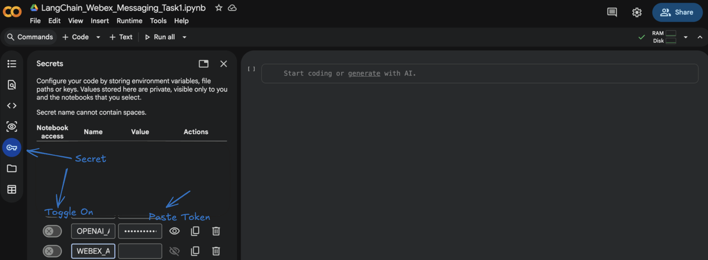
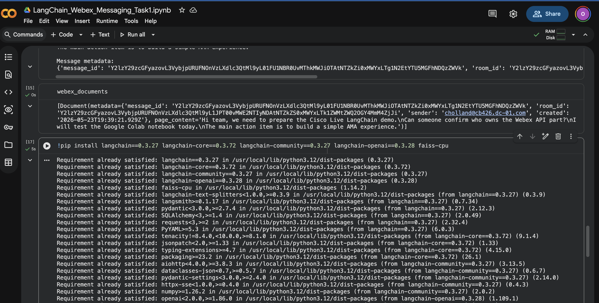
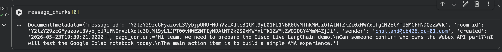
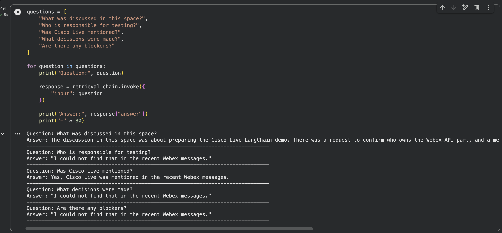

# Module 2b: Ask Me Anything for Webex Spaces

<div style="display:flex;align-items:center;gap:0.5rem;margin:0.2rem 0 1.2rem;flex-wrap:wrap;">
<span style="font-size:0.75rem;font-weight:700;color:#fff;background:#0288d1;padding:0.2rem 0.7rem;border-radius:20px;letter-spacing:0.04em;">🔍 TASK 2</span>
<span style="font-size:0.7rem;font-weight:700;color:#0288d1;background:rgba(2,136,209,0.15);padding:0.15rem 0.6rem;border-radius:20px;letter-spacing:0.04em;">2b</span>
<span style="font-size:0.85rem;color:var(--md-default-fg-color--light);font-style:italic;">RAG over Webex Conversations</span>
</div>

> **Build a Retrieval-Augmented Question Answering experience over your Webex space.**

## Goal

In [Task 1](module-2a-connect-langchain-to-webex-messaging.md) we connected to Webex Messaging, retrieved recent messages from a Webex space, and converted those messages into LangChain Documents.

Now we are going to take the next step. Instead of only displaying raw messages, we will build a simple **Ask Me Anything** experience, where a user can ask natural language questions about the conversation in their space.

For example:

* What was discussed in this space?
* What are the action items?
* Did anyone mention Cisco Live?
* Who is responsible for testing the lab?

This is similar to the native **Webex AI Assistant** experience, where users can ask questions about recent activity in a space. The goal here is not to replace Webex AI Assistant. The goal is to understand the building blocks behind this type of experience, so you can apply the same pattern to your own data later.

We will do this using **RAG** (Retrieval-Augmented Generation): pull only the most relevant Webex messages, hand them to the LLM as context, and let the LLM answer the question using that context instead of its own memory.

## What You Will Learn

By the end of this task, you will understand:

* what **Retrieval-Augmented Generation**, or **RAG**, means
* why raw messages need to be prepared before sending to an LLM
* how to split Webex messages and create **embeddings**
* how to store Webex messages in a **vector database**
* how to retrieve relevant messages based on a user question
* how to ask an LLM to answer **only** from Webex message context

!!! info "Already covered in earlier tasks"
    * Webex token, Space ID, and Colab Secrets: see [1a](../module-1-setup-your-lab-environment/module-1a-webex-developer-portal.md) and [1c](../module-1-setup-your-lab-environment/module-1c-managing-api-keys-in-colab.md).
    * Calling the Webex Messages API and converting results into LangChain `Document` objects: see [2a](module-2a-connect-langchain-to-webex-messaging.md).

## Prerequisites

!!! danger "Stop: you must complete Task 1 in the same notebook first"
    **Task 2 cannot be run on its own.** It builds directly on the work you did in [Task 1 (2a)](module-2a-connect-langchain-to-webex-messaging.md), and it relies on the `webex_documents` variable that Task 1 created in memory.

    Before you continue, make sure all of the following are true:

    * You completed every step of [Task 1](module-2a-connect-langchain-to-webex-messaging.md).
    * You are working in the **same Google Colab notebook** you used for Task 1.
    * The notebook runtime is still connected (the **Connect** indicator in the top-right shows a green check). If the runtime disconnected or you reopened the notebook in a new session, **re-run all of the Task 1 cells from top to bottom** before starting Task 2.

    You can confirm everything is in place by running this in a new code cell:

    ```py linenums="1"
    print("webex_documents loaded:", len(webex_documents), "messages")
    ```

    If you see a `NameError: name 'webex_documents' is not defined` instead of a number, go back and re-run Task 1 first.

The only new thing Task 2 introduces is the **OpenAI API key**, which you already stored as `OPENAI_API_KEY` in [Module 1c](../module-1-setup-your-lab-environment/module-1c-managing-api-keys-in-colab.md).



Everything else (your Webex token, the Charles's Space room ID, the Colab notebook itself) was set up during Task 1 and is reused here.

## Steps

!!! warning "Quick check before you start"
    A reminder before you run the first cell:

    * You are working in the **same Google Colab notebook** you used for [Task 1](module-2a-connect-langchain-to-webex-messaging.md).
    * The notebook **runtime is connected** (the **Connect** indicator in the top-right shows a green check).
    * Task 1 has been **run end-to-end**, so the variable `webex_documents` already exists in this notebook's memory.

    If any of those are not true, scroll back up and finish [Task 1](module-2a-connect-langchain-to-webex-messaging.md) first. Task 2 will not work without it.

### Step 1: Confirm `webex_documents` is available

Before we add any new code, let's make sure the messages we collected in Task 1 are still loaded in this notebook.

In a new code cell, run:


```py linenums="1"
webex_documents
```

You should see a Python list of `Document` objects, one per Webex message, each with `page_content` (the message text) and `metadata` (sender, timestamp, message ID, room ID). This is the data Task 2 will use as the knowledge base for our Ask Me Anything experience.

!!! danger "If you see `NameError: name 'webex_documents' is not defined`"
    The variable does not exist in this notebook's memory, which means **Task 1 has not been run** in this session. Go back to [Task 1 (2a)](module-2a-connect-langchain-to-webex-messaging.md) and run every cell from the top before continuing.

### Step 2: Install the required libraries

Task 1 only needed `requests` and `langchain-core`. Task 2 introduces the LLM, embeddings, and a vector store, so we need a few more packages.

In a new code cell, run:

```py linenums="1"
!pip install langchain==0.3.27 langchain-core==0.3.72 langchain-community==0.3.27 langchain-openai==0.3.28 faiss-cpu
```

When the install finishes, Colab will print a few **dependency warning** messages near the end of the output. These are safe to ignore for this lab.

You will also see a banner at the bottom asking you to **restart the runtime** so the newly installed packages are picked up. Click **Restart session** (or **Restart runtime**) when prompted.



After the restart, make sure the runtime reconnects (the **Connect** indicator in the top-right shows a green check) before you continue.

What we are installing and why:

* **`langchain`** for chains and retrieval workflows
* **`langchain-openai`** for OpenAI chat models and embeddings
* **`faiss-cpu`** for local vector search inside Google Colab

!!! note "Why pin the versions?"
    For a lab environment, pinning each package to a specific version helps avoid surprises during the session. If LangChain releases a new version mid-lab and changes an API, your code keeps working because you're locked to a version we've already tested.

### Step 3: Load your OpenAI API key from Colab Secrets

In Task 1 we loaded the Webex token from Colab Secrets. We will do the same thing for the OpenAI API key here, except this time we also expose it as an **environment variable** called `OPENAI_API_KEY`. LangChain and the OpenAI client both read that variable automatically, so once it is set, we don't have to pass the key around in our code.

In a new code cell, run:

```py linenums="1"
import os
from google.colab import userdata

os.environ["OPENAI_API_KEY"] = userdata.get("OPENAI_API_KEY")

if os.environ["OPENAI_API_KEY"]:
    print("OpenAI API key loaded successfully.")
else:
    print("OpenAI API key not found. Please check your Colab Secrets.")
```

What's happening here:

* **`userdata.get("OPENAI_API_KEY")`** reads the secret you saved in [Module 1c](../module-1-setup-your-lab-environment/module-1c-managing-api-keys-in-colab.md) without printing it on screen.
* **`os.environ["OPENAI_API_KEY"] = ...`** stores the key as an environment variable so that any LangChain or OpenAI call in this notebook can find it.
* The `if/else` is just a quick sanity check.

**Expected output:**

```text
OpenAI API key loaded successfully.
```

If you see `OpenAI API key not found. Please check your Colab Secrets.` instead, jump back to [Module 1c](../module-1-setup-your-lab-environment/module-1c-managing-api-keys-in-colab.md), confirm the secret name is exactly `OPENAI_API_KEY`, and make sure the **Notebook access** toggle is on for it.

### Step 4: Review the Webex documents from Task 1

Before we start creating embeddings, let's take a quick look at the documents we are about to feed into the vector store. This is a sanity check, and it also makes the next steps easier to reason about.

In a new code cell, run:

```py linenums="1"
print("Number of Webex documents:", len(webex_documents))
print()
print("First document:")
print(webex_documents[0])
```

What's happening here:

* **`len(webex_documents)`** prints how many Webex messages were converted into LangChain `Document` objects in Task 1.
* **`webex_documents[0]`** shows the first one in detail, so you can see both the message text (`page_content`) and the metadata we attached (sender, timestamp, message ID, room ID).

**Example output:**

```text
Number of Webex documents: 1

First document:
page_content='Hi team, we need to prepare the Cisco Live LangChain demo.
Can someone confirm who owns the Webex API part?
I will test the Google Colab notebook today.
The main action item is to build a simple AMA experience.' metadata={'message_id': 'Y2lzY29zcGFyazovL3VybjpURUFNOnVzLXdlc3QtMl9yL01FU1NBR0UvMThkMWJiOTAtNTZkZi0xMWYxLTg1N2EtYTU5MGFhNDQzZWVk', 'room_id': 'Y2lzY29zcGFyazovL3VybjpURUFNOnVzLXdlc3QtMl9yL1JPT00vMWE2NTIyNDAtNTZkZS0xMWYxLTk1ZWMtZWQ2OGY4MmM4ZjJi', 'sender': 'cholland@cb426.dc-01.com', 'created': '2026-05-23T19:39:21.929Z'}
```

This confirms that our Webex messages are now in a format LangChain can process.

!!! note "Your output will be different"
    The example above shows **`Number of Webex documents: 1`** because that pod only had a single message in the space at the time. In your case, the count will match how many text messages exist in **Charles's Space** when you ran Task 1, so you may see `2`, `5`, `20`, or any other number. The IDs, the sender email, and the timestamps will also be specific to your dCloud pod.

### Step 5: Split the Webex messages into chunks

In most RAG systems, documents are split into smaller pieces before they are embedded. Each Webex message may already be small, but chunking is still worth doing because:

* some messages may be long
* future spaces may contain long pasted content (logs, code blocks, articles)
* chunking makes retrieval more consistent
* a small **overlap** between chunks helps preserve context across boundaries

In a new code cell, run:

```py linenums="1"
from langchain_text_splitters import RecursiveCharacterTextSplitter

text_splitter = RecursiveCharacterTextSplitter(
    chunk_size=500,
    chunk_overlap=100
)

message_chunks = text_splitter.split_documents(webex_documents)

print("Original documents:", len(webex_documents))
print("Message chunks:", len(message_chunks))
```

What's happening here:

* **`RecursiveCharacterTextSplitter`** breaks each document into pieces of at most **`chunk_size=500`** characters, preferring natural splits (paragraphs, sentences, then words) before forcing a hard cut.
* **`chunk_overlap=100`** copies the last 100 characters of each chunk into the start of the next one, so an idea split across two chunks is still readable on either side.
* **`split_documents(webex_documents)`** runs that on every Webex `Document` we built in Task 1 and returns a flat list of chunks.

**Expected output:**

```text
Original documents: 1
Message chunks: 1
```

### Step 6: Inspect a chunk

Now that we have a list of chunks, let's open one up and see what it actually looks like. This is the same shape of object we saw in Step 4, just narrower in size after the splitter ran.

In a new code cell, run:

```py linenums="1"
message_chunks[0]
```

You should see a LangChain `Document` with:

* **`page_content`**, the chunk text
* **`metadata`**, carried over from the original Webex message (sender, timestamp, message ID, room ID)



### Step 7: Create the embedding model

Embeddings convert text into numerical **vectors**. Each chunk becomes a list of numbers that represents the *meaning* of the text, not the exact words. Two pieces of text with similar meaning end up with similar vectors, even if they share no words in common. That is what lets semantic search find a relevant Webex message when the user's question is phrased completely differently.

We are not embedding any text yet, just creating the embedding model object. We'll use it in the next step.

In a new code cell, run:

```py linenums="1"
from langchain_openai import OpenAIEmbeddings

embeddings = OpenAIEmbeddings(model="text-embedding-3-small")

print("Embedding model ready.")
```

What's happening here:

* **`OpenAIEmbeddings`** is the LangChain wrapper around OpenAI's embedding API. It uses the `OPENAI_API_KEY` environment variable we set in [Step 3](#step-3-load-your-openai-api-key-from-colab-secrets) automatically.
* **`text-embedding-3-small`** is a great default for lab work and small datasets like Webex spaces.

**Expected output:**

```text
Embedding model ready.
```

### Step 8: Store the Webex messages in a FAISS vector database

Now we put the embedding model to work. We will run every Webex message chunk through the model, get back a vector for each one, and store all of those vectors in a local **FAISS** vector database. From that point on, we can ask "find me the chunks that are closest in meaning to this question" and FAISS will give us the best matches in milliseconds.

In a new code cell, run:

```py linenums="1"
from langchain_community.vectorstores import FAISS

vectorstore = FAISS.from_documents(
    documents=message_chunks,
    embedding=embeddings
)

print("FAISS vector database created successfully.")
```

What's happening here:

* **`FAISS.from_documents(...)`** takes our list of `message_chunks` from [Step 5](#step-5-split-the-webex-messages-into-chunks), runs each chunk through the embedding model from [Step 7](#step-7-create-the-embedding-model), and stores the resulting vectors in a local FAISS index.
* **`vectorstore`** is the in-memory database. It lives only in this Colab session, so we don't have to manage any external service.

**Expected output:**

```text
FAISS vector database created successfully.
```

At this stage, the Webex messages are now searchable by **meaning**, not just by keyword. That's the foundation for the Ask Me Anything experience.

### Step 9: Test similarity search

Before we bring an LLM into the picture, let's test retrieval directly against the vector store. This is a great way to see what the AMA experience will *see* before it asks the model to write an answer.

In a new code cell, run:

```py linenums="1"
query = "What are the action items?"

results = vectorstore.similarity_search(query, k=3)

for index, result in enumerate(results, start=1):
    print(f"Result {index}")
    print("Message:", result.page_content)
    print("Metadata:", result.metadata)
    print("-" * 80)
```

What's happening here:

* **`query`** is a natural-language question, the same kind of thing a user would type into the AMA UI.
* **`vectorstore.similarity_search(query, k=3)`** embeds the question, compares it against every chunk in FAISS, and returns the **top 3** closest matches.
* The `for` loop just prints each match nicely with its message text and metadata.

**Expected output:**

```text
Result 1
Message: Hi team, we need to prepare the Cisco Live LangChain demo.
Can someone confirm who owns the Webex API part?
I will test the Google Colab notebook today.
The main action item is to build a simple AMA experience.
Metadata: {'message_id': 'Y2lzY29zcGFyazovL3VybjpURUFNOnVzLXdlc3QtMl9yL01FU1NBR0UvMThkMWJiOTAtNTZkZi0xMWYxLTg1N2EtYTU5MGFhNDQzZWVk', 'room_id': 'Y2lzY29zcGFyazovL3VybjpURUFNOnVzLXdlc3QtMl9yL1JPT00vMWE2NTIyNDAtNTZkZS0xMWYxLTk1ZWMtZWQ2OGY4MmM4ZjJi', 'sender': 'cholland@cb426.dc-01.com', 'created': '2026-05-23T19:39:21.929Z'}
--------------------------------------------------------------------------------
```

!!! info "The model has not answered yet"
    At this point we are **only retrieving the most relevant Webex messages**. No LLM has been called, and no answer has been generated. The query just helps FAISS pull the chunks that are closest in meaning to the question. We'll hand those chunks to the LLM in the next step so it can write the actual answer.

### Step 10: Create a retriever

A **retriever** is the LangChain interface that searches the vector database. In Step 9 we called `similarity_search` directly. The retriever wraps that same idea in a standard object that the rest of LangChain (chains, agents, RAG pipelines) knows how to plug into.

In a new code cell, run:

```py linenums="1"
retriever = vectorstore.as_retriever(
    search_kwargs={"k": 5}
)

print("Retriever ready.")
```

What's happening here:

* **`vectorstore.as_retriever(...)`** turns our FAISS index from [Step 8](#step-8-store-the-webex-messages-in-a-faiss-vector-database) into a retriever object.
* **`search_kwargs={"k": 5}`** tells the retriever to fetch the top **5** most relevant Webex message chunks every time a question is asked. We bumped this from `k=3` (used in the manual search) to give the LLM a bit more context to work with.

**Expected output:**

```text
Retriever ready.
```

From here on, every time a user asks a question, LangChain will hand the question to this retriever, get back the top 5 most relevant Webex message chunks, and pass them to the LLM as context.

### Step 11: Create the LLM

We have data, we have a way to find the right pieces of it, and now we need the brain that will read those pieces and write the answer. That's the **chat model**, also called the **LLM**.

In a new code cell, run:

```py linenums="1"
from langchain_openai import ChatOpenAI

llm = ChatOpenAI(
    model="gpt-4o",
    temperature=0
)

print("LLM ready.")
```

What's happening here:

* **`ChatOpenAI`** is the LangChain wrapper around OpenAI's chat models. It uses the `OPENAI_API_KEY` environment variable we set in [Step 3](#step-3-load-your-openai-api-key-from-colab-secrets) automatically.
* **`model="gpt-4o"`** picks the GPT-4o chat model.
* **`temperature=0`** makes the answer more consistent and predictable. Higher temperatures make the model more creative, but in a Q&A scenario over real Webex messages, we want it to stick closely to the facts in front of it.

**Expected output:**

```text
LLM ready.
```

### Step 12: Create the RAG prompt

Now we tell the model **how to behave** when it answers. The retriever will hand it the most relevant Webex messages, and we want the model to answer only from those messages, not from anything it learned during training. The way we do that in LangChain is with a **prompt template**.

In a new code cell, run:

```py linenums="1"
from langchain_core.prompts import ChatPromptTemplate

rag_prompt = ChatPromptTemplate.from_template("""
You are a helpful Webex messaging assistant.

Answer the user's question using only the Webex message context provided below.

If the answer is not available in the context, say:
"I could not find that in the recent Webex messages."

Do not make up information.

Webex message context:
<context>
{context}
</context>

User question:
{input}
""")

print("RAG prompt created.")
```

What's happening here:

* **`ChatPromptTemplate.from_template(...)`** builds a reusable prompt with two placeholders: `{context}` for the Webex messages the retriever finds, and `{input}` for the user's question.
* The instructions in the prompt are doing the heavy lifting. We are explicitly telling the model:
    * use the provided Webex messages **only**
    * do not guess
    * say when it does not know

This is what stops the model from drifting off into general knowledge or inventing facts about your space.

**Expected output:**

```text
RAG prompt created.
```

### Step 13: Create the document chain

The **document chain** takes the Webex message chunks the retriever finds and inserts them into the `{context}` placeholder of the prompt we just built. In other words, it's the piece that hands the right messages to the LLM in the right shape.

In a new code cell, run:

```py linenums="1"
from langchain.chains.combine_documents import create_stuff_documents_chain

document_chain = create_stuff_documents_chain(
    llm=llm,
    prompt=rag_prompt
)

print("Document chain created.")
```

What's happening here:

* **`create_stuff_documents_chain`** is LangChain's built-in helper for the simplest combine-documents pattern: take all the retrieved chunks and **stuff** them straight into the prompt's `{context}` placeholder.
* It takes two pieces we already built: the **`llm`** from [Step 11](#step-11-create-the-llm) and the **`rag_prompt`** from [Step 12](#step-12-create-the-rag-prompt).

**Expected output:**

```text
Document chain created.
```

### Step 14: Create the retrieval chain

The document chain knows how to put messages into a prompt and call the LLM, but it doesn't know how to *find* those messages. That's the retriever's job. The **retrieval chain** is the piece that connects them: take a user question, hand it to the retriever, then hand the retrieved messages to the document chain.

In a new code cell, run:

```py linenums="1"
from langchain.chains import create_retrieval_chain

retrieval_chain = create_retrieval_chain(
    retriever,
    document_chain
)

print("Retrieval chain created.")
```

What's happening here:

* **`create_retrieval_chain`** wires the **`retriever`** from [Step 10](#step-10-create-a-retriever) together with the **`document_chain`** from [Step 13](#step-13-create-the-document-chain).
* The result is `retrieval_chain`, a single object that handles the **complete RAG workflow** end to end: take the question, fetch the top relevant Webex messages, build the prompt, call the LLM, return the answer.

**Expected output:**

```text
Retrieval chain created.
```

### Step 15: Ask a question about the Webex space

This is the moment everything we've built so far comes together. We will hand a natural-language question to the retrieval chain, and it will run the **complete RAG pipeline** for us: fetch the most relevant Webex messages, drop them into the prompt, call the LLM, and return the answer.

In a new code cell, run:

```py linenums="1"
question = "What are the main action items from this space?"

response = retrieval_chain.invoke({
    "input": question
})

print(response["answer"])
```

What's happening here:

* **`retrieval_chain.invoke({"input": question})`** kicks off the whole RAG workflow. Behind the scenes, the retriever pulls the top 5 closest chunks for that question, the document chain stuffs them into the prompt template, and the LLM generates the answer.

### Step 16: Ask more questions

One question is fine, but the real test is asking the assistant a few different things and seeing how well the answers stay grounded in your Webex messages. Some of these will have a clear answer in the space, others will not, and the prompt we wrote in [Step 12](#step-12-create-the-rag-prompt) is what tells the model how to handle both cases.

In a new code cell, run:

```py linenums="1"
questions = [
    "What was discussed in this space?",
    "Who is responsible for testing?",
    "Was Cisco Live mentioned?",
    "What decisions were made?",
    "Are there any blockers?"
]

for question in questions:
    print("Question:", question)

    response = retrieval_chain.invoke({
        "input": question
    })

    print("Answer:", response["answer"])
    print("-" * 80)
```

For questions that the messages can support, you should get a focused, factual answer. For questions the messages do not cover, the model should fall back to the line we baked into the prompt: *"I could not find that in the recent Webex messages."*



### Step 17: Create a simple reusable function

Let's tidy things up by wrapping the whole workflow in a small Python function.

In a new code cell, run:

```py linenums="1"
def ask_webex_space(question):
    response = retrieval_chain.invoke({
        "input": question
    })

    answer = response["answer"]

    source_docs = retriever.invoke(question)

    print("Question:")
    print(question)

    print("\nAnswer:")
    print(answer)

    print("\nSources:")
    for index, doc in enumerate(source_docs, start=1):
        print(f"{index}. {doc.metadata.get('sender')} at {doc.metadata.get('created')}")
        print(f"   {doc.page_content}")
```

What's happening here:

* The function takes a single `question` string and runs the full RAG pipeline with **`retrieval_chain.invoke(...)`**, just like before.

Now let's test it. In a new code cell, run:

```py linenums="1"
ask_webex_space("What are the key points from this conversation?")
```

You'll see the question, the model's answer, and a numbered list of source Webex messages with the sender and timestamp for each one.

### Step 18 (Optional): Add a user input box in Colab

For a more interactive experience inside Colab, you can ask the question through an input box instead of editing the code each time.

In a new code cell, run:

```py linenums="1"
user_question = input("Ask a question about your Webex space: ")

ask_webex_space(user_question)
```

When the cell runs, Colab will show a small text box right under the cell. Type your question and press **Enter** to send it through the same RAG pipeline you just built.

**Example:**

```text
Ask a question about your Webex space: What did the team agree to do next?
```

The notebook will then call `ask_webex_space(user_question)` for you, so you'll see the question, the answer, and the source Webex messages, exactly like the previous step.

## Task 2 (2b) Summary

In this task, we built a simplified **Ask Me Anything** experience for Webex messages.

We:

* reused the Webex messages we ingested in [Task 1](module-2a-connect-langchain-to-webex-messaging.md)
* split those messages into smaller chunks
* turned each chunk into an embedding using OpenAI
* stored the embeddings in a local **FAISS** vector database
* wrote a **RAG prompt** that tells the LLM to answer only from the retrieved messages
* connected the retriever and the LLM together with a **retrieval chain**
* asked natural language questions about the Webex space and got back grounded answers
* wrapped the workflow in a small `ask_webex_space(...)` helper that also shows the **source messages** behind each answer
