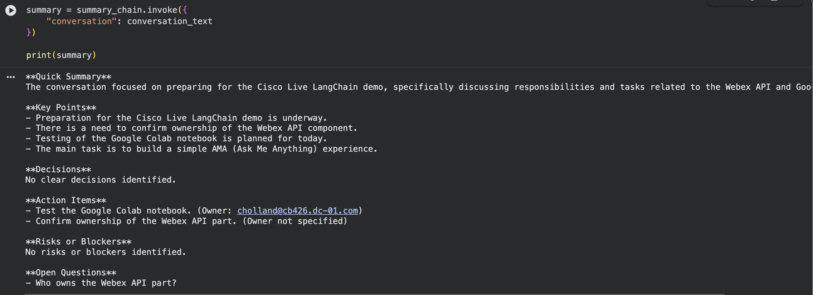
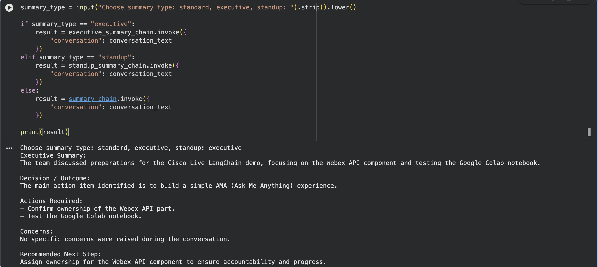

# Module 2c: Generate Space Summaries

<div style="display:flex;align-items:center;gap:0.5rem;margin:0.2rem 0 1.2rem;flex-wrap:wrap;">
<span style="font-size:0.75rem;font-weight:700;color:#fff;background:#7b1fa2;padding:0.2rem 0.7rem;border-radius:20px;letter-spacing:0.04em;">📝 TASK 3</span>
<span style="font-size:0.7rem;font-weight:700;color:#7b1fa2;background:rgba(123,31,162,0.15);padding:0.15rem 0.6rem;border-radius:20px;letter-spacing:0.04em;">2c</span>
<span style="font-size:0.85rem;color:var(--md-default-fg-color--light);font-style:italic;">Catch up on a Webex space using prompt templates and chains</span>
</div>

> **Build a Space Summary Assistant for your Webex space.**

## Goal

In [Task 1](module-2a-connect-langchain-to-webex-messaging.md) we connected to Webex Messaging and retrieved recent messages from a Webex space.

In [Task 2](module-2b-ask-me-anything-webex-spaces.md) we used those messages to build a simple **Ask Me Anything** experience with RAG.

Now, in **Task 3**, we will build a **Space Summary Assistant**. Instead of asking one question at a time, we will ask LangChain to **summarize** the recent Webex conversation and pull out the parts that actually matter:

* Key points
* Decisions
* Action items
* Risks or blockers
* Open questions

This is similar to the native **Cisco AI Assistant** space summary feature, where users can catch up on missed messages and recent conversation activity. The goal here is not to replace Cisco AI Assistant. The goal is to understand how this kind of workflow can be built using **LangChain prompt templates and chains**.

## What You Will Learn

By the end of this task, you will understand:

* how to **reuse** Webex messages retrieved in Task 1
* how to **format** Webex messages for an LLM
* how **prompt templates** control the structure of the output
* how **LangChain chains** connect prompts, models, and output parsers
* how to generate **structured summaries** from conversation data
* how summarization differs from RAG-based question answering

## Prerequisites

!!! danger "Stop: Task 1 must already be complete"
    Task 3 reuses the `webex_documents` variable that Task 1 created. It will not work without it.

    Before you continue, make sure all of the following are true:

    * You completed every step of [Task 1 (2a)](module-2a-connect-langchain-to-webex-messaging.md).
    * Task 1 was run **in this same Google Colab notebook**, so `webex_documents` is still in memory.
    * The notebook runtime is still connected (the **Connect** indicator in the top-right shows a green check).

    You can confirm this with:

    ```py linenums="1"
    print("webex_documents loaded:", len(webex_documents), "messages")
    ```

    If you see a `NameError: name 'webex_documents' is not defined`, go back and re-run [Task 1](module-2a-connect-langchain-to-webex-messaging.md) before continuing.

You can use the **same Colab notebook** you used for [Task 2](module-2b-ask-me-anything-webex-spaces.md). Everything we built there is still valid and we'll reuse it.

You should also have your **OpenAI API key** loaded from Colab Secrets, just like in Task 2.

!!! note "Starting a new notebook?"
    If you would prefer to start with a clean notebook for Task 3, that's fine, but you must run [Task 1](module-2a-connect-langchain-to-webex-messaging.md) first in that new notebook so `webex_documents` exists. Without it, the cells in this task will fail.

## Steps

!!! warning "Quick check before you start"
    A reminder before you run the first cell:

    * You are working in the **same Google Colab notebook** you used for [Task 1](module-2a-connect-langchain-to-webex-messaging.md) and [Task 2](module-2b-ask-me-anything-webex-spaces.md).
    * The notebook **runtime is connected** (the **Connect** indicator in the top-right shows a green check).
    * Task 1 has been **run end-to-end**, so the variable `webex_documents` already exists in this notebook's memory.

    If any of those are not true, scroll back up and finish [Task 1](module-2a-connect-langchain-to-webex-messaging.md) first. Task 3 will not work without it.

### Step 1: Confirm the required libraries

If you already installed the LangChain packages back in [Task 2 (Step 2)](module-2b-ask-me-anything-webex-spaces.md#step-2-install-the-required-libraries), you do not need to install them again. Skip ahead to Step 2 of this task.

If you started a fresh notebook, in a new code cell, run:

```py linenums="1"
!pip install langchain==0.3.27 langchain-core==0.3.72 langchain-openai==0.3.28
```

Task 3 only needs `langchain`, `langchain-core`, and `langchain-openai`. We don't need FAISS or `langchain-community` here because we are summarizing the conversation, not running RAG.

### Step 2: Load your OpenAI API key from Colab Secrets

If you completed Task 2 in this notebook, the key is already loaded and you can skip ahead to Step 3.

To be safe, in a new code cell, run:

```py linenums="1"
import os
from google.colab import userdata

os.environ["OPENAI_API_KEY"] = userdata.get("OPENAI_API_KEY")

if os.environ["OPENAI_API_KEY"]:
    print("OpenAI API key loaded successfully.")
else:
    print("OpenAI API key not found. Please check your Colab Secrets.")
```

**Expected output:**

```text
OpenAI API key loaded successfully.
```

If you see the "not found" message, jump back to [Module 1c](../module-1-setup-your-lab-environment/module-1c-managing-api-keys-in-colab.md), confirm the secret name is exactly `OPENAI_API_KEY`, and make sure the **Notebook access** toggle is on.

### Step 3: Review the Webex documents

Let's quickly inspect the messages we retrieved earlier so we know what we are about to summarize.

In a new code cell, run:

```py linenums="1"
print("Total Webex documents:", len(webex_documents))

print("\nFirst Webex document:")
print(webex_documents[0])
```

Each `Document` should contain:

* **`page_content`**: the message text
* **`metadata`**: sender, created time, message ID, room ID

### Step 4: Format Webex messages for summarization

Right now `webex_documents` is a list of LangChain `Document` objects. The LLM needs them as a single block of text that reads like a real conversation transcript: who said what, and when.

In a new code cell, run:

```py linenums="1"
def format_webex_messages_for_summary(documents):
    formatted_messages = []

    for doc in documents:
        sender = doc.metadata.get("sender", "Unknown sender")
        created = doc.metadata.get("created", "Unknown time")
        text = doc.page_content

        formatted_message = f"[{created}] {sender}: {text}"
        formatted_messages.append(formatted_message)

    return "\n".join(formatted_messages)


conversation_text = format_webex_messages_for_summary(webex_documents)

print(conversation_text[:2000])
```

The function turns each Webex message into a `[timestamp] sender: text` line, then joins them with newlines so the LLM sees the whole conversation in chronological order.

**Example output:**

```text
[2026-05-23T19:39:21.929Z] cholland@cb426.dc-01.com: Hi team, we need to prepare the Cisco Live LangChain demo.
Can someone confirm who owns the Webex API part?
I will test the Google Colab notebook today.
The main action item is to build a simple AMA experience.
```

!!! note "Your output may look slightly different"
    If your Webex space has more messages, you'll see more `[timestamp] sender: text` lines, one per message, in the same shape as the example above.

### Step 5: Create the LLM

If you already created the `llm` in Task 2, you can reuse it here, no new cell needed.

To be safe, in a new code cell, run:

```py linenums="1"
from langchain_openai import ChatOpenAI

llm = ChatOpenAI(
    model="gpt-4o",
    temperature=0
)

print("LLM ready.")
```

`temperature=0` keeps the summary focused and consistent. We don't want the model getting creative with the action items.

**Expected output:**

```text
LLM ready.
```

### Step 6: Create the summary prompt template

This is the heart of Task 3. The prompt is what tells the model **how** to summarize, **what sections** to include, and **what to do** when information isn't in the conversation.

In a new code cell, run:

```py linenums="1"
from langchain_core.prompts import ChatPromptTemplate

summary_prompt = ChatPromptTemplate.from_template("""
You are a helpful Webex space summary assistant.

Your task is to summarize the recent Webex conversation provided below.

Create a clear and useful summary with the following sections:

1. Quick Summary
A short paragraph explaining what the conversation was about.

2. Key Points
Bullet points covering the most important discussion points.

3. Decisions
List any decisions that were made. If there were no clear decisions, say "No clear decisions identified."

4. Action Items
List action items with owners if mentioned. If no owner is mentioned, say "Owner not specified."

5. Risks or Blockers
List any risks, blockers, or concerns. If none were mentioned, say "No risks or blockers identified."

6. Open Questions
List any unanswered questions or follow-ups. If none were mentioned, say "No open questions identified."

Important rules:
- Use only the Webex conversation below.
- Do not invent details.
- Keep the summary concise and easy to read.
- If information is not available, clearly say so.

Webex conversation:
<context>
{conversation}
</context>
""")

print("Summary prompt created.")
```

Notice that the **structure of the output is controlled entirely by the prompt**. If we change the section names or rules in here, the answer changes shape too. That's the whole idea behind prompt engineering.

**Expected output:**

```text
Summary prompt created.
```

### Step 7: Add an output parser

The output parser takes whatever the model returns and converts it into a clean Python string we can print or post somewhere else.

In a new code cell, run:

```py linenums="1"
from langchain_core.output_parsers import StrOutputParser

output_parser = StrOutputParser()

print("Output parser ready.")
```

**Expected output:**

```text
Output parser ready.
```

### Step 8: Create the summary chain

Now we connect the prompt, the LLM, and the output parser using **LangChain Expression Language** (the `|` operator).

In a new code cell, run:

```py linenums="1"
summary_chain = summary_prompt | llm | output_parser

print("Summary chain created.")
```

The flow is simply:

```text
Prompt Template  →  LLM  →  Output Parser
```

When we call `summary_chain.invoke(...)`, the input flows through each piece in order, and we get a clean string back at the end.

**Expected output:**

```text
Summary chain created.
```

### Step 9: Generate the space summary

This is the moment everything comes together, hand the formatted conversation to the chain and watch it produce a structured summary.

In a new code cell, run:

```py linenums="1"
summary = summary_chain.invoke({
    "conversation": conversation_text
})

print(summary)
```

**Example output:**



Your output will be different because it depends on what's actually in your space. The shape and the section headings will match.

### Step 10: Create a reusable summary function

Let's wrap the whole flow into a small helper so we can call it any time without copy-pasting the same lines.

In a new code cell, run:

```py linenums="1"
def summarize_webex_space(documents):
    conversation = format_webex_messages_for_summary(documents)

    summary = summary_chain.invoke({
        "conversation": conversation
    })

    return summary
```

Now test it. In a new code cell, run:

```py linenums="1"
space_summary = summarize_webex_space(webex_documents)

print(space_summary)
```

You should see the same kind of structured summary as Step 9.

### Step 11: Summarize only the most recent messages

A real Webex space can have hundreds or thousands of messages. For this lab and for most "catch me up" use cases, we only care about the most **recent** ones.

In a new code cell, run:

```py linenums="1"
recent_documents = webex_documents[:10]

recent_summary = summarize_webex_space(recent_documents)

print(recent_summary)
```

This works because Task 1 retrieved messages in **most-recent-first order** from the Webex API, so `webex_documents[:10]` gives us the 10 newest.

You can adjust the number to suit:

```py linenums="1"
recent_documents = webex_documents[:20]
```

or:

```py linenums="1"
recent_documents = webex_documents[:50]
```

### Step 12: Create a more executive-style summary

Same Webex messages, same model, but a different prompt produces a very different summary. Let's prove it by writing a second prompt aimed at a senior leader who only has 30 seconds.

In a new code cell, run:

```py linenums="1"
executive_summary_prompt = ChatPromptTemplate.from_template("""
You are an executive assistant summarizing a Webex conversation for a senior leader.

Summarize the conversation in a concise executive format.

Use this structure:

Executive Summary:
Decision / Outcome:
Actions Required:
Concerns:
Recommended Next Step:

Rules:
- Use only the Webex conversation provided.
- Do not invent missing information.
- Keep the tone professional and concise.

Webex conversation:
<context>
{conversation}
</context>
""")

executive_summary_chain = executive_summary_prompt | llm | output_parser

executive_summary = executive_summary_chain.invoke({
    "conversation": conversation_text
})

print(executive_summary)
```

!!! tip "Teaching moment"
    Same Webex messages. Same model. **Different prompt.** Different output. This is the cleanest way to feel what prompt engineering actually does.

### Step 13: Create a stand-up style summary

One more variation. This one is shaped for a daily team stand-up.

In a new code cell, run:

```py linenums="1"
standup_summary_prompt = ChatPromptTemplate.from_template("""
You are summarizing a Webex conversation for a team stand-up.

Use this format:

Yesterday / Previous Discussion:
Today / Next Steps:
Blockers:
Owners:

Rules:
- Use only the Webex conversation provided.
- If owners are not clearly mentioned, say "Owner not specified."
- Keep it short and practical.

Webex conversation:
<context>
{conversation}
</context>
""")

standup_summary_chain = standup_summary_prompt | llm | output_parser

standup_summary = standup_summary_chain.invoke({
    "conversation": conversation_text
})

print(standup_summary)
```

Three different chains, three different summaries, all from the same Webex space. The prompt is doing all the work.

!!! note "Example, add the following to the rules in the prompt"
    Try adding this line to the **Rules** section of the stand-up prompt to give the summary a bit of personality:

    ```text
    - Make jokes based on the content, so we can have a laugh as well.
    ```

    Re-run the cell and notice how the same Webex conversation produces a noticeably different tone. Same chain, same model, just one extra rule in the prompt.

### Step 14 (Optional): Let the user choose the summary type

For a more interactive Colab experience, you can let the user pick which summary they want.

In a new code cell, run:

```py linenums="1"
summary_type = input("Choose summary type: standard, executive, standup: ").strip().lower()

if summary_type == "executive":
    result = executive_summary_chain.invoke({
        "conversation": conversation_text
    })
elif summary_type == "standup":
    result = standup_summary_chain.invoke({
        "conversation": conversation_text
    })
else:
    result = summary_chain.invoke({
        "conversation": conversation_text
    })

print(result)
```

**Example:**

```text
Choose summary type: standard, executive, standup: executive
```

The notebook will run the matching chain and print the result.



### Step 15 (Optional): Add a simple message limit

LLMs have a finite **context window**, which means a very long Webex space could blow past what the model can read in one shot. For a small lab dataset this isn't a problem.

### Step 16 (Optional): Send the summary back to Webex

Since [Task 1](module-2a-connect-langchain-to-webex-messaging.md) already wired us up to Webex, we can post the summary back into the same space and let the team see it.

!!! warning "Only do this if your lab proctor allows posting into the lab space"
    The cell below will send a real Webex message to the room ID you set in Task 1. Make sure you are happy posting into that space before running it.

In a new code cell, run:

```py linenums="1"
import requests

def send_message_to_webex(room_id, text):
    url = "https://webexapis.com/v1/messages"

    headers = {
        "Authorization": f"Bearer {WEBEX_ACCESS_TOKEN}",
        "Content-Type": "application/json"
    }

    payload = {
        "roomId": room_id,
        "text": text
    }

    response = requests.post(
        url,
        headers=headers,
        json=payload
    )

    print("Status Code:", response.status_code)

    if response.status_code in [200, 201]:
        print("Summary sent to Webex successfully.")
    else:
        print("Failed to send summary.")
        print(response.text)
```

Then, in a new code cell, send the summary:

```py linenums="1"
send_message_to_webex(
    ROOM_ID,
    "AI Generated Space Summary:\n\n" + space_summary
)
```

You should see `Status Code: 200` (or `201`) and a confirmation, and the message will appear in **Charles's Space** in your Webex App.

## Task 3 (2c) Summary

In this task, we built a **Space Summary Assistant** for Webex messages.

We:

* reused the Webex messages we ingested in [Task 1](module-2a-connect-langchain-to-webex-messaging.md)
* formatted the messages into a clean conversation transcript
* created a **summary prompt template** with the sections we wanted
* connected the prompt to the LLM with **LangChain Expression Language**
* parsed the model's response into clean text with `StrOutputParser`
* created different **summary styles** (executive, stand-up) by changing only the prompt
* optionally sent the summary back into the Webex space
