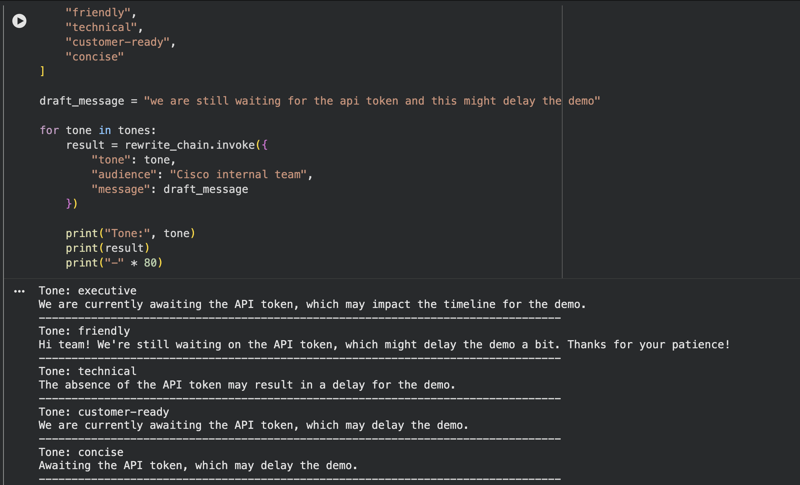
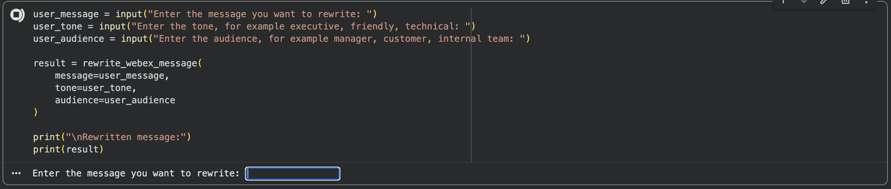
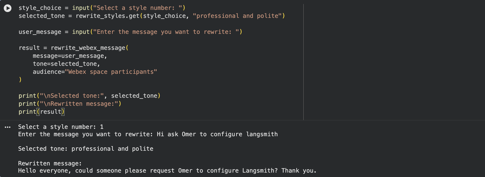

# Module 2d: AI Rewrite Assistant

<div style="display:flex;align-items:center;gap:0.5rem;margin:0.2rem 0 1.2rem;flex-wrap:wrap;">
<span style="font-size:0.75rem;font-weight:700;color:#fff;background:#e65100;padding:0.2rem 0.7rem;border-radius:20px;letter-spacing:0.04em;">✏️ TASK 4</span>
<span style="font-size:0.7rem;font-weight:700;color:#e65100;background:rgba(230,81,0,0.15);padding:0.15rem 0.6rem;border-radius:20px;letter-spacing:0.04em;">2d</span>
<span style="font-size:0.85rem;color:var(--md-default-fg-color--light);font-style:italic;">Rewrite Webex Messages with Prompt Engineering</span>
</div>

> **Build an AI Rewrite Assistant that takes a draft Webex message and rewrites it in different tones.**

## Goal

In [Task 1](module-2a-connect-langchain-to-webex-messaging.md) we connected to Webex Messaging and retrieved recent messages.

In [Task 2](module-2b-ask-me-anything-webex-spaces.md) we built an **Ask Me Anything** experience using RAG.

In [Task 3](module-2c-generate-space-summaries.md) we generated structured **space summaries** using LangChain prompt chains.

Now, in **Task 4**, we will build an **AI Rewrite Assistant**. This assistant will take a draft message and rewrite it in different tones, such as:

* **Executive**
* **Friendly**
* **Technical**
* **Customer-ready**
* **Concise**

This is similar to the native **Cisco Smart Rewrite** capability, where AI can help improve a message before it is sent. The goal here is not to replace the built-in Webex AI feature. The goal is to understand how LangChain chains can be used to build this type of experience.

## What You Will Learn

By the end of this task, you will understand:

* how **prompt engineering** changes AI output
* how to build **reusable prompt templates**
* how to use **LCEL** (LangChain Expression Language) to wire prompt, model, and parser together

## Prerequisites

!!! danger "Stop: Tasks 1, 2, and 3 must already be complete in this notebook"
    Task 4 builds on the work you did in Tasks 1, 2, and 3. It will not work without them.

    Before you continue, make sure all of the following are true:

    * You completed [Task 1](module-2a-connect-langchain-to-webex-messaging.md), [Task 2](module-2b-ask-me-anything-webex-spaces.md), and [Task 3](module-2c-generate-space-summaries.md).
    * You are working in the **same Google Colab notebook** you used for those tasks.
    * The notebook runtime is still connected (the **Connect** indicator in the top-right shows a green check).

You should already have the following in memory from earlier tasks:

* **`WEBEX_ACCESS_TOKEN`** (loaded in [Task 1](module-2a-connect-langchain-to-webex-messaging.md))
* **`ROOM_ID`** (set in [Task 1](module-2a-connect-langchain-to-webex-messaging.md))
* **`llm`** (created in [Task 2](module-2b-ask-me-anything-webex-spaces.md))
* **`output_parser`** (created in [Task 3](module-2c-generate-space-summaries.md))

!!! note "Don't have `llm` and `output_parser` yet?"
    No problem. This task re-runs the setup for you in [Step 1](#step-1-confirm-or-create-the-llm-and-output-parser) below, so you can start cleanly even if you skipped one of the earlier tasks.

## Steps

!!! warning "Quick check before you start"
    A reminder before you run the first cell:

    * You are working in the **same Google Colab notebook** you used for [Task 1](module-2a-connect-langchain-to-webex-messaging.md), [Task 2](module-2b-ask-me-anything-webex-spaces.md), and [Task 3](module-2c-generate-space-summaries.md).
    * The notebook **runtime is connected** (the **Connect** indicator in the top-right shows a green check).
    * Your `OPENAI_API_KEY` is loaded as an environment variable from earlier tasks.

    If any of those are not true, scroll back and finish the earlier tasks first.

### Step 1: Confirm the required libraries

If you already installed the LangChain packages back in [Task 2 (Step 2)](module-2b-ask-me-anything-webex-spaces.md#step-2-install-the-required-libraries) or [Task 3 (Step 1)](module-2c-generate-space-summaries.md#step-1-confirm-the-required-libraries), you can skip this step.

Otherwise, in a new code cell, run:

```py linenums="1"
!pip install langchain==0.3.27 langchain-core==0.3.72 langchain-openai==0.3.28
```

Task 4 only needs `langchain`, `langchain-core`, and `langchain-openai`.

### Step 2: Load your OpenAI API key from Colab Secrets

If your `OPENAI_API_KEY` was already loaded in an earlier task, you can skip this step.

Otherwise, in a new code cell, run:

```py linenums="1"
import os
from google.colab import userdata

os.environ["OPENAI_API_KEY"] = userdata.get("OPENAI_API_KEY")

if os.environ["OPENAI_API_KEY"]:
    print("OpenAI API key loaded successfully.")
else:
    print("OpenAI API key not found. Please check your Colab Secrets.")
```

**Expected output:**

```text
OpenAI API key loaded successfully.
```

If you see the "not found" message, jump back to [Module 1c](../module-1-setup-your-lab-environment/module-1c-managing-api-keys-in-colab.md), confirm the secret name is exactly `OPENAI_API_KEY`, and make sure the **Notebook access** toggle is on.

### Step 3: Create the LLM and output parser

If you already created `llm` and `output_parser` in [Task 3](module-2c-generate-space-summaries.md), you can reuse them and skip this step.

Otherwise, in a new code cell, run:

```py linenums="1"
from langchain_openai import ChatOpenAI
from langchain_core.output_parsers import StrOutputParser

llm = ChatOpenAI(
    model="gpt-4o",
    temperature=0.3
)

output_parser = StrOutputParser()

print("LLM and output parser ready.")
```

For rewrite tasks, a small amount of creativity is useful, so `temperature=0.3` is a good middle ground. It is high enough to vary phrasing, but low enough to keep the meaning faithful.

**Expected output:**

```text
LLM and output parser ready.
```

### Step 4: Create the rewrite prompt template

This is the heart of Task 4. We will write **one** prompt template that can rewrite any Webex message in any tone, for any audience. The prompt is the only thing that knows how to do the rewrite. The model and parser stay the same.

In a new code cell, run:

```py linenums="1"
from langchain_core.prompts import ChatPromptTemplate

rewrite_prompt = ChatPromptTemplate.from_template("""
You are a helpful Webex messaging assistant.

Rewrite the message below using the requested tone and audience.

Tone:
{tone}

Audience:
{audience}

Original message:
{message}

Rules:
- Preserve the original meaning.
- Do not add facts that are not present in the original message.
- Make the message clear, polished, and ready to send in Webex.
- Keep it concise unless the requested tone requires more detail.
- Return only the rewritten message.
""")

print("Rewrite prompt created.")
```

The prompt has three variables:

* **`tone`** (for example "executive", "friendly", "concise")
* **`audience`** (for example "internal team", "customer", "Cisco Live attendees")
* **`message`** (the draft text the user wants rewritten)

Because all three are template variables, the same prompt object will work for any rewrite request.

**Expected output:**

```text
Rewrite prompt created.
```

### Step 5: Create the rewrite chain

Now we connect the prompt, the LLM, and the output parser using **LCEL** (LangChain Expression Language).

In a new code cell, run:

```py linenums="1"
rewrite_chain = rewrite_prompt | llm | output_parser

print("Rewrite chain created.")
```

The flow is:

```text
Prompt Template  →  LLM  →  Output Parser
```

Same LCEL pattern we used for the summary chain in [Task 3](module-2c-generate-space-summaries.md#step-8-create-the-summary-chain). Only the prompt is different.

**Expected output:**

```text
Rewrite chain created.
```

### Step 6: Test a simple rewrite

Let's give it something rough and see what comes back.

In a new code cell, run:

```py linenums="1"
draft_message = "need this done asap can someone check the webex api bit"

rewritten_message = rewrite_chain.invoke({
    "tone": "professional and polite",
    "audience": "internal project team",
    "message": draft_message
})

print(rewritten_message)
```

**Example output:**

```text
Could someone please review the Webex API section at your earliest convenience? Thank you.
```

The original meaning stayed the same. The tone changed.

!!! note "Your output may look different"
    LLMs don't produce the exact same text twice, even at low temperatures. Your rewrite will read a little differently, that's expected. What should stay the same is the **meaning** and the **tone** you asked for.

### Step 7: Try different tones

Now let's keep the message the same and only change the tone, so we can see exactly how much influence the tone variable has.

In a new code cell, run:

```py linenums="1"
tones = [
    "executive",
    "friendly",
    "technical",
    "customer-ready",
    "concise"
]

draft_message = "we are still waiting for the api token and this might delay the demo"

for tone in tones:
    result = rewrite_chain.invoke({
        "tone": tone,
        "audience": "Cisco internal team",
        "message": draft_message
    })

    print("Tone:", tone)
    print(result)
    print("-" * 80)
```

You will see five different versions of the same message, each one shaped by the tone you asked for. Same draft, same model, same audience: only the tone variable changed.



### Step 8: Create a reusable rewrite function

Let's wrap the chain in a small helper so you don't have to type the dictionary every time.

In a new code cell, run:

```py linenums="1"
def rewrite_webex_message(message, tone="professional", audience="internal team"):
    rewritten_message = rewrite_chain.invoke({
        "tone": tone,
        "audience": audience,
        "message": message
    })

    return rewritten_message
```

Now test it. In a new code cell, run:

```py linenums="1"
result = rewrite_webex_message(
    message="i dont think this is ready yet we need to fix the lab",
    tone="constructive and professional",
    audience="lab delivery team"
)

print(result)
```

You should see a polished, constructive version of the same message.

### Step 9: Add an interactive input box

For a more hands-on Colab experience, you can ask for the message, tone, and audience straight from an input box.

In a new code cell, run:

```py linenums="1"
user_message = input("Enter the message you want to rewrite: ")
user_tone = input("Enter the tone, for example executive, friendly, technical: ")
user_audience = input("Enter the audience, for example manager, customer, internal team: ")

result = rewrite_webex_message(
    message=user_message,
    tone=user_tone,
    audience=user_audience
)

print("\nRewritten message:")
print(result)
```

**Example:**

```text
Enter the message you want to rewrite: can you send the room id now
Enter the tone: polite and professional
Enter the audience: lab participant

Rewritten message:
Could you please share the room ID when you have a moment?
```



### Step 10: Create predefined Webex rewrite styles

To make this feel a little closer to a real product experience (think a "Smart Rewrite" menu), let's offer the user a numbered list of preset styles instead of asking them to type a freeform tone.

In a new code cell, run:

```py linenums="1"
rewrite_styles = {
    "1": "professional and polite",
    "2": "executive and concise",
    "3": "friendly and collaborative",
    "4": "technical and precise",
    "5": "customer-ready",
    "6": "short and direct"
}

print("Choose a rewrite style:")
for key, value in rewrite_styles.items():
    print(f"{key}. {value}")
```

Then, in a new code cell, run:

```py linenums="1"
style_choice = input("Select a style number: ")
selected_tone = rewrite_styles.get(style_choice, "professional and polite")

user_message = input("Enter the message you want to rewrite: ")

result = rewrite_webex_message(
    message=user_message,
    tone=selected_tone,
    audience="Webex space participants"
)

print("\nSelected tone:", selected_tone)
print("\nRewritten message:")
print(result)
```

This is a tiny "Smart Rewrite" experience inside Colab: pick a style, paste a message, get a polished version back.



### Step 11: Create a message improvement chain

Sometimes a user doesn't want a *new tone*. They just want their original message cleaned up: spelling, grammar, clarity. That's a different prompt.

In a new code cell, run:

```py linenums="1"
improve_prompt = ChatPromptTemplate.from_template("""
You are a Webex message improvement assistant.

Improve the message below for:
- spelling
- grammar
- clarity
- readability
- professional tone

Rules:
- Preserve the original meaning.
- Do not add new information.
- Keep it suitable for a Webex message.
- Return only the improved message.

Original message:
{message}
""")

improve_chain = improve_prompt | llm | output_parser

print("Message improvement chain created.")
```

Test it. In a new code cell, run:

```py linenums="1"
improved = improve_chain.invoke({
    "message": "hi team omer here, i have craeted the lab and will test a few more things with you before we sent"
})

print(improved)
```

**Example output:**

```text
Hi team, Omer here. I have created the lab and will test a few more things with you before we send.
```

This maps cleanly to the "fix mistakes, polish wording" half of native Smart Rewrite.

### Step 12 (Optional): Generate multiple rewrite options

In real Webex-style AI experiences, the user often gets a few rewrite options to pick from instead of just one.

In a new code cell, run:

```py linenums="1"
multi_rewrite_prompt = ChatPromptTemplate.from_template("""
You are a Webex messaging assistant.

Rewrite the original message in three different ways.

Original message:
{message}

Return exactly three options:

Option 1 - Professional:
Option 2 - Friendly:
Option 3 - Concise:

Rules:
- Preserve the original meaning.
- Do not add new facts.
- Keep each option suitable for a Webex message.
""")

multi_rewrite_chain = multi_rewrite_prompt | llm | output_parser

options = multi_rewrite_chain.invoke({
    "message": "can someone test this today i need to know if it works"
})

print(options)
```

**Example output:**

```text
Option 1 - Professional:
Could someone please test this today? I would like to confirm whether it is working as expected.

Option 2 - Friendly:
Could someone give this a quick test today and let me know if it works?

Option 3 - Concise:
Can someone test this today and confirm if it works?
```

!!! note "Your output may look different"
    Because the LLM generates fresh wording every time, your three options will read a little differently. The shape (three labelled options, same meaning, different style) is what stays the same.

### Step 13 (Optional): Rewrite using recent Webex context

Here's a nice bridge between **Task 3** and **Task 4**. We can take the **space summary** we generated in [Task 3](module-2c-generate-space-summaries.md) and use it as background context, so the rewrite stays consistent with what is actually happening in the space.

This step assumes you still have `space_summary` in memory from Task 3. If not, jump back and re-run [Step 10 of Task 3](module-2c-generate-space-summaries.md#step-10-create-a-reusable-summary-function).

In a new code cell, run:

```py linenums="1"
contextual_rewrite_prompt = ChatPromptTemplate.from_template("""
You are a helpful Webex messaging assistant.

Use the recent Webex space summary as context, then rewrite the draft message.

Recent Webex space summary:
{summary}

Draft message:
{message}

Tone:
{tone}

Rules:
- Preserve the user's intent.
- Use the summary only for context.
- Do not invent new commitments.
- Keep the response suitable for Webex.

Return only the rewritten message.
""")

contextual_rewrite_chain = contextual_rewrite_prompt | llm | output_parser

contextual_message = contextual_rewrite_chain.invoke({
    "summary": space_summary,
    "message": "i will fix this and send it later",
    "tone": "professional and clear"
})

print(contextual_message)
```

**Example output:**

```text
I will review and fix the remaining items in the lab, then share the updated version once it is ready.
```

The point of this step is to show that AI messaging workflows can chain together: the output of one task (a summary) becomes the input of the next (a context-aware rewrite).

### Step 14 (Optional): Send the rewritten message to Webex

Since [Task 1](module-2a-connect-langchain-to-webex-messaging.md) already wired us up to Webex, we can post the rewritten message back into the same space.

!!! warning "Only do this if your lab proctor allows posting into the lab space"
    The cell below will send a real Webex message to the room ID you set in Task 1. Make sure you are happy posting into that space before running it.

First, in a new code cell, define the helper:

```py linenums="1"
import requests

def send_message_to_webex(room_id, text):
    url = "https://webexapis.com/v1/messages"

    headers = {
        "Authorization": f"Bearer {WEBEX_ACCESS_TOKEN}",
        "Content-Type": "application/json"
    }

    payload = {
        "roomId": room_id,
        "text": text
    }

    response = requests.post(
        url,
        headers=headers,
        json=payload
    )

    print("Status Code:", response.status_code)

    if response.status_code in [200, 201]:
        print("Message sent to Webex successfully.")
    else:
        print("Failed to send message.")
        print(response.text)
```

Then, in a new code cell, send the rewritten message:

```py linenums="1"
send_message_to_webex(
    ROOM_ID,
    result
)
```

If you want a small safety net so you don't post by accident, in a new code cell, run:

```py linenums="1"
confirm = input("Send this rewritten message to Webex? Type yes to continue: ")

if confirm.lower() == "yes":
    send_message_to_webex(ROOM_ID, result)
else:
    print("Message not sent.")
```

You should see `Status Code: 200` (or `201`) and a confirmation, and the rewritten message will appear in **Charles's Space** in your Webex App.

## Task 4 (2d) Summary

In this task, we built an **AI Rewrite Assistant** for Webex messages.

We:

* created a reusable **rewrite prompt template**
* passed variables such as **tone**, **audience**, and **message** into the prompt
* connected the prompt to an LLM and an output parser using **LCEL**
* generated rewritten messages in different styles (executive, friendly, technical, customer-ready, concise)
* created reusable **helper functions** like `rewrite_webex_message(...)`
* added a separate **message improvement chain** for spelling, grammar, and clarity
* optionally generated **multiple rewrite options** at once
* optionally used the previous **space summary** from Task 3 as context for a smarter rewrite
* optionally sent the rewritten message back to Webex
