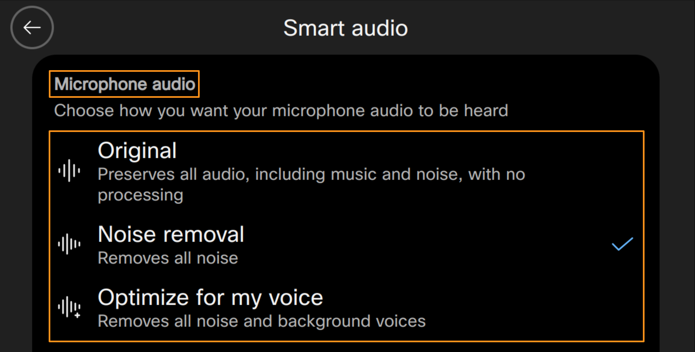
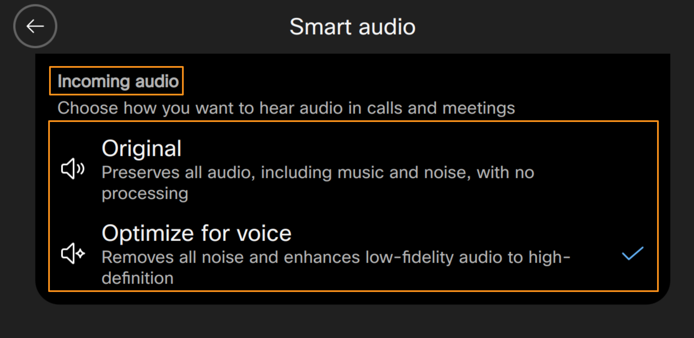
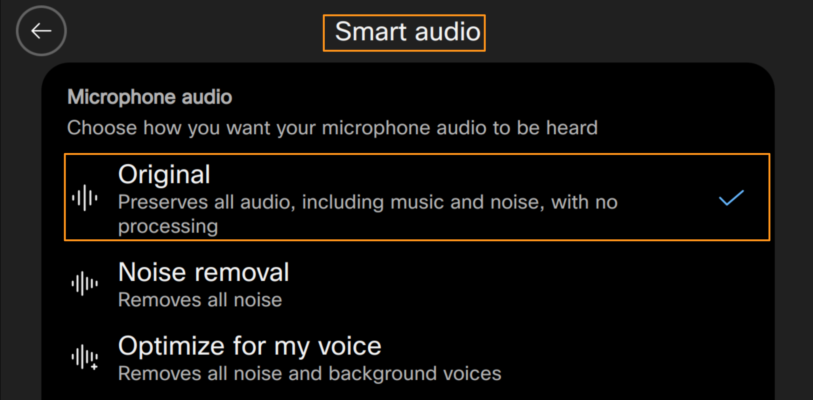
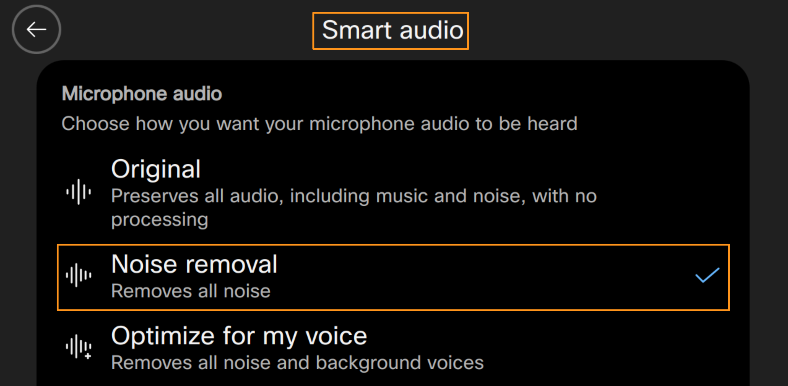
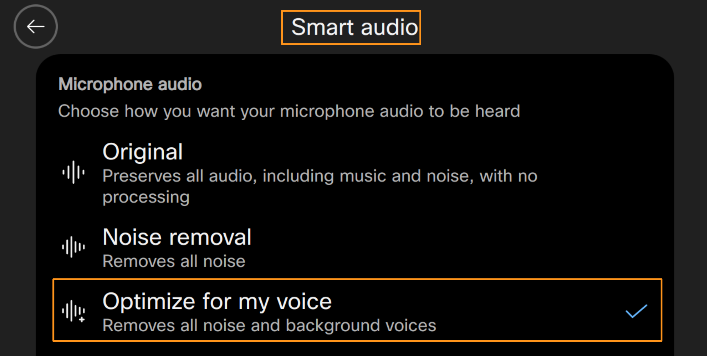
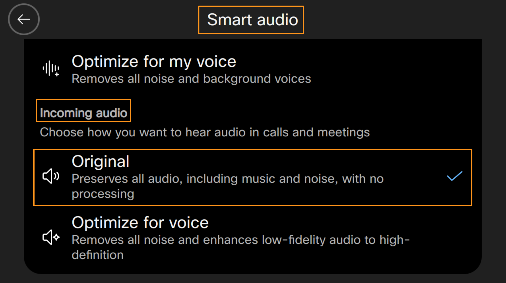
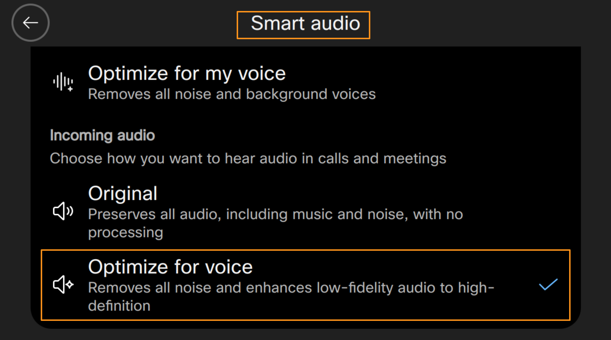

# Module 3a: AI Audio Intelligence on Cisco 9800 Phones

Cisco Desk Phone 9800 Series uses AI-powered audio intelligence to significantly improve call clarity by removing background noise on both outgoing and (on higher models – 9861 and 9871) incoming audio and enhancing narrowband audio into wideband for richer, more natural sound. This smart audio processing reduces distractions and makes conversations clearer even in noisy environments. Users can also adjust AI noise removal and voice-optimization settings directly on the phone for tailored audio quality. These capabilities help ensure clearer communication and a better overall voice experience on every call.

For Cisco 98XX phones, in Smart Audio settings, you will have the AI-powered audio intelligence options as follows:

Microphone audio:

There are 3 options to enhance the audio coming from the phone microphone (or what is heard by remote party).

1. Original: Preserves all audio, including background music or noise, with no processing. You may use if you want the other party to listen any specific sound that is created, such as music.

1. Noise removal: Removes all noise on the phone itself. This option is useful if you are in huddle room with multiple people attending the call on speaker but there may be noise coming from outside. This removes the noise created but everyone can be heard.

1. Optimize for my voice: Removes all noise and background voices. This is option useful if you are in an open office environment and you are attending a call. Phone can optimize the voice coming from the phone microphone ignoring other noise and voices captured by the microphone.

    

Incoming audio (only 9861 and 9871):

There are 2 options to enhance the incoming audio, particularly when you hear noise.

1. Original: Preserves all audio, including background music and noise, with no processing. You may use this option, if you want to listen to incoming audio as is, including background noise etc.,

1. Optimize for voice: Removes all noise and enhances low-fidelity audio to high-definition. You may use if you want to remove any background noise such as wind,  music, voices and increase the quality of the sound to Hi-Def.

Let's first explore AI-powered intelligence on audio coming from Cisco 9800 Microphone (or what is heard by remote party/called party).

1. On the Cisco 9800 phone navigate to go to Settings (Gear icon) > Smart Audio > Microphone audio
2. Select Original option (when you select, check mark will be displayed next to Original option).  Click Settings button again to exit the menu.

    

1. Now from your Cisco 9800 phone place a call to a mobile phone (it MUST US phone number).  If you do not have US phone number, reach out to one of the proctors.   They will share their phone number to call.

1. OR

1. You can team up with one of the attendees next to you.   Ask them to set option Settings (Gear icon) > Smart Audio > Incoming audio to Original  and call their Cisco 9800 phone number.

1. Answer the call on either mobile phone or other attendee Cisco 9800 phone.     Once the call is answered mute the microphone on mobile phone or Cisco 9800 phone (if you are using other attendee phone) .

1. Now, while talking on your Cisco 9800 phone (where you placed the call from) try to introduce/add some background noise like snapping with fingers or tapping the table etc.,  and listen on remote phone (either mobile phone or other Cisco 9800 phone).

1. Notice that you hear your voice and background noise (snapping or tapping table) both.

1. Now continuing on the call, on your phone go to Settings (Gear icon) > Smart Audio > Microphone audio and select the option Noise Removal

    

1. Try again talking on your Cisco 9800 phone and introduce/add some background noise like snapping with fingers or tapping the table etc.,  and listen on remote phone (either mobile phone or other attendee Cisco 9800 phone)

1. Notice that you will not hear any snapping/tapping table on remote phone like before.  Cisco 9800 phone uses AI-powered audio intelligence and removes that noise before sending the audio to remote party.

1. Similarly you can on your Cisco 9800 phone go to Settings (Gear icon) > Smart Audio > Microphone audio and select the option Optimize for my voice

1. Try again talking your Cisco 9800 phone but this while talking on the phone have a proctor or another attendee to say something (standing little away from microphone).

1. Notice that AI-powered audio intelligence optimizes audio for your voice (closest to the microphone) and remote party cannot (or only partially can) hear other person talking.

1. Once you have explored all three options hang up the call and thank your fellow attendee

Now, let's explore AI-powered audio intelligence on incoming audio (or the audio coming from remote party/called party).

1. On the Cisco 9800 phone navigate to Go to Settings (Gear icon) > Smart Audio > Incoming audio and select Original (when you select, check mark will be displayed next to Original option). Click Settings button again to exit the menu

    

1. Now, on your Cisco 9800 phone, dial the extension of pre -configured Auto Attendant 1234. Call will be connected and notice that you will hear the voice/audio with background noise sounds like an airport or crowded place.

!!! note
    NOTE: The audio with background noise is played using pre-configured Auto Attendant.  Once it’s played the full audio, there will be a brief silence and it will replay the audio again.  It will play the audio total three times.  If you do not want to wait for audio to resume after silence, you can just hang up the call and dial 1234 again.

1. While still on the call, navigate back to Go to Settings (Gear icon) > Smart Audio > Incoming Audio and select Optimize for voice.

    

1. Observe that the background noise is removed for incoming audio by AI-powered audio intelligence  and you can hear better compared to the Original option.  Try to switch between Original and Optimize for voice for couple times and observe difference in incoming audio.
