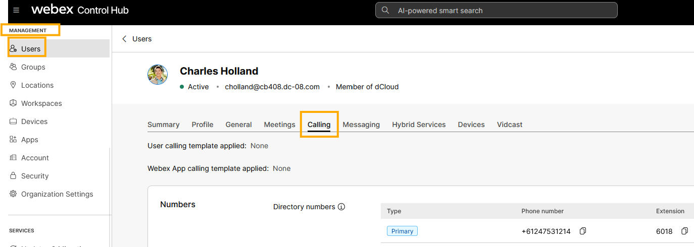
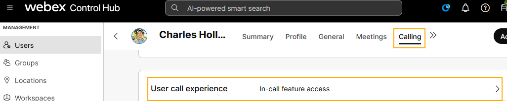
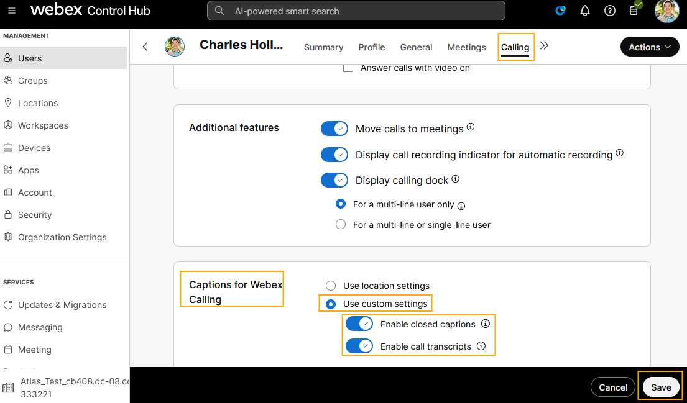
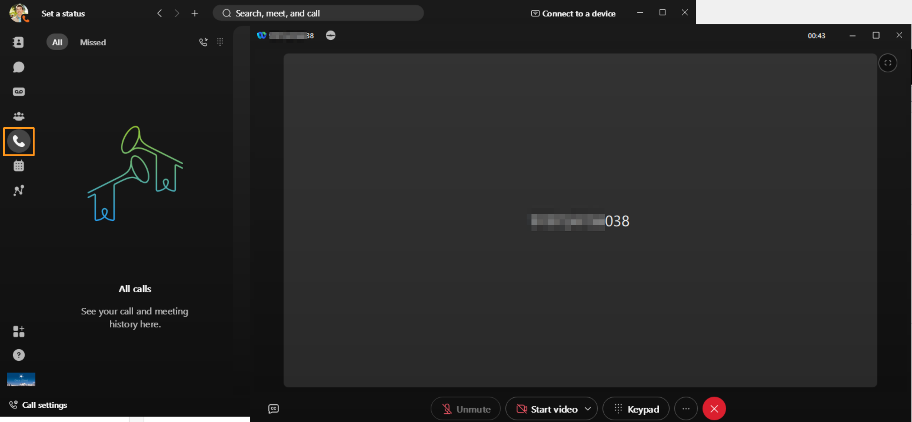

# Module 3b: AI-Generated Closed Captions and Call Transcriptions

Closed Captions (CC) display the spoken content as text during a live call. Call transcription converts spoken language into written text in real time, but it typically includes only the spoken words, not sounds or signals. It updates instantly as participants speak during the live call. Each user in a call can enable the call transcription independently, and it appears only for that user.

Closed captions and call transcription enhance accessibility and inclusivity for hard-of-hearing users during a live call. They also help users with diverse language proficiencies have more engaging and productive conversations.

Closed Captions and call transcriptions can be enabled at:

1. The user level,
2. The location level, and
3. at the organization level.

In this lab, we will enable CC and call transcription for the user Charles Holland in our Webex org. Proceed as follows.

1. Continuing on demo workstation (virtual workstation), and browser where you have logged  into Control Hub.
2. On Webex Control Hub page, navigate to MANAGEMENT > Users.  Select the user Charles Holland. On User page go to Calling tab.

    

1. On the Calling page navigate to User call experience > In-call feature access and scroll to the Captions for Webex Calling section at the bottom of the page

    

1. Select radio button for Use custom settings and toggle ON for both radio button Enable closed captions and Enable call transcripts options. Click Save.  Click Override on the pop-up window to confirm.

    

1. Now  minimize browser and all other applications on the Desktop and bring up the Webex.
2. Go to the Calling tab on the left side page and dial Cisco TAC number: +1 800 553 2447.

    

1. The call will be answered by an IVR.  If you hear the IVR message the call is successfully connected.  FYI, you do not need to make any selection on IVR.   Keep the call active and continue to the next module.  DO NOT hang up the call.
