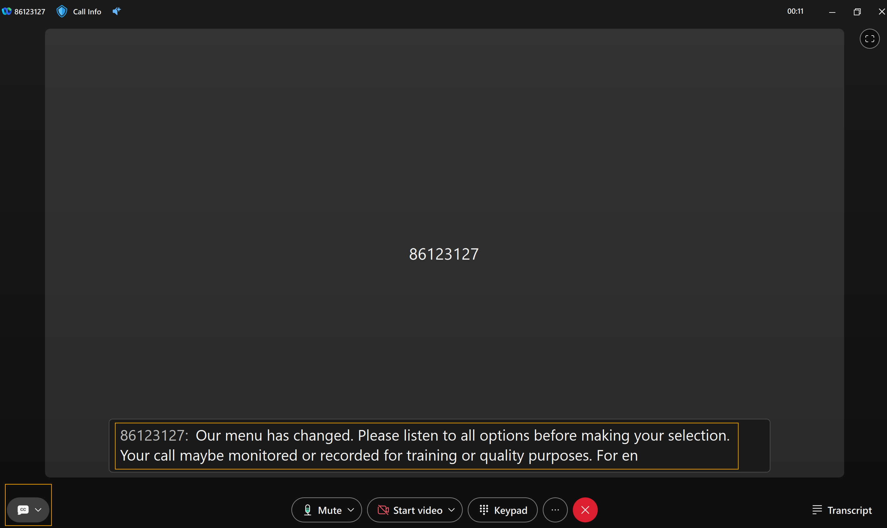
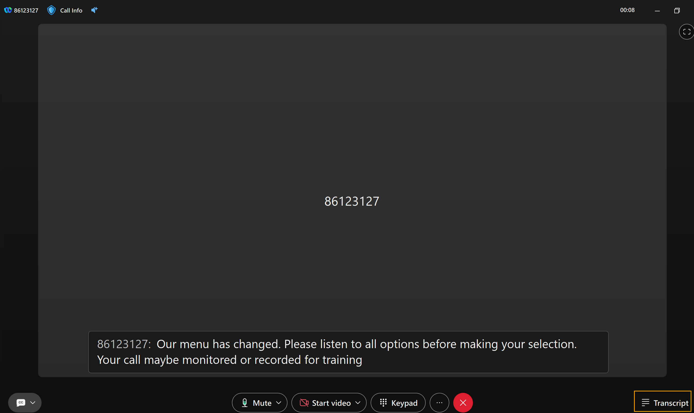
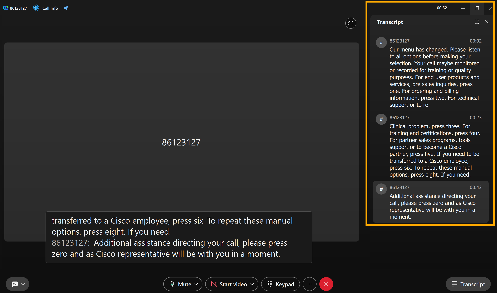

# Module 3c: Test Closed Captions and AI-Generated Call Transcription

1. Make sure the call to Cisco TAC is still active.  If it is disconnected, redial the number +18005532447.

1. Now on the call window, click on the Closed Caption [CC] (towards bottom left). Closed Captions will be displayed as shown below.

1. Now, click on the Transcript option (towards bottom right corner) on call window, as shown below.

1. You can see the AI generated transcript for the call.

