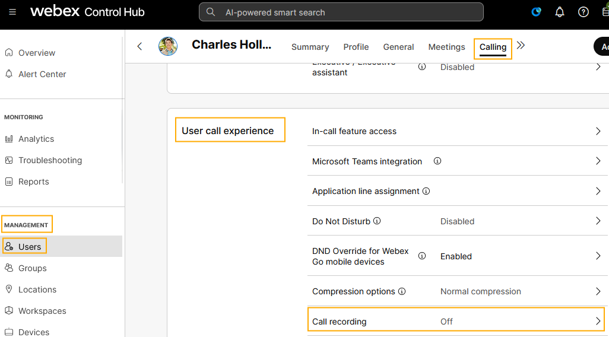
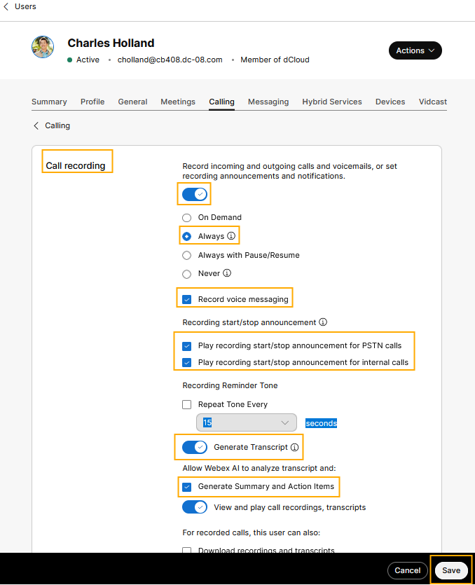
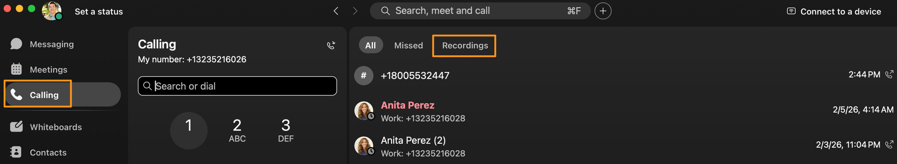
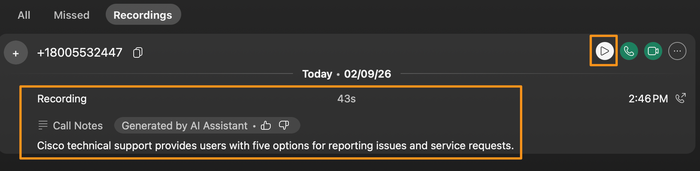
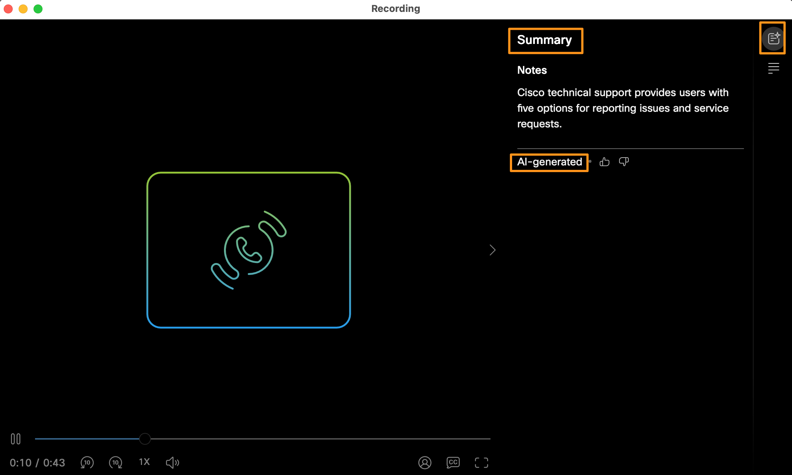
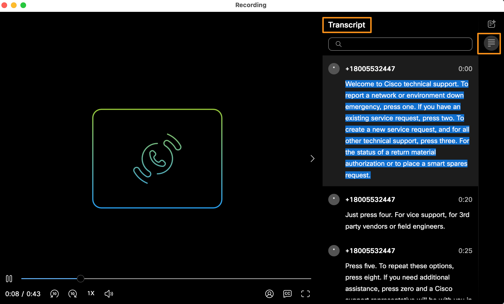

# Module 3d: AI-Generated Closed Captions and Call Transcriptions for Call Recordings

You can configure automatic transcription for recorded calls. Users can see the transcript in the player when they play the recording from Webex App or User Hub. Transcripts are currently available only for calls recorded by the Webex call recording provider and when the call is in English.

First, we will enable call recording at the user level, for the user Charles Holland in our organization.

1. Continuing on demo workstation (virtual workstation) and go to the browser where you have logged  into Control Hub.  On Control Hub page navigate to MANAGEMENT  > Users.  Select user Charles Holland, on user page go to Calling tab.  On Calling page scroll down to the section User Call Experience and select Call recording.

    

1. Turn ON call recording.  Once the recording is turned on,  it will give you options to set for your recordings.  Configure them as shown in below screenshot.  Click Save.

    

1. Now, minimize the browser and bring up Webex.
2. Dial Cisco TAC number again +18005532447 from Webex.  The call will be answered by IVR, keep the call active for 45 seconds to 1 minute and then hang up the call.   You will hear the call recording announcement as the call is being recorded.

1. Now, on Webex app go to Calling tab.  On Calling page go to Recordings tab.

    

1. On Recordings page, select the available recording.  Within few seconds it will populate the AI generated summary for the recording.  Once you have reviewed the summary click play button for the recording.

    

1. It will bring up a pop-up window to play the recording.  Observe two tabs/options on the right side of the pop-up window for AI Generated Summary and full transcript of the Recording.

