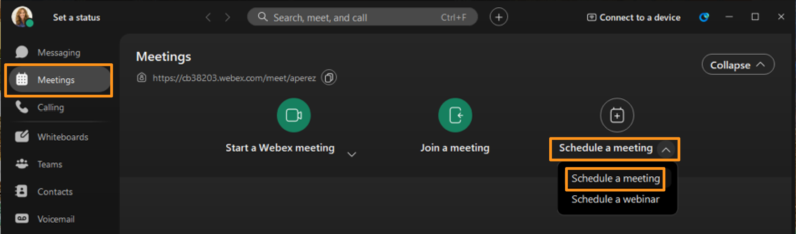
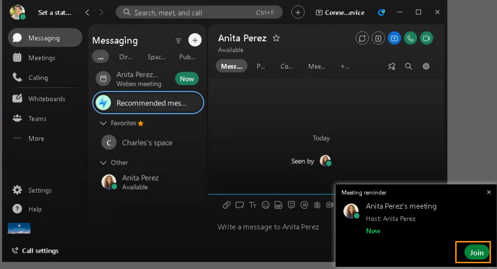
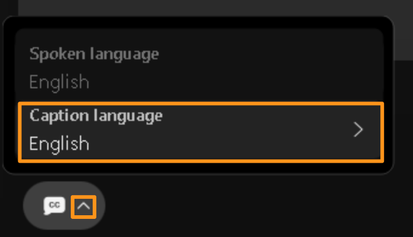
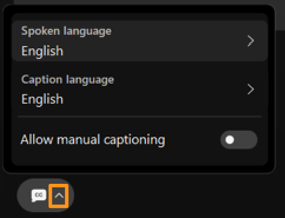
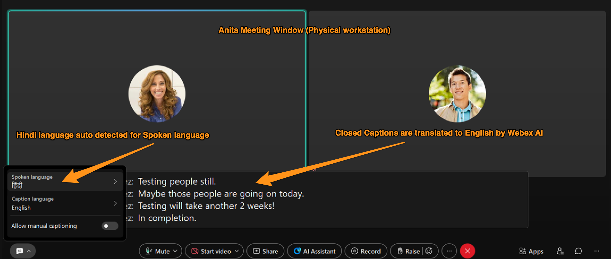
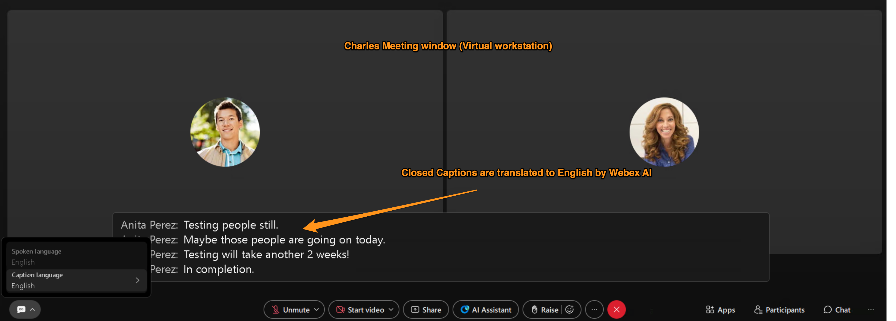
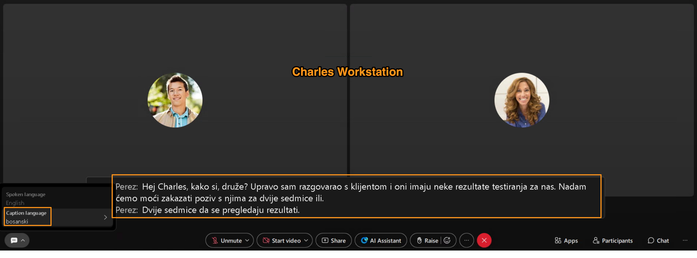
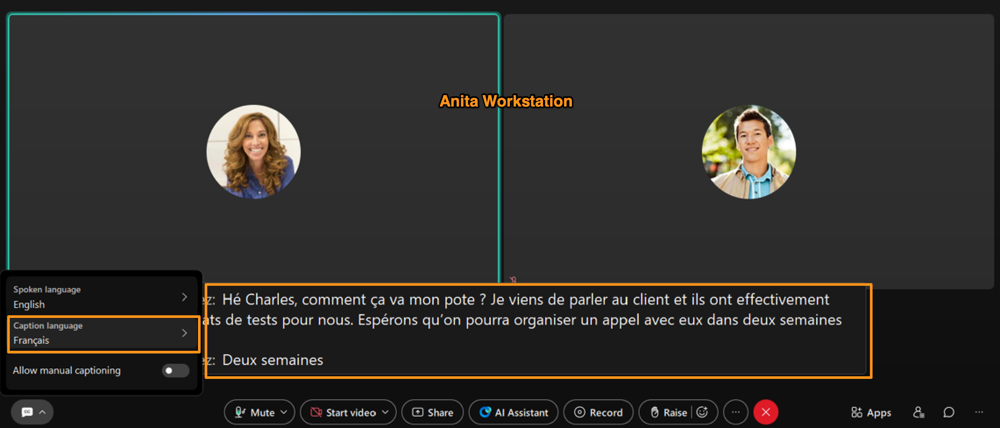

# Module 4a: Language Detection, Closed Captions and Real-Time Translation

In Webex Meetings, powered by AI, Webex can automatically detect the language being spoken, so you don’t have to set or guess it yourself. Once the speech is recognized, real-time closed captions appear on screen, helping everyone follow along—even if the audio is unclear or there’s background noise. For meetings with participants speaking different languages, Webex AI can instantly translate what’s being said, allowing everyone to see the conversation in a language they understand. This makes communication smooth, inclusive, and effortless, no matter where participants are in the world.

1. On your attendee workstation (physical workstation) bring up Webex.  Should be already logged in as Anita Perez.

1. On Webex, go to Meeting tab on left side.  On meetings page drop down Schedule a meeting and choose Schedule a meeting again.

It will bring Webex meeting scheduler, on the right side under Invitees search for Charles Holland and add to list of Invitees.  Adjust the meeting time and timezones to your local current time to match with phones, so you can start/join the meeting right away.  Leave rest of the fields blank and click Schedule.

1. Meeting will be scheduled and there will be meeting reminder (notification) to start the meeting on attendee workstation  (physical workstation), click Start on the reminder to start the meeting. It will launch the meeting window, click Start meeting.

1. Observe that meeting pop-up (OBTJ – One Button to Join) appears on Charles Holland workstation (virtual workstation) too.  Click Join.

1. Ignore the warning about microphone on virtual workstation.  Click Join meeting on meeting window.
2. On both meeting window click Closed Captions []  (towards bottom left) on both meeting windows (from Anita, physical workstation and Charles, virtual workstation) to display Closed Captions.

    

3. Once Closed Captions are enabled on both workstations, go to Charles workstation (virtual workstation) and click on drop down arrow, next to  and observe that it gives options for Spoken language and Caption language.  Make sure Caption language is selected as English.

    

    

1. Go to Anita meeting window (physical workstation) click on drop down arrow, next to Closed Captions icon [],  to see the current Spoken language and Caption language.  DO NOT change any settings on Anita workstation (physical workstation)

    

    

1. Now, on Anita meeting window start talking few sentences in different language (could be French or German or Hindi etc.,).  Once you talked around 3 to 5 sentences, notice that Webex AI will auto detect the Spoken language and update it on Anita workstation under .  Also as the Caption language is chosen as English, Webex AI will translate them to English and display on both workstations.

    

    

    

Also, if Webex AI is taking long to detect the spoken language, could be due to back ground noise or you are in a crowded environment etc., you can drop down the Spoke language and Caption language options and select the language manually from supported list of languages.  For the up to date supported languages refer to below URL.

https://help.webex.com/en-us/article/nqzpeei/Show-real-time-translation-and-transcription-in-meetings-and-webinars#Cisco_Reference.dita_8daebbd0-c640-44f8-bacc-4e4b26ce19fa

1. On Charles meeting window (virtual workstation) drop down option for Caption language and set it to one of the available languages.

1. On Anita meeting window (Physical workstation), manually set the Spoken language to English (or any other language).   Change the Caption language to French (or any other language).    Once you have set the desired languages, start talking in English on Anita workstation (Physical workstation).

1. Notice that both workstations display captions in selected Caption language.

    

    

1. If interested to explore further, you can choose to select any set of different languages and observe that Webex AI will auto detect Spoken language (or you can set it manually) and translate it to desired/chosen Caption language.

1. Keep the meeting running and proceed to next module.
