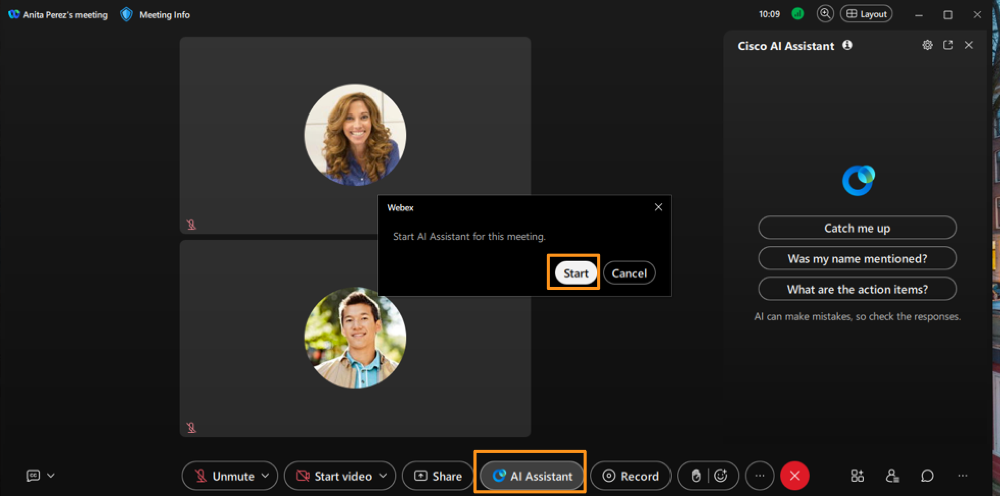
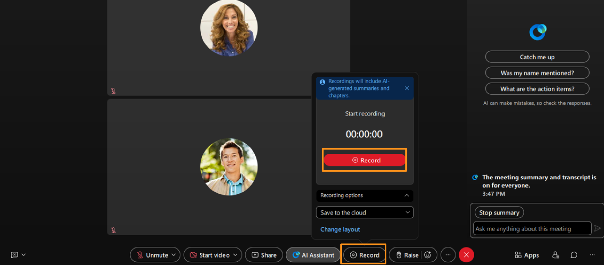
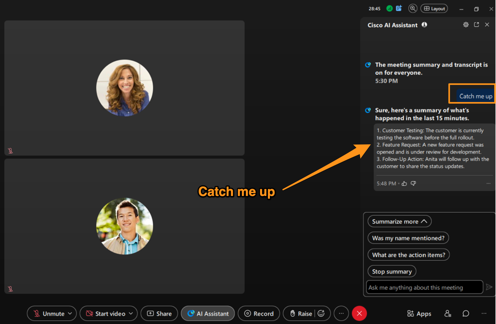
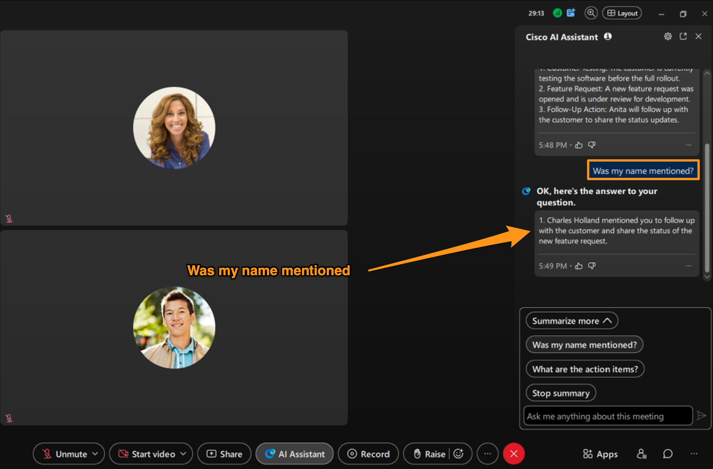
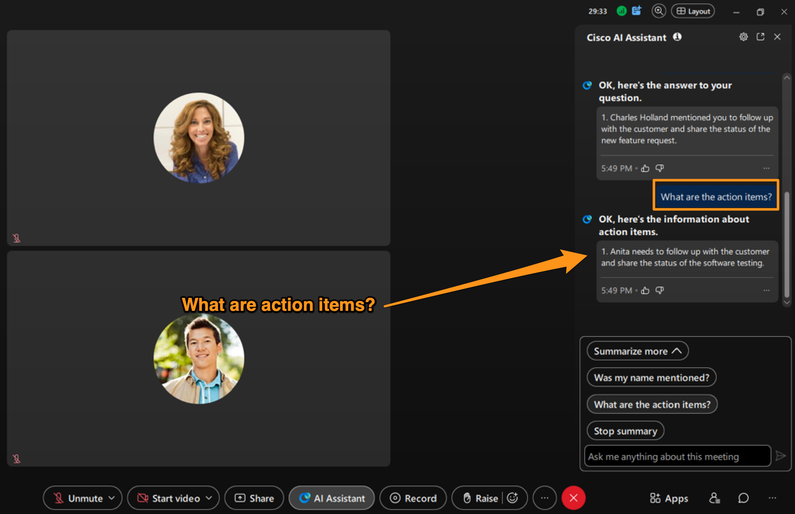
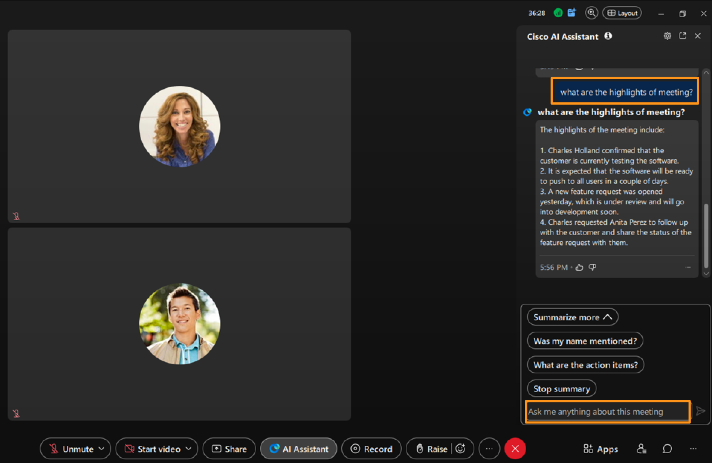
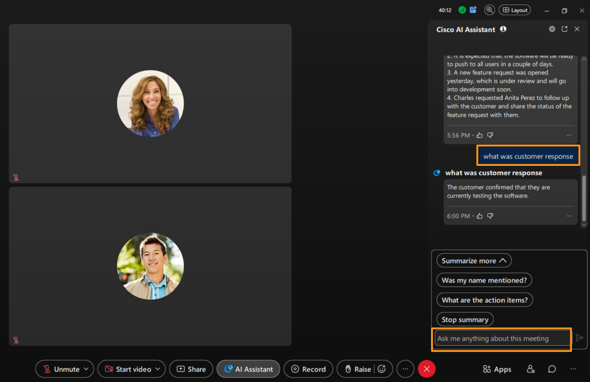
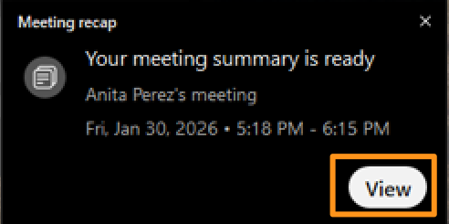
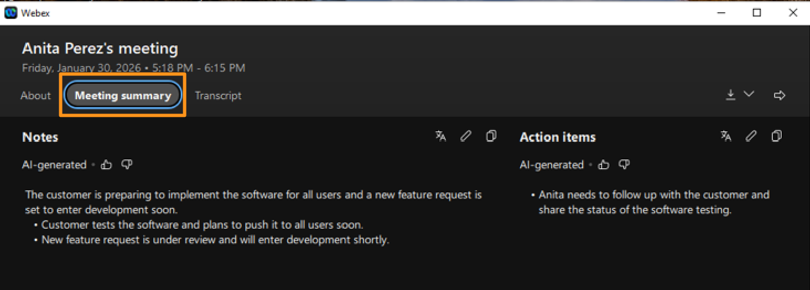
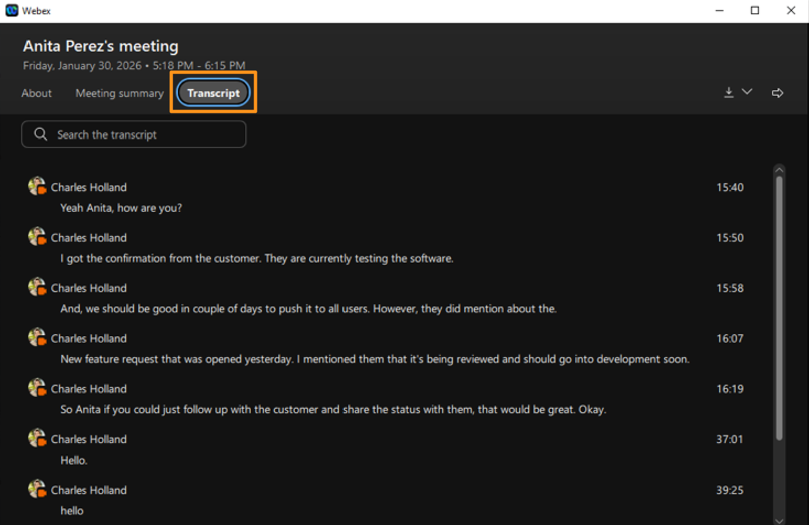

# Module 4b: Webex AI Assistant in Webex Meetings

Now, let's add/enable Webex AI Assistant to this meeting and see how it helps to automatically capture meeting highlights, action items, and summaries to help participants stay aligned without manual note-taking. During the meeting, the AI Assistant identifies key discussion points and important moments, even if users join late. After the meeting, it generates a concise summary that outlines what was discussed and the overall context. Action items are clearly extracted so teams know what needs to be done next. In the backend, the Webex AI Assistant uses cloud-based speech-to-text and large language models to listen to meeting audio, understand conversational context, and intelligently extract decisions, tasks, and key moments—turning live conversations into structured meeting notes.

1. Make sure that meeting from previous module is still running.
2. Go to your Cisco 9800 phone and observe that meeting pop-up (OBTJ – One Button to Join) appearing to join the meeting from Cisco 9800 phone. Click Join to join the meeting.

!!! note
    NOTE: If you do not see the OBTJ button as shown above, you can go to Calendar icon on Cisco 9800 phone and select available meeting to join.

1. Once Cisco 9800 phone joined the meeting, on attendee workstation (physical workstation) meeting window, click AI Assistant. It will bring up a pop-up window to start AI Assistant for this meeting.  Click Start.  It will play a recording saying this meeting is being transcribed and summarized.

    

3. It will start AI Assistant for this meeting and plays a recording saying this meeting is being transcribed and summarized.
4. Now, click Record button on meeting window, to start recording of this meeting.  It will bring up a pop-up window with available options for recording, leave all defaults and click Record again on po-up window.

    

6. We will use this meeting recording in the next module, for now make sure you have turned on recording and continue with current module.
7. Go to your Cisco 9800 phone and start talking something and mention Anita Perez name and some action items, like Anita we need to push the software release deadline, or Anita send follow up email to customer or Anita we need to check on shipment delivery etc.,
8. Now, go to Attendee workstation (physical workstation) and current meeting window and explore any of the AI Assistant options available:  Catch me up or Was my name mentioned? Or What are the action items?

    

    

1. You can also ask anything about this meeting like what are highlights? Or how was customer response etc.,  On the current meeting window type what you want to ask (in Ask me anything about this meeting window).  AI assistant will answer your meeting depending upon information available from this meeting summary.

    

    

4. You can explore and ask more questions about meeting and when done, end the meeting for all.  To end the meeting go to Anita meeting window (attendee workstation) and click [] and select End meeting for all.

    

5. Once the meeting is ended, within a minute or two on attendee workstation (physical workstation) you will see a pop-up window saying meeting summary is ready.  Click View.

    

1. It will bring up Webex meeting summary and transcript as shown below.

    

    

