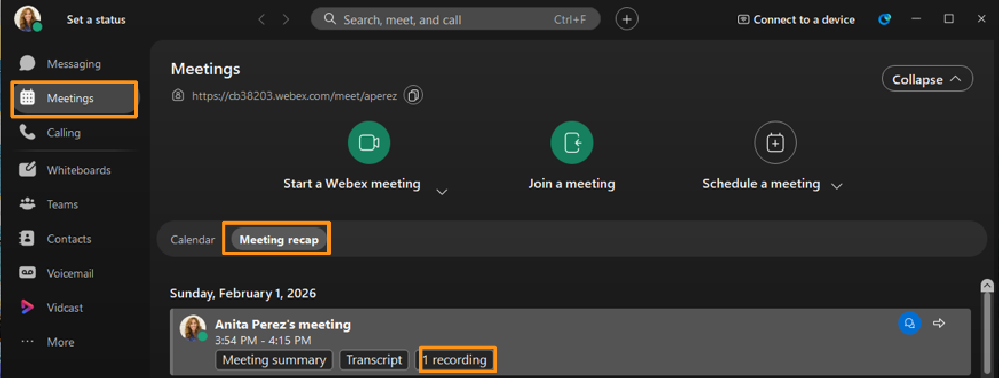
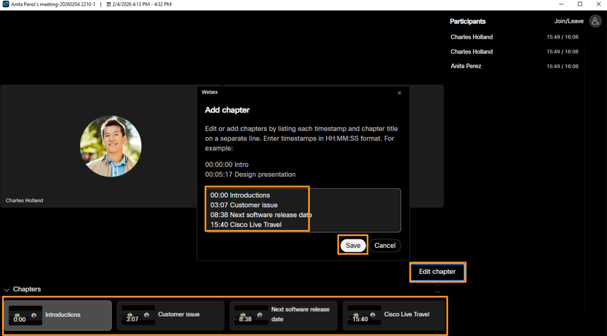
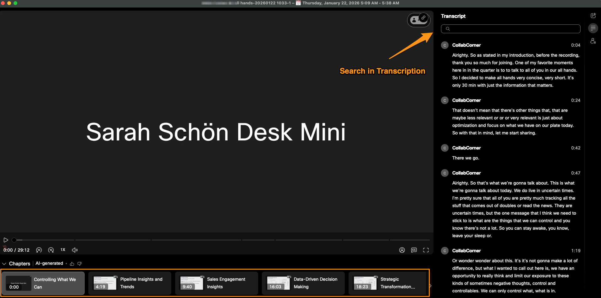

# Module 4c: AI Intelligence in Webex Recordings

When a Webex meeting is recorded along with AI assistant enabled,  AI will go through meeting recording (after the meeting is ended) and will create the following:

Automatic transcription and captions: AI converts recorded audio into accurate, time-synced text with speaker identification and language detection.

Searchable and navigable recordings: Transcripts are indexed so users can search keywords and jump directly to relevant moments in the recording.

Intelligent meeting insights: With Webex AI Assistant enabled, AI analyzes the transcript to generate summaries, highlights, action items, and chapters.

Improved accessibility and audio quality: AI enhances recorded audio clarity and provides captions, making recordings easier to consume for all users.

!!! note
    NOTE: After meeting has been ended, Meeting Summary and Transcript for meeting are populated relatively quickly (with in 2 or 3 minutes), however Meeting Recording and Chapters take longer time  (up to one hour) to populate depending upon the load in cloud.    Also to generate constructive chapters to a meeting, the meeting has to be long enough and should have multiple different topics and multiple people in meeting.  So in this lab you may not be able to generate chapters live.  Below are some screen shots of some meeting recordings for your reference.

1. Continuing on attendee workstation (physical workstation) as Anita, on Webex go to Meetings > Meeting recap.

    

3. You will find your recorded meeting.  Notice that meeting will have Meeting summary, Transcript (that we saw in last module) and a now a recording.

1. Click the recording and open it.  You will probably NOT see chapters created for your recording.  However, notice that you (as meeting host) can also manually create chapters or edit/modify existing chapters.

    

1. If the meeting was long enough and had different topics being discussed for long enough, AI will create the chapters as shown below.  Below screenshot is not from the lab, its reference purpose only.

1. This completes the module AI-Powered Webex Meetings.
