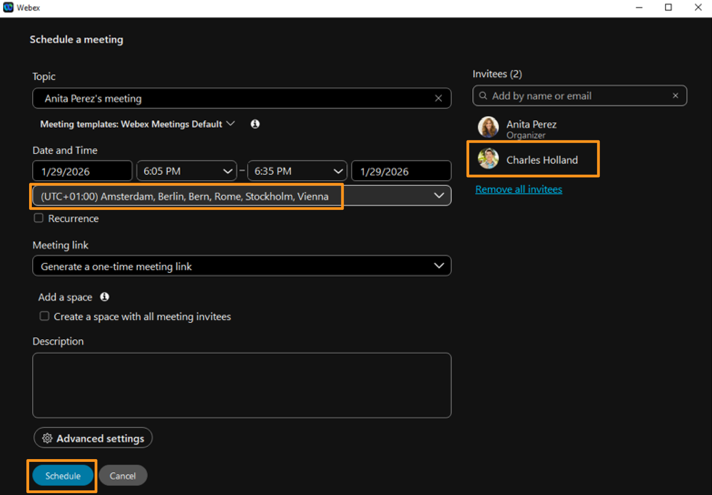
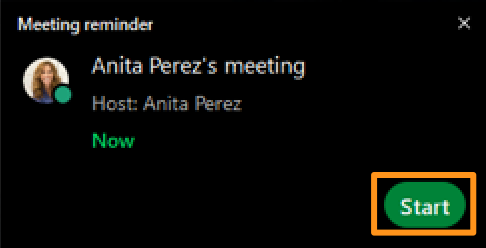
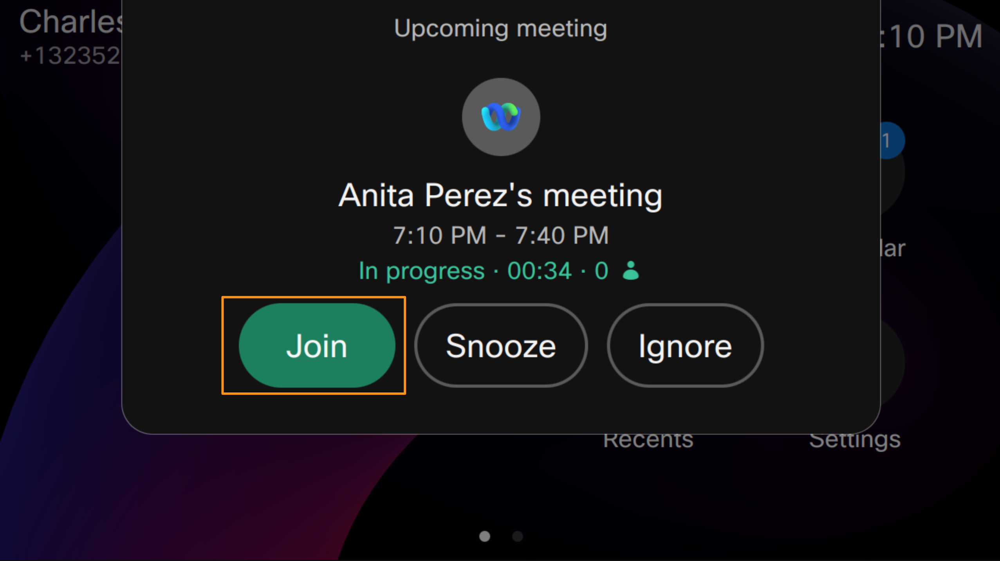
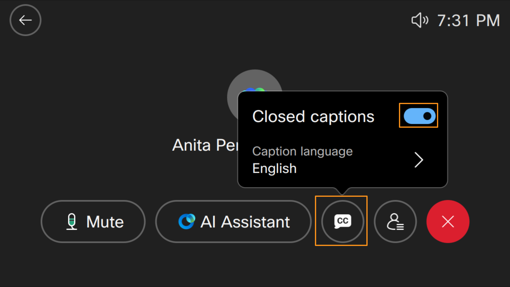
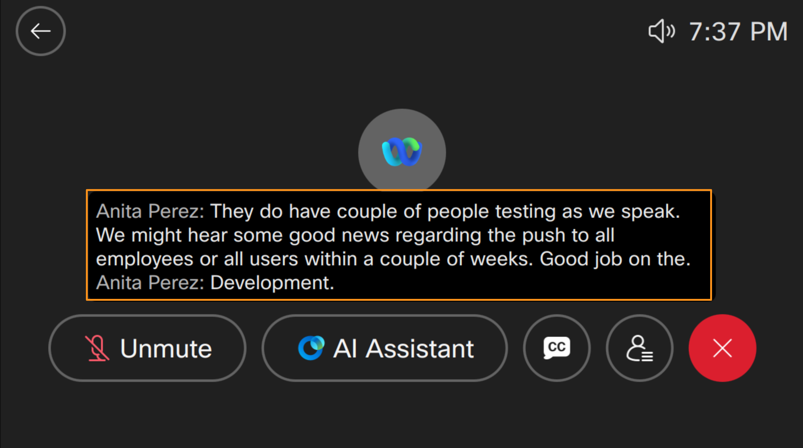
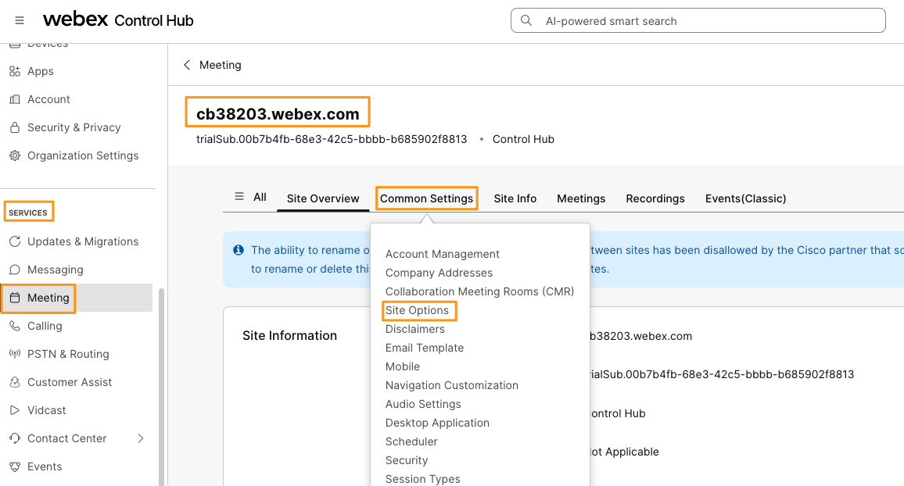
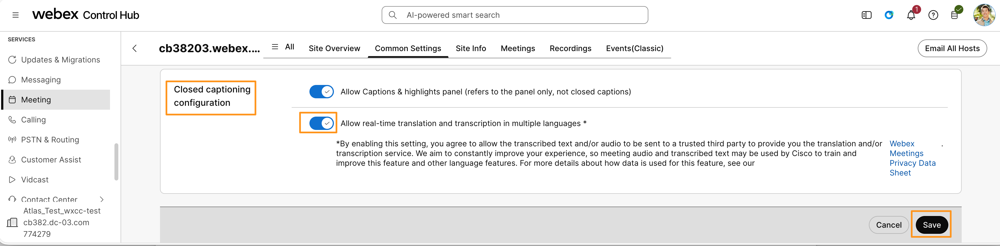
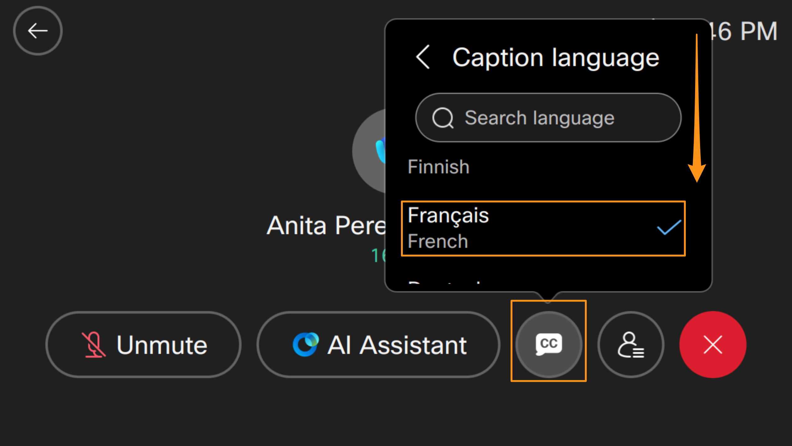
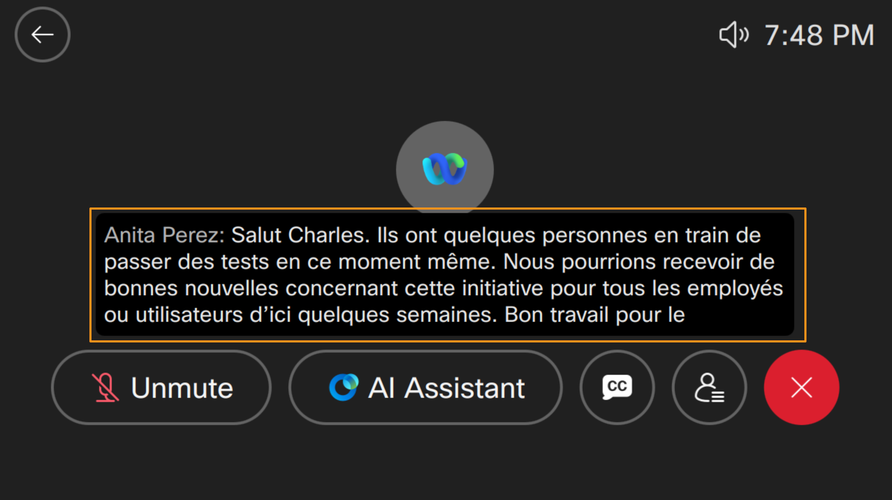

# Module 4d: Live Closed Captions on Cisco 9800 Phone

Live Closed Captions:

Cisco’s 9800 Series phones (e.g., 9861/9871) use AI-powered cloud services to deliver live closed captions by sending the audio from a hybrid meeting (involving cloud and/or traditional calling or on-prem UC applications like Cisco Unified Communications Manager) to Cisco’s Webex speech-to-text engine, which transcribes spoken words into text in real time. When captions are enabled on the phone, that live transcript is displayed on the phone’s screen above the softkeys, making meetings and calls more accessible and inclusive. The transcription leverages Language AI/LLM infrastructure in the Webex backend rather than doing full speech-to-text processing on the phone itself, ensuring up-to-date language models and quality. Users can also choose caption languages, and the system can provide translations where supported in meetings. This feature enhances clarity for participants who are deaf or hard of hearing, or for anyone who benefits from reading what’s spoken during a session.

As a participant in a Webex hybrid meeting, you can choose to show or hide the real-time translation and transcription on the phone screen by simply pressing the softkey Captions or tapping the soft button Closed captions  (depending on your phone model).

When enabled, the closed captions will display just above the softkeys or soft buttons.

Let's explore how AI-Powered Live Closed Captions work on Cisco 9800 phone.

1. On your attendee workstation (physical workstation) bring up Webex.

1. Should be already logged in as Anita Perez.

1. On Webex, go to Meeting tab on left side.  On meetings page drop down Schedule a meeting and choose Schedule a meeting again.

It will bring Webex meeting scheduler, on the right side under Invitees search for Charles Holland and add to list of Invitees.  Adjust the meeting time and timezones to your local current time to match with phones and start the meeting right away.  Leave rest of the fields blank and click Schedule.

1. Meeting will be scheduled and there will be meeting reminder (notification) to start the meeting on attendee workstation  (physical workstation), click Start on the reminder to start the meeting. It will launch the meeting window, click Start meeting.  Ignore any warnings about microphone on workstation.

1. Observe that meeting pop-up (OBTJ – One Button to Join) appears on both of your Cisco 9800 phone. Click Join to join the meeting from both of the devices.

Once both users Anita Perez (Attendee workstation) and Charles Holland (Cisco 9800 phone) joined the meeting , click Closed Captions [] softkey on your Cisco 9800 phone.  It will open a pop-up window.  Toggle on the option for Closed captions.   Once the toggle is on, click anywhere  on phone screen to close the pop-up window.  Mute microphone on Cisco 9800 phone.

Now, on the attendee workstation (p start talking something and notice on the phone that it generates AI-Powered Live Closed Captions on Cisco 9800 phone.

Once you have verified the closed captions, end the meeting for all participants from attendee workstation (physical workstation).

By default AI-Powered Live Closed Captions are generated in English.  However you can also configure to generate these closed captions in different supported languages.

!!! note
    NOTE: Below is the URL that lists all supported languages for AI-Powered Live Closed Captions  translation.  https://help.webex.com/en-us/article/6aoom1/Use-closed-captions-in-phone-calls-and-Webex-meetings-on-9800/8875-(WebexCalling)?utm_source=chatgpt.com

Go back to demo workstation (virtual workstation) and browser tab where you have logged into Webex Control Hub.  On the left side navigation pane, navigate to SERVICES > Meetings.  On the meetings page select the available meeting site it will be in the format of cbXXXYY.webex.com

On the meeting site (cbXXXYY.webex.com) page drop down the option Common Settings and choose Site Options.

On Site Options page scroll down to  Closed captioning configuration section (towards bottom of the page).  Toggle on the button for Allow real-time translation and transcription in multiple languages.  Click Save.

Wait for two minutes for the real-time translation to be enabled in the backend.  Schedule another meeting from Attendee workstation (Physical workstation) as Anita Perez and join the new meeting from Attendee workstation and Cisco 9800 phone. (steps 3 through 6 in this module)

Once both users Anita Perez (Attendee workstation) and Charles Holland (Cisco 9800 phone) joined the meeting, click Closed Captions softkey on your Cisco 9800 phone notice we have English as the default language (shows check mark next to English).

You can now choose to select any other language (Example: French) from the available list.  Scroll down to see all available languages. Once language is selected (shows check mark next to it), click anywhere on phone screen to close the pop-up window.

Now try saying something (in English) on attendee workstation (physical workstation) again and observe that the closed captions are now translated to the language you have selected (in this example French).

Feel free to select different languages and explore AI-Powered Live Closed Captions  translation.

Keep the meeting active for the next module.
