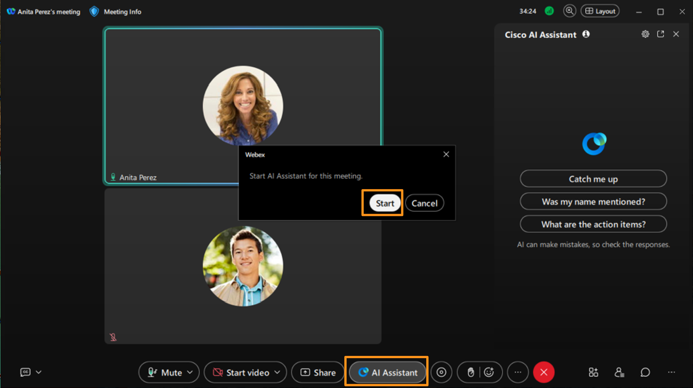
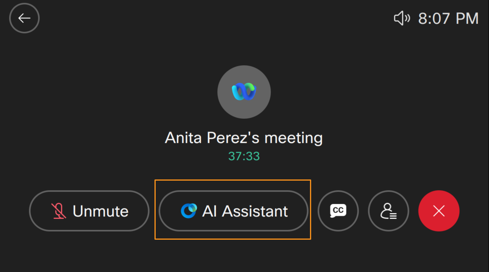
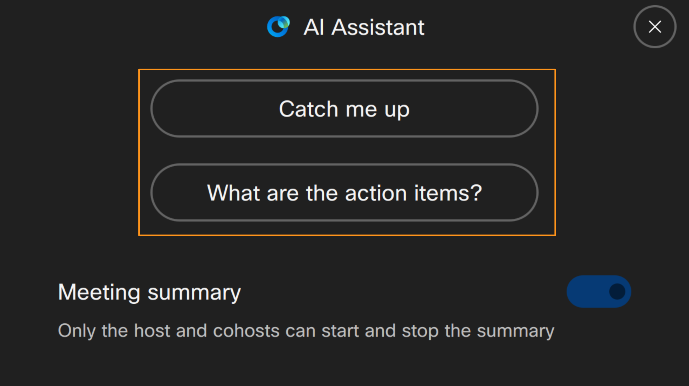
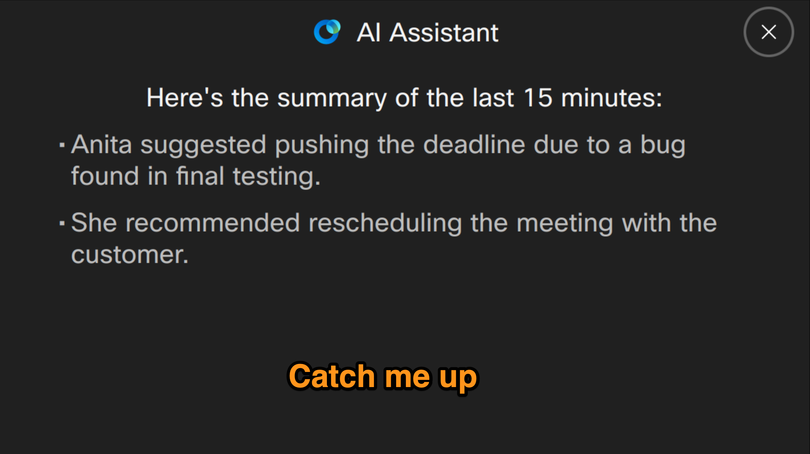
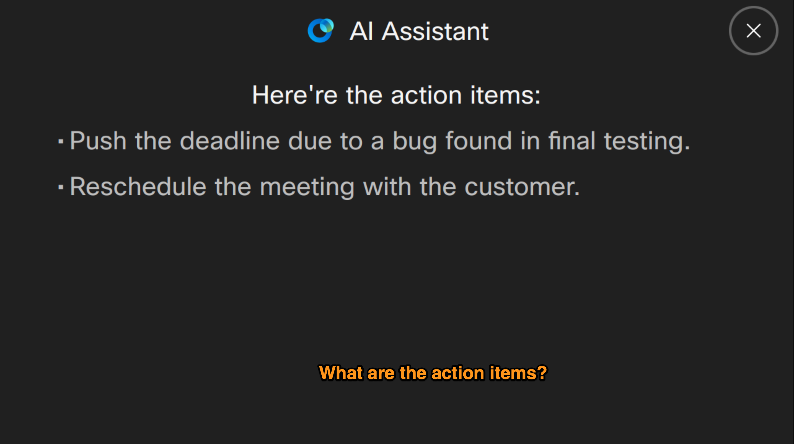

# Module 4e: Webex AI Assistant on Cisco 9800 Phone

Webex AI Assistant

On Cisco 9800 phones, the Webex AI Assistant helps during meetings by bringing cloud-based intelligence to a traditional desk phone experience.  Webex AI Assistant supports meeting summaries, highlights, and action items (viewable after the meeting in Webex), ensuring users don’t miss key points even if they join late or only dial in. Overall, the AI Assistant turns the 9800 phone into a smarter meeting endpoint without running heavy AI processing locally on the device.

Now let's explore Webex AI Assistant in Webex Meetings:

Continuing on attendee workstation (physical workstation), click AI Assistant on the current meeting window.  It will bring up a pop-up window for Webex AI Assistant.  Click Start.  Webex will play a message saying this meeting will be transcribed and summarized.

Now on attendee workstation (physical workstation) start talking again and possibly mention few actions items like push deadline or follow up with customer or check QA timelines etc.,

Go to the Cisco 9800 phone and click AI Assistant softkey.   It will bring up AI Assistant options choose either Catch me up or What are the action items.

It takes few seconds to generate either summary of last few minutes (Catch me up) or action items that are mentioned (What are the action items?) and displays them shown below.

1. End the meeting for all participants from attendee workstation (physical workstation).
