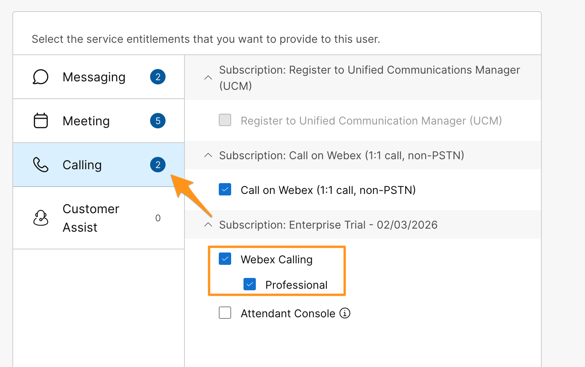
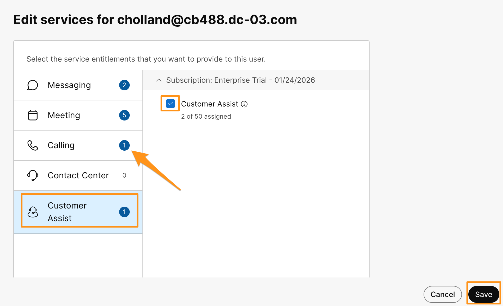

# Module 5a: Customer Assist License Assignment

Webex Calling Customer Assist is designed to provide significant contact center capabilities such as queue management, screen pop, analytics, reports, and so on. You can easily elevate your Webex Calling Call Queue to Customer Assist while maintaining the existing settings. Agents and supervisors can access the features directly from their Webex App.

For this module need to assign a Customer Assist license to users Charles Holland and Anita Perez, remember that Customer Assist license already includes a Webex Calling Professional license, so users do not need both of them.  So, let's assign Customer Assist license and unassign Webex Calling Professional license.

1. Continuing on demo workstation (virtual workstation) go to browser tab where you have logged into Webex Control Hub browser.  On Webex Control Hub, navigate to MANAGEMENT > Users then select the Charles Holland user.

1. On Charles Holland page, scroll down on Summary tab to Licenses section and click Edit Licenses.

1. It will bring up Edit services for cholland@cbXXX.dc-YY.com page, click Edit Licenses again.  Notice that currently Webex Calling Professional license is assigned.

    

Now go to Customer Assist tab and check mark Customer Assist to assign license. Notice that as soon as you check mark Customer Assist license, it automatically unassigns Webex Calling license as it is already included in Customer Assist.   Click Save.  Click Close.

Now, repeat above steps (1 through 4) and assign Customer Assist license to Anita Perez as well.
