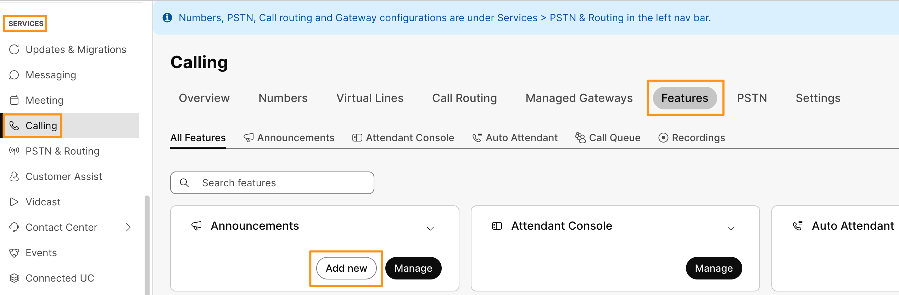
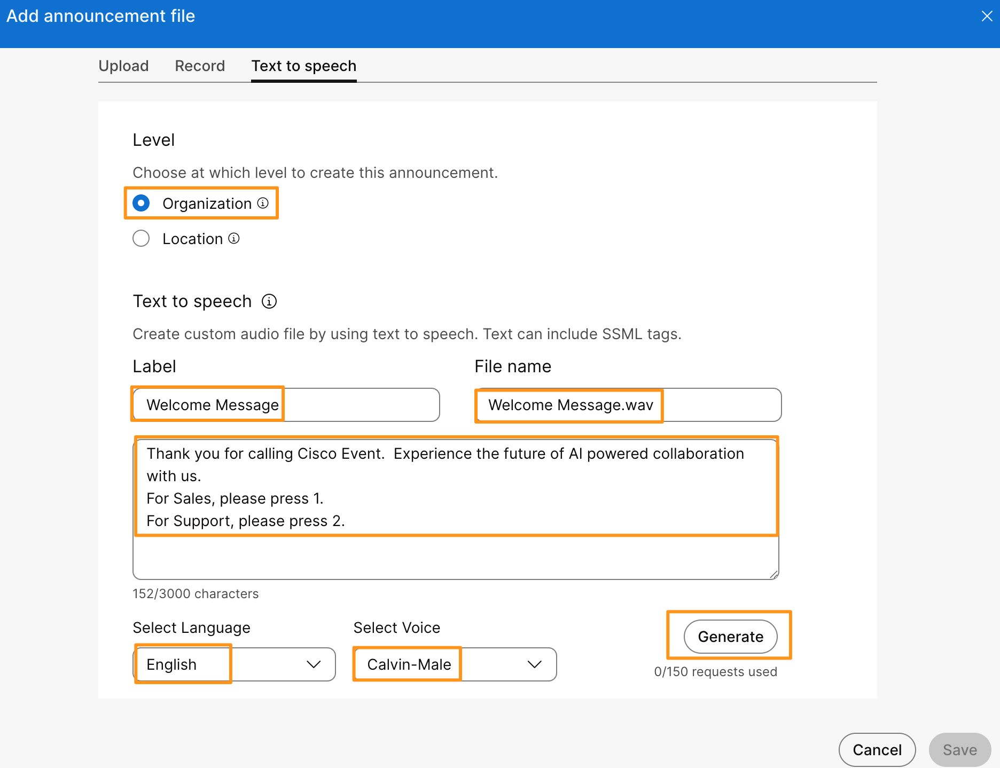
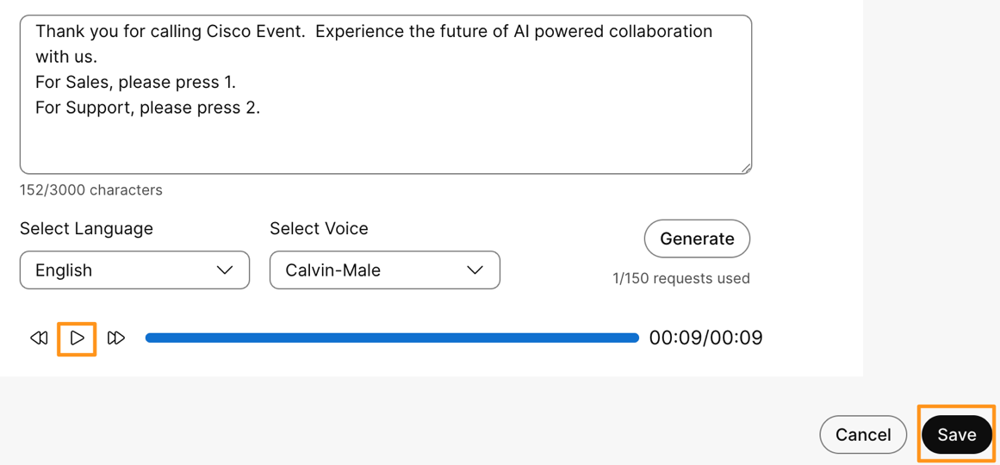

# Module 5b: Create Announcements with Text-to-Speech Capabilities

Text to Speech (TTS) support in the Webex Calling Announcement Repository streamlines the creation and management of audio announcements by allowing users to generate spoken messages directly from written text. With this feature, you can easily manage and update TTS announcements in a centralized location, ensuring dynamic control over all announcements that use the Announcement Repository. TTS also enables seamless integration across supported features, rich customization through SSML tags for expressive and natural-sounding speech, and offers multiple voice and gender options to suit your business needs. Powered by AI, TTS in Webex Calling transforms written content into professional audio for IVR, greetings, and call flows, enhancing both flexibility and efficiency in communication.

Continuing on demo workstation (virtual workstation), go to browser tab where you have logged into Webex Control Hub.  On Webex Control Hub navigate to SERVICES > Calling and on Calling page go to Features.  Click Add new for Announcements.

1. It will bring up a page to add new announcement.  Go to Text to speech tab.  Populate the following details and click Generate.

1. Level: Organization
2. Text to speech > Label: Welcome Message
3. Text to speech > File name: Welcome Message.wav
4. Text to speech > text:   Thank you for calling Cisco Event. Experience the future of AI powered collaboration with us. For Sales, please press 1. For Support, please press 2.
5. Text to speech > Select Language : English (default)
6. Text to speech > Select Voice: Calvin-Male (default)

1. It will take few seconds to generate the prompt.  Wait for the prompt to be generated. Once the prompt is generated you can play the prompt to listen and verify.  Click Save.

    

