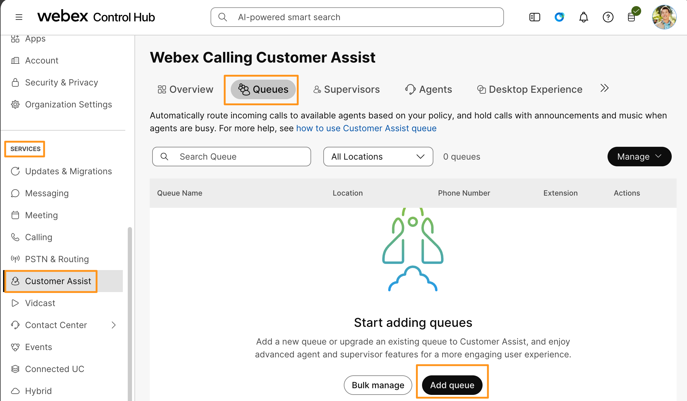
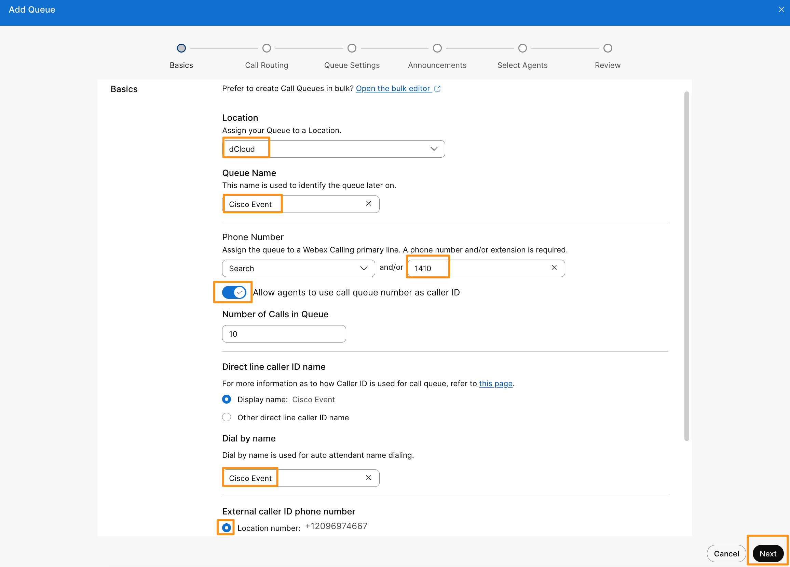
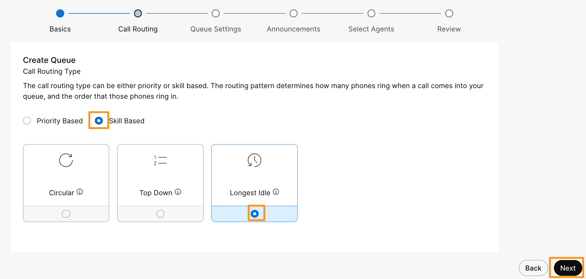
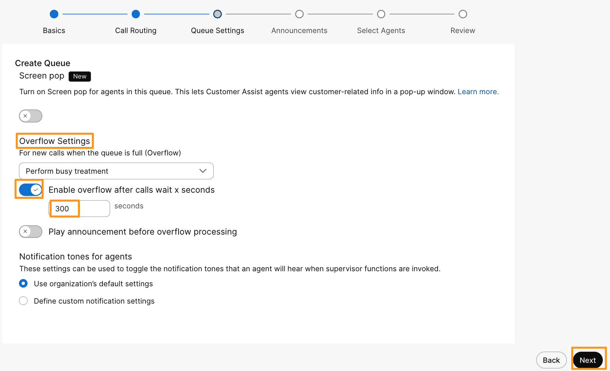
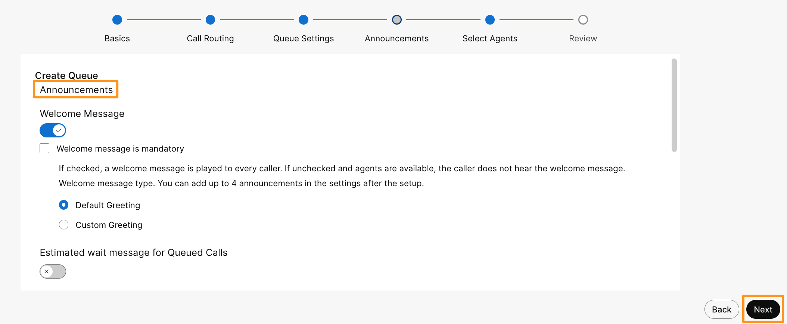
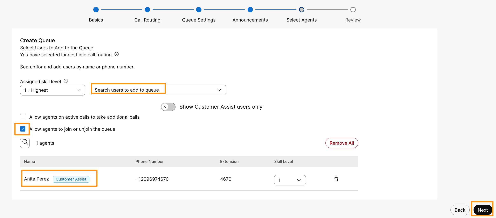
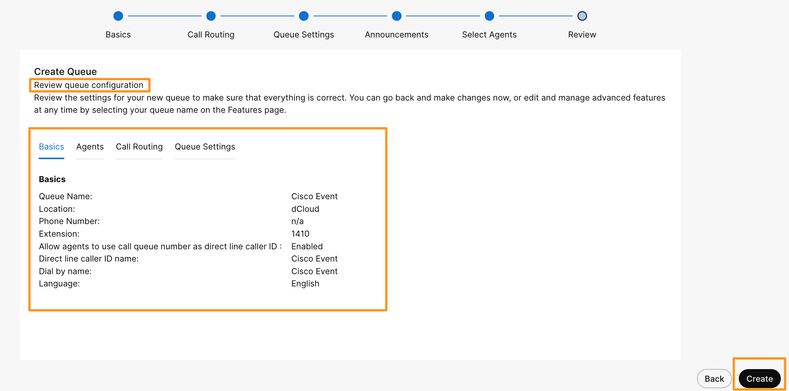

# Module 5c: Customer Assist Queue Configuration

Webex Calling Customer Assist is an AI-powered, calling-focused solution integrated within the Webex App designed to empower employees to deliver exceptional customer service. It provides features such as real-time caller intent summaries, suggested responses based on organizational knowledge bases, screen pops with relevant customer information, and real-time queue monitoring. The solution enhances agent productivity with tools like wrap-up reasons, agent availability management, and supervisor capabilities including agent monitoring, call sentiment analysis (coming soon), and historical queue analytics. It targets local and regional branch offices and knowledge workers who handle inbound customer interactions without dedicated contact center resources. Webex Calling Customer Assist is delivered as a cloud solution including a Webex Calling Professional License and is available globally. It supports voice interactions currently. The solution aims to simplify customer engagement, improve first-call resolution, and provide supervisors with actionable insights to optimize call handling and customer experience.

Key features include:

1. AI-driven caller intent and suggested responses to assist agents (coming soon).
2. Real-time queue and agent status monitoring.
3. Screen pops with caller information for more productive calls.
4. Wrap-up codes for post-call categorization.
5. Supervisor tools for monitoring, coaching, and analytics.
6. Webex Calling Professional License included in Customer Assist License.

This solution is ideal for organizations seeking to enhance customer service at frontline locations without the complexity and cost of full contact center solutions.

Continuing on demo workstation (virtual workstation), go to browser tab where you have logged into Webex Control Hub.  On Webex Control Hub navigate to Customer Assist > SERVICES.

On the Webex Calling Customer Assist page, go to Queues and click Add queue.

It will bring up Add Queue page, populate the following information and click Next.

Location: Drop down and choose dCloud

Queue Name: Cisco Event

Phone Number > Extension: 1410

Allow agents to use call queue number as caller: Toggle ON

Dial by name: Cisco Event

External caller ID phone number: select radio button for Location number

1. On the next page, for  Call Routing Type, select radio button for Skill Based and Longest Idle. Click Next.

1. On the next page, under Overflow Settings, keep the default value of Perform busy treatment for For new calls when the queue is full (Overflow).  Toggle ON for Enable overflow after calls wait x seconds and enter 300 seconds (5 minutes) as the overflow time.   Click Next.

1. On the next page for Announcements, keep everything default and click Next.

    

1. On the next page under Select Users to Add to the Queue, drop down the option for user under Assigned skill level, and choose Anita Perez.  Check mark option for Allow agents to join or unjoin the queue. Click Next.

    

1. On the next page, under Review queue configuration, review all the options we configured and click Create.  Click Done.

