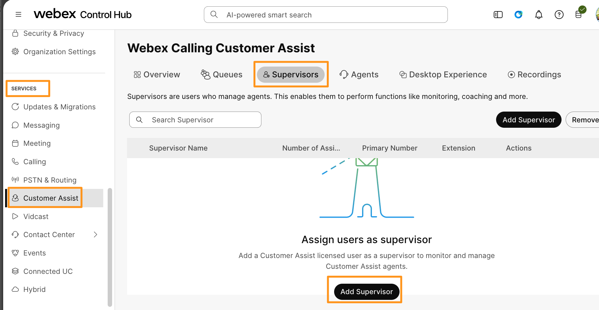
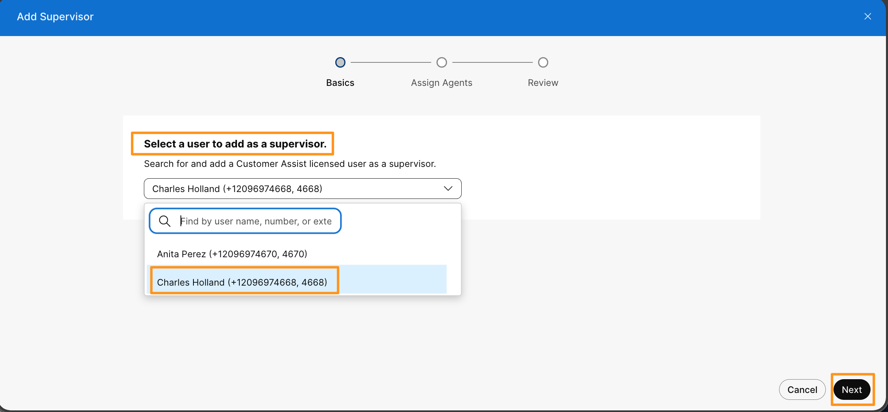
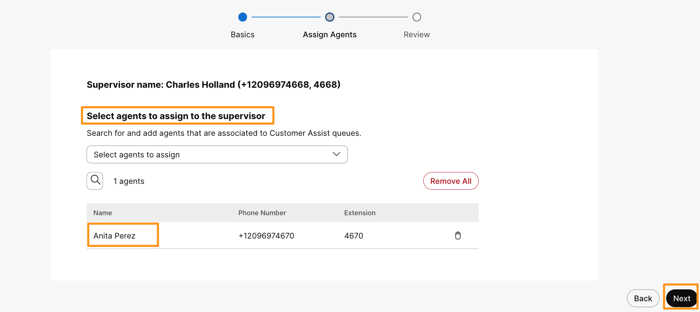
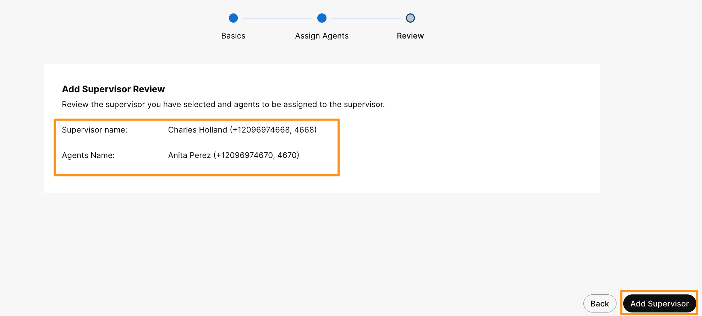

# Module 5d: Supervisor Configuration for Customer Assist

A supervisor in Webex Calling Customer Assist is a user who manages and monitors agents and queues through a centralized interface. Supervisors can view real-time and historical data about agents and queues, monitor live calls, send messages to agents, change agent statuses, and manage agent assignments to queues. They have tools to assess agent performance, listen in on calls, whisper coach, or barge into calls to assist agents. Supervisors also generate and download reports on agent wrap-up reasons enabling effective oversight and operational management of the Customer Assist environment.

1. Continuing on demo workstation (virtual workstation), go to browser tab where you have logged into Webex Control Hub.  On Webex Control Hub navigate to SERVICES > Customer Assist. On the Webex Calling Customer Assist configuration page, go to Supervisors tab.  Click Add Supervisor.

    

1. On the next page for Select a suer to add as a supervisor, drop down Select a user option and choose Charles Holland.

    

1. On the following page for Select agents to assign to the supervisor, drop down option Select agents to assign and choose Anita Perez and click Next.

    

1. On the next page review, the users for supervisor and agent.  Click Add Supervisor.

    

