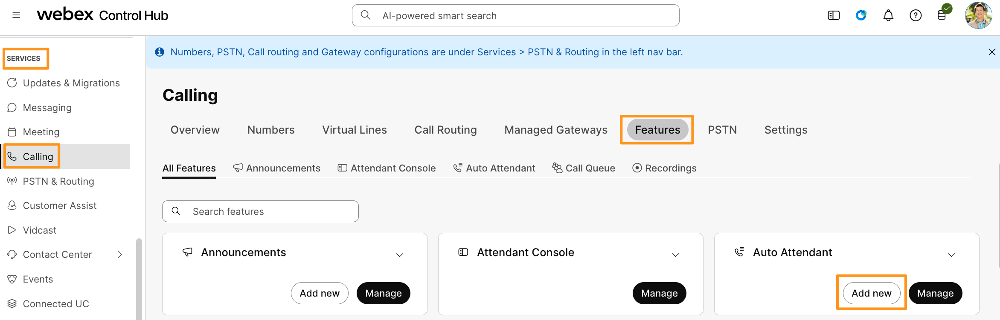
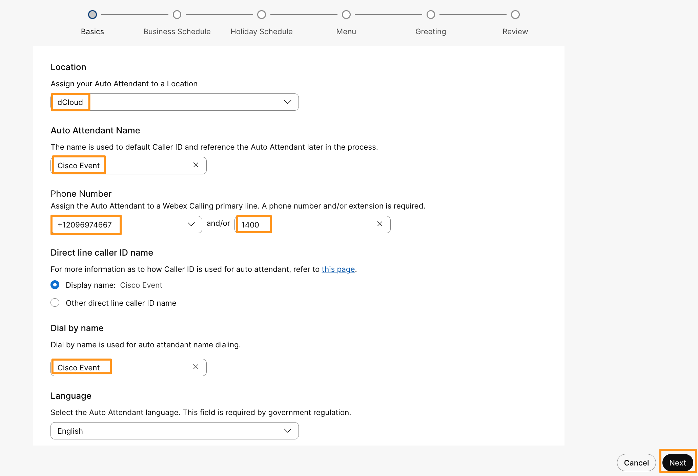
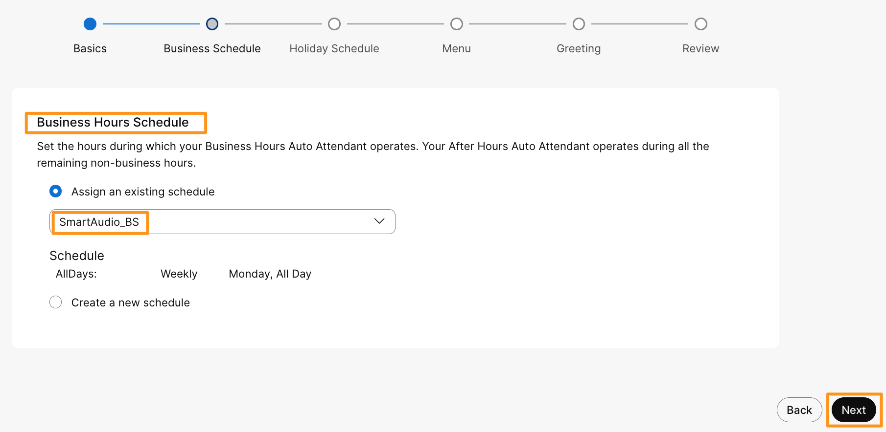
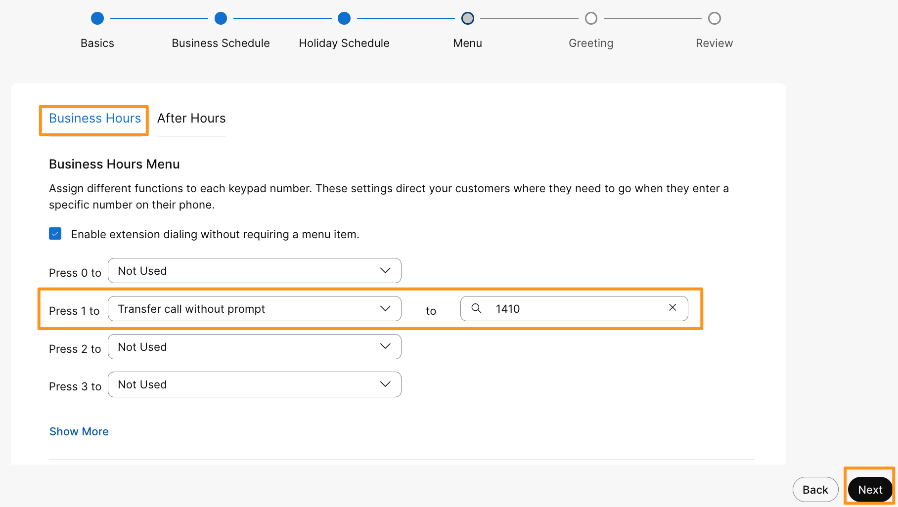
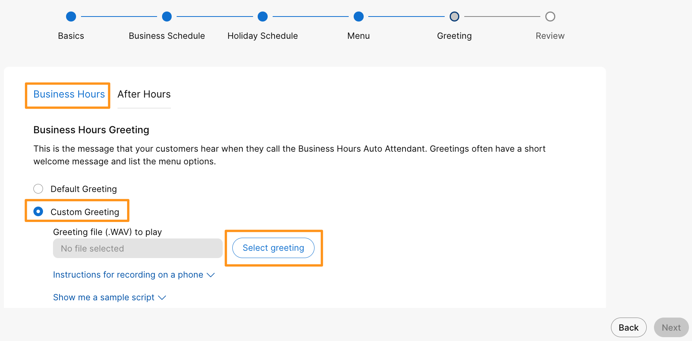
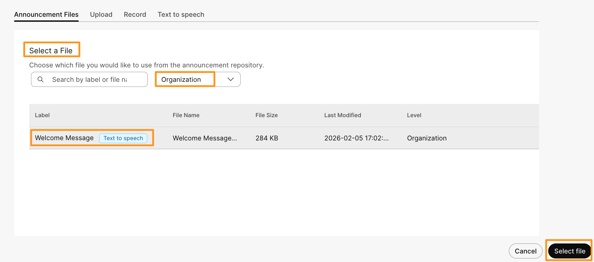
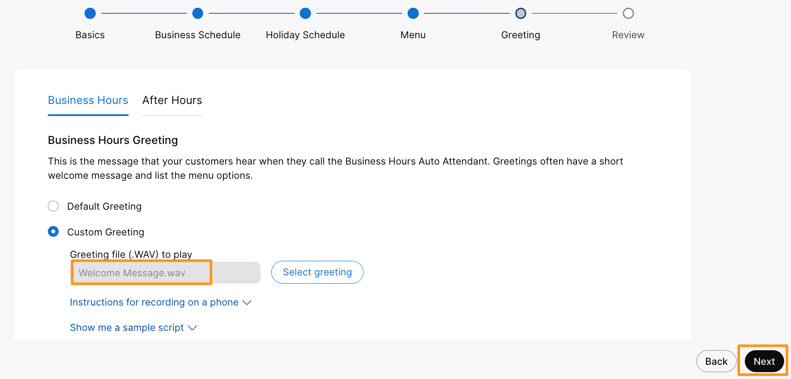
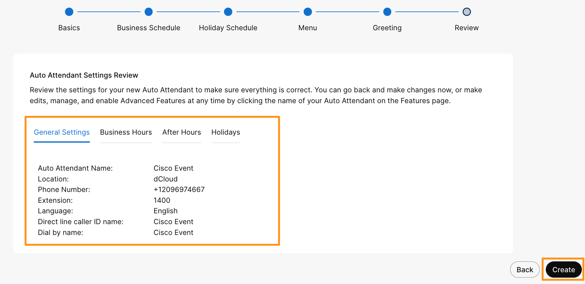

# Module 5e: Auto Attendant Configuration

An Auto Attendant is an entry point from PSTN to route calls to the Sales or Support queue depending upon the end user requirements dialing to the Customer Assist solution. An Auto Attendant in Webex Calling answers incoming calls and provides a menu for callers to direct their calls to the right person, group, or voicemail without a receptionist. It supports customizable greetings and scheduling for business hours, after hours, and holidays, enabling efficient automated call handling 24/7.

1. Continuing on demo workstation (virtual workstation), go to browser tab where you have logged into Webex Control Hub.  On Webex Control Hub navigate to SERVICES > Calling.  On Calling page, go to Features tab and click Add new for Auto Attendant.

    

1. On Create Auto Attendant page, populate the following and click Next.

1. Location: Drop down the option and choose dCloud
2. Auto Attendant Name: Cisco Event
3. Phone Number: Drop down and choose the same number assigned to Location (Main number)
4. Extension: 1400
5. Dial by name: Cisco Event

1. On the next page, for Business Hours Schedule drop down option for Assign an existing schedule and choose SmartAudio_BS and click Next.

    

1. On the next page, click Next for Holiday Schedule.
2. On the next page, for Business Hours Menu configure as described below and click Next.

1. Press 1 to : Drop down and choose Transfer call without prompt to 1410 (extension)

    

1. On the next screen for Business Hours Greeting, select radio button for Custom Greeting and Select greeting.

    

1. It will take you to Announcements page.  Drop down the option for Select a File and choose Organization.   Then click on Welcome Message (the announcement we created using Text to Speech above) and then click Select file.

    

1. It will take you back to Auto Attendant configuration page, make sure Welcome Message.wav has been populated for Custom Gretting and click Next.

    

1. On the next page, under Review queue configuration, review all the options we configured and click Create.  Click Done.

    

