# Module 5f: Customer Assist — AI Summaries for Call Queue Recordings

Queue recording in Webex Calling Customer Assist enables the recording of both incoming and outgoing calls at the queue level, allowing administrators to manage recordings centrally without needing to enable recording for individual agents. This feature supports automatic recording with options for pause and resume, and recordings are accessible through Control Hub for administrators and compliance officers. The AI capabilities integrated with queue recording include the generation of transcripts, summaries, and action items using artificial intelligence. These AI-generated transcripts provide a textual record of the call, while summaries highlight key points and action items with timestamps to facilitate quick navigation and follow-up. This enhances quality assurance, agent training, and operational efficiency by providing detailed insights into customer interactions and enabling supervisors and agents to review and act on call content effectively.

Key points:

1. Queue-level call recording for inbound and outbound calls.
2. Centralized management and access via Control Hub.
3. AI-generated transcripts, summaries, and action items.
4. Action items include timestamps for easy reference.
5. AI features improve agent and supervisor experience by providing detailed call insights.

This functionality is part of the broader Webex Calling Customer Assist solution, which aims to enhance customer service operations with AI-powered tools.

1. Continuing on demo workstation (virtual workstation), go to browser tab where you have logged into Webex Control Hub.  On Webex Control Hub navigate to SERVICES > Customer Assist.  On the Webex Calling Customer Assist configuration, go to Queues tab and select the Queue (Cisco Event) we defined above.

    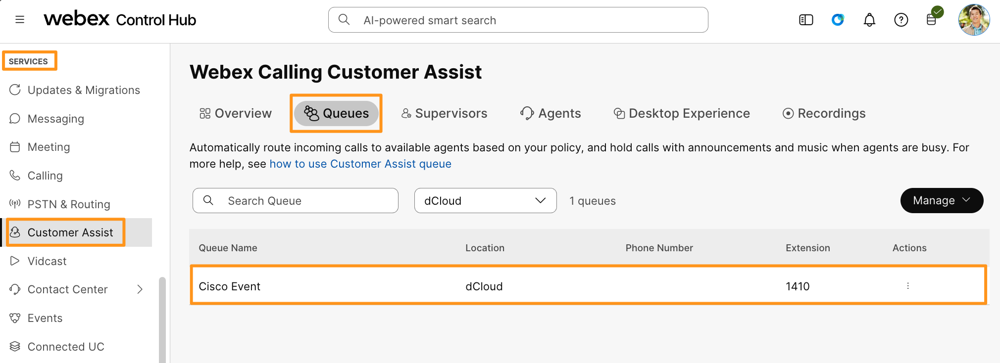

1. On the Cisco Event queue page scroll all the way down and go to Queue recordings > Call recording.

    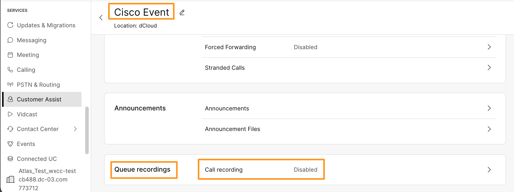

1. On the Call recording page, toggle ON the option for Call recording.  Check Mark options for Play recording start/stop announcement for PSTN calls and Play recording start/stop announcement for Internal calls.  Toggle ON option for Generate Transcript and check mark option for Generate Summary and Action Items. Click Save.

    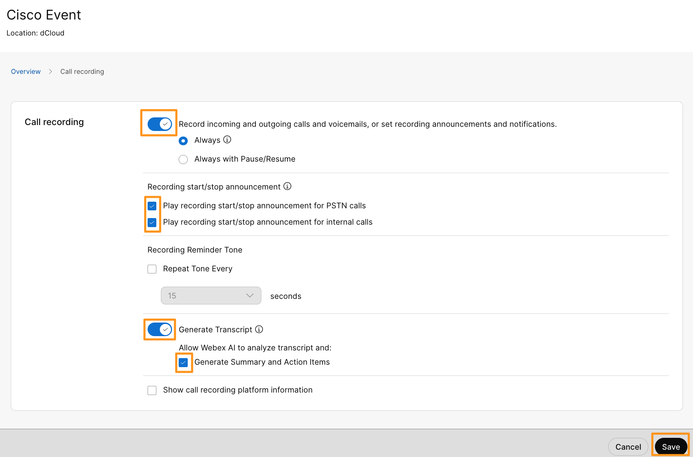

1. To activate the Customer Assist on Webex app, users (as they have already logged in) have to sign out and sign back in.  Sign out of Webex App and sign back in on both demo workstation (virtual workstation) as Charles Holland and attendee workstation (physical workstation) as Anita Perez.   Use the same credentials from Credentials.txt on demo workstation (virtual workstation)

    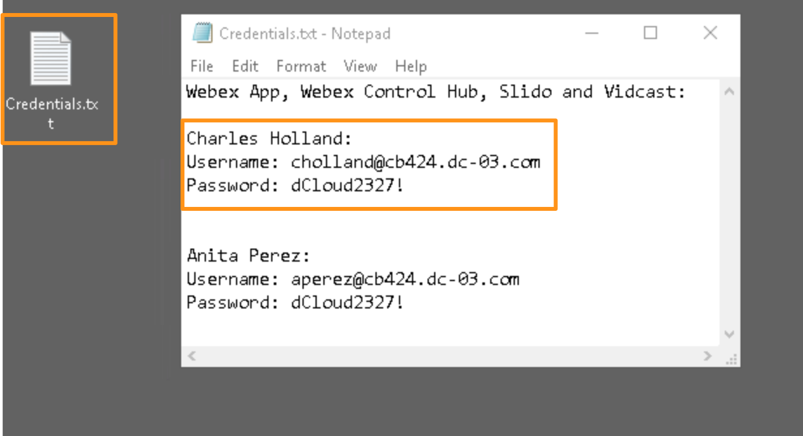

!!! note
    NOTE: To sign out of Webex, click on Profile picture on Webex (top left corner) and select Sign out.

1. Once users signed back into Webex, you will notice Customer Assist tab on left side, right below Calling.  Notice the Customer Assist view different for Charles Holland (Supervisor) and Anita Perez (Agent)

    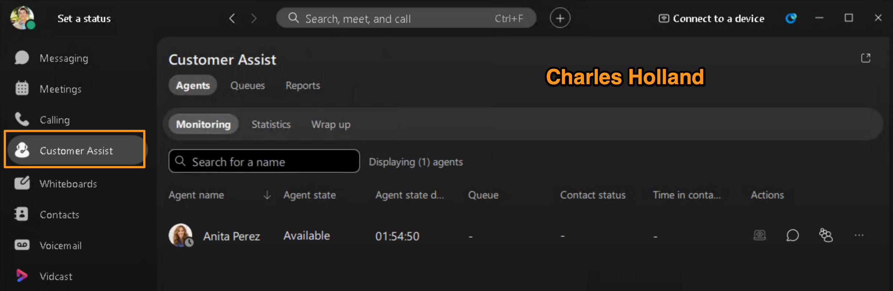

    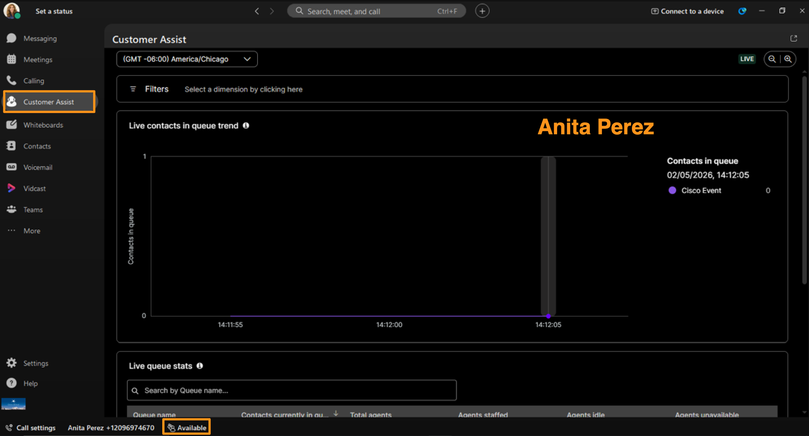

2. Now, we are ready to test AI features on Customer Assist Queue Recordings.
3. To test the Customer Assist Queue Recording feature, from Cisco 9800 phone (as Charles Holland), dial the Auto Attendant number 1400.
4. Once the call is connected, you will hear the Welcome Message prompt we created above.  Press 1 to select Sales.

!!! note
    NOTE: For your reference, here is the Welcome Message we configured (using Text to Speech):  Thank you for calling Cisco Event. Experience the future of AI powered collaboration with us. For Sales, please press 1. For Support, please press 2

1. Call will be routed to Anita Perez, answer the call on attendee workstation (physical workstation).  Once the call is connected, it will announce the call is being recorded.

    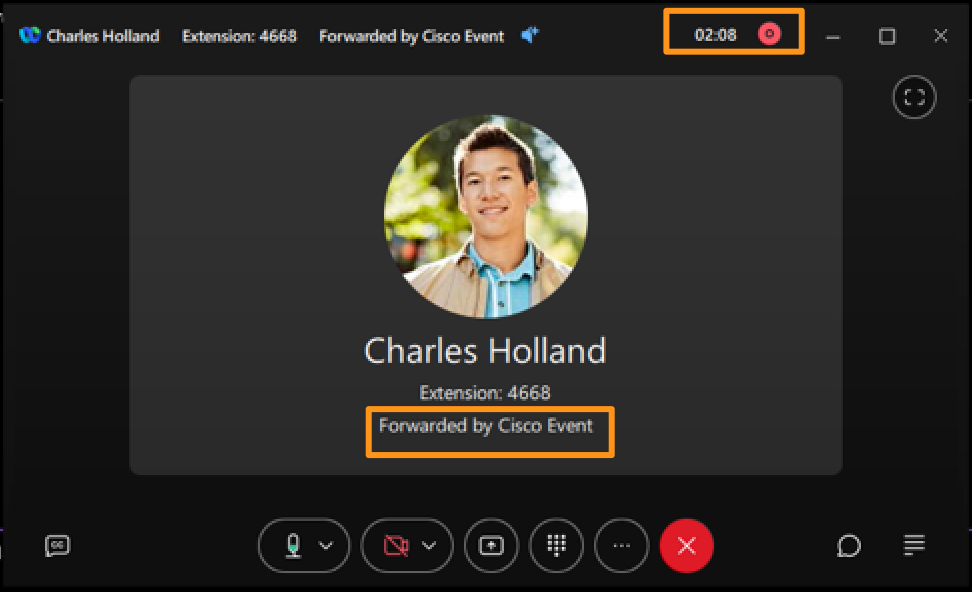

1. Keep the call connected for a minute and start conversing between Anita and Charles.  Include some few dates or action times in your conversation so AI feature can detect and present them in the summary/transcript of call recording, after the call.   After two or three minutes, hang up the call from either side.  Wait for few minutes for the background processes to create summary/transcript for the recording.

1. Now, to view the call recording, we need to login to Webex Control hub as Anita Perez (Compliance Officer).  On your attended workstation (physical workstation), open a browser and navigate to https://admin.webex.com and login with Anita Perez credentials.

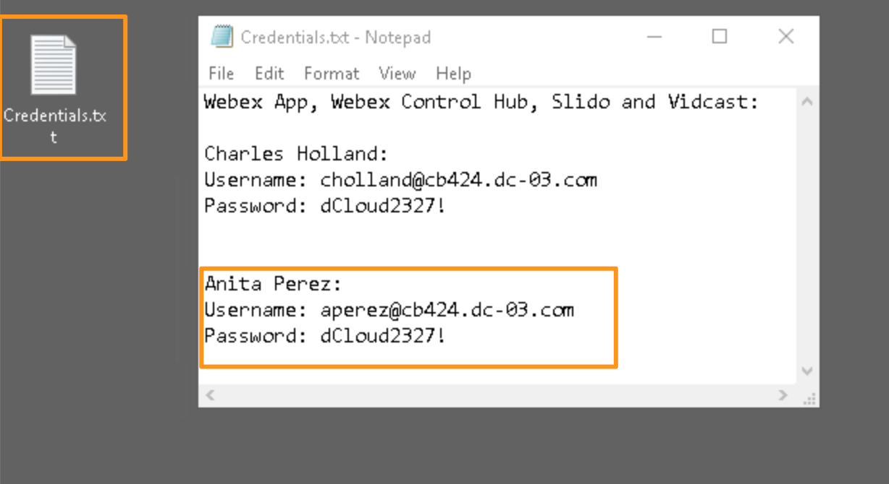

1. Once logged in,  navigate to SERVICES > Customer Assist.  On Webex Calling Customer Assist page, go to Recordings tab.  On Recordings tab, drop down option for location and choose dCloud.  It will bring up all the available recordings for dCloud location.  Select the available recording.

    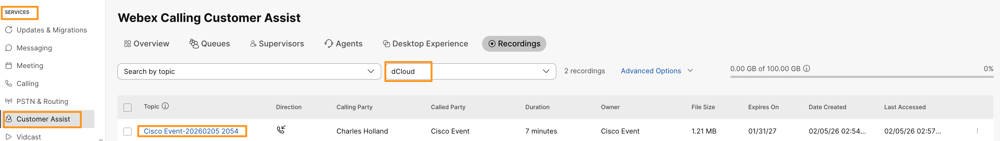

1. Then select the call recording you created above, it will open the recording in a new browser tab.   and review Summary/Action items and transcript.

    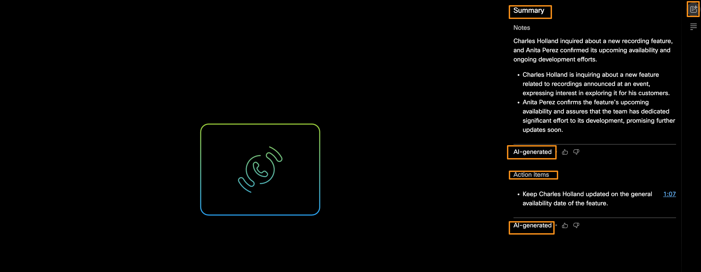

    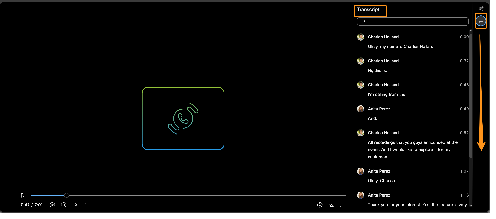

