# Module 6a: Configuring Autonomous AI Agents

AI Agent Studio in Webex Contact Center is a design tool that enables business users and IT admins to quickly build and deploy AI agents. It supports autonomous agents using large language models for natural conversations and scripted agents with predefined rules. This tool allows fast deployment of voice or digital AI agents to reduce call volume, letting human agents focus on complex customer service.

You will use AI Agent Studio to configure an Autonomous AI Agent. Powered by advanced Generative AI and Large Language Models (LLMs), these agents represent a significant leap from traditional scripted bots. Instead of following rigid paths, Autonomous AI Agents adapt to natural language, maintain context across topics, and deliver personalized, human-like responses. Using a low-code interface, you will learn how to quickly configure these agents, connect them to essential knowledge bases.

1. Continuing on demo workstation (virtual workstation), on your Webex Control hub navigate to SERVICES > Contact Center, to access and manage your Webex Contact Center settings and configurations.

1. On Contact Center page go to CUSTOMER EXPERIENCE > AI Agents

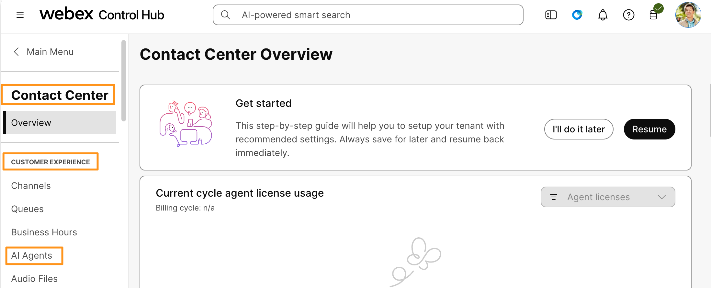

1. It will take you to AI Agents page.  Click Build your AI Agent.  It will take you to a new browser tab to create AI Agent.   Click Create agent.

    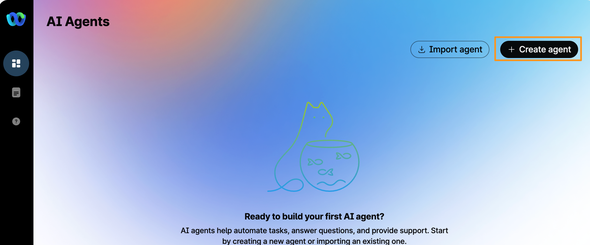

1. On the Create AI Agent configuration page, click on Start from scratch. Click Next.

    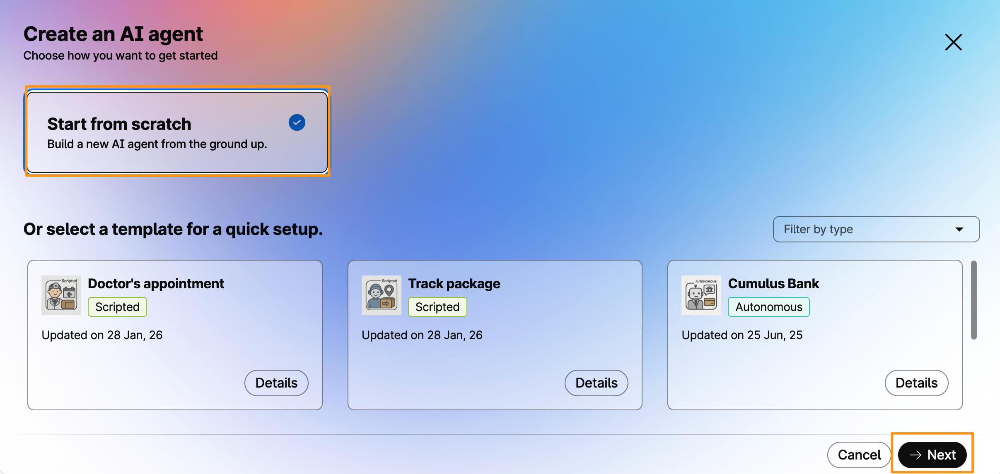

1. On the next page for type of agent,  select Autonomous.

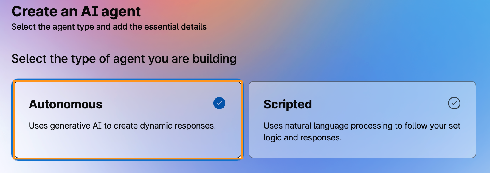

1. Scroll down on the Create AI Agent configuration page, to the Add essentials details section and configure the following:

1. Agent name: Cisco_AIAgent
2. System ID: It will be auto generated
3. AI engine: Keep the Webex AI Pro 1.0 selected.
4. Agent´s Goal: “The AI Agent's goal is to provide friendly and clear answers to frequently asked questions about Webex Contact Center solutions”.

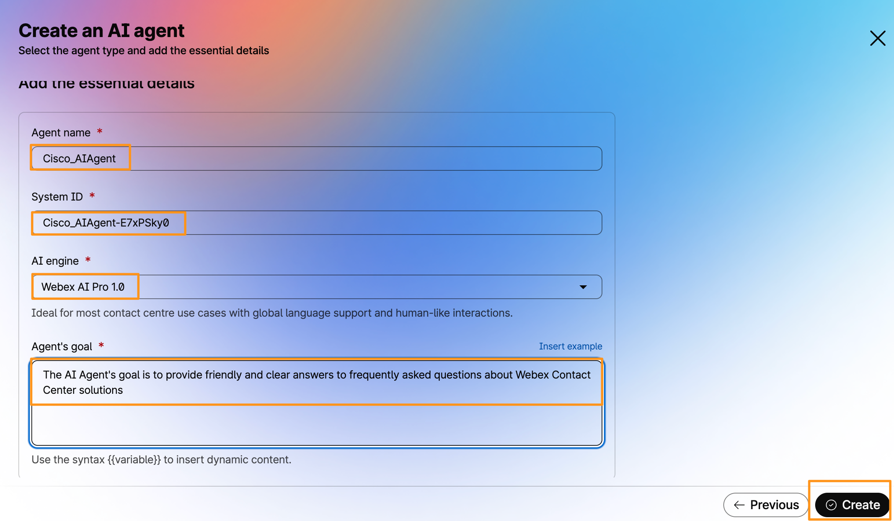

1. Click Create.

1. It will create the new AI Agent and show you Agent configuration page.   Update/replace the URL for agent profile image under Profile to below URL:

1. https://newsroom.cisco.com/c/dam/r/newsroom/en/us/assets/a/y2022/m03/McLaren_Cisco_Partnership_logo_lockup.jpg

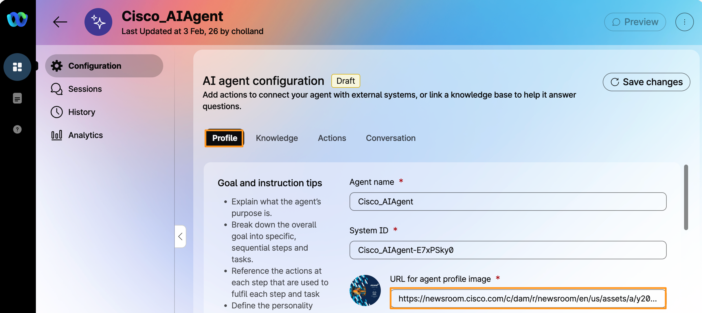

1. On the Welcome Message section, enter “Welcome to Cisco Event. Thank you for your interest in our Webex Contact Center services. How can I assist you today?”.
2. Add below two instructions sections for Instructions:

Respond to Webex Contact Center questions with the information you have in the Knowledge Base.

Provide personalized recommendations of notable places to visit in Amsterdam using accurate and relevant information from the Knowledge Base.

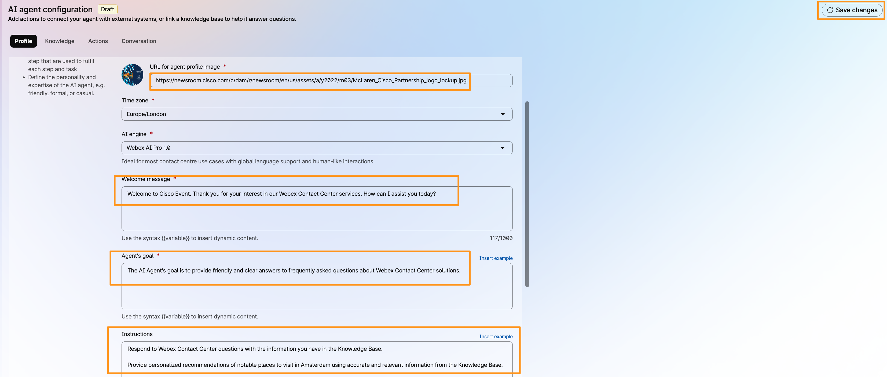

1. Click Save Changes (on top right corner).
2. Once the changes are saved, on the far left side panel of AI Agent Studio, click [] (Knowledge).

    

3. On the Knowledge page, click Create knowledge base.  It will bring up a pop-up window to Create knowledge base.  Populate the following information and click Create.

1. Knowledge base name: CiscoEventKB
2. Description: Cisco Event Knowledge Base

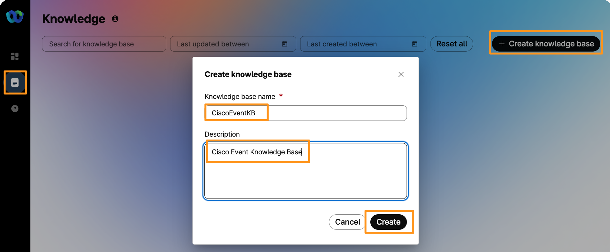

1. It will create the new knowledge base CiscoEventKB, on the knowledge base configuration page, go to Documents tab.  Create Document.

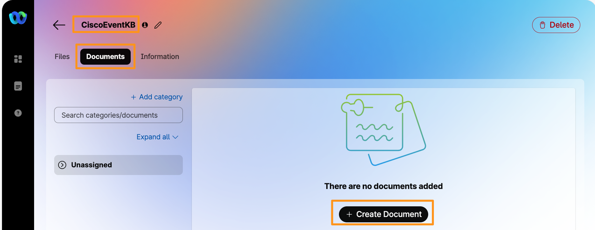

1. It will bring a pop-up window to Create Document,  enter the Document name as Webex CC and Cisco Event Information. Click Save.

    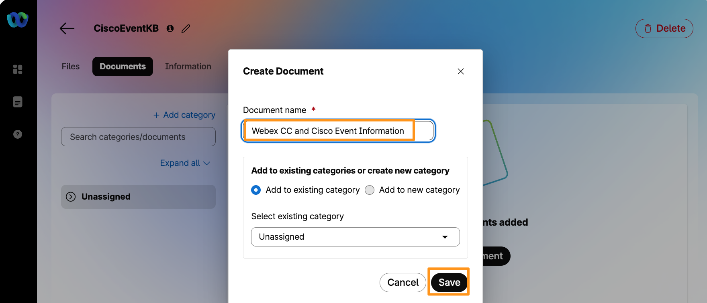

1. Enter the following information for this document.

!!! note
    NOTE: This is just an example of how the AI Agent can take information from a document to answer questions from users in a Webex Contact Center solution:

Webex Contact Center Overview

Empower Agents and Supervisors: Webex Contact Center provides agents with AI-powered tools, real-time assistance, and context-driven insights to deliver fast, efficient, and effective customer experiences.

1. AI Capabilities: Includes scripted and autonomous AI agents that operate across voice and digital channels, offering question answering from knowledge bases and action execution via workflows.
2. Customer Journey Intelligence: Agents receive important context and history about the customer’s journey to better assist and resolve issues.
3. Integration and Support: Integrates with Webex Contact Center Enterprise, Unified Contact Center Enterprise, and Packaged Contact Center Enterprise.
4. Agent Assistance Features: AI-powered agent assistance presents relevant knowledge base articles during calls to help answer customer questions quickly.
5. Multilingual Support: Supports multiple languages with ongoing expansion.
6. Knowledge Base Use: The AI Agent uses a knowledge base consisting of uploaded documents (e.g., FAQs, manuals) to answer customer queries. Documents must be precise and aligned with the agent’s goal. Updates require deleting and re-uploading documents. Maximum file size per document is about 2MB, with up to 100 files per knowledge base.
7. AI Agent Studio: Allows creation and configuration of AI agents with goals, instructions, knowledge base, and actions to automate customer interactions effectively.

Recommended Places to Visit in Amsterdam for Tourism

1. Rijksmuseum: World-renowned museum showcasing Dutch art and history.
2. Van Gogh Museum: Dedicated to the works of Vincent van Gogh and his contemporaries.
3. Anne Frank House: Historic site and museum dedicated to Anne Frank’s life and diary.
4. Canal Cruises: Explore Amsterdam’s iconic canals by boat for a unique city perspective.
5. Vondelpark: Large public park ideal for relaxation, walking, and cycling.
6. Dam Square: Central city square with historic buildings, shops, and street performances.
7. Jordaan District: Charming neighborhood with narrow streets, boutiques, and cafes.
8. Heineken Experience: Interactive brewery tour offering insights into the famous beer brand.
9. Bloemenmarkt: The world’s only floating flower market, perfect for buying tulip bulbs and souvenirs.

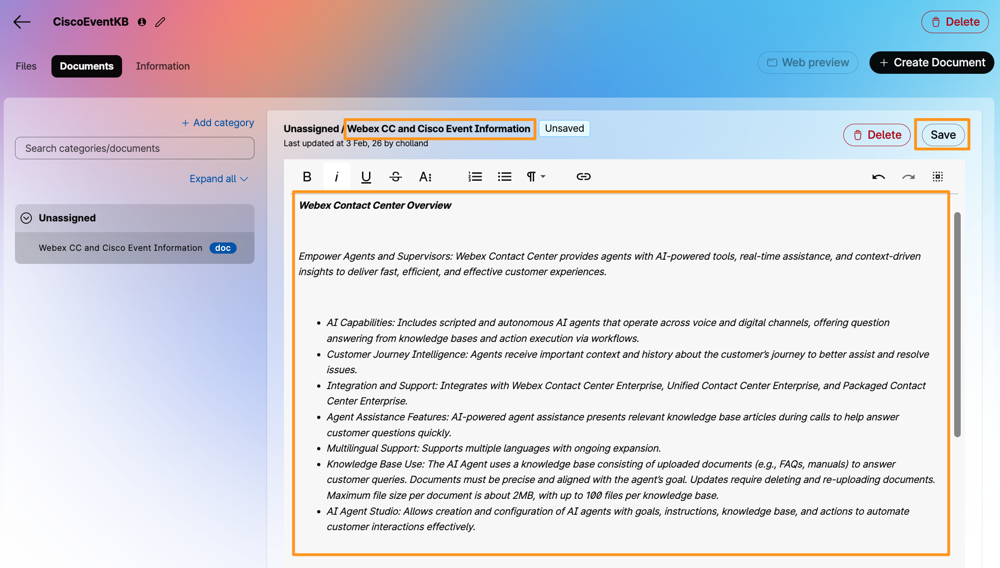

1. Click Save, it will take few seconds to save/process the document.  Wait until the document is processed.
2. Now, on far left side panel go back to the AI Agent [] menu.

    

3. Select the AI Agent that we just configured (Cisco_AIAgent).

    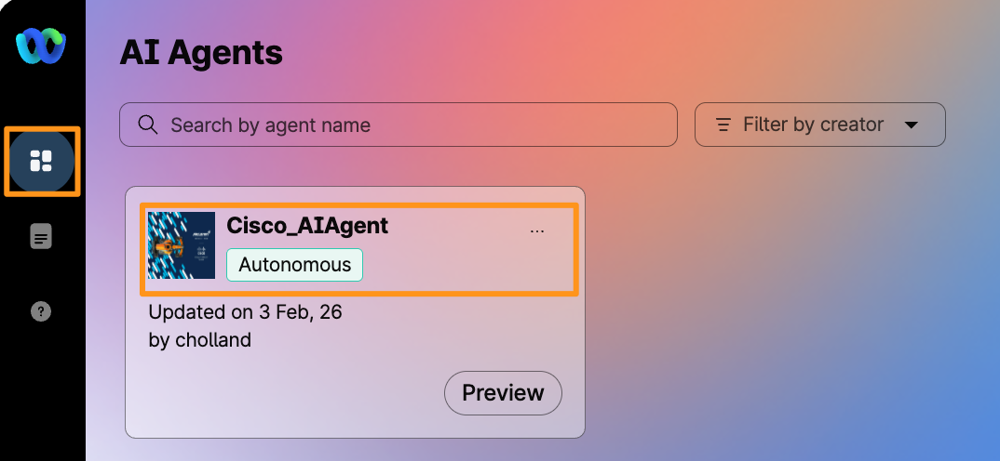

1. Now, we are going to add/assign the Knowledge base we created above (Webex CC and Cisco Event Information) to this Autonomous AI Agent. On the AI agent configuration page, go to  Knowledge tab.
2. On the Knowledge page drop down the option for Knowledge base and choose CiscoEventKB.  Click Save changes.

    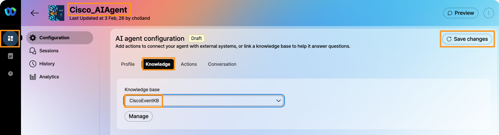

1. It will add/assign the knowledge base and then notice that Save changes button turns to Publish.  Click Publish to have this AI Agent live and ready to be used.

    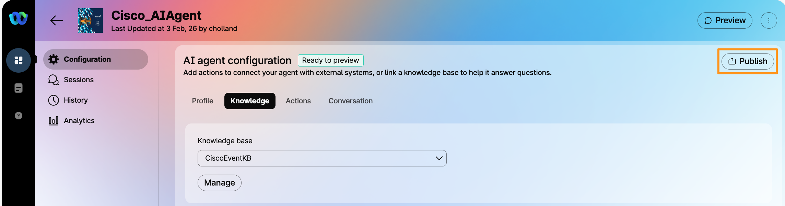

1. It will bring up a pop-up window for Publish and track changes.  Enter Cisco Event first version for Comment field and click Publish on pop-up window.

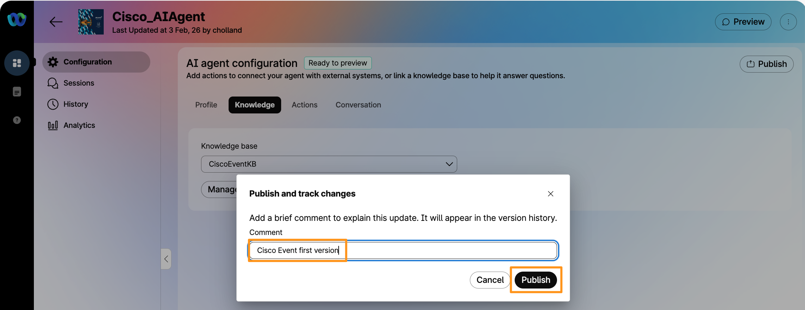

