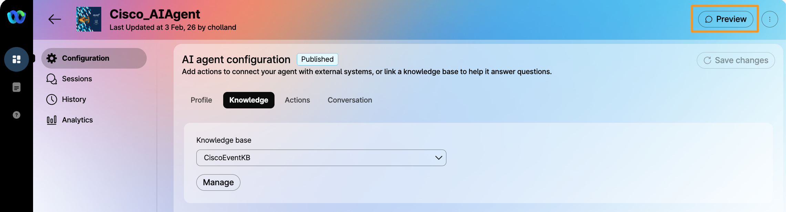
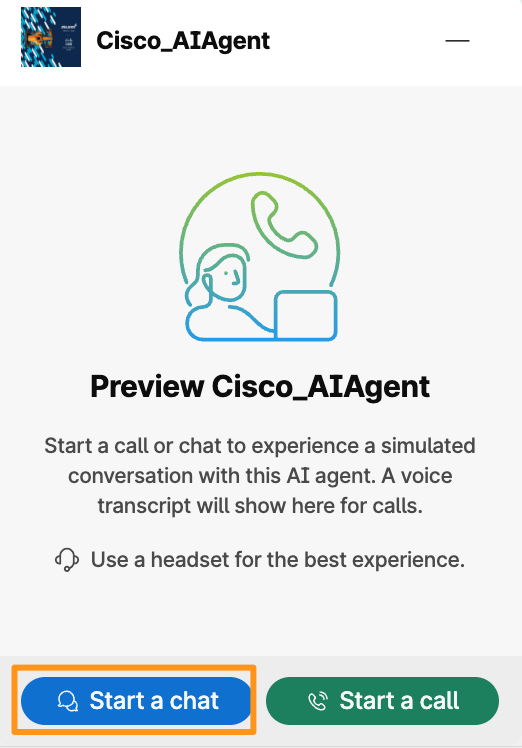
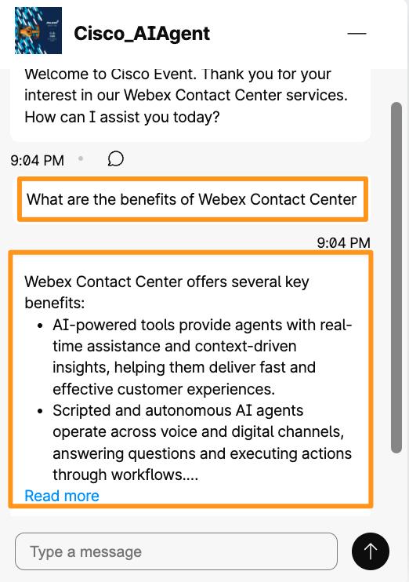
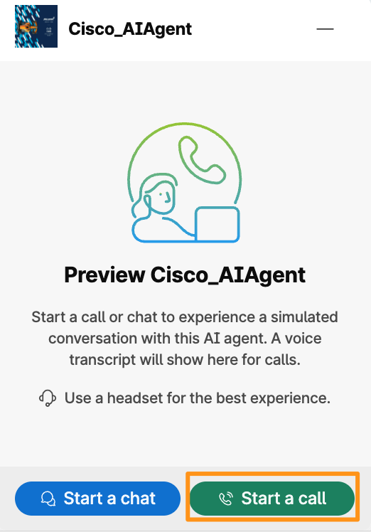
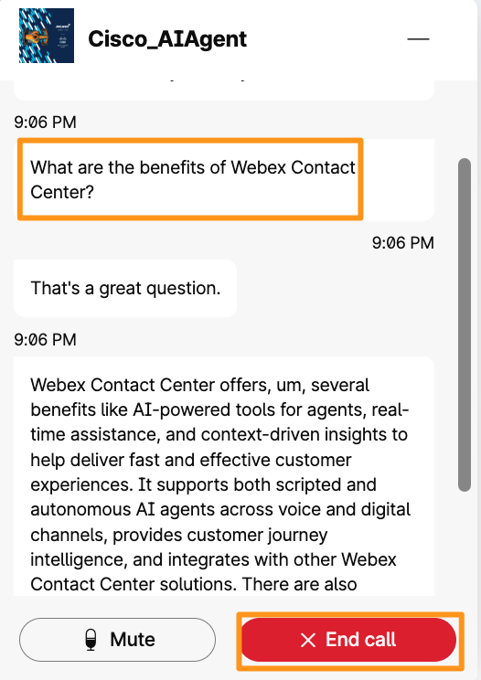

# Module 6b: Testing and Validating AI Agents

The preview feature in AI Agent Studio allows you to test your AI agent in a simulated environment before deployment. By using the preview option, you can interact with the agent as a user would, either through chat or voice channels, to validate the relevance, accuracy, and tone of its responses. This testing helps ensure the agent behaves as expected and provides an opportunity to refine goals, instructions, and API integrations. This feature is essential for optimizing the AI agent’s performance and user experience prior to going live.

1. Continuing on Cisco_AIAgent page, on the AI agent configuration page, click Preview.

    

1. It will bring up a conversation pop-up window on bottom right corner.  You can start a chat or a call (voice) session in order to test the AI Agent you just configured.  Select Start a chat and enter the following question: What are the benefits of Webex Contact Center? or I would like to visit some places in Amsterdam, what places do you recommend to visit?

Chat Session:

Voice Session (Call):

!!! note
    NOTE: Once you have started Chat or Call and wish to switch to other type of communication minimize (“-“  icon on top right corner) the conversation window and bring it back up to go back to welcome screen where you see both Start a chat and Start a call options.

