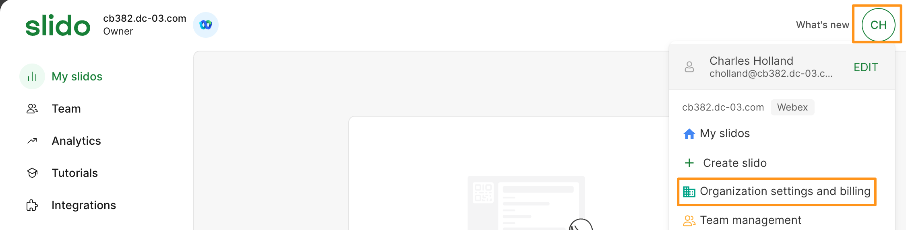
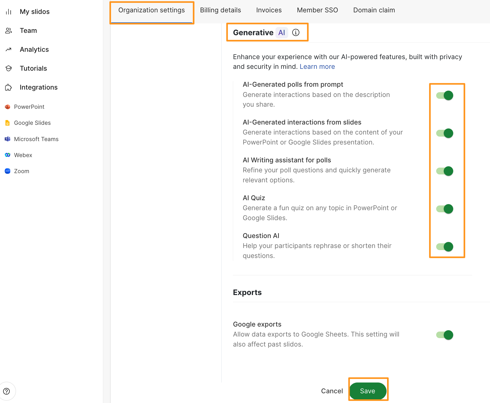

# Module 7a: Configuring Generative AI for Slido

1. On your attendee workstation (physical workstation), open a new browser tab on either Chrome or Mozilla Firefox and go to slido.com.  Click Log In on top right corner.
2. On the following page choose Login with Webex and login same Control Hub login credentials for Charles Holland.

    

1. Once logged in, click on the Username [CH] (top right corner) and choose Organization settings and billing.

    

1. On the Organization settings page go to  Features tab.  Scroll down on Features tab to Generative AI section and toggle ON all the available options.   Click Save.

    

