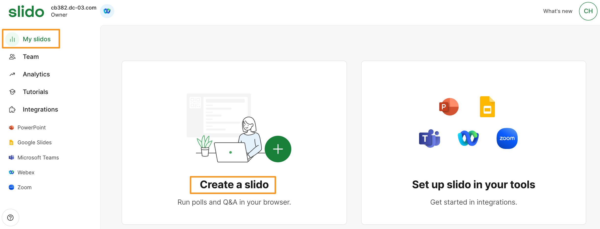
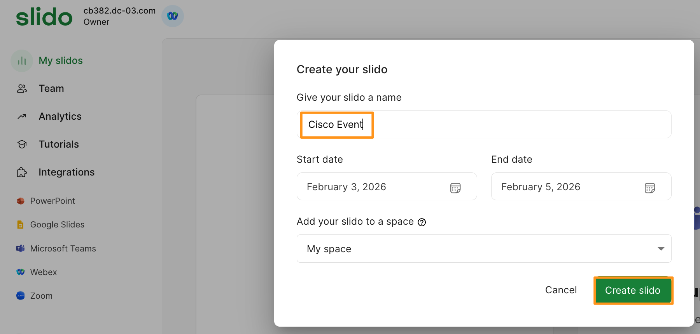
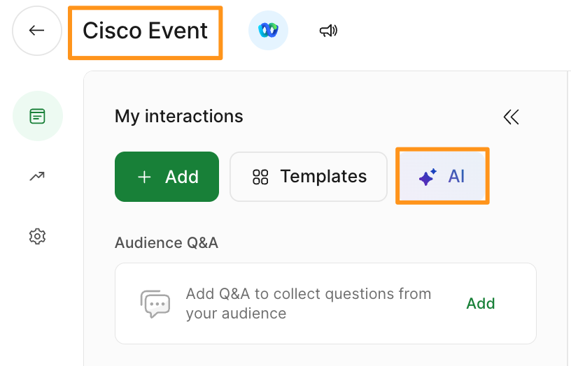
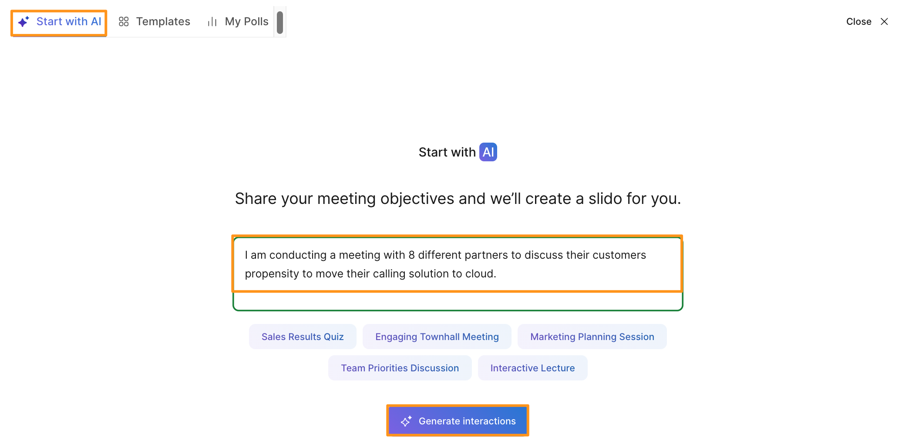
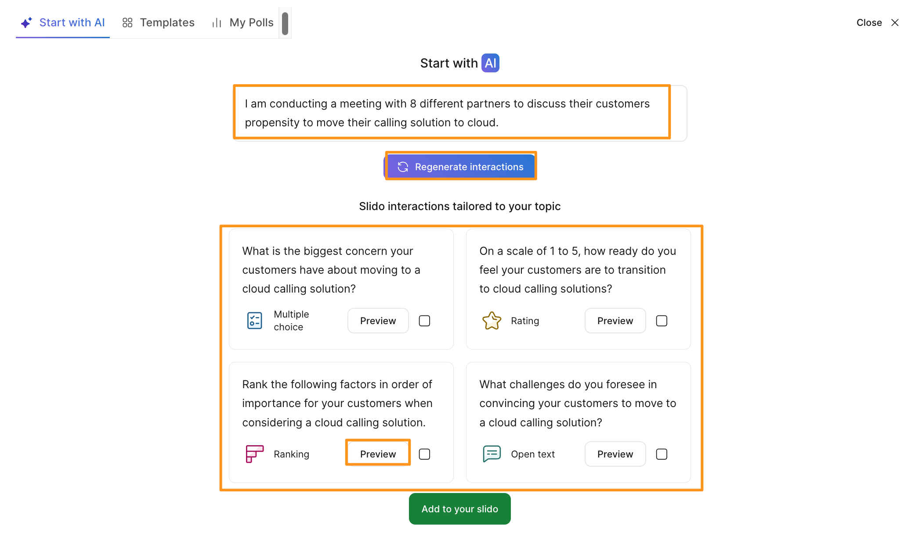
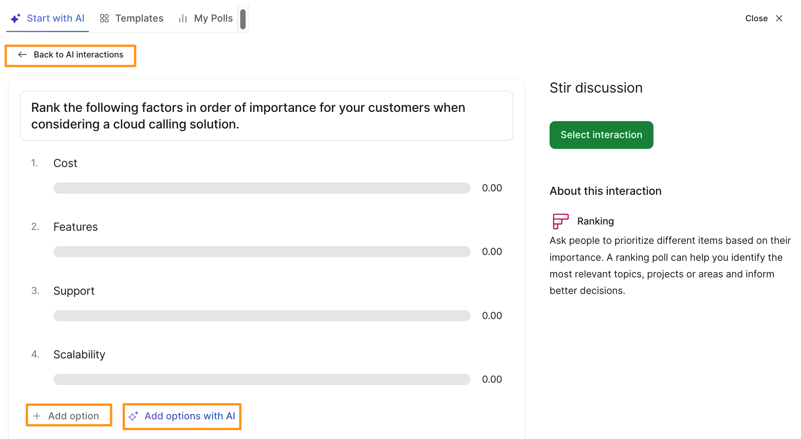
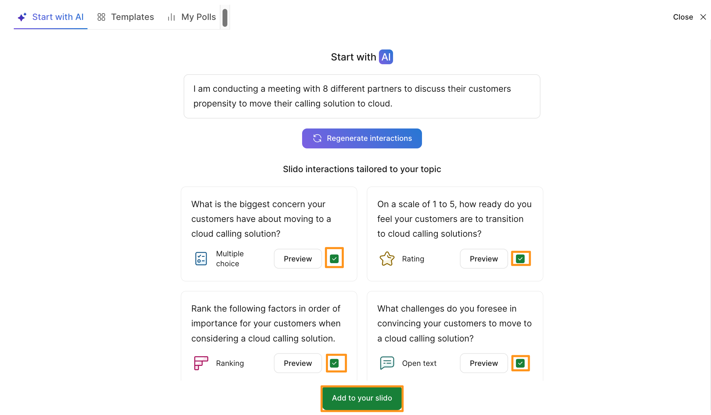
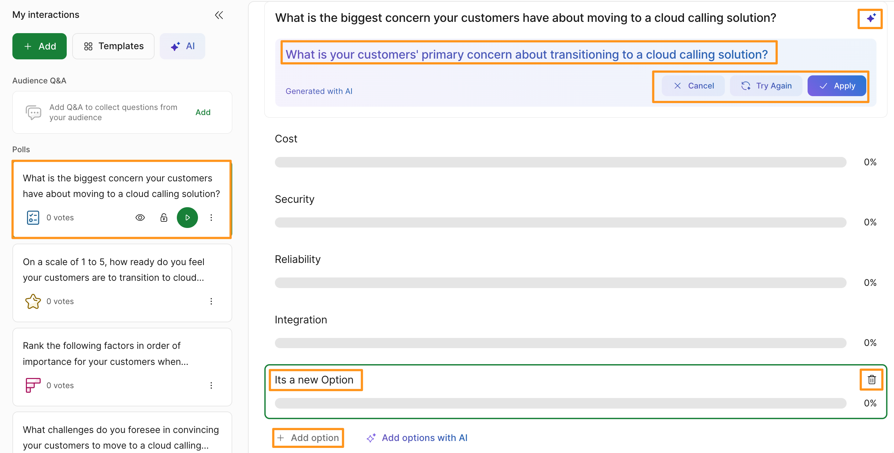
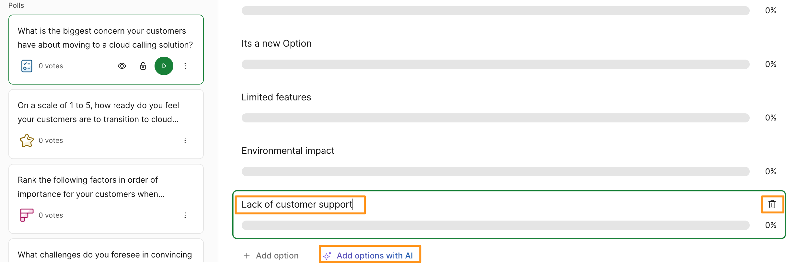

# Module 7b: Creating AI-Generated Polls from Prompts

1. Now, navigate to My Slidos (top left corner) on left navigation pane and click Create a slido.

    

1. It will bring up a pop-up window to Create your slido.  For Give your slido a name enter Cisco Event. Click Create slido.

    

1. It will create the new slido and take you to newly created slido (Cisco Event) page.  Go to AI tab.

    

1. It will bring up a pop-up window and take you to Start with AI tab.  Type in the following objective and click Generate Interactions.

I am conducting a meeting with 8 different partners to discuss their customers propensity to move their calling solution to cloud.

    

It is common for event/webinar/meeting organizers to not know where to begin when prompting engagement from their live or asynchronous audience. This leads to admins either recycling the same questions over and over or not leveraging engagement outside of Q&A all together.

1. It will generate couple of questions for your meeting using Generative AI.  Notice, if you are not satisfied with generated questions, you can choose to Regenerate interactions.  Scroll through the AI suggested questions and choose Preview for one of the questions.

    

By leveraging Slido’s AI-generated suggestions, the platform can automatically get the administrator 80-90% of the way towards engaging their audience with a simple prompt and/or click of a suggested tile. This dramatically reduces the time it can take to create the proper engagement needed for a specific event.

1. It will take you to the question you have selected, notice that for selected question, you can modify available options or add more options. OR you can use Add options with AI.  This action is NOT currently available in Preview mode. However, once you create the poll you will have access to these options.  This is shown in later steps of this section.   Click Back to AI interations (right below Start with AI)

    

1. It will take you back to previous page of AI generated suggested questios.  Select any of the suggestions you would like in your Poll (You can choose multiple options at the same time) and click Add to your slido.

    

1. It will create poll with your choice of selected questions.  Select one of the questions and explore options to either modify existing options for the question or Add option to manually add an option or Add options with AI.  You can also choose improve/modify the question itself as well as shown below.

    

1. Notice that you will have option to either modify or delete the question/choices even when the additional questions for the poll are generated using Add options with AI.

    

Congratulations, you are now the new happy owner of an AI generated poll.

