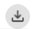
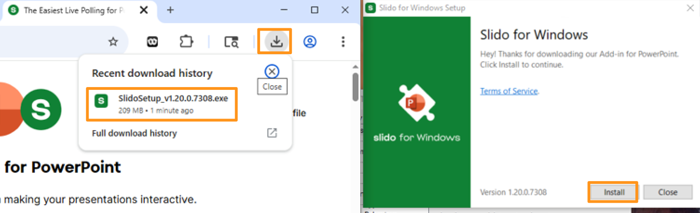
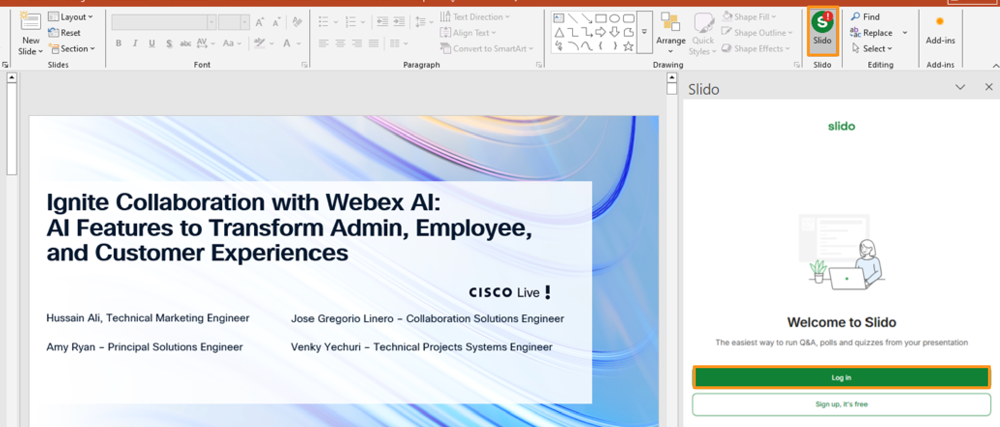
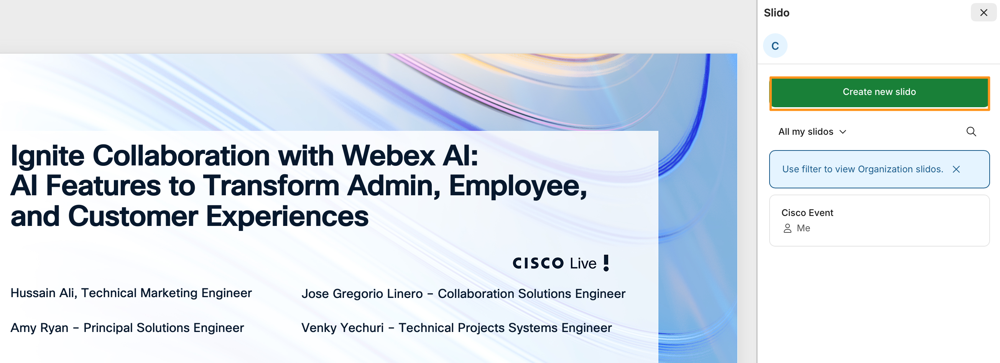
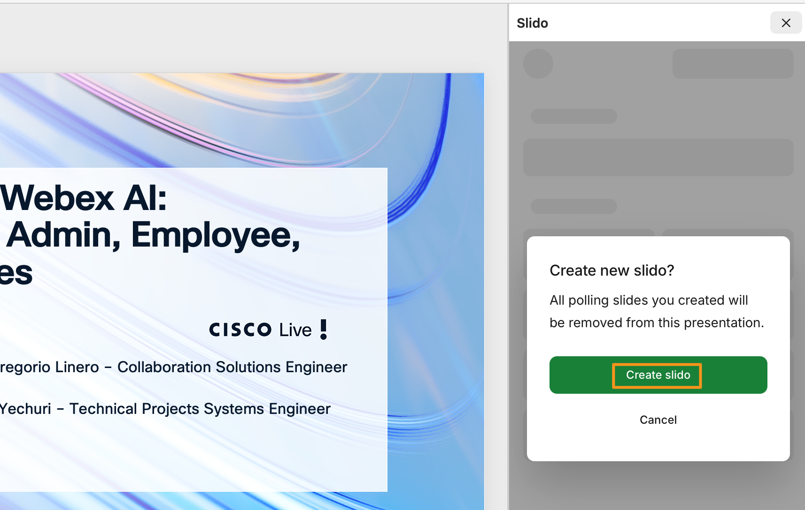
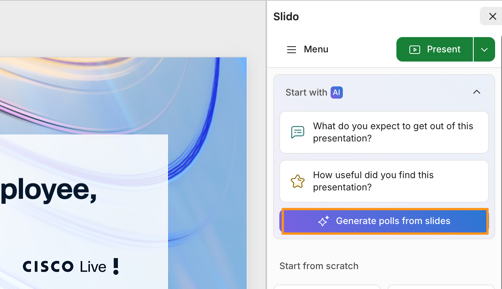
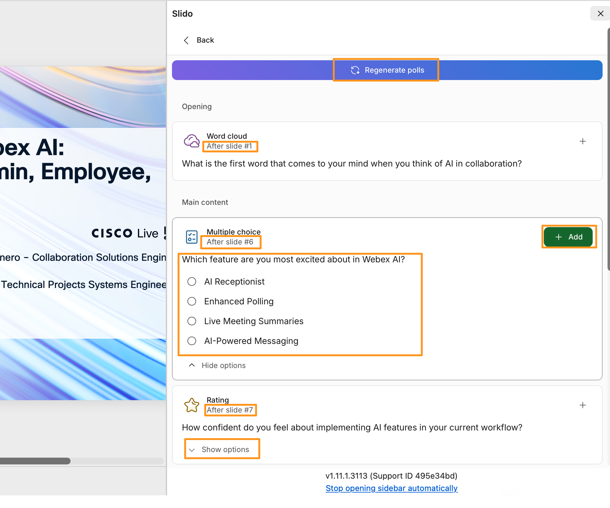
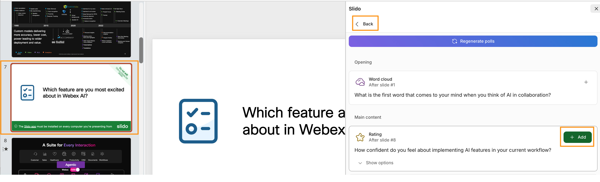
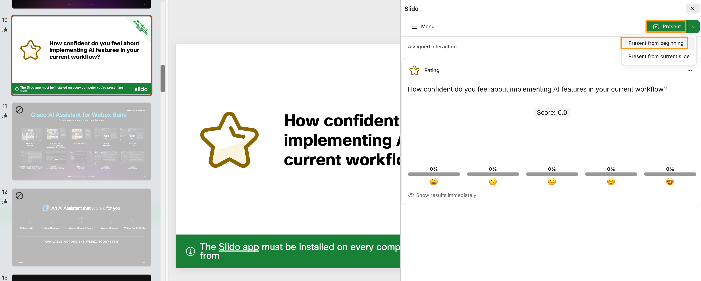

# Module 7c: AI-Generated Interactions from Slides

For this section first we need to install and integrate Slido with PowerPoint.   Before continuing make sure PowerPoint on your attendee workstation is not open.  If it is, close/exit it before continuing.

1. Continuing on the browser tab where you have logged into slido.  Open a new browser tab and go https://www.slido.com/powerpoint-polling.  It will identify the workstation OS (in this lab Windows) click Download for free to download the executable.

    

1. It will download the executable file,  on the browser go to downloads [] select the file to install.  It will open the installer, click Install again and wait for the install to complete and click Finish.

    

    

1. Once application installed, open PowerPoint named LTRCOL-3001 EMEA 2026 from Desktop, you will notice the Slido icon  in the upper right-hand corner.   The red exclamation mark (!) on Slido, is to indicate that login required to Slido (in PPT).

1. Click Slido icon, it will open slido for the PowerPoint.  Click Login, it will open a new browser tab, login with same credentials cholland@cbXXX.dc-YY.com and password that you used for Webex Control Hub login.

    

    

1. Notice once the Login is completed, notice the red exclamation mark (!) will be gone.  Now, on Slido (within PowerPoint) it will show the poll you created in previous module.  Click Create new slido.

!!! note
    NOTE: Click close on the pop-up window that says Slido not found.

1. Ignore the pop-up/warning about current polling slides will be deleted and click Create slido on pop-up window.

    

3. On the slido next page, inside the PowerPoint, click Generate polls from slides (using AI).

    

Similar to the AI-generated Polls within the Slido platform (previous module), this integration does the work for the administrator by reviewing the PowerPoint and created suggested polls to inject into the presentation with a single click.

1. It will take few seconds to create the polls.  Wait for the process to complete.  Review the suggested polls and notice where their suggested placement. You can preview the polls and then choose which ones you would like to add.  For any reason if you don’t like the suggested polls you can Regenerate polls.

    

The important thing to remember with this tool (same with nearly all AI tools) is that the suggestions will never be 100% perfect, 100% of the time, but the core benefit is the immediate ability to provide suggested options for an administrator to review. Again, cutting down the time to ensure the audience is engaged in the content at hand.

1. Once you have selected to Add the desired slide.  You will see the slide added in the appropriate slide position within the presentation, position as indicated in the suggestions.  Similarly add any other polls you may like to the presentation.  After adding all desired polls click Back (on top left corner) in Slido app within PowerPoint.

    

1. Now on the main Slido window (with in PowerPoint) drop down option for Present and choose Present from beginning.

    

1. Observe on the presentation all the poll slides that you chose are added by AI in indicated slide positions.  Super efficient and easy, Right?!

1. Once the slides are verified you can stop the presentation.

    

