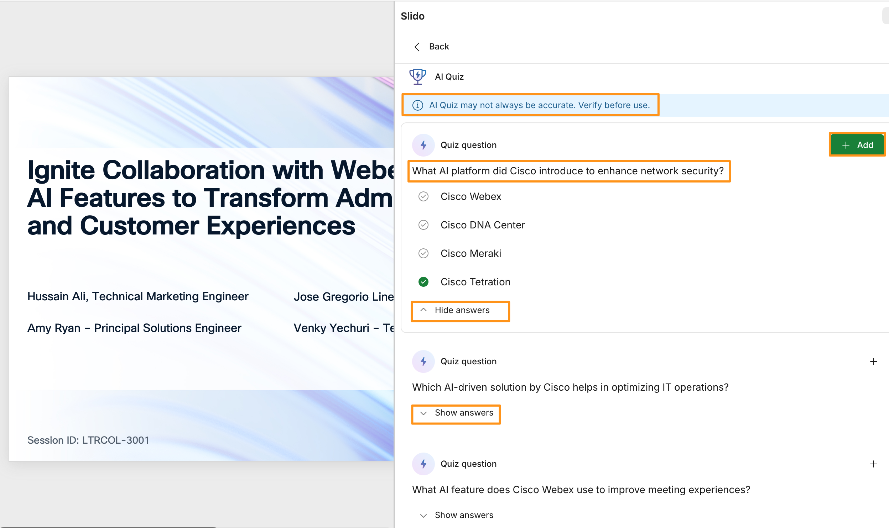

# Module 7d: AI-Driven Quizzes

In this module we will produce an active quiz, powered by AI, in the Power Point.

1. Continuing on attendee workstation (physical workstation).  In the Slido window, within the same PowerPoint, click on Generate quiz.

    

3. For What is the topic of your quiz? Type Innovation in AI at Cisco.  And click Generate questions.

    

1. It will take few seconds to generate the quiz questions.   Once quiz questions are generated, notice the disclaimer on top that says AI Quiz may not always be accurate.  Verify before use.  the show answers for accuracy.  Like suggested by AI, verify the questions/answers and click Add for any of the question you may want to use/add.

    

1. Once added, the quiz questions will appear in the slide pane.

    

!!! note
    NOTE:  When generating quiz questions, you can either select the slide you want the quiz to be generated after in slide order, or you can move questions around in the deck after being generated.

1. Congratulations on creating your first AI generated Quiz.  If you choose, you can now go into presentation mode again, like in previous module, and test the quiz questions.
