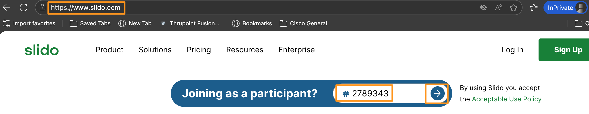
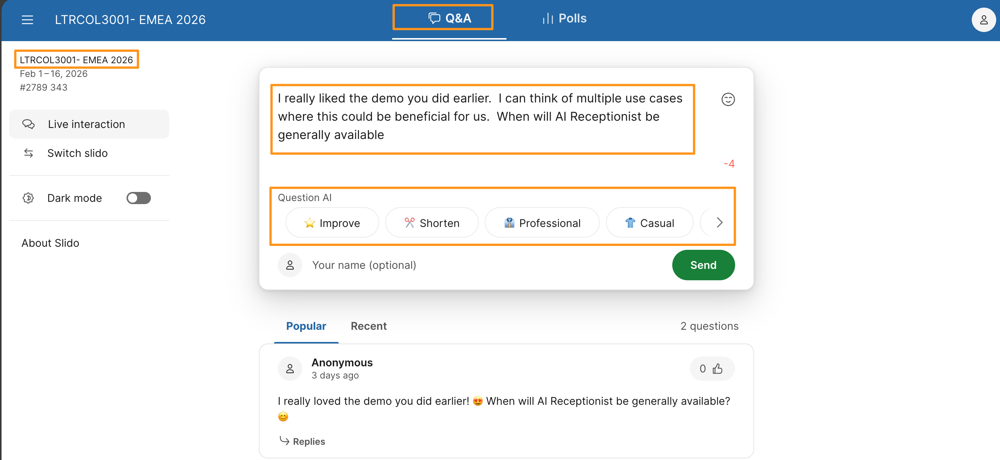
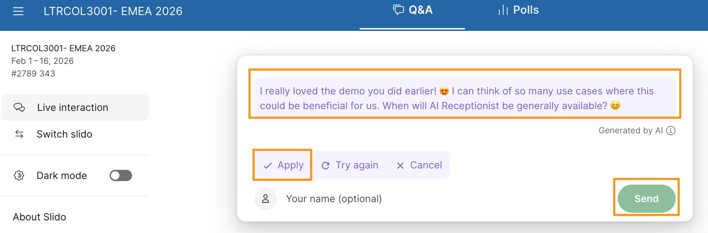

# Module 7e: AI for Question Management

In this section, we are going to experience how when asking questions as a slido participant, how AI can enhance our experience.

1. Continuing on attendee workstation (physical workstation),  open new browser tab and go to https://slido.com and join pre generated Q&A with the following passcode: 2789343

    

1. Ensure you are joined in the correct Q&A space, on the top left corner it will show LTRCOL3001-EMEA 2026.   Now, type your question under Q&A.

Example Question:  I really liked the demo you did earlier.  I can think of multiple use cases where this could be beneficial for us.  When will AI Receptionist be generally available?

1. Once you type your question, observe AI enhancements available to either Improve or make Shorten or  more Casual etc.,.  Make any of the options you like.

    

Just as the Webex app improves message composition, Slido uses AI to help users confidently frame their questions, reducing hesitation and encouraging participation.

1. AI will process the question and present you the updated question.  Then give you option to either Apply (to use) or Try again or Cancel (to go back original) and then you can choose to Send in your question. In example below, Joyful was selected.

1. Once you like the AI generated modification,  click Apply then Send.

    

!!! note
    NOTE: AI may have generated a response with too many characters depending on the character limit set when the poll was created.  In that case you could use AI again to Shorten, or modify yourself before sending.

