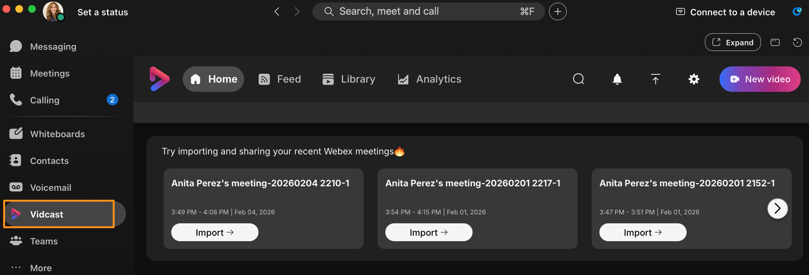
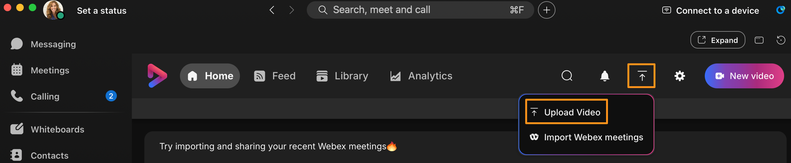
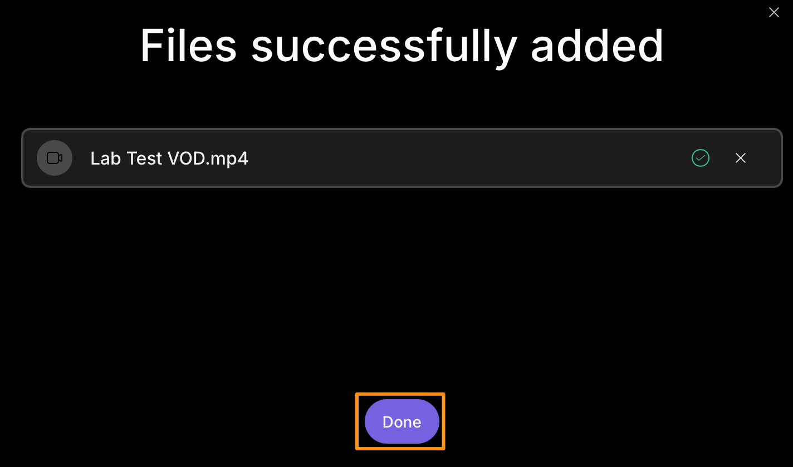
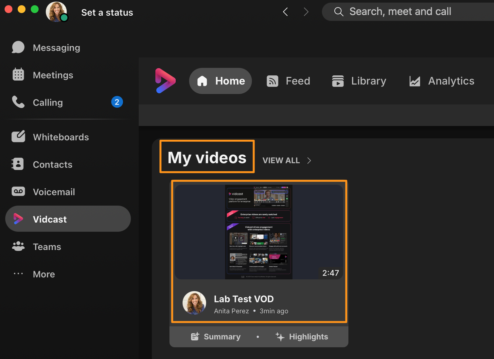
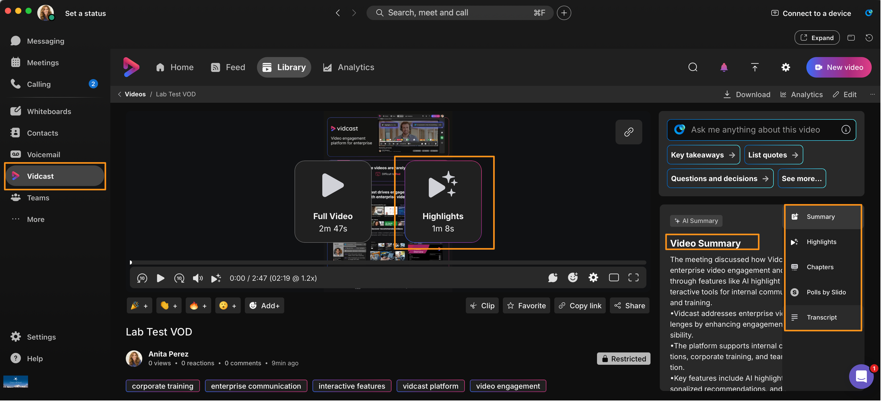
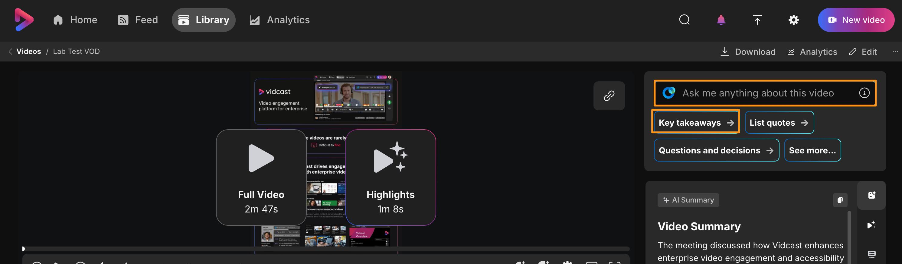
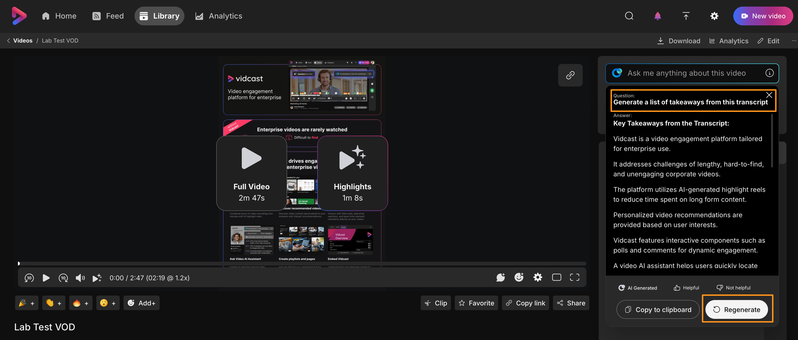

# Module 8a: Review AI Features

1. Continuing on attendee workstation (physical workstation) minimize browser and other applications and bring up Webex app.  On Webex app left side pane go to Vidcast.

    

When speaking with customers, we are consistently met with blank and confused faces when asking them: Where do you store your most important video recordings? The typical answer comes back as either

Answer 1: Stored in their preferred meeting vendors space, titled something like meeting_recording_10.19.2024 along with thousands of other customers.

OR

Answer 2: They are thrown as .MP4 into a SharePoint folder, never to be seen again.

OR

something similar

Vidcast opens the door for organizations to create their own secure, enterprise YouTube kind to store, organize, and share every type of video recording, from 1:1 messages, meetings, virtual town halls, and everything in between.

1. Let’s start this section with reviewing some of the AI features within Vidcast.  For lab purposes we will upload a recording of a video and review.  In the right corner, click on the upload icon and select Upload Video.

    

1. It will bring up a pop-up window to upload video.  Click Drag and drop files on pop-up window and browse to Desktop and upload video titled Lab Test VOD.mp4.  It will take a moment to upload and process video. Wait for the process to complete.  Once the video is uploaded click Done.

    

1. It will take you to Vidcast tab with in Webex app.  Go to My videos and select Lab Test VOD (that we just uploaded above).

    

1. It will open the video and show you all available AI options for the video like, Video Summary, Highlights, Chapters and Transcript  etc.,  Go through each or any of the options and explore available AI generated information about the video.

    

1. Notice that you can ask questions about the video (top right corner).  AI will also give you few readily AI generated questions right below the prompt, that you can click to ask.  Choose one of the available questions (Key takeaways or List quotes etc., in below screenshot) or you can manually type and ask anything related to this video.

    

    

The value of Vidcast’s AI summaries, chapters, highlights, is productivity. Employees get double-booked, have meetings overlap, and don’t have the time to rewatch a full 30-60 minute recording, or update from leadership. With the support of these tools, employees can easily search the transcript to find the information that is essential to their role in a fraction of the time it would take to watch the recording in its entirety.

