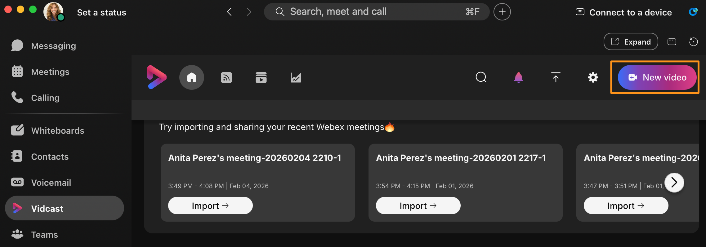
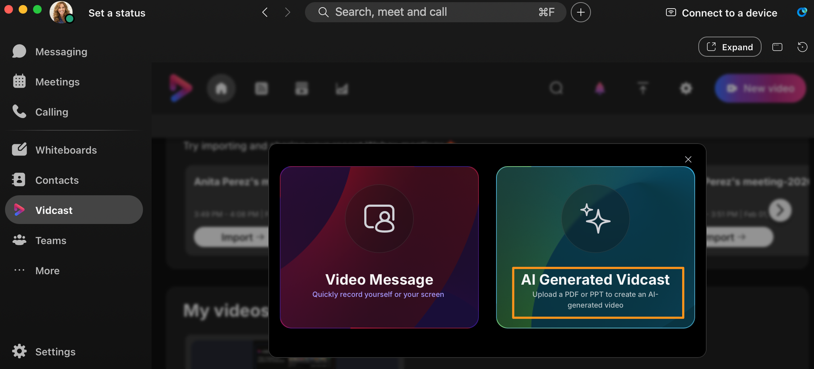
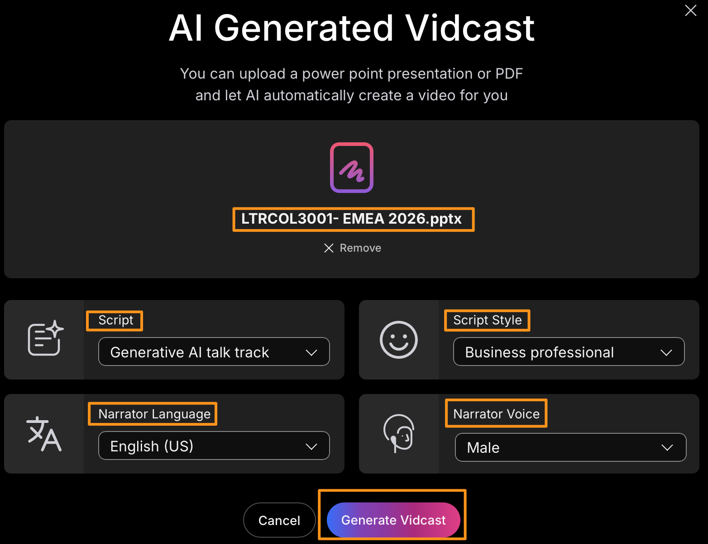
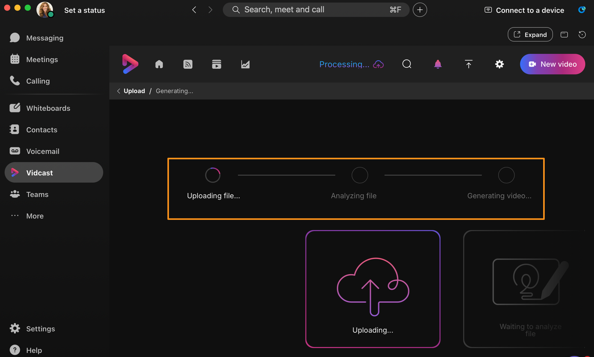
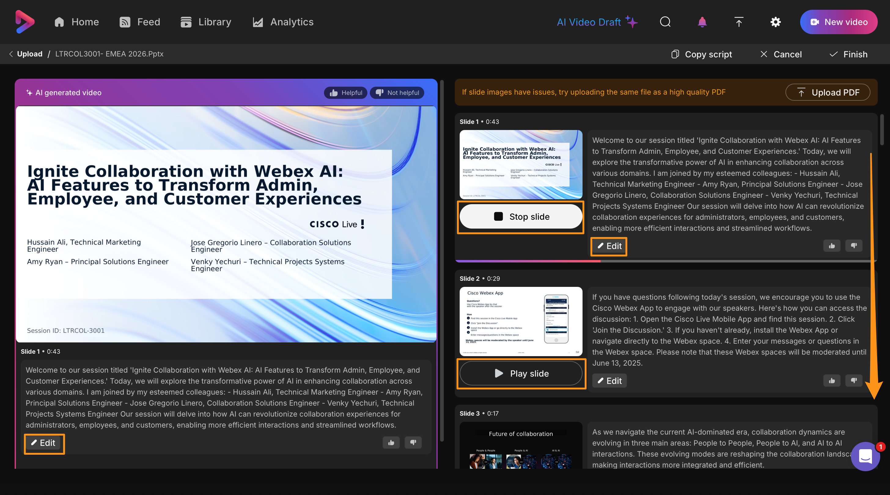
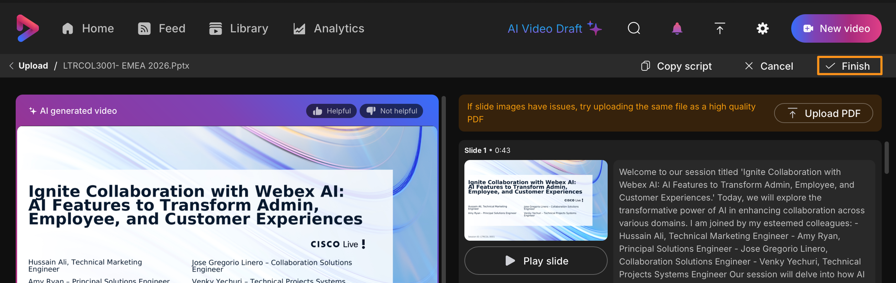
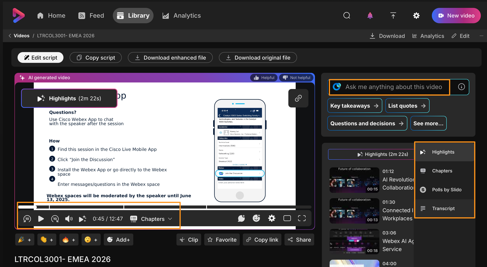

# Module 8b: Creating AI-Generated Vidcasts

1. Continuing on attendee workstation (physical workstation).  On Webex > Vidcast page click New video (top right corner).

    

1. It will bring up a pop-up window ith availabel opitons, choose AI Generated Vidcast.

    

1. On the next page click Drag & Drop PDF or PPTX and browse to Desktop and select the file titled LTRCOL-3001 EMEA 2026 and you can choose any of desired drop down options for Script, Script Style, Narrator Langague and Narrator Voice or you can leave all default values and click Generate Vidcast.

    

1. It will take a few moments to process, and you will get visual updates about the process like Uploading file, Analyzing file and Generating video etc., along the way.   Wait for the process to complete before continuing.

    

1. Once the process has been completed, observe you can review/play AI generated audio and listen for each slide individually and if not satisfied with AI generated audio you can choose to edit the slide and regenerate.

AI generated Vidcast has a wide array of use cases, but the first that comes to mind is accessibility. An organization can provide a playlist of AI-generated Vidcasts of their employee onboarding documentation in multiple languages, or to support those with vision impairments has an immediate impact on the ability to communicate with your workforce

1. Once you have verified all the slides, click Finish (top right corner).  This will take few moments to generate the video for the PPT we uploaded.  Wait for the process to complete.  Sometimes it might take longer to generate Highlights, Chapters and Transcript.

    

1. Once all these processes are completed, you can interact with the AI features (like in the previous module) Highlights, Chapter and Transcript.   You can also choose to ask anything about this video or choose one of the available AI generated readily available questions.

CONGRATULATIONS!!, you have finished the lab!!
